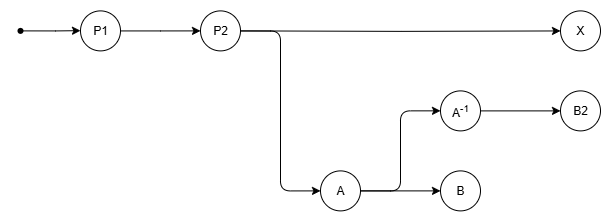

# Revision Metadata

Rebase operations need metadata to provided by the caller (e.g., the high-level rebasing algorithm) about the overall branching structure that the rebase takes place in.
For example, if commit `B` from a branch `[A, B]` is being rebased over some commit `X` as part of rebasing `[A, B]` over `X`,
then that rebase operation needs to be informed about `A`'s relative position in the commit graph w.r.t. to `X`.

This page aims to explain why this is the case and precisely define the characteristics of this scheme.
While the scheme for revision metadata is not specific to sequence fields, sequence fields are currently the only motivator for it.
This document therefore focuses on them.

## Commits and Cell IDs

The idea of cells is introduced in [cell-model-of-collaborative-editing.md](cell-model-of-collaborative-editing.md).
The core idea is that, in addition to requiring a way to refer to positions that nodes occupy
(which we accomplish using integer indices for nodes in a given sequence, at a given point in the commit graph)
we need a way to refer to the positions that nodes will occupy or have occupied in the past.
We call these "cells".

We accomplish this by assigning a unique ID to each such cell.
Each cell ID is associated with the commit that introduced it,
which makes it easy to check if a given commit introduced a given cell.

Being able to refer to empty cells makes it possible for commits to convey position information relative to such cells.
For example, if some commit `A` inserts content before some empty cell `c`
while some other commit `X` concurrently inserts content after that same cell `c`,
then we know that, the content inserted by `A` should come before the content inserted by commit `X`
no matter the order in which the commits `A` and `X` end up sequenced in the commit history.
If these commits had not been able to refer to `c`, then there would not have been a way to guarantee the relative ordering of their inserted contents.

There are two cases where a commit introduces new cell ID:

1. Inserting a new node in a sequence introduces a cell ID to refer to the cell that will hold the node.
   In the input context of the commit, the cell is empty.
   In the output context of the commit the cell is populated with the inserted node.
2. Moving or removing a node from a sequence introduces a cell ID to refer to the cell that held the node.
   In the input context of the commit, the cell is populated with the node.
   In the output context of the commit, the cell is empty.

Commits can also refer to a cell using an ID that was introduced in a prior commit.
This occurs in two cases:

1. An inverse commit (whether a rollback or revert) refers to cells that the commit it is the inverse of referred to and uses the same IDs to do so.
   For example, if commit `A` removes a node and therefore introduces cell ID `Id1` to refer to the cell it empties,
   then the inverse of `A` will restore that node to the same cell, referring to that cell using `Id1`.

2. Rebasing a commit `A` over a commit `X` leads to a commit `A'` that refers to all that either `A` or `X` referred to.
   For example, if `A` inserts a node next to a node `n`, and `X` removes `n` thereby introducing cell ID `Id1` to refer to the cell where `n` used to be,
   then `A'` will carry a mark that uses `Id1` in order to describe the location of the cell that used to contain `n`.

One can infer from the above that for a given commit `C`...
* `C` refers to all cells introduced in `C`.
* `C` refers to all cells introduced in ancestors of `C` up to some ancestor.

The commits that introduce cells that `C` refers to therefore from a contiguous subsequence always including and ending in `C`.

In commit graph diagrams, we can represent this contiguous subsequence visually with a segment that extends from `C` backwards under all the commits that introduced cells that `C` refers to:

 
_`C` refers to all cells introduced in `C` and all its ancestors up to and excluding `B`._

 
_`C` refers to all cells introduced in `C` and all its ancestors up to and including `A`._

## Cell Ordering From Commit Ordering

While cells help specify the relative order of content in sequences,
there are some situation where the information contained in commits only specify a partial order.
The rebasing system is responsible for picking a total ordering that is consistent across peers.
It does this based on the relative sequencing order of the commits in the commit graph.
This happens in two cases:

1. When cells are being introduced in the same gap by concurrent commits. 
    
   _`X` and `A` are concurrent so the relative order of cells they introduced in the same gap is unspecified. 
   The colors have no intrinsic meaning. Their purpose is to depict which commit refers to cell introduced by which commit._

2. When a commit `C` introduces cells in a gap where one of its ancestors (commit `A`) introduced cells that are empty in the input context of `C`,
   and `C` does not include references to the cells introduced by `A`. 
    
   _`C` does not refer to cells introduced by its ancestor `A`,
   so the relative order of cells `C` and `A` introduce in the same gap is unspecified._

In both of this cases we order the cells introduced by the later commit left of the cells introduced by the earlier commit.
This leads to a system where,
in order to determine the relative order of two cells,
we sometimes need to know the relative order of the two commits that introduced the cells.

In the remainder of this section, we consider the cell-ordering scenarios that compose and rebase operation face.

### Compose

When composing `A ○ B`, we know the following about the commit graph:

* `A` comes before `B` in sequencing order.
* `A` and `B` are not concurrent.
* There are no commits between `A` and `B` in sequencing order.

We can represent this situation with the following commit graph: 
 
The commit `P` represents another prior commit (which is not being composed).
It is included here because `A` and/or `B` may refer to cells that `P` introduces.
While there may be any number of such prior commits that introduced cells that `A` and/or `B` may refer to,
using a single commit is sufficient to fully consider the relevant cases.

For each pair of cells (`ca`, `cb`) referred to by `A` and `B` respectively,
we need to be able to determine the relative ordering of `ca` and `cb`.
Its helpful to visualize the possible scenarios and group them as follows:

1. `A` only refers to cells introduced no earlier than the cells referred to by `B` were introduced: 
 
 
 
1. `B` only refers to cells introduced later than cells referred to by `A` were introduced: 
 
 

In the first group of scenarios,
`B` must include references to both `ca` and `cb`,
so their relative ordering is already fully defined in `B`.
This does not require consider the sequencing order of commits.

In the second group of scenarios,
`ca` must be referring cell introduced by either `P` or `A`,
while `cb` must be referring cell introduced by `B`.
We can order the two cells by relying on the fact that commits `P` and `A` both come before `B` in sequencing order.
While this does require that we consider the sequencing order of commits,
the relevant ordering information
(i.e., that `B` comes after any other commit that might have introduced cells that `A` might refer to)
is implicitly derivable from the fact that we're composing `A ○ B` as opposed to `B ○ A`.

The implementation of compose doesn't know which group of scenarios it's dealing with on a case by case basis,
but it can handle both groups by checking if `B` contains a reference to `ca`,
and if not, treating `ca` as older than `cb`.

### Rebase

When rebasing `B ↷ X`, we know the following about the commit graph:

* `X` and `B` are concurrent and have the same ancestry.
* `X` comes before `B` in sequencing order.

Note that it does _not_ follow from the above that `B` comes directly after `X` in sequencing order.
In the simplest case, `B` does comes directly after `X`,
which amounts to the following graph: 
 
with the goal to produce `B'`: 
 

In the more general case, there can be any number of commits between `P` and `B`,
which amounts to the following graph: 
 
with the goal to produce `A'` and `B'`: 
 

When confronted to this general case,
we first rebase `B` over the inverses of all the commits between `P` and `B`.
This produces to a commit `B2` that is akin to what `B` would have been if `P` were its direct ancestor:
 

It is this `B2` commit is is passed to the rebase function when performing `B ↷ X`.
The graph of relevant commits in the general case therefore looks like this: 

In the remainder of this section, we use `B` to refer to all variants of `B`,
and `B2` when statements apply to that variant of B more specifically.

For each pair of cells (`cb`, `cx`) referred to by `B2` and `X` respectively,
we need to be able to determine the relative ordering of `cb` and `cx`.
Its helpful to visualize the possible scenarios and group them as follows:

1. `B2` only refer to cells introduced later than the cells referred to by `X` were introduced: 
 
 
1. `B2` only refers to cells introduced no earlier than the cells referred to by `X` were introduced: 
 
1. `B2` refers to cells introduced both earlier and later than the cells referred to by `X` were introduced: 
 

In the first group of scenarios,
`cx` must be referring to a cell introduced by either `P` or `X` while `cb` must be referring to a cell introduced by `A` or `B`.
We can order the two cells by relying on the fact that commits `P` and `X` both come before `A` and `B` in sequencing order.

The second group of scenarios is similar to the first,
with the added possibly that both `cb` and `cx` refer to a cell introduced by `P`.
When that's the case, both `X` and `B2` will include references to both `cb` and `cx`,
so they fully define the correct ordering.

In the third group of scenarios,
`cx` must be referring to a cell introduced `X` while `ca` may be referring to a cell introduced by either `P`, `A`, or `B`.
Given a cell ID and a commit, we can check if the cells corresponding to the ID was introduced in the commit.
This enables the rebase implementation to check whether `ca` corresponds to a cell that was introduced in `B`.
If it does, then `cb` was introduced by a later commit than `cx`.
If it does not, then we need outside knowledge to differentiate cells that refer to ancestors of `X` such as `P`,
from cells that refer commits that are sequenced between `X` and `B` such as `A`.
This knowledge is provided in the form of metadata that can, for any cell reference,
determine whether it refers to a commit on the branch being rebased (`A` or `B` in our example).

The implementation of rebase doesn't know which group of scenarios it's dealing with on a case by case basis,
but it can handle them all using the following steps:
1. Use the provided metadata to check if `cb` refers to a cell introduced in the branch being rebased.
   If so, then `cx` is older than `cb`.
2. If not, check if `X` also refers to `cb`,
   If so, then `X` carries information defining the ordering between `cx` and `cb`.
3. If not, then `cb` must be referring to a cell introduced by a common ancestor of `X` and `B`,
   while `cx` must be referring to a cell introduced by `X`.
   It's therefore safe to treat `cb` as older than `cx`.

