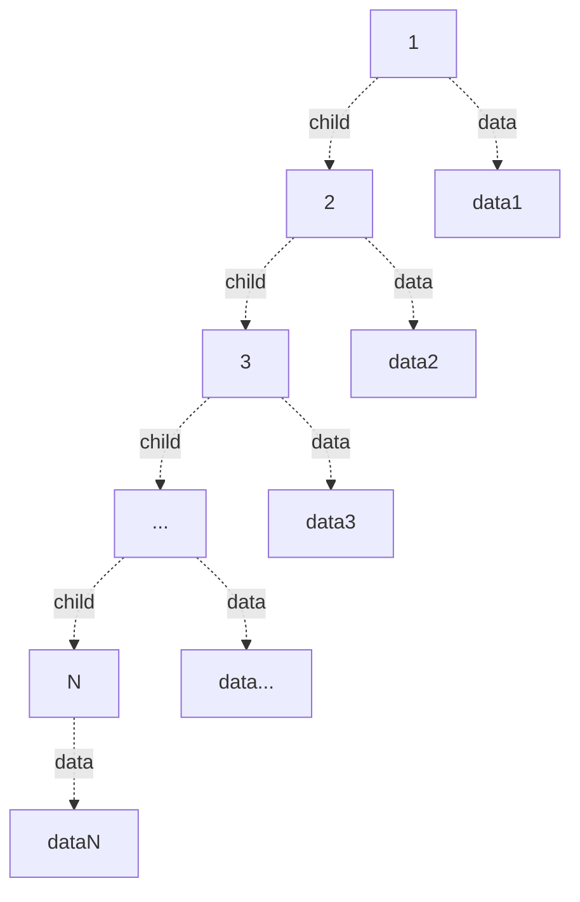
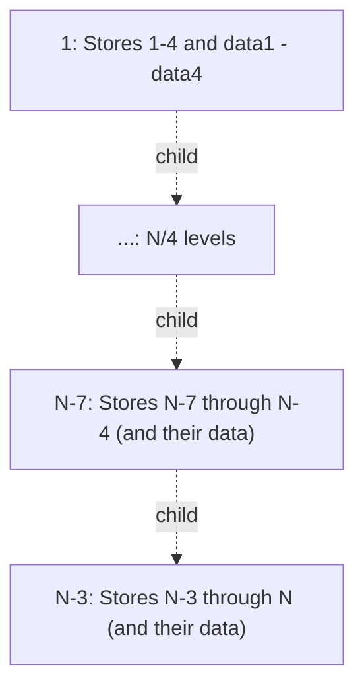
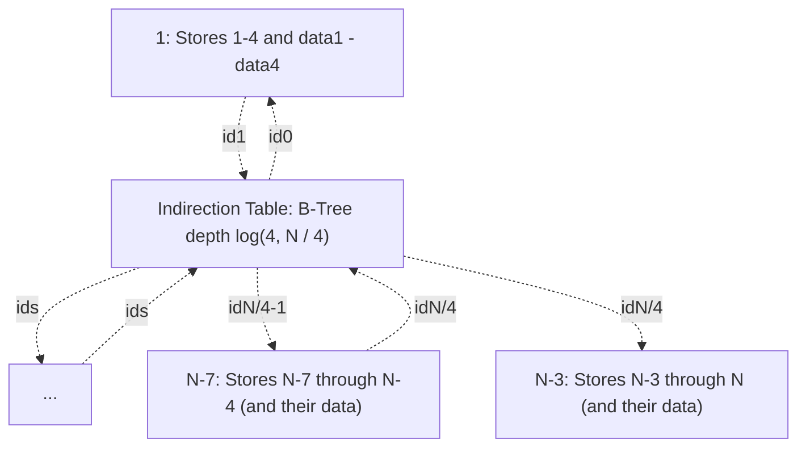
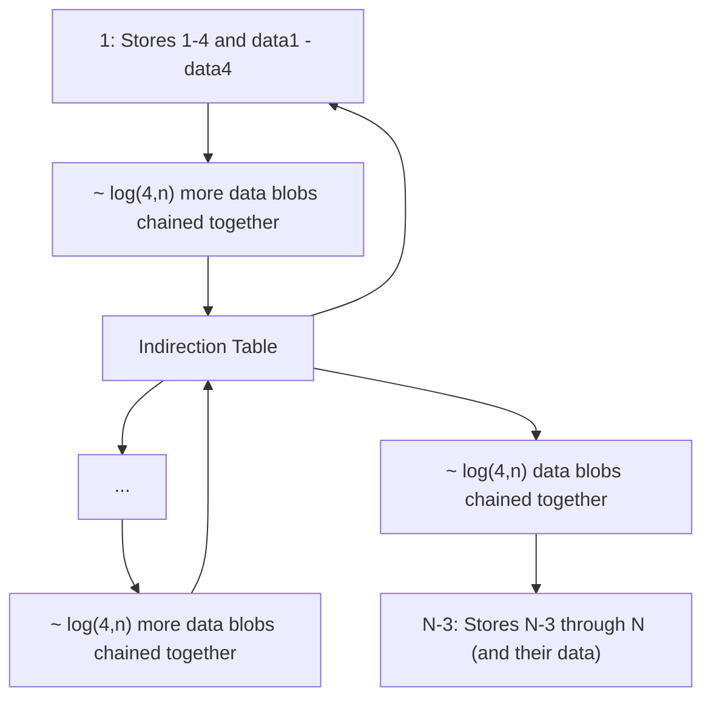

# Tree Storage

This document assumes that the trees will be persisted into some copy on write storage in the form of blobs, which can be fetched using their "handle" which can in turn be serialized into blobs.
This is the API of Fluid's blobs, but note that Fluid requires you to upload the blob to be able to serialize a handle to it:
relaxing this constraint (which would further constraint the storage service) would offer some performance benefits, reducing round trips when uploading but does not fundamentally change the designs.
If using a system where blobs could be assigned names, and updated (classic key value store instead of Fluid's content addressable blob storage),
these approaches still work, but there are some easy design tweaks to improve performance: these are noted, but are not the focus on this document.

It is assumed that each client has access to some stored version of the tree, and keeps the "dirty" part in memory.
It is not required that all the clients agree on what stored tree they are using, or how it's chunked: all that's required to be kept consistent is their understanding of its content.
For example, clients may make nondeterministic chunking decisions for the data, and/or keep a local copy of the chunked tree on disk (ex: via index db) which can have different tuning parameters if they want.

## What Gets Stored

Data stored as part of the tree:

-   The current tree.
-   Optional "local" history information (information stored on/within the logical tree about history for that specific subtree.
    This mostly makes sense for structural edits, but could point to or include high level edits/transaction information).
    If stored This information should be made sufficient to do common history access use-cases locally:
    this includes computing the state of a subtree at any revision between snapshots, or finding which edits happened in a sub tree in a specific period.

Other data can be stored separately (possibly using simar approaches, or extending the tree to have an extra root under which these are stored):

-   Optional references to old snapshots (ex: sequence of top level snapshots. How file system snapshots work).
-   Optional top level edit sequence (log of ops. Could be temporal history and/or logical branch history. Can include high level edit information).
-   Indexes (ex: Node Identifier to Chunk)
-   Schema

For the rest of this document we will just consider the "tree" as the actual document tree plus anything that is stored inline with it.
Any data stored some other way is out of scope for this document.

## Spacial Indexes

Note that this document (other than this section) assumes the data being logically stored is a tree (which may or may not contain local/distributed history information).
There is an alternative perspective that can be takes to store this: the storage could be a clustered 2-d index over location and revision.
For example the data storage could reside in an R-Tree (or alternative spacial index).

## Glossary

-   blob: immutable binary data (ex: Fluid blob).
    Often a b-tree node referencing other blobs, or a collection of chunks (separating out and deduplicating the "shape" information) optionally referencing other blobs.
-   Chunk: A binary encoded compact form for a sequence nodes including some (possibly empty) connected subset of child nodes.
    Children not included directly are referenced from other chunks, which may or may not be in the same blob, and the reference may or may not be indirect.
    Used in memory, as well as within blobs.
    Chunks typically contain a reference to common "shape" data which is deduplicate across a collection of chunks, as well as the actual "content" which can be parsed using the shape information.
-   deep tree: a tree with N nodes and depth O(N).
-   handle: a serializable reference to a blob. In the case of Fluid handles, currently cannot be created until a blob is uploaded.

## Storage Approaches

### Logical Node Tree

The actual tree itself can be stored directly, with each node being a blob, and referring to each other node with a handle.
This would perform very poorly when used with Fluid's blobs being pulled over the network due to:

-   poor per node storage efficiency (pay full blob cost (including storing a handle in the parent) for every node)
-   lots of dependent reads when traversing down (depth of logical tree)
-   large sequences can produce large blobs (since a single node won't be split ever)
-   updates have to create O(depth) blobs, which depend on each-other (and this with Fluid have to be uploaded in sequence)

This does have some nice properties:

-   Accessing a child from its parent is always exactly 1 handle dereference.
-   When walking a sequence, siblings can be prefetched.
-   It's very simple and easy to implement correctly.

Some useful performance trade-offs that could be made to improve this:

-   Inline some nodes instead of storing them in separate blobs.
    Choice of which nodes to do this with impacts performance a lot and depends on usage.
    Could include choice with schema and/or usage information (both hard coded heuristics and dynamically).
-   Could indirect some (or all) blob references through an indirection table (effectively a page table like B-Tree mapping short arbitrary "indirection ids" to handle, where which blobs it points to changes over time) to avoid having to update the blobs containing the ancestors up to the root.
    This instead requires updating the indirection table blobs (which means updating blobs through the indirection table's B-Tree to the root).
    -   Choice of when to do this could be heuristic tuned to balance read costs, indirection table memory use, and write costs.
    -   Can be used where depth (by number of blobs) since last indirection is high, and/or right above blobs that keep getting updated (ex: add an indirection when updating multiple parent blobs for the sole purpose of updating a specific child tht keeps changing).
    -   indirection ids can be allocated such that nearby blobs tend to sort near each other improving efficiency of caching nodes in indirection B tree.
    -   Can rewrite parts of the tree removing or changing indirection (and possibly re-chunking). Doing this occasionally for parts of the tree that were loaded but not modified can ensure read-heavy parts of the tree have a chance to get optimally re-encoded for reading.
-   Chunk sequences: when listing the children in a sequence, allow referring to a "Chunk" which can contain multiple nodes (potentially via sub-chunks) instead of just directly to nodes.
    This allows splitting up large sequences for more efficient editing and avoiding bloated blobs due to large sequences.
    It also allows clustering similar siblings together for improved compression, which works particularly well when combined with inlining of their children.
    This also makes it easier for the root to be a sequence instead of a node, which may benefit the editing APIs.
-   Chunked sets of traits:
    When there are very many traits so the fields list, even with one chunk per trait, is too big for the blob, of there are several traits with small subtrees that should be inlined, but they can't all fit,
    it can be useful to split up the list of traits into chunks (or even a tree).
    This can easily be done by organizing them into a sorted tree (ex: B-Tree) by field key.

These optimizations interact: for example if inlining to optimize breadth first traversal,
the depth of the tree of blobs will tend to be as high as the logical tree's depth, so indirection on blob handles will be more useful.

For N nodes, if 1 in 20 blobs' handles were randomly indirect, and we fit an average of 100 nodes in a blob, and the indirection b-tree is of branching factor 200 (4KB blobs, 20 byte handle) we get:

-   N / 100 blobs
-   N / 2000 indirect blob references
-   log(200, N / 2000) deep indirection table. (First blob gets us to 400k nodes, 4 deep covers 3.2 trillion nodes)
-   on average traversing an edge between nodes does 1 / 100 + log(200, N / 2000) / 2000 handle dereferences (assuming nothing is cached). (For 1M nodes, thats ~0.01)
-   40 bytes per node in main tree
-   ~0.01 bytes of indirection table per node
-   average blobs updated on single change: ~20 (This might be acceptable if we batch updates, only writing batches when summarizing, since that would deduplicate a lot of intermediate updates.
    Also optimizing where indirection is used (instead of random) would also help a lot here).

Same stats with every handle indirect:

-   N / 100 blobs
-   N / 100 indirect blob references
-   log(200, N / 100) deep indirection table. (First blob gets us to 20k nodes, 4 deep covers 160 million nodes)
-   on average traversing an edge between nodes does 1 / 100 + log(200, N / 100) / 100 handle dereferences (assuming nothing is cached). (For 1M nodes, thats ~0.027)
-   40 bytes per node in main tree
-   ~0.2 bytes of indirection table per node
-   average blobs updated on single change: 1 + ceil(log(200, N / 100)). Thats 2 upt to 20k nodes, 5 for 160 million.

Another interesting approach to tuning indirection is to set the probability indirection to O(1 / log(N)).
This makes the amortized read overhead cost O(1) without changing the asymptotic update cost (which was already O(log(N))).

#### key value store vs. immutable blob store

If using a mutable key value store (ex: IndexedDB), instead of an immutable blob store, it becomes possible to update blobs instead of just creating new ones.
This ability can be used for all blobs instead of having to manually implement it with the indirection table.
This removes the extra log(N) network round trips indirection adds to blobs (and replaces it with log(N) disk accesses on the server).
There is however a downside: if the ability to reference old versions of the tree is desired, the key value store must provide this itself.
There are some also ways to benefit from key value store that supports updating values that don't have this downside
(ex: appending deltas to blobs when they fit instead of making new versions, and determining if such deltas should be applied when reading the tree).

### Path B-Tree

All data in the tree can be stored in a key value store under its full path through the logical tree.
Doing this with a [Radix tree](https://en.wikipedia.org/wiki/Radix_tree) roughly amounts to storing the logical tree.
Rather than directly doing a Radix tree, a B-Tree can be used, which can be optimized by omitting any common prefixes shared by every key within that node.
This optimization not only saves a lot of space in the nodes, but also makes moves more efficient, allowing moves to reuse B-Tree nodes when the only change was the part og the path/kay that was optimized out of the node.
This means a move only has to update three paths through the B-Tree: before and after the source, and the destination, allowing for subtree moves in O(log(N)) blob updates (where N is the number of total nodes).

Some possible optimizations:

-   Omit the common parts of the paths in the node (as described above).
-   Compress repeated prefixes withing the nodes.
    This is distinct from the above because its about compressing prefixes shared by some but not all entries in the b-tree node.
-   Store large keys/paths out of line.
    Very deep trees can result portions of keys being store in a node that are larger than the target blob size.
    These can be chunked and stored out of line.
    This can increase blob fetches when navigating in deep subtrees trees, but mitigates the cost of having such deep trees when navigating to their siblings and the upper parts of them.
    This effectively makes the B-Tree more like the logical tree, adding extra depth to the portions of the B-Tree that are storing very deep trees.
    This has the same issues (the update cost when stored in an immutable blobs store being proportional to the depth), and could be mitigated with the same approach (an indirection table use to break up particularly long paths).
-   Model sequence indexes such that inserts usually don't have to change the indexes of other nodes in the sequence (ex: allow inserting at 2.5, instead of moving everything above 3 over one and inserting at 3).
    As long as the keys still sort in the right order, it should work fine, but can result in keys getting longer.
    May involve occasionally normalizing the indexes in a sequence to shorten indexes where inserts keep happening.
-   Subtrees could be used as values in the tree instead of just the leaf values, allowing any of the Logical Node Tree optimizations in the section above to be applied to leaf subtrees.
-   Heuristically inline trees into interior nodes.
    This benefits cases like breadth first traversal when the inlined trees have lower depth (in the logical tree) than large subtrees between them.

Limitations:

-   Does not handle super deep trees very well.
    For a tree with depth greater than O(log(N)), the size of the keys stored in the B-Tree nodes is larger than O(1) and thus can lead to oversized blobs or require some extra splitting of blobs.
    Every update pays at least the O(depth where change was made) cost as that path is stored at least once in the path from it to the root of the B-Tree which needs new blobs.
-   Traversal of sequences high in the tree reading small amounts of data for each item (ex: listing the file names in a directory near the root of a large file system) produces worst case access patterns,
    resulting in performance which is as bad as the Node Identifier B-Tree: O(log(N)) dependent blob fetches per property accessed.

If using a key value store instead of an immutable blob store, some edits can avoid paying the O(max(depth, log(N)) update costs by updating nodes in places (either appending delta information or directly editing blobs) as well as not having to update a blob just because its child got updated (same benefit as indirection in the Logical Node Tree).

### Node Identifier B-Tree

Give all nodes a unique identifier, and refer to them using this identifier.
This is the approach used by experimental shared-tree.
Can be optimized using id-compression and the chunking scheme prototyped in https://github.com/CraigMacomber/sequence.

This approach does poorly for sequences that have been reordered since that forces the B-Tree to have more entries due to not having chunks which cover contiguous ID space.

This chunking approach can avoid a lot of the indirection costs, and sequential id allocation can help keep access in the B tree using nearby keys a lot of the time,
but in general it can end up pulling down lots of B-nodes when trees fail to have well clustered IDs, which can happen due to editing.
Due to this overhead, this design isn't considered in the scenarios below, and is mainly included for comparison.
This design works decently for in memory storage, but doesn't page in/out data very well since a lot of the data in the blobs will be data thats not needed for the part of the tree thats being used.

### Hybrid

The various optimizations to the Path B-Tree make it more like the Logical Node Tree.
If the inlining optimization is permitted to inline subtrees that are split up over multiple blobs,
a hybrid is produced where Path B-Tree is used at the root, and at some point in each subtree, switch over to the Logical Node Tree approach.

This seems a lot like using the Path B-Tree as a replacement for the indirection table from the Logical Node Tree, but this doesn't really work out.
For deep trees, which is the only case where the indirection table is really critical, the Path B-Tree struggles (due to large keys).

If the Path B-Tree also used out of line/chunked storage for large keys combined with an indirection table,
then it would handle deep trees ok, but thats using the same approach that the logical node tree does, so the hybrid approach is not offering a major improvement.

It's possible to have a logical node tree where some of its leaves are actually Path B-Trees,
as well as Path B-Trees there is leaves are Logical Node Trees.
These could be arbitrarily mixed, switching between these approaches (and possibly others as well) heuristically on the subtree level.
This can be thought of as a reference to a Path B-Tree being a kind of chunk supported in the logical node tree.

It's unclear what benefits these hybrid approaches would have a heavily optimized version of either,
but it does seem like there is a clear path to evolve either optimized approach into a hybrid if desired.

## Example Scenarios

### Deep Tree

Consider a tree with N nodes where its depth is O(N).

This makes the path to the leaves, and thus the size of the key in the Path B-Tree O(N).
Best case this can be optimized by omitting the common prefixes resulting in each node storing O(N / log (N)) portions of the key.
This not only potentially causes the b-tree nodes to end up oversized (or store keys out of line or chunked),
but also requires at minimum O(N\*N / log (N)) key data across the whole tree, which ends up being both the size and traversal time bound.
The update costs are also O(N).

In the logical tree case, its O(N) space, and assuming use of some indirection, O(N \* log(N)) time to visit the whole tree.
Inlining can be used to get good sizes for the blobs, and indirection can be used occasionally to lower its costs by a constant factor.
Updating the tree depends on how much indirection is used, but assuming some is used the update time and space costs are O(log(N)) due to needing to update the indirection table.


Example Deep Tree. In this example all children are under a "child" field for simplicity,
but in the general case they could all be different field (making paths incompressable).



B-Tree with branching factor of 4 using the common prefix elision optimization.
Note how all interior nodes in the upper part of this tree has to store O(N) sized keys for all but the right most child.
This is the worst at the root, but still O(N) for the nodes O(1) levels below it.
This gets slightly worse at the root as branching factor increases, but the lower nodes are impacted less.

```mermaid
graph TD;
    root["B-Tree Root"]
    root-.child/.../child: 3N / 4 copies of child.->B1

    B1-.child/.../child: 3N / 16 copies of child.->B11
    B1-.child/.../child: 2N / 16 copies of child.->B12...
    B1-.child/.../child: N / 16 copies of child.->B13...
    B1-.empty string.->B14...

    B11-."log(4,N) levels".->B1N["B11...1"]

    B1N-.child/child/child/data.->DataN
    B1N-.child/child/data.->DataN-1
    B1N-.child/data.->DataN-2
    B1N-.data.->DataN-3

    root-.child/.../child: 2N / 4 copies of child.->B2...
    root-.child/.../child: N / 4 copies of child.->B3...

    root-.empty string.->B4

    B4-."log(4,N) levels".->B4N["B4...4"]
    B4N-.child/child/child/data.->Data4
    B4N-.child/child/data.->Data3
    B4N-.child/data.->Data2
    B4N-.data.->Data1
```

Logical Node Tree, with inlining ~8 nodes into a blob without indirection:



Logical Node Tree, with inlining ~8 nodes into a blob with indirection every level (B-Tree branching factor of 4):



Logical Node Tree, with inlining ~8 nodes into a blob with indirection every log(4, N) levels (B-Tree branching factor of 4).
Note that indirection table has depth log(4, (N / 4) / log(4, N / 4)).
For simplicity ids are omitted.
In this case amortized access cost is O(1), since the cost of an indirection is less than O(log(N)), and its paid ever O(log(N)) chunks.
If older data (from when N ands thus log(N) was smaller) is not rewritten, it will have more indirections, but that will make little difference since it will be a small amount of data compared to N.




### Walking a long sequence high up in a large tree

Read a small amount of data out of many large subtrees.
There are many scenarios that would do this:

-   reading the the type of items in a whiteboard to find ones which contain text for search indexing.
-   listing or file names (and optionally other metadata) for all items in a directory.
-   finding subtrees which were recently modified
-   etc.

This could hit most of the interior nodes in a Path B-Tree because it would be reading data thats spread out pretty uniformly though the key-space.
This seems like a worst case access pattern for Path B-Tree, but at least its in order so the occasional dependent reads when traversing down multiple levels in the B-Tree can be efficiently amortized, and older blobs can be freed from memory without getting re-downloaded later in the traversal.

The Logical Tree approach could theoretically chunk the data to handle this case nearly optimally.
The question is how close to that would be expect it to get in practice since it needs to optimize for many usage patterns, not just this one.
Simple heuristics, like always inlining the type, and tending to inline small subtrees that always have the same shape (like the position) could work well here, though there is a balance between inlining small subtrees causing the size of nodes in the chunk to be larger, resulting in the top level sequence having more chunks.
There are thus two extremes where this could go badly:

1. Too much inlining, causing each node in the sequence to be in its own chunk. At least these chunks could be prefetched for the upcoming children.
2. Too little inlining: the information we need from the node is not available in the chunks that make up the sequence, thus for each node we have to fetch its chunk. When reading the content of that chunk, we could even have to fetch another chunk for the position if it also wasn't inlined (ex: lots of other data got inlined filling up the chunk)

on Notes

The Path B-Tree has very simple chunking logic for internal nodes and can easily produce nicely sized blobs for data, but for deep trees the key/path part can become bloated or need special handling.

The Logical Node Tree approach, when applying good chunking heuristics, has much more complex chunking logic (has to handle large numbers of fields, long sequences, inlining etc),
the management of the underling tree of blobs it uses is very simple.

Both should have a good algorithm compressing leaf subtrees (subtrees which single piece), for the Logical Node Tree this is really just one case of its more general algorithm while for The Path B-Tree its an additional requirement.

The logical tree approach is well suited to applying contextual optimizations, for example it can easily be made extensible with a sequence chunk abstraction, allowing for specialized encoding and compressions schemes to be used where appropriate.
Such specialized approaches and tuning of heuristics can optionally consume schema data, as well as usage patterns to have blob boundaries converge where edits happen, reducing redundant storage and updates over time.
It would be relatively easy to produce a minimal version of the logical tree approach and add optimizations incrementally in the future, even maintaining document compatibility.

#### Finding parents and identifier indexes

In both cases, you use a path to a node to find it so its parents are found on the way.

However if we add an index that allows finding nodes by some other query path (ex: an index by node identifiers for nodes which have an identifier), there are a few ways that can work.
If the index maps identifier to path, then the index is expensive to update for large subtree moves.
If the index maps identifier to handle (or indirection id), this can avoids large update costs for moves, but needs another index (handle to parent) to be able to discover parentage of nodes looked up this way.

### Conclusions

It seems like the logical tree provides modular way to add tuning/optimization allowing incremental delivery of target optimizations,
though that comes at the cost of possibly needing more optimizations to reach a good baseline performance.

The Path B-Tree provides a elegant and simple approach, but it complicates moves somewhat, doesn't handle very deep trees particularly well, and is impractical to optimize for specific access patterns, like breadth first traversals of sequences of large subtrees.

While both approaches could permit optimized formats for the leaf subtrees, this fits more naturally into the logical tree, which can do this for non-leaf subtrees as well.

The Logical Node Tree is optimized for child access and can be tuned for which children can be accesses quickly (via inlining and indirection heuristics).
The Path B-Tree excels in order at depth first traversals offering almost optimal possible performance for this case.
High up in large trees breadth first traversal and depth first where the order of recursion is not the same as the path sort order, the Path B-Tree's accesses degrade (though bounded by log(n)) with poor caching/locality.
In these same cases the Logical Node Tree should deliver significantly better constant factors, though if using indirection does still have a worst case of log(n) as well.

The Logical Node Tree also more naturally handles partial checkouts that don't include all the leaves (ex: load all the directories in a folder, but not their contents), getting better locality in these cases,
and is more comparable with subtree based permissions systems (since all nodes in a chunk always share a an ancestors that in the chunk).

Both approaches are similar as far as being able to be specialized to take advantage of a key value store instead of an immutable blob store,
however its likely slightly easier to support both modes of operation for the Logical Node Tree since doing so basically amounts to tweaking the indirection logic
(always on, but replace the indirection able with the key value store).

#### Decision

These factors, in my (Craig's) subjective opinion, seem to lean toward the Logical Node Tree as being a better choice for Shared-Tree's planned usage patterns.
This still needs consensus.
A conclusion on this front is not needed for M1 (partial checkouts and incremental summaries are not technically necessary for that),
but this area would be a good one to develop in parallel with other aspects of SharedTree.
This is a good place leverage decision encapsulation to minimize the impact if we change our approach later
(ex: we come up with better ideas, find an issue with this analysis, or change our evaluation criteria).
