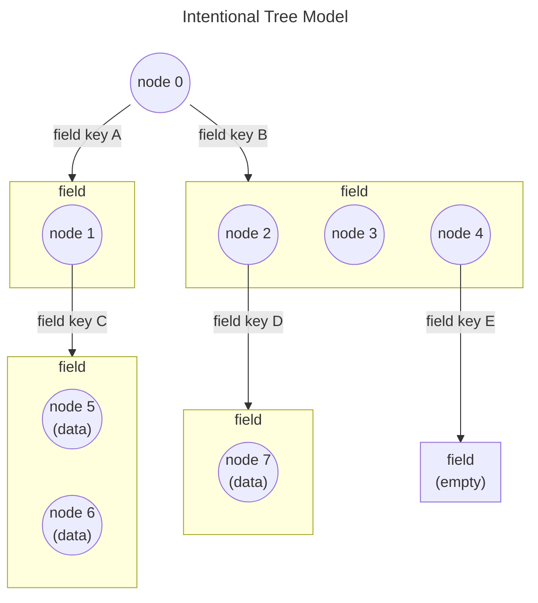
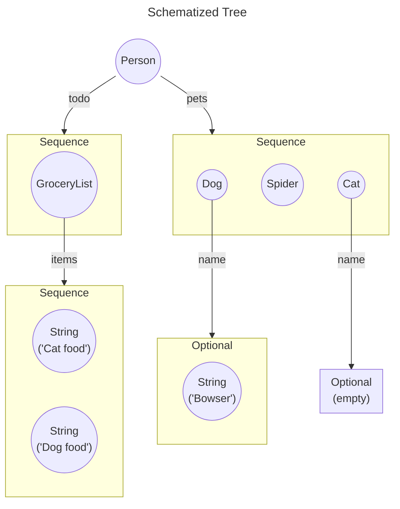
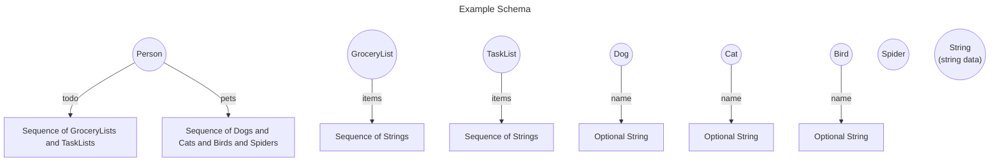

# SharedTree Schema Evolution

This document provides the necessary background for understanding SharedTree's strategy for conforming data to a given user-provided schema.
It then explores in what ways a user might change a schema over time, and how that might be accomplished with minimal friction.

## What is a Schema?

When using a SharedTree, users provide a **schema** which allows SharedTree to enforce that certain types of data are at certain locations in the tree.
SharedTree's current schema API and read/write API (as of Jan 2025) have been designed to conform to common Javascript conventions.
However, there are other possible schema APIs that SharedTree could support, because it is built, internally, on top of a more general model.
This section of this document will introduce that model - the Intentional tree model - because its simplicity makes it easy to describe the techniques available for conforming a tree to a schema.
[Later on](#modern-sharedtree-schema), this document will show how SharedTree builds its actual API as a restriction of that model.

### The "Intentional" Tree Data Model

Publicly, SharedTree exposes a "JavaScript friendly" data model. However, _internally_, SharedTree uses a more uniform data model to host its content.
This model is a structure consisting of "nodes" and "fields", each parented under the other recursively to form an arbitrary tree.

> This model is sometimes referred to as the "Intentional" model, named for the legacy project from which SharedTree originated.

**Nodes** can contain a data payload (e.g. a string, or a number) and have a labeled edge to each of zero or more child fields.
Each labelled edge is called a "field key", and is unique among all other field keys under its same parent node.
**Fields** contain an ordered sequence of zero or more nodes.

For example, one possible tree in this data model might look like:



Some nodes have no child fields, others have a single field, and others have multiple.
Likewise, some fields are empty, others contain a single node, and others contain multiple.
In this particular tree, only the leaf nodes contain any data payloads, but it's possible for any node to have a data payload.

> One notable limitation to this model is that nodes/fields cannot directly reference nodes/fields other than their direct children.
  A node/field can never have multiple parents in the tree. Therefore, a field wishing to point to some data that already exists elsewhere in the tree must use an indirect reference of some kind (e.g. a path from the root of the tree to the referenced data, encoded as a string in a node's data payload).

### Restricting Data with a Schema

The example tree diagram above describes what data is in the tree, but it does not describe what data _could possibly_ be in the tree.
This is the job of a _schema_ - to constrain the shape and content of the tree to a more specific domain.

For example, in the tree above, we can see that the field under `field key D` of `node 2` contains exactly one node - `node 7`.
Without a schema, we don't know if that's because there is always a single node in that field, or if it's sometimes empty, or sometimes has more than one node.
This makes it cumbersome to read data from the tree (the API treats every field as a sequence, even if e.g. it's known that there ought to be exactly one node there), and dangerous to write data to the tree (e.g. if this field is supposed to always have exactly one node, what happens when it is deleted?).

A schema could tell us that `node 2` is a "Dog" and that every dog has a string data payload - the dog's name - under `field key D`.
In addition to knowing that the data in `node 7` is a string, and what that string means, we also know that it wouldn't make sense to put more than one node in that field - a dog can't have two names (not in this domain, anyway).

If we have the guarantee that the data in the tree conforms to this "Dog" schema, then users can be confident about how to read and write the dog's name.
We can also make the APIs better (for example, having a specific `setName(nameString)` function rather than a general `setField(fieldKey, nodes)` function).

### Tree Schema Structure

What does a tree schema actually look like?
What aspects of the Intentional Tree Model introduced above might be constrained by a schema?
The following list describes the building blocks for schema enforcement that are in use by SharedTree and have proven to be sufficient for typical SharedTree projects so far.

1. **Nodes have a _type_.**
   Knowing what a given node represents in an application domain is important to understanding the data in and around that node.
   By assigning each node a unique type identifier (e.g. "Dog" or "com.microsoft.powerpoint.rectangle"), the data held by that node can be understood.

2. **Nodes have expected fields.**
   For a given type of node, a schema enumerates which fields are expected to be under that node.
   For example, a node of type "Dog" is expected to have a field under the field key "name".

   > Having an expected field means that the field is expected to be there, but the inverse is not true.
     _Not_ having an expected field with key _K_ does not mean that there _can't_ be a field with key _K_.
     Field _K_ might be in the tree, but it's invisible to a schema that doesn't know about it and that schema can (in theory) pretend it doesn't exist.

   For each of these expected fields...

   3. **Fields have a _kind_.**
      The kind of a field determines its behavior (e.g. in the case of SharedTree, this might affect how concurrent edits to the field are merged).
      One critical aspect of a field's kind is its _multiplicity_.
      The multiplicity describes how many nodes a field is allowed to hold.
      The Intentional tree model defines the following:

      * **Required fields** must have exactly one node at all times.
      * **Optional fields** can have either zero nodes or one node.
      * **Sequence fields** can have any number of nodes (including zero).
      * **Forbidden fields** must have exactly zero nodes (this is useful in some complicated scenarios but not something a typical user would desire).

   4. **Fields only have certain types of nodes.**
      A field can be restricted to contain only nodes whose types are in a known set.
      For example, the field under the "name" key of the "Dog" node only allows nodes of type "String".
      A field under the "pet" key of a node of type "Person" might only allow nodes of type "Dog" or "Cat".

   > As we'll see later when introducing the existing [SharedTree schema](#modern-sharedtree-schema), it's also useful to allow a "wildcard" field key for SharedTree map nodes.
     This means a node is allowed to have any number of optional/sequence fields under any arbitrary keys - keys which may not be know outside of runtime.

---

Here is the example tree from before after being "schematized" using the above rules.
The field keys have also been changed to be more descriptive.



Now we can see what the data is describing - a person, including their todo list and all their pets.
Apparently, they still need to name their cat.

---

This tree now has a schema and is merely one of the many possible trees that conforms to that schema.
What is the schema in the abstract?
Fundamentally, it's a collection of schema for each type of node.



This captures each of the four aspects discussed above.
Each node (defined by its type) is associated with its expected fields and their respective kinds (multiplicities) and allowed child types.
The example tree above is a "Person" node.
It is just one of many possible trees that could satisfy one of the nodes in this schema.
In fact, this schema even contains some node types that were not present in the tree at all("TaskList" and "Bird").

## The Evolution of Schema

Sometimes a schema needs to _change_.
In fact, it's common for an application schema to change over time as the application matures.
For example, new features often require new data to be stored in the tree, requiring a change to the schema.
First, we'll identify what the possible changes to a hypothetical schema might be.
Then, we'll explore how these changes can be accomplished by the developer.

The following list describes ways that a developer might wish to change their schema.

1. **Add an allowed type.**
   A developer can expand the set of node types allowed under a particular field, or at the root of the tree.

   > In fact, by modeling the tree as having a single, special root _field_ rather than having a root _node_, there is no distinction between adding a new allowed type at the root field vs. any other field in the tree.
1. **Remove an allowed type.**
1. **Change the type of a node.**
   A developer may want to swap out one allowed type for another (e.g. a field containing "Dog" nodes now contains "Cat" nodes), or they might want to rename the type identifier of a node (e.g. "Dog" -> "Dawg").
1. **Rename a field key.**
   For example, renaming the "Dog" node's "name" field to "nickname".
1. **Add an expected field to a node type.**
   For example, adding a required field with a node of type "Boolean" and field key "doesBark" under the "Dog" node.
1. **Remove an expected field from a node type.**
1. **Change the kind of a field.**
   For example, allow Dogs to have multiple names by changing the "name" field of the "Dog" node from an optional field to a sequence field.

---

Without any specialized APIs for facilitating these kinds of changes, any change to a schema results in a new, different schema.
For example, if a developer wanted to add a new field to the "Dog" schema, they'd create a "Dog2" schema with the existing fields of "Dog" ("name") as well as their new field ("doesBark").
If they want a "Person" to be able to own a dog that barks, they'll need to create a "Person2" schema that allows "Dog2" in the "pets" field rather than the legacy "Dog".
Before they know it, a significant part of their schema has been recreated as the new data format "bubbles up" the tree.

> In this way, if a schema node changes, then all schema nodes that transitively reference/contain that node will also have to change.
  Therefore a typical application schema will observe a "spine" of its schema tree change when _anything_ in the schema changes, climbing up to the application's root node.
  Since the root node always changes, even a very small change to a leaf schema node results in a "replacement" of the entire schema.

Migrating the application from the old schema to the new schema can be difficult.
The next section will detail the worst case scenario, but subsequent sections will explore how the migration might be [made easier for some of the types of changes listed above](#schema-change-shortcuts).

### Migration

Many developers who change their schema will need to think carefully about how they migrate their application from the old schema to the new schema.
It requires thoughtful planning in a production scenario.

An application has its schema encoded in multiple places.

* The **stored schema** is the schema that the tree in the **document** - the persisted state and source of truth for the application's data, shared by all clients - conforms to.
  It is persisted as part of the document.
  All clients reading the document know that the tree stored in that document matches this schema.
* The **view schema** is the schema that a client expects when reading and writing tree.
  It is part of the application source code loaded by a client.

When an application is first written, these two schema are equivalent.
In some environments, the developer can ensure that they remain equivalent as new versions are released.
For example, consider an application where all the documents are stored on a central server.
To release a new version, a developer takes the following steps to upgrade from schema A to schema B:

1. At first, the documents are using stored schema A and the application is written against stored schema A.
2. The developer temporarily takes the service offline, suspending application availability, and then upgrades all documents on the server to use stored schema B before re-enabling the service.
   Thereafter, any clients attempting to connect to the service will be prompted to download the new version of the application client first, which is written against view schema B.
3. The migration is complete.

That makes a clean and relatively simple transition.
The diagram below visualizes the clean break between the old and new schema that happens at step 2:

```mermaid
gantt
dateFormat D
axisFormat Step %e
tickInterval 1day
Maintain view schema A in application source code : 1, 1d
Documents contain stored schema A                 : 1, 1d
Maintain view schema B in application source code : 2, 1d
Documents contain stored schema B                 : 2, 1d
```



Unfortunately, many applications operate under additional constraints.
For example, what if the developer does not have control over all the documents?
Perhaps the documents can be stored locally on a user's computer, or can be hosted by another service that is independent of the developer.
What if the developer does not have control over when a client updates their application?
Even "live service" applications, like web apps, might allow users to continue using an older/cached version of an application client long after a deployment of a new version.
In these scenarios, when does the document get upgraded?
When does the client move to the new version of the application?
The developer cannot know, and therefore cannot guarantee that the stored schema and view schema of their application will be the same for all clients and documents.

This is problematic.
If view schema B is deployed to the application, a client might encounter a document that is still using stored schema A (i.e. the view schema is ahead of the stored schema).
Or, a client might avoid updating even after its document has upgraded to the stored schema B (i.e. the view schema is behind the stored schema).
The application cannot function unless the view schema and the stored schema agree.

How then does a developer in this situation go about upgrading their application schema?
The developer must do a **staged rollout** - an incremental set of application deployments that release client code only when it is safe to do so.

1. Initially, the documents are using stored schema A and the application is written against view schema A.
2. View schema B is written into the application client code.
   The application's UI, etc. is written against it, but the existing code that (written against view schema A) continues to be maintained.
   Thus the application logic becomes bifurcated according to the schema.
   If the application loads a document with stored schema A, it views that document with view schema A.
   If instead it loads a document with stored schema B, it views it with view schema B.
   Both versions of the view/UI/application/etc. must continue to be maintained until after step 4.
   This new version of the application is deployed and clients can begin updating to it.
3. The developer waits until all (or most) clients have upgraded to this new application version.
   The amount of clients that have moved to the new version is known as the **client saturation**.
   It may be impossible to know for sure when 100% client saturation has been achieved, so a developer may estimate when the client saturation is sufficient - e.g. after 99% of online clients in the last 30 days had updated the new version.
   After client saturation, the stored schema of the documents can now be upgraded to B.
   It's important that this happens after client saturation of view schema B, or else there will be many clients that fail to open a document with stored schema B because they only know about view schema A.
   A new version of the application is deployed which will upgrade the document to stored schema B when it first loads (or first writes to) a document using stored schema A.

   If every client is guaranteed to have write permissions, then the developer can also remove view schema A and the code written against it in the same deployment.
   This is because any client that encounters a document with stored schema A can upgrade it to stored schema B before interacting with it.
   However, if the client is a read-only client, then it can't do this, and it needs to retain the code to read view schema A in case it opens a document with stored schema A.
   This caveat is made more manageable by [adapters](#adapters), introduced later in this document.

     > To minimize the time between client saturation and document upgrades, the ability to upgrade the document can be made part of the deployment in step 1 but "shipped dark" and remotely enabled in this step via a feature flight.

4. Wait until all documents have upgraded to the new stored schema.
   After this **document saturation** has been achieved, the application can do another deployment, removing view schema A and all of its related code, if it was not able to do so in step 3 (because some of its clients are read-only).
   It's important that this happens after document saturation, or else there will be read-only clients that fail to open a document with stored schema A because they only know about view schema B.

   > In some environments, there's no guarantee that document saturation will ever occur - and this step is never completed.
     Old documents can hang around forever if they remain unopened, but must still be supported in the event that someday they are needed.
     The code that reads view schema A must be maintained forever.
     Fortunately, this headache can be somewhat mitigated via the use of [adapters](#adapters).

5. Eventually, all clients will have updated to the latest deployment, and all traces of schema A will be gone in both the documents and application source code.

```mermaid
gantt
dateFormat D
axisFormat Step %e
tickInterval 1day
Maintain view schema A in source code (read/write client) : 1, 2d
Maintain view schema A in source code (read-only client)  : 1, 3d
Documents contain stored schema A                         : 1, 3d
Maintain view schema B in source code                     : 2, 3d
Documents contain stored schema B                         : 3, 2d
```



Different applications with different requirements may tweak this process in various ways, but in general doing a staged rollout is a cumbersome endeavor.
It takes time, it requires code bifurcation/duplication, and it's complicated to understand and coordinate.
The next sections will explore ways to reduce the amount of effort a developer must take to change their schema.

### Adapters

A **schema adapter** helps to reduce the code bifurcation/duplication (described in the previous section) that results from doing a staged rollout.
One of the main pain points of the staged rollout process is that the application has to maintain two view schema while the migration is ongoing (or forever!), since the client might encounter documents of either the old stored schema or the new stored schema.
In practice, this can mean a lot of redundant application code as the UI is bound to two different data models, but only one is ever used at a time.
Allowing legacy code to be removed earlier improves codebase health, aids developer velocity and reduces the size of shipped code.

To facilitate this, an application can write a schema adapter.
The adapter takes a tree of data that conforms to one schema and transforms it to conform to another schema.
In the context of a schema migration, this means that the application can write code (e.g. the code that binds the view schema to the UI) _only against the new view schema_.
The code that binds to the old view schema is deleted at the same time that the new view schema and the new adapter are added.
This is a net benefit because it's simpler to write the adapter's code than it is to write the UI binding code.
During the migration, when the application loads a document with the old stored schema, it first adapts the data in the document to the new view schema before the data is read by the app.

This replaces the view schema bifurcation with the adapter and changes the rollout sequence to:

1. Initially, the documents are using stored schema A and the application is written against view schema A.
2. Write an adapter from schema A to schema B, which will adapt the data in _stored_ schema A into the data in _view_ schema B.
   Replace view schema A with view schema B and deploy a new version of the application.
3. Wait for [client saturation](#migration), then enable the upgrading from stored schema A to stored schema B.
4. If applicable, remove the adapter from the source code and redeploy after [document saturation](#migration).
5. The migration is complete.

```mermaid
gantt
dateFormat D
axisFormat Step %e
tickInterval 1day
Maintain view schema A in source code                      : 1, 1d
Maintain A -> B adapter in source code (read/write) : 2, 1d
Maintain A -> B adapter in source code (read-only)  : 2, 2d
Documents contain stored schema A                          : 1, 3d
Maintain view schema B in source code                      : 2, 3d
Documents contain stored schema B                          : 3, 2d
```



> Similar to a staged rollout without an adapter, read-only clients must preserve the adapter for more of the migration than read/write clients.
  Therefore the advantages to using an adapter vs. not (i.e. maintaining the code bifurcation to support the old view schema) are extra valuable for applications with read-only clients.

---

An application could even write a "reverse" adapter to adapt the new schema to the old schema.
This is useful if the application code wishes to move to a new view schema - and begin development on binding the UI to the model as soon as possible - but it can't do any upgrades to the stored schema of the documents yet.
The application can use an adapter from schema A to schema B to read the document, and an adapter from schema B to schema A to write to the document.

> This can be useful for migrations where some data has been removed in the new schema, or when the data is semantically similar in both the old and new schema but has been re-organized.
  If the new schema introduces _new_ data, then it can't be written to the document until the stored schema of the document is also upgraded.

### Schema Change Shortcuts

Any kind of change to the stored schema can be accomplished via the expensive staged rollout process described above, and tools like [schema adapters](#adapters) can help to reduce the ensuing code bloat.
However, there are various kinds of changes to the stored schema that, with the proper API available on the view schema, can be accomplished so as not to require the view schema having to be replaced.
This means that a staged rollout might not be necessary.
Each kind of schema change enumerated in the [The Evolution of Schema](#the-evolution-of-schema) section above will be examined below to see whether it requires a staged rollout to accomplish or whether there's a **shortcut** to do it without.

This analysis is also summarized in a succinct table in [Appendix A](#appendix-a-shortcut-matrix).

1. **Add an allowed type.**
   * We can provide a special "catch-all" type that will be used for any type that is unrecognized.
     For example, imagine a digital whiteboard app that renders various types of content to the screen.
     The developer chooses "Ink", "Sticky Note" and "Unknown" (the catch-all) as the possible node types allowed in the whiteboard canvas field.
     To render an "Unknown", the app makes a gray box that says "This content is not supported, please update to the latest version of the application", but the app otherwise is fully functional as it has been (it is _not_ an error).
     In a future version of the application, the possible node types are increased to "Ink", "Sticky Note", "Unknown" and "Image".
     A version of the app with the original view schema will interpret Images as "Unknown" and render the gray box.
     Therefore the new version, with the new view schema, can go ahead and upgrade the stored schema as well without worrying about doing the staged rollout process.

     Clearly, when this strategy makes sense for the application, it immensely reduces the amount of work required to add a new node type.
     However, it must be employed preemptively.
     The developer needs to include the "Unknown" type ahead of time, anticipating that "there might be some new stuff here someday".
   * To mitigate that problem, another option would be to have the "Unknown" type be automatic - or "opt-out" rather than "opt-in".
     That is, all applications must handle the "Unknown" type in every field, unless they intentionally make the decision not to.
   * A third approach would be to automatically filter out unrecognized node types where applicable.
     In the example above, the original client would simply not be able to observe that there are Image nodes in the canvas field - the field would appear shorter than it does to the upgraded clients if there are images in it.
     This might be appropriate for sequence fields, but would not work for required fields because a required field must not appear empty.

     > TODO: This is one of Noah's off-the-cuff ideas. Whether or not filtering makes sense for optional fields (or at all) is debatable.

     This strategy could be used in combination with the "Unknown" type - if Unknown is in the field's set of allowed types, then the foreign type will present as an Unknown, otherwise it will be filtered.

1. **Remove an allowed type.**
   This scenario can employ the same strategy as "Add an allowed type" above, namely, the "Unknown" catch-all type.
   The newer schema can simply add the "Unknown" type to the set of allowed types if it doesn't already exist.
   Then the removed type, when present in the document, will present as an "Unknown".

   This does not require the developer to plan ahead - "Unknown" can be added to the new view schema when the field is first removed, rather than having to be added preemptively in the original schema as is the case when adding an allowed type.
   However, the _stored_ schema may not be upgraded to remove the node type until the number of clients with the new view schema has passed the saturation point.
   This is because so long as an old client exists, it might try to write the removed type into the document, and if the stored schema has already removed that type then they will experience an error.

1. **Change the type of a node.**
   This can be accomplished by first removing the node type and then adding a new one, according to the processes outlined above.
   Therefore it takes on the drawbacks of both - the "Unknown" type must be added preemptively, and the stored schema may not be upgraded until the new clients have reached saturation.

   In the event that the developer merely wants to rename the _identifier_ of a node, but otherwise keep the node the same, we can support that with an aliasing feature.
   Specifically, when defining the node in the view schema it can be supplied with both a "view identifier" (the new name) and a "stored identifier" (the existing name).
   The view identifier will show up in the source code when reading/writing the tree, but it will be automatically translated to the legacy stored identifier when reading/writing to the document.

1. **Rename a field key.**
   This can be accomplished via the same technique used to rename node identifiers (see "Change the type of a node") above.
   When defining an expected field in a node schema, both a "view field key" and a "stored field key" may be supplied.

1. **Add an expected field to a node type.**
   This scenario is more or less difficult depending on the kind of the field.

   * To add a _required_ field (or more specifically, any field with a multiplicity that does _not_ include zero) to a node without otherwise changing the node, the staged rollout process must be employed.
     This is because the new clients will demand that the field be present for the given node, but older clients will not know that it exists.
     Therefore, new clients will error if they _read_ the document _before_ its stored schema changes, but old clients will error if they _write_ to the document _after_ its stored schema changes.

     > Notably, old clients are only in danger if they _write_ to the document.
       After the stored schema has introduced the new field, clients with the old view schema could be permitted to view the document in a "read only" mode.
       They simply won't see the new field, and this would not require a staged rollout migration.

     One way around this is to introduce an entirely new node type that is the same as the old node type but also has the new field - e.g. replace "Dog" with "Dog2" that has a "doesBark" field.
     Then, the developer can use the strategies outlined above (see "Change the type of a node") to migrate from "Dog" to "Dog2".
     However, this may not be a very satisfying resolution because old clients will see "Dog2" as "Unknown" and e.g. will not be able to read or write the "name" field of a "Dog2", even though it has the same meaning as it does in "Dog".
     Additionally, new clients will have be able to convert "Dog" nodes to "Dog2" nodes until the saturation of new clients completes (no old clients left).

   * To add an _optional_ or _sequence_ field (or any field with a multiplicity that _does_ include zero), there is an additional escape hatch.
     Since the field can tolerate being empty, it is (potentially) acceptable if a client which is not aware of the field does not populate it.
     For example, "doesBark" can be added as an optional field to "Dog" in the stored schema without requiring a staged rollout migration.
     This is because clients with the new view schema will read and write the new field, but clients with the old view schema can ignore it entirely.
     Old clients will never populate it, but that's okay because new clients handle its absence.

     One danger to this approach is if an old client attempts to _copy_ a node with a new optional field that is invisible to the client.
     Had this copy occurred on a client with the new view schema, the copy would include the optional field, but since the copy occurred on the old client, the client didn't know to also copy the new field.
     Depending on the application scenario, this could be interpreted as data loss.
     Therefore, tolerating new optional fields in this way should be a feature enabled by policy choice rather than automatically.

1. **Remove an expected field from a node type.**
   This is the inverse of adding an expected field (see above) and has similar properties, but some things are easier.

   If a required field is removed from the stored schema, then old and new view schemas will not be compatible (unless the clients with the _new_ view schema are read-only) and a staged rollout is required.

   If instead the entire node is replaced ("Dog" -> "Dog2"), then all the same caveats apply as when using this strategy to add an expected field.
   Old clients will not be able to interact with the individual fields of a "Dog2" node, even if it knows about them in the context of a "Dog" node.

   If removing an optional/sequence/multiplicity-includes-zero field, no staged rollout is necessarily required.
   Old clients tolerate the field being empty and therefore it is safe for new clients to leave it unpopulated.

1. **Change the kind of a field.**
   This can be effectively accomplished by removing the expected field and adding a new one of the desired kind under the same key.
   Directly changing the multiplicity of a field, or its concurrent merge resolution behavior, is unlikely to be a common scenario and it's probably not worth having a special API or mechanism to do it more directly (if one is even possible).

## Modern SharedTree Schema

The current SharedTree API and its corresponding schema-declaration APIs expose a subset of the capabilities of the "Intentional" model.
SharedTree restricts the possible schema a user can write in order to make the library more conventional in a Javascript environment.
By restricting nodes to be either an **object node**, **array node** or **map node**, the schema take a shape similar to native Javascript objects, arrays and maps.

1. **Object Node:**
   An object node is a node that has a known set of expected fields.
   All of its fields are either required (multiplicity one) or optional (multiplicity zero/one) - there are no sequence fields.

   The SharedTree read/write API leverages the object node schema to generate JavaScript getter/setter properties for each field.

   An object node always has _exactly_ the fields that are described by its _stored_ schema (no more, no fewer).
   It may have more fields than is described by its _view_ schema if an `allowUnknownOptionalFields` flag is set (this allows for the "optional field [shortcut](#schema-change-shortcuts)" described above when adding or removing an optional field), or via the use of [adapters](#adapters).

   Any of the schema [changes](#the-evolution-of-schema) described above are applicable to object nodes.

2. **Array Node:**
   Every array node has exactly one, special field, which uses the hardcoded field key `""` (the empty string).
   This field is a sequence field and is the only place where a sequence field is used in SharedTree schema.
   This means that any sequence of arbitrary length in a SharedTree must reside within an array node.
   For example, a Person node could not store its list of pets directly in a field:

   ```mermaid
   flowchart TD
   node0(("Person
   (object node)"))
   subgraph field0["Sequence (Not possible!)"]
   node2((Dog))
   node4((Cat))
   end
   node0--"pets"-->field0
   ```

   Rather, the pets would be in the special sequence field of an array node:

   ```mermaid
   flowchart TD
   node0(("Person
   (object node)"))
   subgraph field0["Required"]
   node1(("Array Node"))
   end
   node0--"pets"-->field0
   subgraph field1["Sequence"]
   node2((Dog))
   node4((Cat))
   end
   node1--"''''"-->field1
   ```

   This special field is opaque to the developer who interacts with the array node.
   In the SharedTree read/write API, array nodes implement (roughly) the JavaScript `Array` interface, making them feel much like native JavaScript arrays.

   Because they don't allow arbitrary fields, the only [changes](#the-evolution-of-schema) that can be made to an array node schema are to the types allowed in the array (or the type identifier of the array node, if it was user-defined).

3. **Map Node:**
   Like object nodes, map nodes store at most a single node under each user-defined field key, but unlike object nodes, the field keys are not know at compile time.
   Like a JavaScript `Map`, a map node allows any possible key to be queried for a possible value.

   > One way to model this conceptually is that a map node is an object node with an optional field under every possible field key.

   The values of a given map node are constrained to a particular node type by the developer.
   Therefore, like array nodes, the only [change](#the-evolution-of-schema) that a map node might undergo is to the node type(s) of its values (or the map node's type identifier).

Whether a node is an object node, array node or map node is a property of the node in the SharedTree schema.
Therefore there is an additional kind of change that can be made to a SharedTree schema - the transition of a node from one of these types to another.
The only transition that makes much sense is to convert a map node to an object node, or visa versa.
This is only possible if all of the object node's fields are of kind optional.
There is currently no API in SharedTree for doing so.

### SharedTree Schema Adapters

A library for authoring [schema adapters](#adapters) will be exposed by SharedTree to allow convenient and idiomatic use of adapters for customers that need them for migration.
The API has yet to be designed, but will conform as much as possible to existing SharedTree APIs and usage patterns.

## Appendix A: Shortcut Matrix

This table enumerates the kinds of [changes](#the-evolution-of-schema) to a SharedTree application's view schema that developers might make and the [shortcuts](#schema-change-shortcuts) that can be used to accomplish them without resorting to a [staged rollout migration](#migration).
For each, it lists in what ways the change is compatible with clients using the old or the new schema and whether or not SharedTree currently exposes an API for the shortcut.

The changes are ordered into three categories:

* The first (🟩) are changes which don't required any change to the stored schema.
  The translation between the stored schema and the new desired view schema can be accomplished completely by the new client view schema code at runtime.
  These are the easiest kinds of changes to make because the developer does not need to do anything to ensure compatibility other than use the proper migration API on the view schema in the new version of the application.
* The second (🟡) are changes which do require a change to the stored schema, but which no _not_ require any changes to the application _data_ in the document.
  These changes might require the previous version of the schema to be forwards-compatible with the new version, which requires planning ahead.
* The third (🔶) are changes which require a change to the stored schema and also a change to the application data.
  This requires a mechanism for migrating the data from one format to another at the same time that the stored schema is updated.
  Currently, this capability is neither designed nor planned for SharedTree.

Additional symbols used in the table below:

* ✅ A green check mark indicates that the operation can be performed by the client
* ✔ A gray check mark means the operation can be performed by the client by using a shortcut API.
* ⚠️ A warning triangle indicates that the operation can be performed via a shortcut API, but must be planned for in advance (by being forward-compatible).
* ⌛ A timer means a shortcut API is possible and/or planned, but not yet available

|| View Schema Change | Stored Schema Change Required | Stored Schema Change ⇒ Possible Need to Migrate Data | Read Compatibility | Write Compatibility | SharedTree Shortcut API Available |
|-|-|-|-|-|-|-|
| 🟩 | Map Node → Object Node*              | No | No | ✔ **New clients** must enable `allowUnknownOptionalFields` in the view  | ✅ | ⌛ |
| 🟩 | Rename Node Type†                    | No | ❕ Yes | ✔ **New clients** provide alias in the view schema | ✔ **New clients** provide alias in the view schema | ⌛ |
| 🟩 | Rename Field Key                     | No | ❕ Yes | ✔ **New clients** provide alias in the view schema | ✔ **New clients** provide alias in the view schema | ✅ |
| 🟩 | Remove Allowed Type                  | No | ❕ Yes | ✔ **New clients** mark the type as "excluded" in the view schema | ✅ | ⌛ |
| 🟩 | Remove Non-Required Field            | No | ❕ Yes | ✔ **New clients** must mark the field as "excluded" in the view schema | ✅ | ⌛ |
| 🟡 | Object Node† → Map Node              | 🔄 Yes | No | ✅ | ✅ | ⌛ |
| 🟡 | Add Allowed Type                     | 🔄 Yes | No | ⚠️ **Old clients** must _preemptively_ include "Unknown" type in the view schema | ✅ | ⌛ |
| 🟡 | Add Non-Required Field               | 🔄 Yes | No | ⚠️ **Old clients** must _preemptively_ enable `allowUnknownOptionalFields` in the view schema | ✅ | ✅ |
| 🔶 | Add Required Field‡                  | 🔄 Yes | ❗ Yes | ✅ | ❌ | ❌ |
| 🔶 | Remove Required Field‡               | 🔄 Yes | ❗ Yes | ❌ | ❌ Old client cannot write to field | ❌ |

> \* For an object node to be converted to a map node (or visa versa), every field of the object must be an optional field.
  Furthermore, the types allowed as values in the map must be the union of all types allowed in the fields of the object.

> † This refers to renaming the schema type of a node, as opposed to simply renaming its name in the source code (e.g. the Typescript class name).

> ‡ Adding or removing a required field can be accomplished less directly by defining a new type of node with the desired additions/removals and then adding that as a new allowed type.
