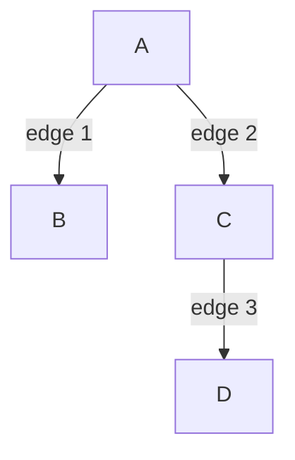
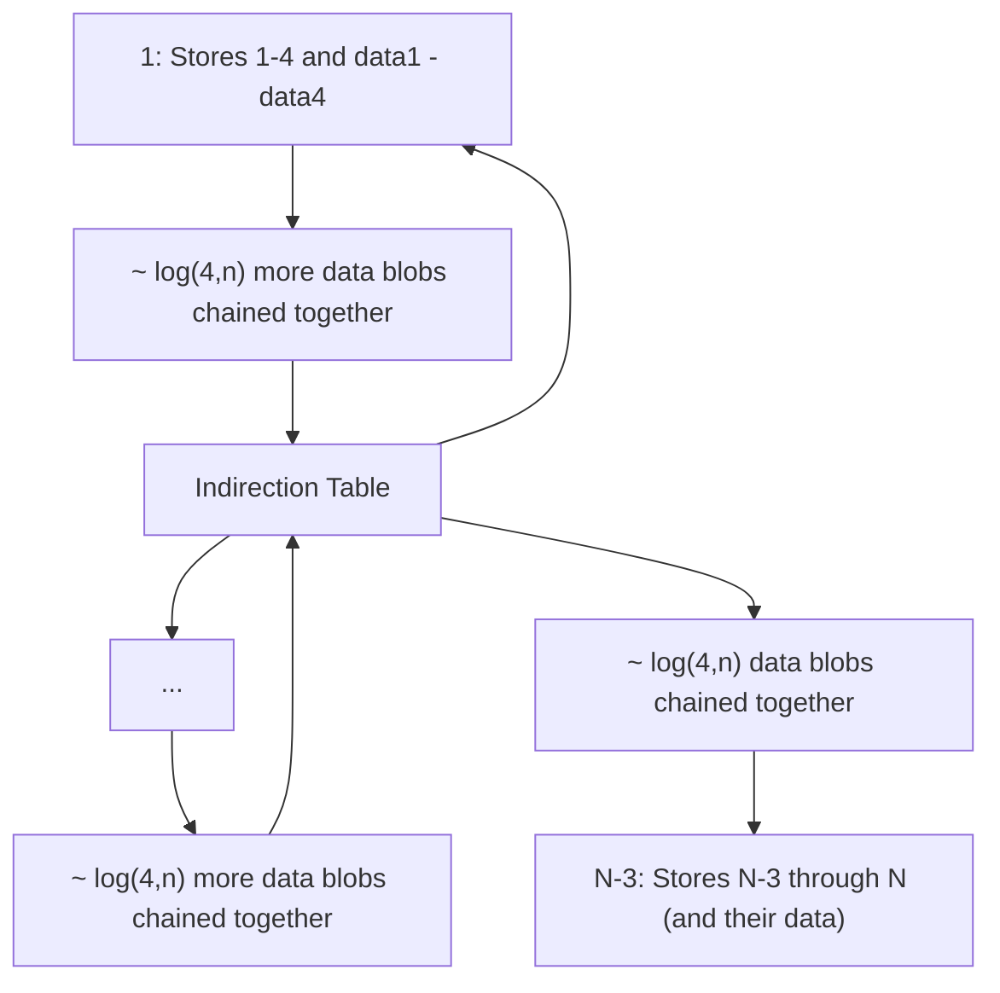

# Shared Tree Storage

> Note: Items in a `code block` are elaborated upon in the Glossary at the end of this document.

## Overview

This document discusses plans and options for serializing the SharedTree data structure. The design is motivated by SharedTree's scalability needs; a SharedTree needs to be able to hold _very_ large documents (documents on the order of terabytes are a requirement). There is therefore significant complexity introduced to many of the storage approaches in order to make this kind of scalability possible. The data that needs to be stored in order to fully capture the state of the tree is as follows:

1. The nodes in the tree. This includes any metadata or attributes associated with each node (e.g. schema type, identity label) as well as the data payload of the node (e.g. its "value", if it has one)
2. The child/parent relationships between the nodes in the tree.
3. The schema of the tree
4. Any indexes or accelerations structures that cannot be cheaply derived from the other serialized state.

Optionally, some trees may store the following information depending on the needs of the clients and the strategy used for maintaining the tree's `history`:

5. References to old summaries
6. A log of operations
7. History information that is localized to a particular part of the tree. The simplest way to store this information might be by including it on the nodes themselves.

> Note: The remainder of this document will focus on how to store data that resides in the tree structure itself (1, 2 and 7 above).

## Virtualization

Clients accessing a very large document via a SharedTree may not be able to hold the entire contents of the tree in their memory (or even their disk!). Therefore, a SharedTree must be able to `virtualize` some regions of a tree to a client without downloading all the others. The part of the tree requested by a client is its `partial checkout`.

It is a goal of SharedTree to support `partial checkouts` of the tree. This constraint has implications on the layout of the storage data. For example, item 7 in the list above might not be necessary if the full tree was always available to a client, but for a client with only a partial checkout, it must be able to access data for only the portion of the tree that it cares about. Likewise, it must be able to update parts of the tree `incrementally` to minimize writes.

## Blobs and Chunks

In order to allow partial checkouts, clients split the tree into contiguous regions of nodes called `chunks` according to a chunking algorithm. For example:


----


> In practice, chunks will likely contain many more nodes than in the illustration above

> The chunking algorithm itself is outside the scope of this document. It has the constraint that chunks are contiguous and do not overlap.

These chunks are the smallest units of tree that can be read from storage or written to storage individually. At the storage layer, chunks are stored in `blobs` which are uploaded to the storage service. The chunk size is not necessarily equal to the blob size; multiple chunks might go into a blob, or perhaps a chunk might be split across two blobs (that must always be downloaded as a pair).

TODO: revisions and copy-on-write

## Node -> Chunk Lookup

Given a `path` to a node, a client needs to be able to find that node in the tree. For a tree that resides entirely in memory this is trivial; the client simply uses the path as a guide to walk down from the root of the tree. If the tree is split into chunks however, the client may at any point during the tree walk encounter a chunk that is not downloaded, and must wait for the chunk to download from storage before continuing. The amount of chunks that need to be downloaded is dependent upon how deep into the tree the path points. Assuming that chunks are all roughly the same size, the worst case lookup will be a path that goes down to the very bottom of the tree and must download a number of chunks that is some constant factor smaller than the depth of the tree. This is an `O(d)` operation where _d_ is the depth of the tree. Because a SharedTree's contents and shape are entirely controlled by the user of the library, there is not any guarantee about how balanced the tree is. So in the worst case, a tree might be extremely deep with a minimal average branching factor, i.e. _d_ can be as high as the number of nodes in the tree _n_. So ultimately a lookup of a node in the tree by path is at worst `O(n)`.

There is an opportunity to improve this by organizing the chunks in data structures that allow chunks lower down in the tree to be addressed directly. This removes the need to walk down the entire tree from the root, and can make the worst case runtime `O(log(n))` instead. Several strategies have been discussed and are summarized below.

### Path-Based B-Tree

Every node in the tree can be identified uniquely by its path:



 Node | path
------|-----
   A  | "/"
   B  | "/1"
   C  | "/2"
   D  | "/2/3"

Paths may be encoded as strings, and are sortable; for example, the paths above can be sorted lexically to order the nodes as `[A, B, C, D]` (an in-order traversal of the tree).

The path for each node and the data stored at each node can then be used as keys and values, respectively, in a B-Tree or similar data structure. It is then easy to break the nodes up into chunks; Every _n_ paths in sorted order create a chunk, where _n_ depends on the maximum allowed chunk size and the branching factor of the B-tree.

> Other sorts are possible too, but this one allows for some helpful optimizations in the B-Tree itself (see Potential Optimizations below).

Advantages:

* The scheme is conceptually simple and it's straightforward to break the tree into chunks. There is no structural/shape analysis of the tree required to figure out the chunk boundaries.
* The lookup of any node is `O(log(n))`.
* A suboptimal implementation could use an off-the-shelf B-Tree library for quick prototyping. However, an production implementation would very likely want optimizations which necessitate a custom B-Tree implementation (see below).

Drawbacks:

* The chunking algorithm is inflexible. Some shapes of trees will need to walk the B-Tree sporadically even when traversing nodes that are adjacent in the `logical tree`. There is no sort order or chunk size that can guarantee good locality for all regions of a tree of any shape.

Potential Optimizations:

* Path keys in the B-Tree are always sub-paths of the keys in the B-Tree node above them. Eliminate this redundant shared prefix from all paths to greatly reduce the storage needed for the keys, especially for very deep trees (which will have very long paths).
* Deduplicate/intern sections of paths within a B-Tree node that are repeated to save additional storage. This can be done with a prefix tree on each B-Tree node.
* Store large paths out of line TODO
*

### Logical Node Tree

The actual tree itself can be stored directly, with each node being a blob, and referring to each other node with a handle.
This would perform very poorly when used with Fluid's blobs being pulled over the network due to:

-   poor per node storage efficiency (pay full blob cost (including storing a handle in the parent) for every node)
-   lots of dependent reads when traversing down (depth of logical tree)
-   large sequences can produce large blobs (since a single node won't be split ever)
-   updates have to create O(depth) blobs, which depend on each-other (and this with Fluid have to be uploaded in sequence)

This does have some nice properties:

-   Accessing a child from its parent is always exactly 1 handle dereference.
-   When walking a sequence, siblings can be prefetched.
-   It's very simple and easy to implement correctly.

Some useful performance trade-offs that could be made to improve this:

-   Inline some nodes instead of storing them in separate blobs.
    Choice of which nodes to do this with impacts performance a lot and depends on usage.
    Could include choice with schema and/or usage information (both hard coded heuristics and dynamically).
-   Could indirect some (or all) blob references through an indirection table (effectively a page table like B-Tree mapping short arbitrary "indirection ids" to handle, where which blobs it points to changes over time) to avoid having to update the blobs containing the ancestors up to the root.
    This instead requires updating the indirection table blobs (which means updating blobs through the indirection table's B-Tree to the root).
    -   Choice of when to do this could be heuristic tuned to balance read costs, indirection table memory use, and write costs.
    -   Can be used where depth (by number of blobs) since last indirection is high, and/or right above blobs that keep getting updated (ex: add an indirection when updating multiple parent blobs for the sole purpose of updating a specific child tht keeps changing).
    -   indirection ids can be allocated such that nearby blobs tend to sort near each other improving efficiency of caching nodes in indirection B tree.
    -   Can rewrite parts of the tree removing or changing indirection (and possibly re-chunking). Doing this occasionally for parts of the tree that were loaded but not modified can ensure read-heavy parts of the tree have a chance to get optimally re-encoded for reading.
-   Chunk sequences: when listing the children in a sequence, allow referring to a "Chunk" which can contain multiple nodes (potentially via sub-chunks) instead of just directly to nodes.
    This allows splitting up large sequences for more efficient editing and avoiding bloated blobs due to large sequences.
    It also allows clustering similar siblings together for improved compression, which works particularly well when combined with inlining of their children.
    This also makes it easier for the root to be a sequence instead of a node, which may benefit the editing APIs.
-   Chunked sets of traits:
    When there are very many traits so the fields list, even with one chunk per trait, is too big for the blob, of there are several traits with small subtrees that should be inlined, but they can't all fit,
    it can be useful to split up the list of traits into chunks (or even a tree).
    This can easily be done by organizing them into a sorted tree (ex: B-Tree) by field key.

These optimizations interact: for example if inlining to optimize breadth first traversal,
the depth of the tree of blobs will tend to be as high as the logical tree's depth, so indirection on blob handles will be more useful.

For N nodes, if 1 in 20 blobs' handles were randomly indirect, and we fit an average of 100 nodes in a blob, and the indirection b-tree is of branching factor 200 (4KB blobs, 20 byte handle) we get:

-   N / 100 blobs
-   N / 2000 indirect blob references
-   log(200, N / 2000) deep indirection table. (First blob gets us to 400k nodes, 4 deep covers 3.2 trillion nodes)
-   on average traversing an edge between nodes does 1 / 100 + log(200, N / 2000) / 2000 handle dereferences (assuming nothing is cached). (For 1M nodes, thats ~0.01)
-   40 bytes per node in main tree
-   ~0.01 bytes of indirection table per node
-   average blobs updated on single change: ~20 (This might be acceptable if we batch updates, only writing batches when summarizing, since that would deduplicate a lot of intermediate updates.
    Also optimizing where indirection is used (instead of random) would also help a lot here).

Same stats with every handle indirect:

-   N / 100 blobs
-   N / 100 indirect blob references
-   log(200, N / 100) deep indirection table. (First blob gets us to 20k nodes, 4 deep covers 160 million nodes)
-   on average traversing an edge between nodes does 1 / 100 + log(200, N / 100) / 100 handle dereferences (assuming nothing is cached). (For 1M nodes, thats ~0.027)
-   40 bytes per node in main tree
-   ~0.2 bytes of indirection table per node
-   average blobs updated on single change: 1 + ceil(log(200, N / 100)). Thats 2 upt to 20k nodes, 5 for 160 million.

Another interesting approach to tuning indirection is to set the probability indirection to O(1 / log(N)).
This makes the amortized read overhead cost O(1) without changing the asymptotic update cost (which was already O(log(N))).

#### key value store vs. immutable blob store

If using a mutable key value store (ex: IndexedDB), instead of an immutable blob store, it becomes possible to update blobs instead of just creating new ones.
This ability can be used for all blobs instead of having to manually implement it with the indirection table.
This removes the extra log(N) network round trips indirection adds to blobs (and replaces it with log(N) disk accesses on the server).
There is however a downside: if the ability to reference old versions of the tree is desired, the key value store must provide this itself.
There are some also ways to benefit from key value store that supports updating values that don't have this downside
(ex: appending deltas to blobs when they fit instead of making new versions, and determining if such deltas should be applied when reading the tree).

#### Indirection "Balancing"

Naively is seems like randomly inserting indirections would get a good distribution.
This is for initial tree construction, but it does not hold up after editing.
When editing, its trivial to add more indirections, but difficult to remove them.

Other heuristics in practice might result in good spacing of indirections, but if hard asymptotic bounds are desired, this approach can be used.

We enforce two properties:

1. To ensure that update costs are bounded by O(log(n)):
    - there are no chains of chunks deeper than log(n) chunks without an indirection.
    - The cost of maintaining these invariants during update also has to be kept O(log(n)).
2. Amortized blob dereference is bounded by O(1) overhead from indirections: there is on average O(n/log(n)) indirections total which are somewhat uniformly distributed.

To reason about this, we will think of the tree of data blobs (blobs containing tree content, not the ones forming the indirection table) as a set of islands,
where each indirection is the root of an island, and every data-blob reachable from it without going through an indirection is part of that island.

Each data blob can record the number of blobs below it in its island, as well as its maximum depth.

When creating a new island (updating an entry in the indirection table to point to a different blob), we can ensure that:

1. The depth of the island does not exceed our current maximum depth threshold
2. The number of blobs is not lower than our minimum size threshold

If we set the minimum size threshold to be half of the maximum depth threshold (or lower) this should be practical to maintain.

For the newly created island if its too deep, we can split it. Both haves will have at least half the maximum depth threshold of blobs, and thus exceed the minimum size threshold.
This assumes that replacing a direct references with an indirect one can be done without wrecking the blob boundaries: the format could ensure this is possible.

If it's too small, there are a couple of options:

1. If it has islands below it, pick one and merge with it. This either results with an island that is fine, or on that is too deep. If it is too deep, it must be possible to split it and get two acceptable islands, so do that.
2. If it has a parent, merge with that. Handle this the same as above, though it requires having a parentage information to find the parent.
   Typically an edit is specified with a path, so the parent can be recovered from that.

If neither of those can be used, the document fits in one island, so leave it as is.

All these operations should be O(log(n)).

There is one extra detail: if picking an island size bounds that are not constant (ex: O(log(n))), there might be some islands of unexpected sizes around.
The above approach should work fine, though it might occasionally produce slightly illegal sizes.
Rather than iterating it until all the sizes are valid, just making a best effort with one iteration should converge toward the data having valid islands.
Iterating would work, but possibly drive the cost of the balancing above O(log(n)).

Also note that when picking a child (or parent) to merge with, some extra heuristics could be used to pick a good one (maybe pick the smallest, or one that has been detected to have inefficient chunking, or one that has been read a lot compared to how often its written).

### Path B-Tree

All data in the tree can be stored in a key value store under its full path through the logical tree.
Doing this with a [Radix tree](https://en.wikipedia.org/wiki/Radix_tree) roughly amounts to storing the logical tree.
Rather than directly doing a Radix tree, a B-Tree can be used, which can be optimized by omitting any common prefixes shared by every key within that node.
This optimization not only saves a lot of space in the nodes, but also makes moves more efficient, allowing moves to reuse B-Tree nodes when the only change was the part og the path/kay that was optimized out of the node.
This means a move only has to update three paths through the B-Tree: before and after the source, and the destination, allowing for subtree moves in O(log(N)) blob updates (where N is the number of total nodes).

Some possible optimizations:

-   Omit the common parts of the paths in the node (as described above).
-   Deduplicate repeated prefixes withing the nodes.
    This is distinct from the above because its about compressing prefixes shared by some but not all entries in the b-tree node.
    This can be done with a prefix tree.
-   Store large keys/paths out of line.
    Very deep trees can result portions of keys being store in a node that are larger than the target blob size.
    These can be chunked and stored out of line by replacing any segments in the prefix tree longer than a constant threshold with a length, hash of the segment, and reference to a separate blob containing the full segment's data.
    The allows fetching of nodes at any path with O(log(N)) download, even paths that are O(N) in length.
    The out of line chunks are only needed when enumerating tree content.
-   When searching the prefix tree, for nodes requiring hashes, check the hashes in increasing length order to avoid hashing large portions of the path many times if short parts keep matching. This allows node lookup with O(path length) compute.
-   Out of line path segments can be chunked. Using [a stable chunking scheme](https://www.tarsnap.com/deduplication-explanation) to split them into a tree, and hashing them [Merkle tree](https://en.wikipedia.org/wiki/Merkle_tree) style could minimize update costs (reduce hashing time, and get better blob reuse).
-   Model sequence indexes such that inserts usually don't have to change the indexes of other nodes in the sequence (ex: allow inserting at 2.5, instead of moving everything above 3 over one and inserting at 3).
    As long as the keys still sort in the right order, it should work fine, but can result in keys getting longer.
    May involve occasionally normalizing the indexes in a sequence to shorten indexes where inserts keep happening.
-   Heuristically inline logical trees into B-Tree nodes.
    This allows many of the optimizations from the logical tree nodes section to be applied to leaf subtrees.
    This could be done only at the leaves of the B-Tree,
    but allowing it anywhere benefits cases like breadth first traversal when the inlined trees have lower depth (in the logical tree) than large subtrees between them.
-   Compression of field keys.
    Field keys (and sequence indexes) occur a lot in the tree.
    Unlike in the logical tree, these are scattered in a way thats hard to do shape/schema based compression, but there are two approaches that can still work:
    -   Have a global (or type specific) table assigning short aliases for field keys (likely part of the stored schema).
        This works well for keys from schema, but map style usage might not work well with it.
        Fortunately we can pick a strategy is local to the specific type/schema, and handle nodes with map style usage differently (maybe with an escape?).
        Storing short integers in the stores schema, or using hashes of the file names (full names can be looked dup in the schema) are valid options.
        This could share code with path compression for edit representations.
    -   Do compression on the blob level, for example deflate. Note that this might not need to be explicitly done if the network and storage layers already do compression.

Limitations:

-   Field keys and indexes take up space in the tree, occurring in the paths within the B-Tree. Not only are these not deduplicate based on shape/schema (like in the logical node tree's chunk encodings), but can actually be duplicated (worst case O(log(n)) times) when a subtree is split across multiple branches in the B-Tree.
-   Traversal of sequences high in the tree reading small amounts of data for each item (ex: listing the file names in a directory near the root of a large file system) produces worst case access patterns,
    resulting in performance which is as bad as the Node Identifier B-Tree: O(log(N)) dependent blob fetches per property accessed.
    Inlining can help with this, but is more limited in what can be done heuristically than in the logical node tree, and does not change the worst case asymptotic complexity.
-   Logical tree encoding/compression tricks (ex: shape based chunk compression), can't be applied to nodes which have a large subtree under them since they can't be inlined.
    Once case hurt by is nodes with bunch of fixed size fields, and one large field. For example a directory entry with lots of metadata (modification time, size, access time, owner, permissions etc, then the actual content field). The B-Tree will sort these fields, likely putting the content in the middle forcing the two haves to the meta-data to compressed independently. If inlining happens at the node/field level, each meta-data file would be compresses separately, and the their field key would explicitly occur in the tree as keys.
    A separate compression pass could help, but here, but is more limited than the logical node tree's specialized approaches (which can maintain random access while compressed).

Just like with the logical node tree, if using a key value store instead of an immutable blob store, some edits can avoid paying the O(log(N)) update costs by updating nodes in place (either appending delta information or directly editing blobs) as well as not having to update a blob just because its child got updated (same benefit as indirection in the Logical Node Tree).

### Node Identifier B-Tree

Give all nodes a unique identifier, and refer to them using this identifier.
This is the approach used by experimental shared-tree.
Can be optimized using id-compression and the chunking scheme prototyped in https://github.com/CraigMacomber/sequence.

This approach does poorly for sequences that have been reordered since that forces the B-Tree to have more entries due to not having chunks which cover contiguous ID space.

This chunking approach can avoid a lot of the indirection costs, and sequential id allocation can help keep access in the B tree using nearby keys a lot of the time,
but in general it can end up pulling down lots of B-nodes when trees fail to have well clustered IDs, which can happen due to editing.
Due to this overhead, this design isn't considered in the scenarios below, and is mainly included for comparison.
This design works decently for in memory storage, but doesn't page in/out data very well since a lot of the data in the blobs will be data thats not needed for the part of the tree thats being used.

### Hybrid

The various optimizations to the Path B-Tree make it more like the Logical Node Tree.
If the inlining optimization is permitted to inline subtrees that are split up over multiple blobs,
a hybrid is produced where Path B-Tree is used at the root, and at some point in each subtree, switch over to the Logical Node Tree approach.

This seems a lot like using the Path B-Tree as a replacement for the indirection table from the Logical Node Tree, but this doesn't really work out.
For deep trees, which is the only case where the indirection table is really critical, the Path B-Tree struggles (due to large keys).

If the Path B-Tree also used out of line/chunked storage for large keys combined with an indirection table,
then it would handle deep trees ok, but thats using the same approach that the logical node tree does, so the hybrid approach is not offering a major improvement.

It's possible to have a logical node tree where some of its leaves are actually Path B-Trees,
as well as Path B-Trees there is leaves are Logical Node Trees.
These could be arbitrarily mixed, switching between these approaches (and possibly others as well) heuristically on the subtree level.
This can be thought of as a reference to a Path B-Tree being a kind of chunk supported in the logical node tree.

It's unclear what benefits these hybrid approaches would have a heavily optimized version of either,
but it does seem like there is a clear path to evolve either optimized approach into a hybrid if desired.

## Summarization

Summarization is complicated by the fact that a very large tree might not fit in the memory of any one machine; therefore, the entire tree cannot be summarized by a single machine in one pass. There are at least two other options:

1. A single machine (a smart server or a dedicated summarizer client) summarizes portions of the tree over time as they change.
2. Each client is responsible for summarizing the part of the tree that it has checked out.

Both options require changes to the current (as of Aug 2022) summarization APIs. The changes, and the precise scheme for how the summarization would work and be consistent across clients, is outside the scope of this document and is expected to undergo significant design effort.


## Example Scenarios

### Deep Tree

Consider a tree with N nodes where its depth is O(N).

This makes the path to the leaves, and thus the size of the key in the Path B-Tree O(N).
Using prefix tree within nodes with out of line large chunks optimizations, the Path B-Tree can maintain its proper blob size and access time, though its space due to duplication across B-Tree nodes will result in at worst O(N log(N)) space.
Stable chunking of out of like path storage could further optimize this if using content addressable blob storage (like FLuid's), deduplicating identical out of line chunks,
bringing the space back to O(N), though with significant constant factor overheads (ex: storing all the field keys)

In the logical tree case, its O(N) space, and assuming use of indirection of at most O(1/log(N)) blobs, O(N) time to visit the whole tree.
Inlining can be used to get good sizes for the blobs, and indirection can be used occasionally to lower its costs by a constant factor.
Update time and space costs are O(log(N)) due to needing to update the indirection table and nodes between indirections.

Example Deep Tree. In this example all children are under a "child" field for simplicity,
but in the general case they could all be different field (making paths incompressable).


B-Tree with branching factor of 4 using the common prefix elision optimization.
Note how all interior nodes in the upper part of this tree has to store O(N) sized keys for all but the right most child.
This is the worst at the root, but still O(N) for the nodes O(1) levels below it.
This gets slightly worse at the root as branching factor increases, but the lower nodes are impacted less.
The prefix tree without out of line chunk storage allows looking up paths under long keys O(log(N)) blob downloads,
though actually walking the whole tree will be O(N \* log(N)).

```mermaid
graph TD;
    root["B-Tree Root"]
    root-.child/.../child: 3N / 4 copies of child.->B1
    B1-.child/.../child: 3N / 16 copies of child.->B11
    B1-.child/.../child: 2N / 16 copies of child.->B12...
    B1-.child/.../child: N / 16 copies of child.->B13...
    B1-.empty string.->B14...
    B11-."log(4,N) levels".->B1N["B11...1"]
    B1N-.child/child/child/data.->DataN
    B1N-.child/child/data.->DataN-1
    B1N-.child/data.->DataN-2
    B1N-.data.->DataN-3
    root-.child/.../child: 2N / 4 copies of child.->B2...
    root-.child/.../child: N / 4 copies of child.->B3...
    root-.empty string.->B4
    B4-."log(4,N) levels".->B4N["B4...4"]
    B4N-.child/child/child/data.->Data4
    B4N-.child/child/data.->Data3
    B4N-.child/data.->Data2
    B4N-.data.->Data1
```

Logical Node Tree, with inlining ~8 nodes into a blob without indirection:


Logical Node Tree, with inlining ~8 nodes into a blob with indirection every level (B-Tree branching factor of 4):


Logical Node Tree, with inlining ~8 nodes into a blob with indirection every log(4, N) levels (B-Tree branching factor of 4).
Note that indirection table has depth log(4, (N / 4) / log(4, N / 4)).
For simplicity ids are omitted.
In this case amortized access cost is O(1), since the cost of an indirection is less than O(log(N)), and its paid ever O(log(N)) chunks.
If older data (from when N ands thus log(N) was smaller) is not rewritten, it will have more indirections, but that will make little difference since it will be a small amount of data compared to N.



### Walking a long sequence high up in a large tree

Read a small amount of data out of many large subtrees.
There are many scenarios that would do this:

-   reading the the type of items in a whiteboard to find ones which contain text for search indexing.
-   listing or file names (and optionally other metadata) for all items in a directory.
-   finding subtrees which were recently modified
-   etc.

This could hit most of the interior nodes in a Path B-Tree because it would be reading data thats spread out pretty uniformly though the key-space.
This seems like a worst case access pattern for Path B-Tree, but at least its in order so the occasional dependent reads when traversing down multiple levels in the B-Tree can be efficiently amortized, and older blobs can be freed from memory without getting re-downloaded later in the traversal.

The Logical Tree approach could theoretically chunk the data to handle this case nearly optimally.
The question is how close to that would be expect it to get in practice since it needs to optimize for many usage patterns, not just this one.
Simple heuristics, like always inlining the type, and tending to inline small subtrees that always have the same shape (like the position) could work well here, though there is a balance between inlining small subtrees causing the size of nodes in the chunk to be larger, resulting in the top level sequence having more chunks.
There are thus two extremes where this could go badly:

1. Too much inlining, causing each node in the sequence to be in its own chunk. At least these chunks could be prefetched for the upcoming children.
2. Too little inlining: the information we need from the node is not available in the chunks that make up the sequence, thus for each node we have to fetch its chunk. When reading the content of that chunk, we could even have to fetch another chunk for the position if it also wasn't inlined (ex: lots of other data got inlined filling up the chunk)

The Path B-Tree has very simple chunking logic for internal nodes and can easily produce nicely sized blobs for data, but for deep trees the key/path part can become bloated or need special handling.

The Logical Node Tree approach, when applying good chunking heuristics, has much more complex chunking logic (has to handle large numbers of fields, long sequences, inlining etc),
the management of the underling tree of blobs it uses is very simple.

Both should have a good algorithm compressing leaf subtrees (subtrees which single piece), for the Logical Node Tree this is really just one case of its more general algorithm while for The Path B-Tree its an additional requirement.

The logical tree approach is well suited to applying contextual optimizations, for example it can easily be made extensible with a sequence chunk abstraction, allowing for specialized encoding and compressions schemes to be used where appropriate.
Such specialized approaches and tuning of heuristics can optionally consume schema data, as well as usage patterns to have blob boundaries converge where edits happen, reducing redundant storage and updates over time.
It would be relatively easy to produce a minimal version of the logical tree approach and add optimizations incrementally in the future, even maintaining document compatibility.

### Fetching a Subtree

In this scenario, a path to a node is provided, and all nodes within that subtree are visited in an arbitrary order (for example to copy or search the subtree).

Note that if you perform this, but have a rule for skipping visiting subtrees, it can end up containing the "Walking a long sequence high up in a large tree" scenario from above: for this section we are assuming no such skipping option.

To keep things simple, we are assuming no really large nodes.
To include larger nodes in this model, split them up into multiple nodes in a tree, and count them as that many nodes.

We define:

-   P: the length of the path
-   N: total nodes in the document (current revision)
-   B: size of a blob in nodes or handles (assuming nodes, handles average the same size)
-   S: number of nodes in the "fetched" subtree
-   I: when doing indirections, the portion of blobs indirected (between 0 and 1).
-   R: Average branching factor of logical tree (assumed R << B so nodes have roughly constant side and fit in blobs)

All logs (unless otherwise noted) in this section are base B.

#### Logical Node Tree

With optimal inlining (for this exact scenario) and no indirection is performed, the logical node tree can achieve will need (P+S)/B blobs to be fetched.
With worst case inlining decisions (but still filling the blobs) the logical node tree would instead need P+S/B blob fetches, since it may need one for each point along the path. Even without usage heuristics average of P/log_base_R(B)+S/B blob fetches should be achievable.

If adding indirection, the depth of the indirection table's B-Tree will the log(number of indirections).
The number of indirections is given by the number of blobs, times I, so (I \* N / B) giving a depth of log(I)+log(N)-1.
Since I is at most 1, se can define a conservative overestimate of this depth, ID, to be log(N).

If we then make one out of every K \* log(N) blob references indirect (for arbitrary tuning parameter K), using the depth estimate ID, we get an amortized data blob read cost of 1 + log(N) / K \* log(N), or 1 + 1 / k.
This allows the overhead from indirection to be a constant factor while keeping O(log(N)) update costs for edits.

#### Path B-Tree

TODO: How do we compute the branching factor high up in the B-Tree? Assuming its B results in oversized blobs due to key/path size?

It's going to to have to be at least (P+S)/B blobs to be fetched since the path and nodes fetch both must be somewhere in the blobs read.
This is the same as with the logical node tree.
Additionally we know it will be at least log(N / B) (which is log(N)-1) interior nodes deep, so we can raise that to at least max(log(N)-1, P / B) + S / B.

## Finding parents and identifier indexes

In both cases, you use a path to a node to find it so its parents are found on the way.

However if we add an index that allows finding nodes by some other query path (ex: an index by node identifiers for nodes which have an identifier), there are a few ways that can work.
If the index maps identifier to path, then the index is expensive to update for large subtree moves.
If the index maps identifier to handle (or indirection id), this can avoids large update costs for moves, but needs another index (handle to parent) to be able to discover parentage of nodes looked up this way.

## Conclusions

It seems like the logical tree provides modular way to add tuning/optimization allowing incremental delivery of target optimizations,
though that comes at the cost of possibly needing more optimizations to reach a good baseline performance.

The Path B-Tree provides a elegant and simple approach, but it complicates moves somewhat,
and is more limited in how it can be optimized for specific access patterns, like breadth first traversals of sequences of large subtrees.

Both approaches could permit optimized formats for the leaf subtrees, but this work generalizes to non leaf subtrees the logical node tree.

The Logical Node Tree is optimized for child access and can be tuned for which children can be accesses quickly (via inlining and indirection heuristics).
The Path B-Tree excels in order at depth first traversals offering almost optimal possible performance for this case.
High up in large trees breadth first traversal and depth first where the order of recursion is not the same as the path sort order, the Path B-Tree's accesses degrade (though bounded by log(n)) with poor caching/locality.
In these same cases the Logical Node Tree should deliver significantly better constant factors, though if using indirection does still have a worst case of log(n) as well.

The Logical Node Tree also more naturally handles partial checkouts that don't include all the leaves (ex: load all the directories in a folder, but not their contents), getting better locality in these cases,
and is more compatible with subtree based permissions systems (since all nodes in a chunk always share a an ancestor that in the chunk).

Both approaches are similar as far as being able to be specialized to take advantage of a key value store instead of an immutable blob store.

For total storage size, the logical tree probably wins due to being able to leverage shape based compression in chunks in more cases,
resulting in less occurrences of field keys in the encoded data.
The logical B-Tree also never has to explicitly encode indexes withing fields, while these do occur in the Path B-Tree.
The Path B-Tree also sometimes duplicates edges in the tree, up to log(N) times, resulting in even more copies of field keys in the tree.
These difference can be mitigated somewhat with extra compression approaches in the Path B-Tree, but it has more data to compress,
and it harder due to lacking the context the logical tree can leverage for its compression.
However, in typical cases, we expect the vast majority of the data size to be in leaf subtrees, with both compress the same, making this difference less important.

The logical node tree can order its fields as a performance optimization (ex: placing frequently use and/or fixed size fields first).
Similar to the above storage size case, this works for both approaches, except for non-leaf subtrees.

Maintaining proper "balance" when updating is more flexible in the logical tree case, so it can use heuristics to better optimize the tree,
however it significantly complicated to actually ensure its indirection don't become too frequent over time.

Overall it seems like a well tuned logical node tree should exceed the performance of the Path B-Tree for total storage size,
and common access patterns (for which it has been tuned: either manually or by it tracking access patterns).
Editing performance differences is unclear: both approaches cause significant but different editing pattern dependent write amplification.

The Path B-Tree's storage of keys and paths adds some complexity: it needs sortable path representations, and optimizations related to handling these.
This same logic is needed for edit/changeset representation though, so it shouldn't be counted for much against the Path B-Tree.

## Decision

The Path B-Tree has better understood performance characteristics around update costs for maintaining its balance, and its optimizations mostly consist of optimizations we will need for edits anyway (compact leaf tree encoding and path encoding and manipulation).
Basic support for deep trees (out of line prefix tree segments) can easily be added,
and the later optimizations we might do for that (stable Merkle tree chunking) are easy to separate from the rest of the code and don't interact with the performance of most operations (only impact update of deep trees, not read)

The logical node tree's indirection support is more involved, and harder to add later (it impacts how chunks refer to each-other, and complicates the update code-path quite a lot, and changes performance of reads and updates significantly, even in trees which aren't exceptionally deep).

These factors, in my (Craig's) subjective opinion, seem to lean toward the Path B-Tree, with an initial version supporting inlining (rather than special casing leaves and adding inlining later) and the prefix tree with out of line large segments (this allows for known bounds on blob size), but not the optimized chunked out of line segments (thats easy to add later, and only impacts deep trees).

This still needs consensus.

A conclusion on this front is not needed for M1 (partial checkouts and incremental summaries are not technically necessary for that),
but this area would be a good one to develop in parallel with other aspects of SharedTree.
This is a good place leverage decision encapsulation to minimize the impact if we change our approach later
(ex: we come up with better ideas, find an issue with this analysis, or change our evaluation criteria, or decide to support both as configurable options).

## Glossary

- Blob: binary data that is uploaded to and downloaded from a storage service. Blobs are content-addressable and therefore immutable.
  > Note: Blobs may contain references to other blobs.
- Chunk: a contiguous region of the tree. Every node in the tree belongs to a chunk. Chunks can be serialized into compact binary representations and stored in blobs; multiple chunks might fit in a single blob.
  > Note: The region of the tree captured by a chunk has a "shape". The shape of the chunk must be known to retrieve the nodes from within it. For extra efficient compaction when encoding, chunks with identical shapes can share the same shape metadata.
- Deepest Tree: a tree with N nodes and depth O(N), i.e. a tree shaped like a linked list
- Handle: a serializable reference to a blob. In the case of Fluid handles, currently cannot be created until a blob is uploaded.
- History: the sequence of changes that have been made to a tree over time. A given document may or may not care about its tree's history. If it does desire the history, then the history must be recorded as part of its summary, since the Fluid service will only deliver ops that occur after the most recent summary.
- Logical Tree: refers to the actual tree of nodes/data that make up the content of shared tree. This term is used to disambiguate when multiple kinds of trees are being discussed in the same context.
- Partial Checkout: a client loads only a portion of a tree, and can read/write only from/to that portion of the tree.
  > Note: Partial checkout might be necessary for performance reasons (e.g. if the full tree is too large to fit into the client's memory), or for privacy/security reasons (e.g. multiple clients share a tree but each is only allowed access to some part of it)
- Path: a sequence of child nodes (and/or edges) that are walked through from the root of the tree to find a specific node
- Revision: a specific moment in the history of the tree. Every permanent change to the tree creates a new revision with a new tree state.
- Virtualization: the process of downloading or paging in specific data in a larger collection without receiving the entire collection.
- Incrementality: the process of uploading or updating specific data in a larger collection without overwriting the entire collection.

----
## Extra stuff
## Spacial Indexes

Note that this document (other than this section) assumes the data being logically stored is a tree (which may or may not contain local/distributed history information). There is an alternative: the storage could be a clustered 2-d index over location and revision. For example the data storage could reside in an R-Tree or some other kind of spacial index.

This document assumes that trees will be persisted into a copy-on-write storage in the form of blobs, which can be fetched using their "handle" which can in turn be serialized into blobs.
This is the API of Fluid's blobs, but note that Fluid requires you to upload the blob to be able to serialize a handle to it;
relaxing this constraint (which would further constrain the storage service) would offer some performance benefits, reducing round trips when uploading but does not fundamentally change the designs.
If using a system where blobs could be assigned names and updated (e.g. a classic key/value store instead of Fluid's content-addressable blob storage)
these approaches still work, but there are some easy design tweaks to improve performance, which are noted, but are not the focus of this document.

It is assumed that each client has access to some stored version of the tree, and that each keeps the "dirty" part in memory.
It is not required that all the clients agree on what stored tree they are using or how it is chunked; all that's required to be kept consistent is their understanding of its content.
For example, clients may make nondeterministic chunking decisions for the data, and/or keep a local copy of the chunked tree on disk (ex: via index db) which could have differing tuning parameters across clients.
