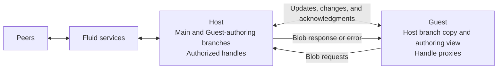
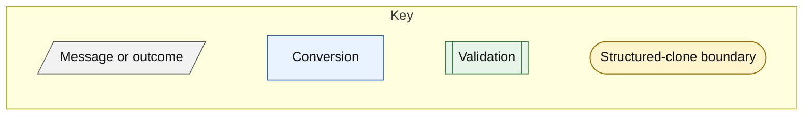
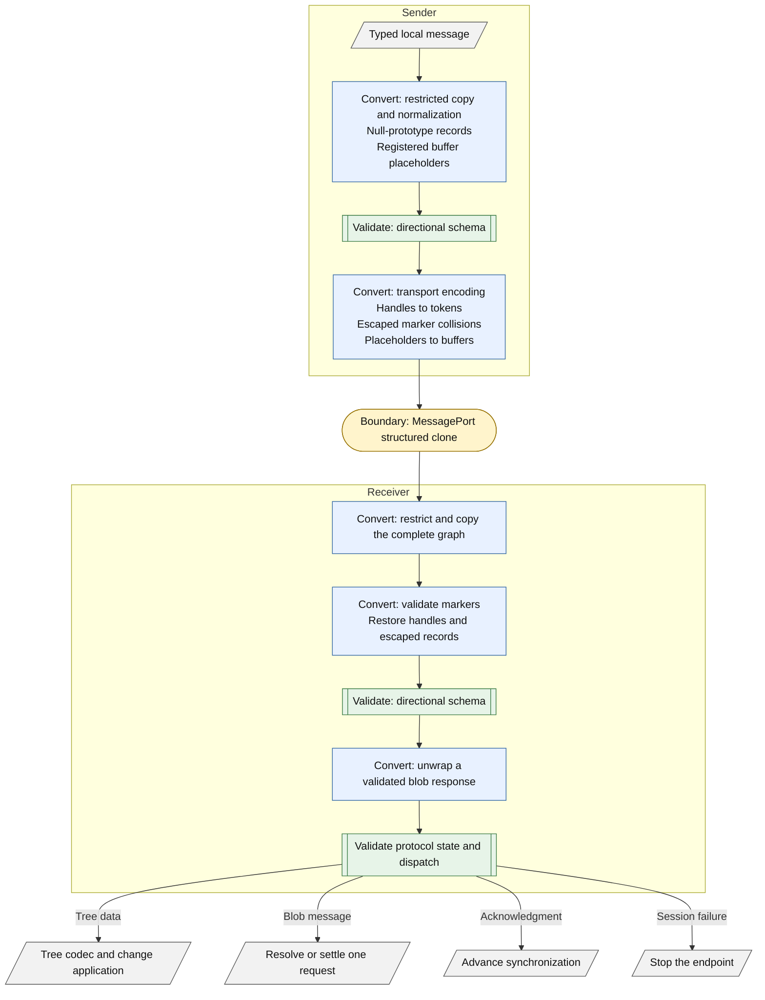

# SharedTree Sandboxing

This document describes the `@alpha` `Sandboxing` library, which exposes a [ViewableTree](https://fluidframework.com/docs/api/fluid-framework/viewabletree-interface) inside a sandbox.
The Host remains connected to a Fluid service and synchronizes one of its branches with the Guest over a [`MessagePort`](https://developer.mozilla.org/en-US/docs/Web/API/MessagePort).
Within the Guest, applications use the standard synchronous SharedTree view APIs.
Behind the scenes, SharedTree's existing merge and rebase logic asynchronously reconciles changes between the Host and Guest, much like the synchronization between Fluid clients.

Although the library is designed for sandboxing, the same APIs can support other scenarios that separate a SharedTree from its view.
For example, a remote user or service could edit a specific branch, or a shared worker could provide local collaboration across browser tabs.
The current implementation focuses on running the view in a restricted [iframe](https://developer.mozilla.org/en-US/docs/Web/HTML/Reference/Elements/iframe).
Other scenarios can be more difficult for applications to deploy because the protocol is not stable: the Host and Guest must use exactly matching versions of the SharedTree code.
Keeping those versions aligned is typically easier in the sandboxing scenario, where the application controls the code loaded on both sides.

> [!WARNING]
> This implementation is alpha and is not yet a complete security boundary for an untrusted participant.
> See [Security Boundary and Known Limitations](#security-boundary-and-known-limitations) before using it outside tests or controlled environments.

## Intended Audiences

This document has three intended audiences:

1. Contributors and coding agents that implement and maintain this feature.
2. Early adopters who want to build prototypes and provide feedback.
3. Security and privacy reviewers, and the developers who work with them to evaluate the design, implementation status, and remaining work.

## Core Concepts

- **Host:** The SharedTree endpoint connected to Fluid services.
  The Host borrows the application-owned main view and owns the session branches and authorized-handle table.
- **Guest:** The independent tree and view inside the sandbox.
  It owns a copy of the Host branch and a separate authoring checkout for Guest edits.
- **Peer:** Another Fluid client that collaborates with the Host through Fluid services.
- **Session:** One Host-to-Guest connection, including its branches, ID space shard, handle authority, and pending requests.
- **Finalized-history boundary:** A commit through which history will not be rebased or replaced.
  The protocol uses `trunkRevision` to identify this boundary.
- **Handle token:** A session-local index that authorizes the Guest to refer to one Fluid handle provided by the Host.
  A token is neither a secret nor a Fluid handle URL.
- **Guest proxy:** A local `IFluidHandle` whose `get()` requests blob content from the Host.

### Transport Representations

- **Wire representation:** Structured-clone-compatible data sent through the port.
  It contains handle markers, escaped records, and actual buffers.
- **Normalized transport data:** A restricted local copy with null-prototype records, restored handles, and registered buffer placeholders.
  It has not yet passed protocol schema or state validation.
- **Tree payload:** Encoded initial tree data or an encoded change.
  Its permitted value vocabulary is distinct from the codec-specific structure of the payload.

Structured clone does not preserve null record prototypes or Fluid handle symbols.
The handle marker is `{ type: "__sandbox_handle__", token }`.
The escape record is `{ type: "__sandbox_object__", entries }`.
The transport uses escape records when ordinary data collides with a marker shape.

## Status and Prerequisites

The implementation requires these conditions:

- While a session remains active, each sent message is eventually delivered or the transport reports a terminal failure.
- The Host and Guest use the same version of the tree code.
  The protocol has no compatibility commitment between different versions.
- Each direction preserves message order.
  Messages in opposite directions can arrive in any relative order.
- Messages use genuine `MessagePort` structured clone.
  The transport does not support arbitrary same-realm proxies.
- The Guest is valid only for its owning Host session.
  The application must replace both endpoints after session failure.
- The runtime ID compressor uses the V3 serialization format.
  Set the container runtime's `oldestSupportedClient` option to `"3.4.0"` or later.

## Architecture

Applications create one Host and one Guest with separate endpoints of a `MessageChannel`.
The Host requires the application view.
The Guest requires the forest and codec options used to create its independent tree.
Each endpoint owns its port, logger, synchronization state, and failure boundary.



> [!NOTE]
> Blob resolution uses the same channel but does not block tree synchronization while the Host resolves content.

The directional TypeBox schemas in [common.ts](./common.ts) define the message types and runtime validators.
Each message contains exactly one member from its directional schema.
Each endpoint validates its incoming direction and dispatches the validated envelope once.

### Synchronization Model

The Guest maintains a checkout for the Host branch and a separate checkout for Guest edits.
The Host sends branch transitions without waiting for outstanding Guest edits.
The Guest applies each transition to its Host branch, rebases its authoring checkout, and acknowledges the update.

The Host maintains a local branch that reconstructs the Guest's authoring state.
It applies Guest changes to that branch and merges accepted changes into the application-owned main branch without rebasing the local branch.
The local branch must continue to represent the Host state that the Guest has confirmed.
Only a Guest acknowledgment proves that the Guest applied a Host update, so only that acknowledgment advances the local branch over the update.

Each pending Host update retains a disposable snapshot of the exact branch state that was sent.
A revision can be rebased while its update is in flight, so the revision alone might no longer identify that state.
When the Guest acknowledges the update in order, the Host rebases its local branch onto the retained snapshot and then releases the snapshot.
Session shutdown releases snapshots for updates that remain pending.
Ordered delivery lets each endpoint validate message identifiers and the revisions on which a change was authored.
Revisions alone cannot reconstruct the Guest's authoring state from the current main branch.

### Guest Initialization and ID Space Sharding

The Guest initialization message contains:

- Compressed tree content and stored schema at the oldest retained Host revision.
- Retained commits after that revision, in application order.
- A serialized child ID space shard for the Guest.

The Guest first creates its Host branch from the baseline tree and schema.
It then replays each retained commit before exposing its view.
Keeping those commits separate lets the Guest rebase pending Host edits if Host history changes.

The baseline snapshot can be uninitialized when the retained commits include the original schema and content initialization.
The baseline revision identifies the independent checkout's initial head, even when no retained commits follow it.

Initialization commits use the same handle transport as subsequent changes and preserve custom commit metadata.

The Host creates the child shard after it encodes the baseline and retained commits so the serialized child knows every ID used by initialization.
The Host retains the initial child progress for updates and eventual reclamation.
The Guest deserializes the child before it creates its checkouts.

The Host and Guest compressors share a session ID but do not automatically learn IDs created by the other compressor.
Each Guest change therefore includes child-shard progress captured after the change is encoded because encoding can create IDs.
The Host applies that progress before it decodes the change.
Consecutive changes can report the same generation count when they create no new IDs.

Host updates include parent progress captured after their commits are encoded.
The Host also forwards finalized ID creation ranges in order, including ranges that do not accompany a tree update.
The Guest applies parent progress before it decodes commits or finalizes a range.
Ordered delivery places a range before an update that uses its IDs.
The Fluid runtime, not the sandbox, submits creation ranges for finalization.

Guest disposal does not notify the Host.
Host disposal stops receiving Guest messages and reclaims the child shard from the last accepted Guest progress.

### Message Conversion and Validation

Both directions use the same transport pipeline.





[transport.ts](./transport.ts) restricts the complete incoming graph before it interprets markers or restores handles.
Its transport vocabulary contains only null, undefined, booleans, finite numbers, strings, dense arrays, ordinary or null-prototype records, buffers, and Fluid handles.
When encoding outgoing data, the transport treats Fluid handles as indivisible values and replaces them with tokens.
Incoming data must represent handles with authorized token markers.
The transport rejects every other value, including unsupported objects, cycles, sparse arrays, accessors, symbol properties, non-enumerable record properties, and invalid prototypes.
All copied and reconstructed records have null prototypes.
Repeated ordinary references are copied independently.

`TransportCodec.decode` returns `NormalizedTransportData`.
Normalization establishes the transport vocabulary but does not establish a protocol message type or valid protocol state.
Restoring a handle does not bind it or resolve its content.

Records that collide with transport markers use an escape record.
The decoder validates escape records, rejects duplicate keys, and does not reinterpret a reconstructed root as another marker.
It defines own data properties so `__proto__`, `constructor`, and `prototype` remain ordinary keys.
Tree payload validation accepts local handles as opaque leaves and rejects buffer placeholders.

The Guest unwraps a registered buffer placeholder only from a validated `blobResponse`.
No phase recursively restores buffers into general tree data.
Marker-shaped data cannot forge a buffer because placeholder identity comes from a private registry.
Identifier brands do not establish runtime authorization.
Responses must match an outstanding request.

A Guest change is decoded into the Host local branch, its handles are bound, it is merged into main, and only then is it acknowledged.
Incoming processing failures and outgoing normalization, validation, encoding, or posting failures terminate the session.
Initialization follows the complete pipeline before the Guest creates its tree.

### Handle and Blob Transport

The Host authorizes each handle that it sends and replaces it with a session-local token on the wire.
The Guest restores the token as a proxy.
The Guest can send an authorized proxy back to the Host but cannot introduce a new or foreign handle.
The Host validates returned tokens in both Guest changes and blob requests.
Only the Host binds handles and performs Fluid attachment.

> [!NOTE]
> The sandbox supports only blob handles that resolve to an `ArrayBuffer`.

A Guest proxy sends a `blobRequest`, and the Host replies with either `blobResponse` or `blobResponseError`.
The request ID matches a response to its pending request and is distinct from the handle token.
Blob-resolution failures reject only the proxy's `get()` operation.
The Host logs the original error and sends the Guest a fixed message that the service failed to resolve the handle.

Equivalent Host handle paths reuse one token, and the Guest reuses one proxy for each token.
Each proxy caches one `get()` promise, including rejection.
Buffers are copied rather than transferred so that Host consumers keep their buffers.
During validation, a private identity registry associates each buffer with a local placeholder.
The placeholder's shape alone does not provide buffer identity.
Placeholders never cross the port.

Handle authority, Guest proxies, and pending blob requests belong to one session.
Session failure or disposal clears the associated tables and rejects pending requests.
The implementation does not reclaim individual handles or provide sandbox-specific Fluid garbage collection.
The transport codecs do not implement `IFluidSerializer` or JSON stringification.

### Failure and Lifecycle

[Sandbox sessions](./session.ts) fail (and invoke their `handleProtocolError` callback) when they encounter protocol or synchronization errors.
To end a session, dispose both endpoints; this cleanup is still required after a failure.
Recovery requires a new session.

## Threat Model and Security and Privacy Requirements

> [!WARNING]
> The current implementation does not yet satisfy all of these requirements and has not completed a security or privacy review.

The design targets the following threat model and requirements:

1. The Guest can become fully compromised at any time.
   The Host must safely process or reject any message payload that the `MessagePort` can deliver.

2. The Host must not give the Guest access to data outside the branch that the application explicitly shares with it.
   The authorized data includes the contents of blobs referenced by Fluid handles in that branch.
   It does not include the URLs of those handles, unrelated handles, other remotely accessible content, or Host cookies and credentials.

3. Guest-controlled input can affect Host output only through the following mechanisms:

   - **Telemetry:** The application provides the Host with a logger.
     The Host can emit telemetry events in response to Guest behavior.
     Telemetry fields must not contain user data or Guest-controlled data unless the data is tagged with the appropriate `TelemetryDataTag`.

   - **Errors:** The Host can throw errors that contain information derived from Guest input.
     If an error is logged through `TelemetryLoggerExt.sendErrorEvent`, it must result in telemetry that complies with the telemetry requirements above.

   - **SharedTree changes:** The Guest can modify the branch in any valid way, as defined in [Valid Branch Changes](#valid-branch-changes).

   - **Side channels:** The implementation does not attempt to prevent exfiltration through side channels.
     For example, a compromised Guest could observe information in the shared branch and encode that information in the timing or size of valid edits.
     An observer might infer the encoded information from the client's network activity, CPU activity, or Fluid service usage.

### Valid Branch Changes

The Guest is intentionally allowed to write any data it can access into the document and to add, remove, or replace content in the shared branch.

The implementation currently permits changes that are syntactically valid but semantically invalid.
These changes fall into the following categories:

- Changes that directly cause content to violate the schema.
  Examples include deleting a required field, performing an invalid move between sequences, inserting content of the wrong type, or changing the schema so that it no longer permits the document's content.
- Changes that can cause content to violate the schema after merging with concurrent edits.
  For example, a Guest could insert content into an empty optional field as though the field were a sequence.
- Changes that satisfy the SharedTree schema but violate application invariants.
  For example, a Guest could set a `__proto__` field on a record node when the application assumes that all field keys are safe to assign with `=`.
  A Guest could also provide a string that the schema permits but the application does not accept, such as an invalid HTML color.
- Changes that are sufficiently large or expensive to cause a denial of service for the document, the Host, or other Fluid clients.

A malicious Fluid peer can already produce each of these categories of changes.
Applications must therefore account for these risks even when they do not use sandboxing.

Additional Host-side validation could restrict Guests more than ordinary Fluid peers and reduce the harm that a Guest can cause.
The design and scope of that validation have not yet been finalized.

One proposed fault-isolation boundary is to ensure that a Guest cannot make a change that prevents the application from using the SharedTree history APIs to restore an earlier working state.
Implementing this boundary can require additional Host-side validation, hardening of Timeline or the rebaser, and careful application integration.
The application must remain functional enough to perform the restoration after it receives invalid content.

### Security Boundary and Known Limitations

The transport and protocol validators provide defense in depth, but the implementation is not yet a complete boundary for an untrusted participant.
The remaining limitations are:

- Initialization and change payloads do not yet have complete codec-specific structural validation before mutation.
- Tree codecs still need verification that they reject handles in structural-record positions without traversing handle internals.
- The protocol does not enforce limits for message size, nesting depth, pending requests, or blob data.
- Failures during main-tree merge are not fully isolated.
- Retained Guest references cannot always be invalidated after a broken tree operation.
- Cross-realm integration coverage uses `MessagePort` but does not yet include an isolated iframe.
- History retention, trunk trimming, and timeline behavior do not yet have a complete product contract for every configuration.

Use application-level coordination when the port cannot deliver a failure notification.
Do not continue editing a Guest after session failure.

## Remaining Work

### Protocol Validation and Hardening

- Complete codec-specific validation of initialization and change payloads before mutation.
- Verify that tree codecs reject handles in structural-record positions without traversing handle internals.
- Define limits for message size, nesting depth, pending requests, and blob data.
- Add malformed-message and protocol-state tests for the remaining message types.

### Session Fault Isolation

- Isolate failures during main-tree merge.
- Support cleanup of already-broken checkouts and invalidate retained Guest references.
- Integrate application-level failure coordination when the port cannot notify the peer.

### Host History Lifetime

- Retain every branch that the Guest can still know about.
- Account for Guest revertables as well as active local branches.
- Define when the Host can release retained history after acknowledgment or session shutdown.

### Guest History and Timeline

- Validate timeline behavior for changes that remain local to the Guest.
- Define how much pre-session history the Guest retains.
- Verify history operations on local branches.
- Preserve the commit metadata required by timeline APIs.
- Define trunk-trimming behavior for configurations that do not retain unlimited history.

### Cross-Realm Integration Testing

- Add an integration test that uses a real isolated iframe.
- Verify that the implementation does not depend on shared globals, constructors, prototypes, or object identity.

### Additional Test Coverage

- Add remaining delayed and interleaved message cases.
- Expand Guest reload and disposal coverage with messages in flight.
- Add undo and redo coverage for reversing a deletion after the Host would normally discard its data refreshers.
- Profile schedule-test resource use before materially increasing the default seed count or schedule depth.

## Testing

[transport.spec.ts](../test/shared-tree/sandboxing/transport.spec.ts) covers transport values, handles, blobs, markers, and malformed messages.
[common.spec.ts](../test/shared-tree/sandboxing/common.spec.ts) covers sandbox failure classification, diagnostic separation, and telemetry tagging.
[sandboxing.spec.ts](../test/shared-tree/sandboxing/sandboxing.spec.ts) covers initialization, synchronization, ID progress, rebasing, undo and redo, session failure, and replacement.
[demo.integration.ts](../test/shared-tree/sandboxing/demo.integration.ts) covers ServiceClient integration with a V3 ID compressor.

The synchronization schedule tests use deterministic seeds and controlled message delivery.
Each step selects from the actions that are currently legal.
Every schedule starts with nonempty content, drains the sandbox and Fluid message queues, and verifies convergence.
Failures identify both the seed and the action sequence.

The default suite runs 50 seeds with 20 steps each.
Normal stress mode uses 100 steps.
Run these commands from `packages/dds/tree` after building the tests:

```bash
# Run the default schedules.
pnpm test:mocha:esm --grep 'Synchronization schedules'

# Run more seeds and longer schedules.
FUZZ_TEST_COUNT=200 FUZZ_STRESS_RUN=normal pnpm test:mocha:esm --grep 'Synchronization schedules'

# Replay one seed.
pnpm test:mocha:esm --grep 'Synchronization schedules seed 7$'
```

To replay a seed outside the default sample, set `FUZZ_TEST_COUNT` to at least the seed plus one.
Also set `FUZZ_STRESS_RUN=normal` when replaying a normal stress run.
