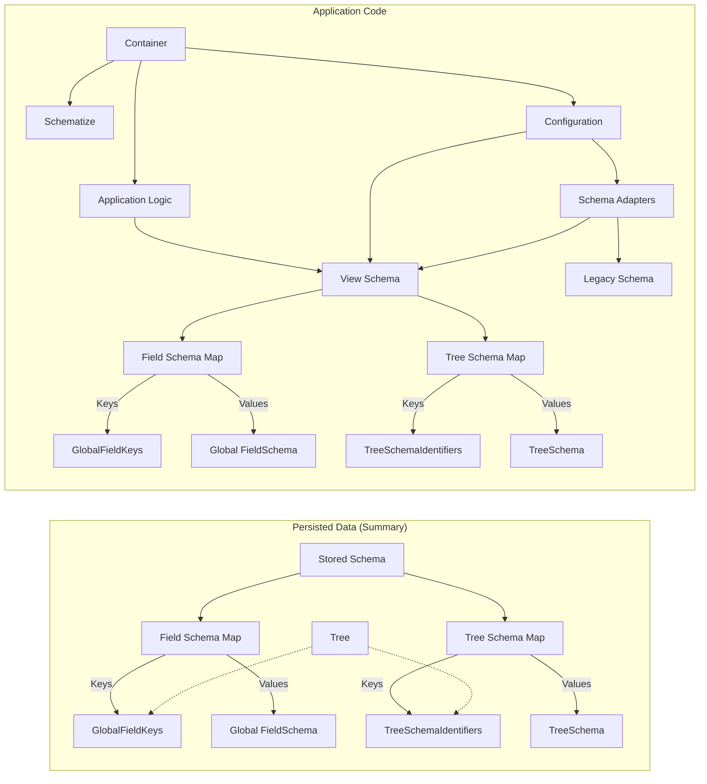

# Stored and View Schema

This document covers our chosen design from the design space defined by [Stored and View Schema Options](./Stored%20and%20View%20Schema%20Options.md).

This diagram shows the schema related data for a typical Fluid Tree powered application and a document for it.
The edges show dependencies/references.



The `Application Code`'s schema (the "View Schema") are code, and thus can include TypeScript types for the schema.
The "Stored Schema" from the documents are data, and thus do not contain TypeScript types.

When the Container is loaded, Schematize uses the Schema Adapters to present the Tree from the document (which complies with the Stored Schema) as a Tree complying with the View Schema. Then the application logic can use the per schema TypeScript types to have type safe schema aware access to the tree.

## Schema Evolution Design Pattern

To support making changes to schema used in existing documents:

If existing data will always be compatible with the new schema (new schema permits a superset of what the old one did):

-   Update view schema to accept the new format (must still support the old format).
-   Ensure the app can properly handle documents containing the new format but does not switch documents to the new format.
    There are a few approaches (TODO: we should pick one of these, and document how to actually do it cleanly):
    -   Use new schema as the view schema, and be careful when editing.
    -   Have the app support both view schemas (new and old) and
        have schematize pick which to use based on which is the stored schema.
    -   Make which format is written for new content conditional on a flag (which opts into creating data that needs the new format).
        Initialize this flag based on if the new schema is compatible with the stored schema.
-   Wait for above to be deployed to most users.
-   Update or configure app such that it writes the new schema to the document's stored schema, and starts thus using the new functionality that enables.

If existing data could be incompatible with the new schema:

-   Author new schema (with a new type identifier)
-   Add support for it in the application.
    This may optionally be done by using the new schema as the view schema (removing the old one), and providing schematize with a handler to do the update/conversion.
-   Recurse this algorithm updating the parent to accept the new schema (which in most cases will hit the "If existing data is compatible with the new schema" case.)

### Schema Versioning

This migration strategy results in two kinds of changes to schema:

1. An updated copy of a schema with a new type identifier.
2. An updated copy of a schema with the same type identifier (and tolerates strictly more trees than the old version).

In both of these cases, keeping the old schema around in the application source code is useful, but in different ways.
This section covers a pattern for efficiently managing all the old schemas that accumulate over time,
meaning that we do not place any O(number of old schema) complexity into any code.

Old schema in case #2 only need to be kept until the migration is complete, meaning deployed applications are allowed to write the new more flexible format.

During the migration, both can be kept and a test can be used to confirm that the new schema actually permits a superset of what the old one did.

Once the migration is done, all code depending on the old schema can be deleted which should just be:

-   the old schema itself
-   support for creating data in that format when inserting it into the document
-   the above mentioned test

The two schema could be kept straight by calling them `*CompatibilitySchema` and `*Schema` respectively.

It would also be possible to express the new one as a declarative upgrade to the old one (via a set of relaxations to parts of it), and then replace it with a normally coded one (not based on the old one) when deleting the old one.

Old schema in case #1 has much longer term implications: they need to live forever to support old documents.

In this case, the schemas have different identifiers, which could either be random (ex: UUID), or a developer friendly name including a version.
The old schema, and handlers which can upgrade the data to the new format, get packed into a library which can be loaded into schematize to provide legacy schema support.

The old schema will not need to be mentioned anywhere else in source code (it may be mentioned in documents though!).

### Schema Migration examples

As we don't have a schema language yet, consider this schema pseudocode.

If we start with:

```typescript
// We need some way to express the unique identifiers. Just going to add them after the name for the API for now, and use versions not UUIDs for this example.
Canvas: CanvasV1 {
    items: Circle | Point
}

Circle: CircleV1 {
    center: Point
    radius: number
}

Point: PointV1 {
    x: number
    y: number
}
```

Then update this doing the desired schema change.
This is our new view schema:

```typescript
Canvas: CanvasV1 {
    items: Circle | Point // Note this implicitly refers to CircleV2 now.
}

Circle: CircleV2 {
    center: Point
    diameter: number // Changed from radius
}

Point: PointV1 {
    x: number
    y: number
}
```

To enable support for legacy documents we separately package

```typescript
// The original canvas schema, moved/renamed out of the way (Case #2 above: kept until migration is finished).
// TODO: details on how we se this during the migration to avoid premature format updates before rollout is complete.
CanvasCompatibility:CanvasV1{
    items: CircleV1 | Point
}

// The original circle schema, moved/renamed out of the way (Case #1 above: kept forever)
CircleV1:CircleV1{
    center: Point
    radius: number
}
```

And with CircleV1, we provide an adapter for use with schematize that can handle a CircleV1 when a Circle (aka Circlev2) is expected.

## Open questions in proposed design

### How to deal with rebasing of schema changes?

Like any other edit, schema changes can be concurrent and need rebasing.
Doing this will need careful design, both to avoid schema violation in documents and to provide a nice app-facing API for handling cases where their schema changes conflicted and thus were apparently undone in an incompatible way.
These cases (where a schema change gets reverted/undone or conflicted) mean that the monotonic approach of schema changes always relaxing constraints cannot apply everywhere, and thus may be worth reconsidering.

### How should we deal with transient out of schema states while editing?

Use edit primitives that avoid this?

ex: swap instead of delete and insert. Maybe a version of detach that inserts a placeholder which has to be replaced with valid data before the transaction ends? That seems like it could make the tree reading API for the middle of transactions messy.

### What to do with TreeSchema.extraGlobalFields?

Should TreeSchema.extraGlobalFields exist, and if not, should be be unconditionally on or off? (See its doc comment).

### Do we need bounded open polymorphism?

Definitions for adjectives used with polymorphism:

-   unbounded: all types/values are permitted.
-   bounded: constrained by something e.g. an explicit list of types, a structural interface type (like a typescript or Go interface), a nominal interface (which the type must declare it implements, like a java interface or typescript class with protected members).
-   open: does not require modifying the declaration of the field to create a new type which can be used in it.
-   closed: requires modifying the declaration of the field to create a new type which can be used in it.

The example schema system includes bounded closed polymorphism (via unions in fields), and unbounded open polymorphism (via fields with unconstrained types). However, it does not support bounded open polymorphism. If support for bounded open polymorphism was added, it would be done by modifying FieldSchema.type. See its doc comment for details.

There are a few reasons to leave bounded open polymorphism out of initial versions:

-   It is possible to add in the future without breaking existing documents and could be incrementally adopted in new and updated schema.
    Thus there is little cost to delaying its implementation.
-   There are several ways it could be implemented.
    This means we will have to make some design decisions which will take time, and might be able to make better informed later.
-   It complicates the implementation, requiring time to test and implement.

## Approaches for Bounded Open Polymorphism

Despite these reasons to delay worrying about it, it is worth outlining some of the approaches which are practical to make sure they are sufficient to handle the desired use-cases. Deciding which of these approaches we actually want is a separate issue.

Before listing the approaches, it's important to note what we really care about is enabling applications to do bounded open polymorphism.

This distinction is important for two reasons:

1. Applications may want to constrain the types based on what the application can do with the types, not the structural shape of their data (ex: canvas might want to limit its children to things the app has code to draw, not things that have some particular fields like a top left point).
2. There are some ways we can implement bounded open polymorphism-like patterns at the app level without requiring direct support in the schema system.

Some approaches for bounded open polymorphism at the applications level:

-   Build view schema with a closed set of types on app load or build:

    The application can compute a closed set of types which meet it's requirements:

    -   structural e.g. require specific fields
    -   nominal: Specific types opt in to some named set of types they want to be included in.
    -   behavioral: All types supporting some specific functionality/[behavior](https://en.wikipedia.org/wiki/Aspect-oriented_programming)).

    This can be used to programmatically construct a schema using closed polymorphism while exposing it as open polymorphism to the application authors/schema language.
    This has the issue that different applications might come up with different sets of types so this approach is mainly suitable for view schema.

    There are a few options for how to handle the stored schema (listed below).
    Note that all these approaches potentially have to deal with cases where the app's view schema does not match the stored schema.
    If one group controls all the apps and the versions of them in use, it's possible to ensure that all apps support all types that will occur in the stored schema and tooling could be made for this (ex: generate the set of types as a build step, check in the results and ensure it only grows, then be careful with version roll-outs to roll out view support for types before versions that insert them).

    -   initially use the same schema used for view and update later (ex: when a different app performs an edit inserting something the first app doesn't support)
    -   just list the minimal set of types actually used in the document in that field, and update the field schema to allow new types when needed used.
    -   use open polymorphism

-   The above, but hand code the type lists.

    It should be possible to get build errors if you don't update it, so this should be practical if all allowed types are statically known when building the app (ex: no dynamically loaded plugins that add extra types).

-   Use open polymorphism in the stored and view schema. Handle unexpected values in the app.
-   Build a nominal open polymorphism system into the schema, allowing types to explicitly declare they are a member of a particular typeset/interface.

    Compatibility between stored and view schema can include checking these align.

-   Add a structural constraints that can be applied to field's children.
    There are a few design choices for this:

    -   How deep does it go?
        -   Allow constraints to apply further constraints on the children recursively.
        -   Allow only constraining the immediate children beyond the constraints their type implies.
    -   Are the constraints applied to types or values?

        -   Types: compute, based only on the schema, which types are allowed under which constraints.
            This only permits types where all possible values meet the constraints. `allowsTreeSuperset` can compute if a type is allowed.
        -   Values: compute, based only on the value, if it's allowed under which constraints.

            For example, a type with an optional field could be placed under a constraint which required it, if the particular instance of the value had the field.
            This adds more `context` (same tree might be valid in one place and invalid in another due to these constraints).
            This would be difficult to support as stored schema due to needing to reject edits that are in schema for the type, but violate a structural constraint.
            Making this work soundly when combined with concurrent moves which change which structural constraints apply would be hard.

## Inheritance Notes

Inheritance is a conflation of a specific kind of nominal bounded open polymorphism with reuse of implementation/declaration for some common parts of the types.
These aspects can be separated, allowing for a more flexible system than one based on inheritance.

Inheritance is sometimes useful for concisely expressing specific types:
we can gain this benefit by implementing it as syntactic sugar for some reuse mechanism
(ex: a way to include fields from another type or standalone set of fields) combined with some bounded open polymorphism mechanism (pick from the above approaches).

# Schedule

What work we need to do for each milestone in the [roadmap](../../docs/roadmap.md).

## M2

Review and polish [Schema Migration Design Pattern](#schema-migration-design-pattern) including actual APIs, documentation, and examples so apps can start planning forward compatibility for documents.

Pick concrete answers for the flexible areas in the design that need to be nailed down for document compatibility.
This includes how values/primitives work and what our initial set of primitive types will be.

## M2 or M3

Implement enough functionality to perform the steps in the above design pattern.

## M3

Polish up and finalize schema language, schema-aware APIs, and make sure APIs are statically typed and result in data staying in schema (including fuzz testing and maybe some proofs).

## Sometime after M3

Schema/Shape optimized storage formats and optimize schematize for these formats and for known stored schema.

Support additional functionality (prioritize based on users). Some examples we might do:

-   other options for stored schema
-   imperative extensions to view schema
-   more specific multiplicity options
-   helpers for schema migrations
-   support and/or helpers for bounded open polymorphism.
-   allow metadata for app use in view (and maybe stored) schema
-   default values:
    -   Maybe default values in stored schema can make schema migrations more flexible (ex: adding value fields), and provide a hint for compression.
    -   Maybe default values in view schema can provide an API-like value fields but for fields stored as optional? What about defaults for sequences?
    -   Maybe as a special case usage or a more general constants system?
-   helpers and patterns for enums

# Misc Notes

## Schema DDS

The stored schema could be in its own DDS.
This would be particularly practical if we add a way (or find a pattern) for DDS_s to perform cross DDS transactions.
Maybe the tree DDS could be optionally configured with a schema DDS which it uses for stored schema (could allow sharing schema between documents).
Readonly (for most people) public schema documents would compose interestingly with this.

Even if we can't make it work as a separate DDS, it should be implemented such that it would be easy to reuse the code as a schema-DDS.

## Typescript Typing

It is be possible to have an embedded DSL for schema declaration in the style of [typebox](https://www.npmjs.com/package/@sinclair/typebox) which produces both compile time types and runtime schema data.
This allows for schema-aware APIs (for example for tree reading and editing) to be provided without code gen.

It's possible to take this schema-aware static typing much further though (but it may not be useful to do so).

This static typing could be used to provide:

-   A SchemaRegistry that also collects runtime and compile type data.
-   Type safe APIs for schema updates e.g. updating a stored schema gives back a new schema repository that includes the changes.
-   Ways to type document load/viewing e.g. provide an expected stored schema with the document, and type check that the view supports it, optionally including strongly typed handles/adapters/reencoders for schematize.

Regardless of the typescript typing, the stored schema can be checked against the view schema to skip schematize where possible.
Schema-supersettting can be also used to determine if a schema is safe for reading but not writing.

## Reuse and Polymorphism

This document generally covers where schemas can be stored and how they can be used, and not the specifics of what they actually do.

Another way to put that is this is about what the Fluid tree needs from a schema system, and what options that leaves for how such a schema system could work,
and not about how to use those options to actually build a schema system.
