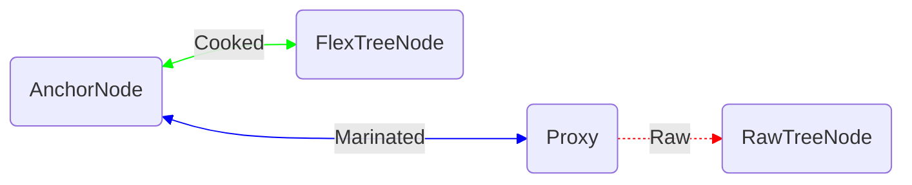

# simple-tree Proxy Binding

Proxy binding is a technique used in the simple-tree API implementation which enables a useful API feature, namely the ability to use a node proxy after it is inserted into the tree.
This allows developers to "read back" values that they insert into the tree much more succinctly.
Here is an example:

```ts
function addPoint(curve: Curve, x: number, y: number): Point {
	const point = new Point({ x: 3, y: 3 });
	curve.points.insertAtEnd(point);
	// After insertion, `point` can be queried:
	assert(point.x === 3);
	// In fact, `point` is the same proxy object that you would get from reading it off of its new parent in the tree:
	assert(point === curve.points[curve.points.length - 1]);
	// So, to read the content that was just inserted, the original object can be used and there is no need to read via the parent:
	return point;
	// (rather than: `return curve.points[curve.points.length - 1]`)
}
```

## Implementation

This feature is supported by doing some bookkeeping to ensure that the proxy objects,
flex nodes and anchor nodes in the tree get associated and disassociated at the right times.
There are three states that a node proxy can be in: "raw", "marinated" and "cooked".

### Raw Proxies

A newly created proxy, a.k.a. a **raw** proxy. A raw proxy is produced by invoking the schema-provided constructor for a node:

```ts
const rawPoint = new Point({ x: 3, y: 3 });
```

Such a proxy will be raw until it is inserted into the tree and becomes "marinated" (see below).
As of this writing raw proxies cannot be read or mutated, but in the future they will be capable of both.

### Marinated Proxies

Proxies become **marinated** as soon as they are inserted into the tree, whether directly or as part of a larger subtree:

```ts
// Upon insertion, `rawPoint` transitions from "raw" to the next state, "marinated"
app.graph.curves[0].insertAtEnd(rawPoint);
```

```ts
// Upon insertion, `rawPoint` transitions from "raw" to the next state, "marinated"
app.graph = {
    curves: [
        [new Point({ x: 2, y: 2 }, rawPoint, new Point({ x: 4, y: 4 }))],
        [new Point({ x: 10, y: 10 }, new Point({x: 20, y: 20})],
    ]
}
```

A marinated proxy, by definition, is bound bi-directionally to an `AnchorNode`.
When insertion occurs, an `AnchorNode` will be created for the location of the new content.
The proxy for that content will then be mapped to the `AnchorNode` and the `AnchorNode` will be mapped to the proxy.
Note that the `AnchorNode` does not yet have a `FlexTreeNode` associated with it - that happens when the node becomes "cooked" (see below).

### Cooked Proxies

A proxy is fully cooked when it finally associates itself with a `FlexTreeNode`.
This happens lazily on demand, if/when proxy is read.

```ts
const point = new Point({ x: 3, y: 3 }); // `point` is raw
curves.points.insertAtEnd(point); // `point` becomes marinated
const x = point.x; // `point` becomes cooked in order to support the read of `x`
```

This laziness prevents the proxy tree from generating unnecessary `FlexTreeNodes`.

Cooking a marinated proxy works as follows:

1. Get the `AnchorNode` associated with the marinated proxy.
2. Walk up the `AnchorNode` ancestry (parent-by-parent) until an `AnchorNode` is found which already has a corresponding `FlexTreeNode`
3. Walk back down the same path that was walked up in step 2, but this time via the `FlexTreeNode`s.
   This will cause the `FlexTreeNode`s all along the way to be generated, down to and including the original target node.

### Mappings



Note that it is possible for the `Cooked` mappings between an `AnchorNode` and a `FlexTreeNode` to exist regardless of whether there is also a proxy yet created for that node.
In that case, when that proxy is created it will immediately be given its `Marinated` mappings and therefore already be cooked.

`RawTreeNode`s, which implement the `FlexTreeNode` interface (or at least, at time of writing, pretend to), are substitutes for the true `FlexTreeNode`s that don't yet exist for a TODO (raw or marinated vs just raw) node.
The `Raw` mapping is removed when a proxy is TODO (marinated vs. cooked), and the `RawTreeNode` is forgotten.

See [proxyBinding.ts](./proxyBinding.ts) for more details.
