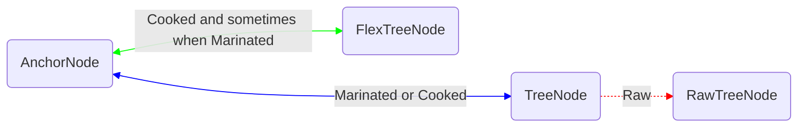

# simple-tree node Binding

Hydration is a three step process which provides the ability to use a simple-tree node both before and after it is inserted into the tree.
This allows developers to "read back" values that they insert into the tree much more succinctly.
Here is an example:

```ts
function addPoint(curve: Curve, x: number, y: number): Point {
	const point = new Point({ x: 3, y: 3 });
	curve.points.insertAtEnd(point);
	// After insertion, `point` can be queried:
	assert(point.x === 3);
	// In fact, `point` is the same simple-tree node object that you would get from reading it off of its new parent in the tree:
	assert(point === curve.points[curve.points.length - 1]);
	// So, to read the content that was just inserted, the original object can be used and there is no need to read via the parent:
	return point;
	// (rather than: `return curve.points[curve.points.length - 1]`)
}
```

## Implementation

This feature is supported by doing some bookkeeping to ensure that the simple-tree objects,
flex tree nodes and anchor nodes in the tree get associated and disassociated at the right times.
There are three states that a node simple-tree node can be in: "raw", "marinated" and "cooked".

Note from the public API perspective, `Unhydrated` nodes are "raw", and hydrated nodes are either "marinated" or "cooked".

### Raw Proxies

A newly created simple-tree node, a.k.a. a **raw** simple-tree node. A raw simple-tree node is produced by invoking the schema-provided constructor for a node:

```ts
const rawPoint = new Point({ x: 3, y: 3 });
```

Such a simple-tree node will be raw until it is inserted into the tree and becomes "marinated" (see below).
As raw nodes can be read or mutated.

### Marinated Proxies

Proxies become **marinated** as soon as they are inserted into the tree.

This happens whether proxies are inserted directly, as the root of the content subtree...

```ts
// Upon insertion, `rawPoint` transitions from "raw" to the next state, "marinated"
app.graph.curves[0].insertAtEnd(rawPoint);
```

...or proxies are inserted indirectly, making up some arbitrary portion of the content subtree.

```ts
// Upon insertion, `rawPoint` transitions from "raw" to the next state, "marinated"
app.graph = {
	curves: [
		[new Point({ x: 10, y: 10 }), new Point({ x: 20, y: 20 })],
		[new Point({ x: 2, y: 2 }), rawPoint, new Point({ x: 4, y: 4 })],
	],
};
```

A marinated simple-tree node, by definition, is bound bi-directionally to an `AnchorNode`.
When insertion occurs, an `AnchorNode` will be created (if not already present) for the location of the new content.
The simple-tree node for that content will then be mapped to the `AnchorNode` (via its kernel) and the `AnchorNode` will be mapped to the simple-tree node.
Note that the `AnchorNode` may not yet have a `FlexTreeNode` associated with it - that happens when the node becomes "cooked" (see below).

### Cooked Proxies

A simple-tree node is fully cooked when it finally associates itself with a `FlexTreeNode`.
This happens lazily on demand, if/when a marinated simple-tree node is read or mutated (by the local client).

```ts
const point = new Point({ x: 3, y: 3 }); // `point` is raw
curves.points.insertAtEnd(point); // `point` becomes marinated
const x = point.x; // `point` becomes cooked in order to support the read of `x`
```

This laziness prevents the simple-tree node tree from generating unnecessary `FlexTreeNodes`.

Cooking a marinated simple-tree node works as follows:

1. Get the `AnchorNode` associated with the marinated simple-tree node.
2. Get or create a `FlexTreeNode` for the anchor.
3. This will cause the `FlexTreeNode` to be generated which corresponds to the simple-tree node.

### Mappings



Note that it is possible for the `Cooked` mappings between an `AnchorNode` and a `FlexTreeNode` to exist regardless of whether there is also a simple-tree node yet created for that node.
In that case, when that simple-tree node is created it will immediately be given its `Marinated` mappings and therefore already be cooked.

`RawTreeNode`s, which implement the `FlexTreeNode` interface (or at least, as of 2024-03-21, pretend to), are substitutes for the true `FlexTreeNode`s that don't yet exist for a raw node.
The `Raw` mapping is removed when a simple-tree node is marinated, and the `RawTreeNode` is forgotten.

See [proxyBinding.ts](./proxyBinding.ts) for more details.
