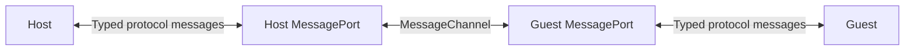
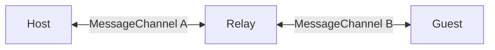

# Host and Guest MessagePort Design

## Status

This document is a proposal.
It describes preliminary cleanup for the Host and Guest messaging pattern in the SharedTree sandboxing demo.

## Purpose

The Host and the Guest currently use separate callbacks for data changes and acknowledgments.
Each participant has one callback for each message type.
This pattern couples the participants to the test transport.
It also does not test communication across a realm boundary.

Replace these callbacks with one duplex [`MessagePort`](https://developer.mozilla.org/en-US/docs/Web/API/MessagePort) for each participant.
The ports will carry data-change messages and acknowledgment messages in both directions.

This change will simplify the participant interfaces.
It will also prepare the demo for communication with an iframe, worker, or separate process.

## Scope

This design includes these changes:

- Define a typed protocol for data changes and acknowledgments.
- Give the Host and the Guest one `MessagePort` each.
- Send all runtime protocol messages with `MessagePort.postMessage()`.
- Listen for messages with the `message` event.
- Validate each received message before the participant processes it.
- Use real `MessageChannel` instances in tests.
- Keep deterministic control of message delivery in the permutation test.
- Close each port when its owner is disposed.

This design does not include these changes:

- ID compressor sharding.
- Fluid handle serialization.
- Initialization through the port.
- Message retransmission.
- Reconnection support.
- Full-duplex history synchronization.

These items remain separate production tasks.

## Current Pattern

The Host currently receives two callbacks:

- A callback that sends a data change to the Guest.
- A callback that sends an acknowledgment to the Guest.

The Guest receives the equivalent two callbacks for messages to the Host.
The test setup connects these callbacks directly to methods on the other participant.

This pattern has these problems:

- Each new message type requires another callback.
- The constructors expose transport details.
- The test passes message values by reference.
- The pattern does not model a browser or worker messaging boundary.
- The timeout transport and queue transport duplicate routing logic.

## Proposed Architecture

Create one `MessageChannel` for each Host and Guest session.
Give one endpoint to the Host and the other endpoint to the Guest.
Each participant uses its endpoint to send and receive messages.



The Host and the Guest will not hold direct references to each other.
The port will be their only runtime communication path.

## Protocol Schema

Use a discriminated union for the protocol envelope.
The `type` property identifies the message type.

The following example shows the initial schema:

```typescript
interface DataChangeMessage {
	readonly type: "dataChange";
	readonly change: JsonCompatibleReadOnly;
}

interface AcknowledgmentMessage {
	readonly type: "acknowledgment";
}

type HostGuestMessage = DataChangeMessage | AcknowledgmentMessage;
```

Use the same schema in both directions.
The receiver determines the meaning of the message.

| Receiver | `dataChange` meaning | `acknowledgment` meaning |
| --- | --- | --- |
| Host | Apply a change that the Guest created. | Confirm that the Guest applied the last Host update. |
| Guest | Apply an update that the Host created. | Confirm that the Host applied one Guest change. |

The first implementation does not need an acknowledgment identifier.
The design assumes that each message eventually arrives and that messages arrive in order in each direction.
The current state machines process data changes and acknowledgments in that order.

A later protocol can add message identifiers if it supports retransmission or duplicate delivery.
Do not add acknowledgment identifiers during this cleanup.

## Message Validation

TypeScript types do not validate data from another realm.
Each `message` event supplies data that the receiver must treat as `unknown`.

Add one protocol parser or type guard.
It must verify these conditions:

- The value is a non-null object.
- The value has a recognized `type` property.
- A `dataChange` message has a `change` property.
- An `acknowledgment` message does not require a payload.

The protocol validator must validate only the envelope.
`TreeViewAlpha.applyChange()` will continue to validate the serialized SharedTree change.
Do not duplicate the SharedTree change validator.

Do not use an assertion for an invalid external message.
An invalid message is a protocol or caller error, not an internal invariant failure.
Send it to an explicit protocol-error handler.
Do not acknowledge an invalid message.

Listen for the `messageerror` event too.
Send structured-clone deserialization failures to the same protocol-error handler.

## Host Design

Change the Host constructor so that it receives one `MessagePort` instead of two send callbacks.

The following example shows the intended constructor shape:

```typescript
class Host<const TSchema extends ImplicitFieldSchema> {
	public constructor(
		main: TreeViewAlpha<TSchema>,
		private readonly port: MessagePort,
		private readonly handleProtocolError: (error: Error) => void = (error) => {
			throw error;
		},
		private readonly logger: (message: string) => void = () => {},
	) {
		this.port.addEventListener("message", this.onMessage);
		this.port.addEventListener("messageerror", this.onMessageError);
		this.port.start();
	}
}
```

The Host message listener will route messages as follows:

- Route `dataChange` to the existing Guest-change processing logic.
- Route `acknowledgment` to the existing Guest-acknowledgment processing logic.

Keep the state-machine methods separate from the transport listener.
Make them private after the tests no longer call them directly.
This separation keeps protocol routing independent from tree synchronization.

The Host will send messages with `port.postMessage()`.
It will send a `dataChange` message when it updates the Guest.
It will send an `acknowledgment` after it applies a Guest change.

## Guest Design

Change the Guest constructor so that it receives one `MessagePort` instead of two send callbacks.

The Guest message listener will route messages as follows:

- Route `dataChange` to the existing Host-change processing logic.
- Route `acknowledgment` to the existing Host-acknowledgment processing logic.

The Guest will send a `dataChange` message for each local Guest change.
It will send an `acknowledgment` after it applies a Host update.

The existing in-flight counters and promises can remain unchanged.
This cleanup changes the transport, not the synchronization algorithm.

## Event Listener Pattern

Use `addEventListener()` instead of assigning `onmessage`.
This makes listener ownership explicit and supports symmetric cleanup.

Define listeners as stable class fields.
This lets `dispose()` remove the same function references.

The following example shows the routing pattern:

```typescript
private readonly onMessage = (event: MessageEvent<unknown>): void => {
	const message = parseHostGuestMessage(event.data);

	switch (message.type) {
		case "dataChange":
			this.receiveDataChange(message.change);
			break;
		case "acknowledgment":
			this.receiveAcknowledgment();
			break;
	}
};
```

Call `port.start()` after the listeners are registered.
This is required when the implementation uses `addEventListener()`.

## Ownership and Disposal

The participant that receives a port owns that port.
The owner must release it during disposal.

The Host and Guest `dispose()` methods must perform these operations:

1. Remove the `message` listener.
2. Remove the `messageerror` listener.
3. Close the port.
4. Unsubscribe from tree events.
5. Dispose owned views and branches.
6. Reject pending synchronization operations with a `SessionDisposedError`.

Closing the ports is important in Node.js tests.
An active port can keep the test process alive.
Use deterministic disposal instead of a Node.js-specific `unref()` call.
The same implementation must work in browsers and iframes.

The transport cleanup must not leave a promise pending forever.
Reject each pending synchronization promise with a `SessionDisposedError` when the participant that owns the promise is disposed.
This error lets callers distinguish disposal from protocol and SharedTree failures.

The following example shows the error type:

```typescript
class SessionDisposedError extends Error {
	public constructor() {
		super("The Host and Guest session was disposed before synchronization completed.");
	}
}
```

Store a rejection function with each pending promise.
Call the rejection function during disposal before the participant releases its other resources.

## Ordinary Test Setup

Replace the timeout callback transport with a real `MessageChannel`.

The following example shows the new setup:

```typescript
const channel = new MessageChannel();

host = new Host(main, channel.port1, handleProtocolError, logger);
guest = new Guest(config, options, content, channel.port2, handleProtocolError, logger);
```

A real channel provides asynchronous delivery.
It also applies structured cloning to each message.
The ordinary tests will therefore exercise a real message boundary.

The current initialization payload can remain a constructor argument.
Initialization will move to the protocol only after the ID compressor and Fluid handle designs are complete.

## Deterministic Permutation Test

The permutation test must control which direction delivers the next message.
A direct `MessageChannel` does not expose its internal queue.

Use a relay between the Host and the Guest.
The relay will use two real `MessageChannel` instances.
Keep the relay local to the sandboxing test.



The relay has these responsibilities:

- Receive structured-cloned messages from the Host.
- Receive structured-cloned messages from the Guest.
- Store the messages in separate Host-to-Guest and Guest-to-Host queues.
- Expose `dispatchToHost()` and `dispatchToGuest()` test methods.
- Forward one queued message through the destination channel when the test requests it.
- Close all relay ports during teardown.

The Host and the Guest still communicate only through their ports.
They do not know that the relay exists.

Port delivery is asynchronous.
The permutation test must wait until the relay receives a sent message before it selects the next protocol step.
Convert the test to an asynchronous test if necessary.

Do not replace the relay with direct method calls.
Direct calls would bypass structured cloning and the message listeners.

## Error Handling

Use one error callback per participant for the first implementation.
The callback must default to a handler that throws the error immediately.
Tests and production code can provide a different handler when they need to observe or report the error.

The error path must cover these cases:

- Unknown message type.
- Invalid message envelope.
- Structured-clone deserialization failure.
- Invalid serialized SharedTree change.
- Message received after disposal, if the platform delivers one that was already queued.

The listener should catch errors from parsing and message processing.
It should restore temporary state in a `finally` block where necessary.
It must not send an acknowledgment after a failed apply operation.

This cleanup must not define a remote error-response message.
Error responses require a larger protocol decision about recovery and compatibility.

## Test Plan

Keep the current behavior tests.
Update them to wait for messages delivered through the ports.

Add these focused tests:

1. A Guest data change crosses the channel and reaches the Host.
2. The Host acknowledgment crosses the same channel and reaches the Guest.
3. A Host update crosses the channel and reaches the Guest.
4. The Guest acknowledgment crosses the same channel and reaches the Host.
5. The receiver gets a clone of the message instead of the original object.
6. Messages keep their send order in each direction.
7. An unknown message type enters the protocol-error path.
8. An invalid message envelope enters the protocol-error path.
9. An invalid SharedTree change is not acknowledged.
10. Disposal rejects pending synchronization promises with a `SessionDisposedError`.
11. Disposal removes listeners and closes each owned port.
12. The relay preserves deterministic control of both directions.
13. The existing permutation scenarios still pass through the relay.

## Implementation Sequence

Use this implementation sequence:

1. Add the protocol types and validator near the demo classes.
2. Add port-based listeners and send helpers to the Host.
3. Add port-based listeners and send helpers to the Guest.
4. Replace the callback parameters in both constructors.
5. Replace the timeout callback transport with a direct `MessageChannel`.
6. Add the relay for the permutation test.
7. Add protocol validation and disposal tests.
8. Update the sandboxing overview to describe the implemented transport.
9. Run the Tree test build and the focused sandboxing test.
10. Run formatting, lint, and `git diff --check` for the changed files.

## Compatibility and Future Extensions

The protocol is local to one Host and Guest session.
It is not a persisted format.
The Host and the Guest always use code from the same package version.
Therefore, the protocol does not need a version property or version negotiation.

Keep the discriminated union extensible.
New messages can later support these operations:

- Session initialization.
- ID compressor state transfer.
- Fluid handle requests and responses.
- History and branch synchronization.
- Session shutdown.

Add each new operation as a new message type.
Do not add another constructor callback for it.

## Resolved Decisions

- Keep the `handleProtocolError` parameter and use a default handler that throws the error immediately.
- Reject pending synchronization promises with a `SessionDisposedError` during disposal.
- Keep the relay local to the sandboxing test.
- Do not add a protocol version property or version negotiation. The Host and the Guest always use the same package version.
- Do not add acknowledgment identifiers. The design assumes ordered, eventual message delivery.
