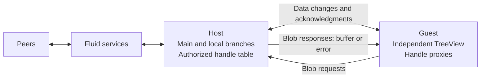
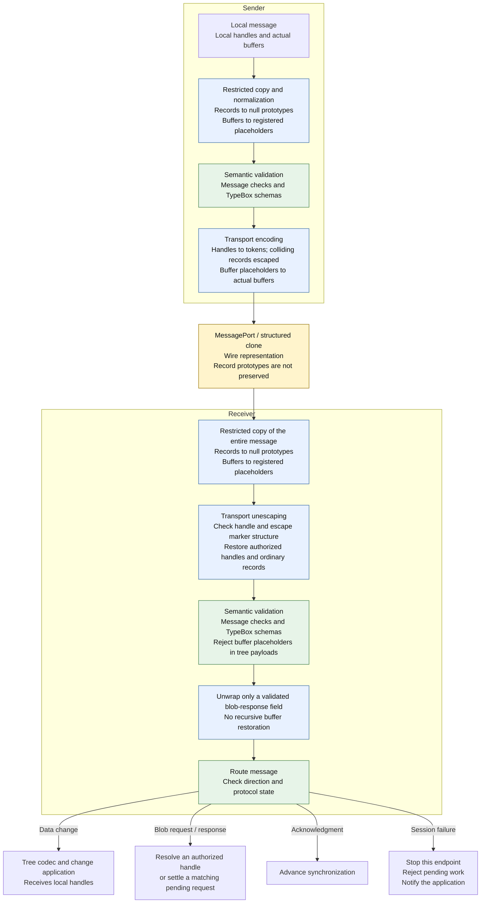

# Sandbox Demo

The test file in this folder contains an example architecture for a SharedTree view in a sandbox.

The example contains these items:

* A protocol for messages between the Host and the Guest.
* An example implementation of the Host and the Guest.
* Tests that show usage patterns and validate the implementation.

This architecture gives applications access to the familiar, feature-rich SharedTree view inside a sandbox.
Application developers can use its existing APIs and conflict resolution instead of building custom alternatives.

## Terminology

Use the terms "Host" and "Guest" for the two sides.
These terms are similar to the terms for virtual machines.

### Participants and Synchronization

- **Host**: The SharedTree that connects to Fluid services.
- **Guest**: The independent TreeView and its related internal components, separated from the Host by a message protocol.
- **Peer**: Another Fluid client that collaborates with the Host through Fluid services, not through the sandbox protocol.
- **Session**: The lifetime of one Host-to-Guest connection, including its handle tables and pending requests.
  Nothing in the Guest is supported beyond its owning Host session.
- **Session failure**: A terminal protocol or synchronization error that requires the application to replace the Host/Guest pair.
  A `sessionFailure` message notifies the peer when the transport still works.
- **Sequenced edits**: Edits ordered by Fluid services.
  The **trunk** is the branch containing sequenced history.
- **Host-local edits**: Edits on the Host that are not sequenced.
- **Guest-local edits**: Edits on the Guest that the Host has not acknowledged.
- **Host-originated edits**: Edits that the Host makes directly, not edits received from a Guest.
- **Main branch**: The Host branch that participates in Fluid collaboration.
  The Host also maintains a **local branch** to track and reconcile Guest edits.
  The main view belongs to the application; the sandbox Host borrows it and owns its session branches.
- **Data change**: A sandbox message containing an encoded SharedTree change.
- **Acknowledgment**: A sandbox message confirming that the receiver applied a data change.
- **Timeline**: The tree's application-visible branch history, including support for history operations such as undo and redo.

### Transport and Validation

- **Structured clone**: The platform's copying mechanism used to deliver `MessagePort` data across the boundary.
  It does not preserve null record prototypes or Fluid handle symbols.
- **Record**: An object with string-keyed data properties, distinct from arrays, buffers, and handles.
  A **null-prototype record** has no inherited properties.
- **Transport codec**: The sandbox conversion layer in [handles.ts](./handles.ts).
  It copies supported values, normalizes record prototypes, and converts handles, buffers, and escaped records between local and wire representations.
- **Wire representation**: Structured-clone-compatible data sent through the port, with handle markers, escape records, and actual buffers.
- **Tree payload**: The encoded initial tree or encoded change carried by the sandbox.
  Its **value vocabulary** is the set of permitted values, independent of the structure required by a particular tree codec.
- **Semantic validation**: Sandbox message and payload checks performed after normalization or transport decoding.
  TypeBox validates schemas, including custom checks for local handles, records, and buffer placeholders.
  This is not complete validation of every message or encoded change.
- **Tree codec**: An existing SharedTree codec that interprets encoded tree content or changes.
  It receives local handles, not wire handle markers.

### Handles and Blobs

- **Local handle**: An actual `IFluidHandle` recognized by the Fluid handle symbol in the current runtime.
  It can be a Host handle or a **Guest proxy**, whose `get()` requests content from the Host.
- **Handle token**: A session-local index into the Host's table of authorized handles.
  Its **handle marker** is the wire record `{ type: "__sandbox_handle__", token }`.
  Tokens are not secrets or Host handle URLs.
- **Escape record**: The wire wrapper `{ type: "__sandbox_object__", entries }`, where `entries` contains key/value pairs.
  It preserves ordinary records whose `type` would otherwise be interpreted as a handle or escape marker.
- **Blob**: Binary content returned by handle resolution as an `ArrayBuffer`.
- **Blob request / response**: A Guest-to-Host request to resolve a handle token, followed by a Host-to-Guest response containing a blob or an error.
  A **blob request ID** matches the response to its outstanding request; it is distinct from a handle token.
- **Buffer placeholder**: A local null-prototype `{ arrayBufferMarker: true }` record associated with a buffer in a private WeakMap.
  Map membership, not the record's shape, identifies a real placeholder.
  Placeholders keep actual buffers out of schema validation and are not sent over the port.
- **Binding**: Registering a restored handle with the Host's SharedTree handle for Fluid attachment.
  Binding is separate from restoring a token or resolving a handle's content.

## Key Assumptions

1. Each message between the Host and the Guest eventually arrives.
2. Messages that move in the same direction arrive in the order that they were sent.
    This requirement applies in each direction.
    Messages that move in opposite directions can arrive in any relative order.
3. The Host and the Guest use the same version of the tree code.
    Thus, this protocol does not require version stabilization.
4. Each message is compatible with [MessagePort](https://developer.mozilla.org/en-US/docs/Web/API/MessagePort).
    This requirement includes initialization messages.
    The example does not currently meet this requirement.
    For more information, see "ID Sharding."
5. The Guest is valid only during its owning Host session.
    Behavior after that session ends is unsupported.

## Architecture

### Participants and Message Directions

The Host connects the Guest to the collaborative tree.
Blob requests use the same channel as changes and acknowledgments, but do not block tree synchronization while content resolves.

### Message Conversion and Validation

Both directions use this pipeline.
The sender and receiver can each be the Host or the Guest; the permitted message direction is checked on receipt.
Blue steps convert data, green steps validate it, and the yellow step crosses the structured-clone boundary.

The entire incoming graph is restricted before marker validation or handle restoration.
Restoration alone neither binds nor resolves handles.
For Guest-to-Host changes, the Host applies the change to its local branch through the tree codec, binds its handles, merges into the main branch, and then acknowledges it.
Incoming validation or processing failures and outgoing normalization, validation, or encoding failures terminate the session.

Initialization is a separate entry point: the compressed initial tree follows normalization, payload validation, transport encoding, structured clone, transport decoding, payload validation, and tree-codec initialization.
The complete initialization payload does not yet pass through `MessagePort`; see [ID Sharding](#id-sharding).

These diagrams show the implemented layers, not a complete security guarantee.
See [Protocol Validation and Security Hardening](#protocol-validation-and-security-hardening) for the validation still required before production use.

### Session Failure and Application-Managed Recreation

[SandboxSession](./session.ts) treats protocol anomalies and synchronization failures as fatal: it stops the endpoint, rejects pending work, and reports the error to the application and, when possible, the peer.
Valid blob-resolution errors reject only `get()`, not the session.
Error reporting runs outside tree event dispatch to avoid interrupting main-tree edits.

The application owns teardown and recreation of the Host/Guest pair and sandbox.
Host disposal preserves the application's main view, including successfully merged edits whose acknowledgments failed.
Recovery uses fresh session objects, not reset breakers.

The tested failure paths preserve main-tree usability; see [Session Fault Isolation](#session-fault-isolation) for remaining work.

## Path to Production

Complete these items in any order.

Some tests will fail if you write them before you complete the implementation.
These failures do not prevent you from writing the tests.

### ID Sharding

The Host and the Guest currently use the same id-compressor instance.
This design is not practical because the Host and the Guest can run in different processes.
Update the code to serialize a sharded id-compressor.

Sharding support was added in https://github.com/microsoft/FluidFramework/pull/26294.
The change was reverted in https://github.com/microsoft/FluidFramework/pull/26394.
Fix, restore, and use that implementation, or implement a different solution.

### Fluid Handles

Handle transport and resolution follow [Architecture](#architecture), with these constraints:

- Only blob resolution is supported; non-buffer results and resolution failures reject `get()`.
  Buffers are copied, never transferred and detached from the Host.
- Every entry in the Host's session-scoped handle array is authorized for that Guest.
  Tokens are allocated sequentially and checked for both incoming changes and blob requests.
  The Guest can return existing handles, but cannot introduce new or foreign handles.
- Only the Host performs binding and Fluid attachment; Guest proxies cannot attach.
- Equivalent Host handle paths reuse one token and Guest proxy.
  Each proxy caches one `get()` promise, including rejection.
- Tables and proxies are retained until session failure or disposal, which clears the tables and rejects pending Guest requests.
  No per-handle reclamation or sandbox-specific Fluid garbage collection mechanism is required.
- The transport codecs do not implement `IFluidSerializer` or provide JSON stringification.

### Protocol Validation and Security Hardening

The [pipeline](#message-conversion-and-validation) enforces these additional rules:

- **Restricted copying:** Accept null, undefined, booleans, finite numbers, strings, dense arrays, ordinary or null-prototype records, and buffers.
  Local handles are opaque leaves on send; received handles must use tokens.
  Reject unsupported objects, cycles, sparse arrays, accessors, symbol properties, and non-enumerable record properties.
  Copy repeated ordinary references independently.
- **Prototypes:** All copied, generated, and reconstructed records have null prototypes, as required by semantic validation.
  Arrays, buffers, and local handles have separate rules; buffers pass prototype and property checks before replacement.
- **Escaping:** Reject malformed escape records and duplicate keys.
  Do not reinterpret reconstructed roots as markers.
  Define own data properties so `__proto__`, `constructor`, and `prototype` remain valid keys.
- **Buffers:** Blob-response fields require registered buffer placeholders; tree payloads reject them.
  Marker-shaped user data remains ordinary data and cannot forge a buffer.
- **Identifiers and messages:** Use distinct branded types for handle tokens and blob request IDs; brands do not confer authorization.
  Handle-marker and blob-message schemas require nonnegative safe-integer IDs, required fields, and no extra properties.
  Blob responses contain either a blob or an error string, never both.
- **Protocol state:** Enforce the [message directions](#participants-and-message-directions), token authorization, and response matching against outstanding requests.
- **Local handles:** Legacy string-property lookalikes remain ordinary data.
  Removing the general `isFluidHandle` helper's legacy fallback is separate work.
- **Validator support:** Alternative validators must support the custom handle, buffer-placeholder, and plain-record schema kinds or provide equivalent checks.

This boundary assumes genuine structured clone, not arbitrary same-realm JavaScript proxies.
Before using it with an untrusted participant:

- Complete schemas for data changes, acknowledgments, and the full initialization payload.
- Validate codec-specific change structure before mutation, beyond the value vocabulary, to prevent partial application of malformed changes.
- Verify that tree codecs reject handles in structural-record positions, including record-node data, without traversing handle internals or invoking getters.
- Define resource limits for message size, nesting depth, outstanding requests, and blob data.
- Test malformed messages and protocol-state violations across the remaining message types.

### Session Fault Isolation

Complete the isolation guarantees of [session failure handling](#session-failure-and-application-managed-recreation):

- Isolate failures during main-tree merge; successful local-branch validation alone does not guarantee this.
- Invalidate retained Guest references and support cleanup of already-broken tree state.
- Integrate application-level failure coordination when the port cannot notify the peer.

### Host Lifetime Extensions

How the Host manages the lifetime of some data must be adjusted.
The Host revision manager must retain additional branches to support the Guest.

A branch-based solution should be able to address the Guest's use of revertables as well as local branches.
Prevent the Host from pruning any branches that the Guest could know about until confirming the Guest no longer retains them.

### Trunk Trimming for Guest (Not required for V1)

Keep an unlimited history only when the Guest is configured to do so.
Guest trunk trimming is not a requirement for V1 because timeline support disables this trimming.
In other configurations, make sure that the Guest does not keep an unlimited history.

### `MessagePort` and IFrame Testing

The Host and the Guest send runtime data changes and acknowledgments through a real `MessagePort`.
The unit tests validate the structured-clone boundary.
The permutation test uses a two-channel relay to control message delivery in each direction.

Initialization data does not yet pass through the port.
The compressed initial tree follows the separate path described in [Architecture](#message-conversion-and-validation).
Complete [ID sharding](#id-sharding) before the entire initialization payload uses the message protocol.

Add an integration test that uses an isolated iframe.
This test makes sure that the implementation does not depend on shared global values.

### Edge Case Unit Testing

The tests should cover concurrent Host and Guest edits, delayed and interleaved messages,
Guest reloads or disposal with messages in flight, and malformed messages.
Handle-specific tests should cover repeated references, concurrent `get()` calls, resolution failures.

Validate undo and redo operations.
Include an operation that reverses a deletion after the Host would have normally discarded its data refreshers.

### Timeline

Make sure that timeline APIs such as `TreeView.branchHistory` operate in the Guest.

The Guest timeline must match the Host timeline.
The current architecture adds corrective changes instead of editing history, which makes the timeline incorrect.
The [Full-Duplex Architecture](#full-duplex-architecture-required-for-timeline-compatibility) is necessary for the correct behavior.
Also complete these tasks:

- Make sure that the timeline operates correctly for changes that are still local to the Guest.
- Give the Guest all Host history during initialization. The timeline must include changes from before the Guest was created.
    - Consider a Host snapshot or summary for this initialization. The snapshot or summary might have to include local edits. If it includes local edits, add an option that permits this behavior.
    - Consider serializing the revision manager directly instead of using a SharedTree snapshot.
    - Validate when Host has local changes.
- Make sure that history operations on a local branch do not cause incorrect behavior.
- If the protocol uses our codecs, use versions that preserve commit metadata. One possible solution is to set the minimum collaboration version to the current version.

### Full-Duplex Architecture (Required for Timeline Compatibility)

Application developers can reproduce the current architecture with their own protocols, without access to SharedTree internals.
The architecture does not require merge resolution in the Guest.
However, it delays updates to the Guest while the Guest has local changes.
As a result, the Guest can receive updates late.
A very active Guest editor can also cause increasingly expensive local rebase operations.

Consider this alternative architecture:

* On the Guest, keep a copy of the sequenced trunk branch, the local Host main branch, and the local Guest branches.
* Do not perform merge resolution for the Guest on the Host. Instead, the Host notifies the Guest of new commits on the trunk and main branches. The Guest then rebases its local branches.
* When the Guest sends edits to the Host, include the revisions of the latest commits on the main and trunk branches. Use the revisions that were current when the Guest created the edits. The Host uses this information to update its branches.

This design is a simple variant of the edit manager.
The edit manager does a similar task for the Host, but it manages the branches of all remote clients instead of one Guest.

### Fix Memory Leak in Exhaustive Test (optional)

See the comment on the "All permutations" test.
