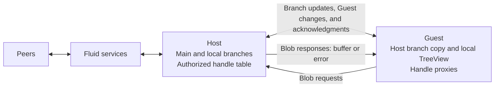
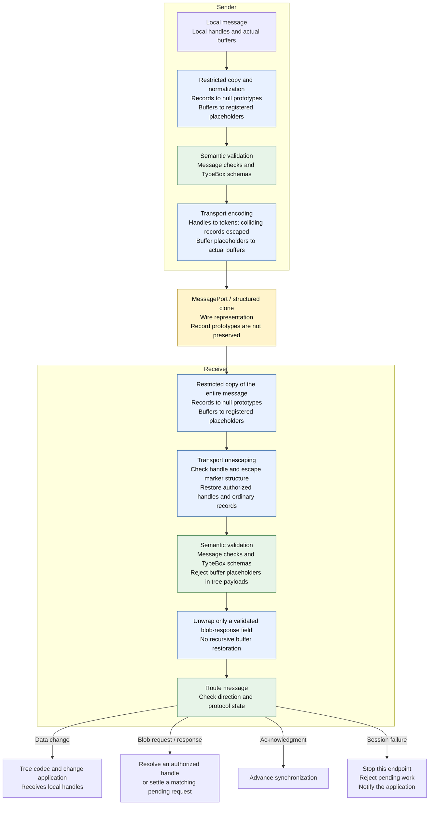
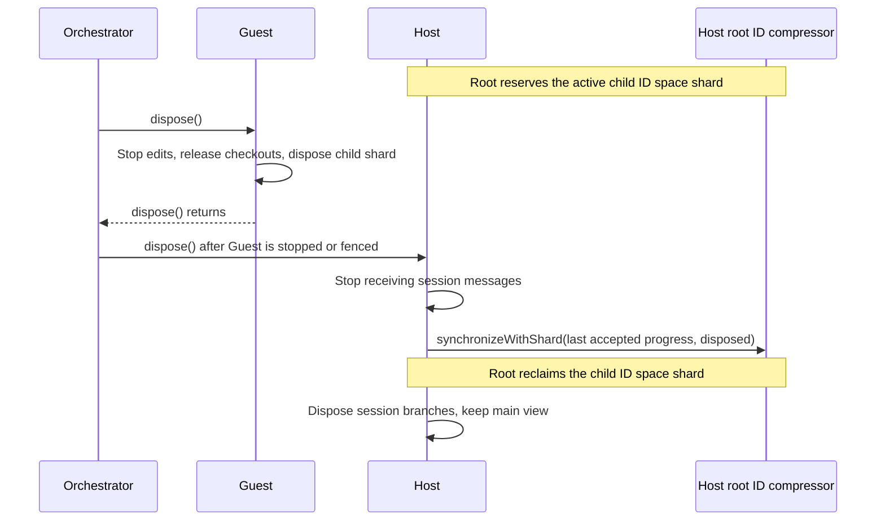
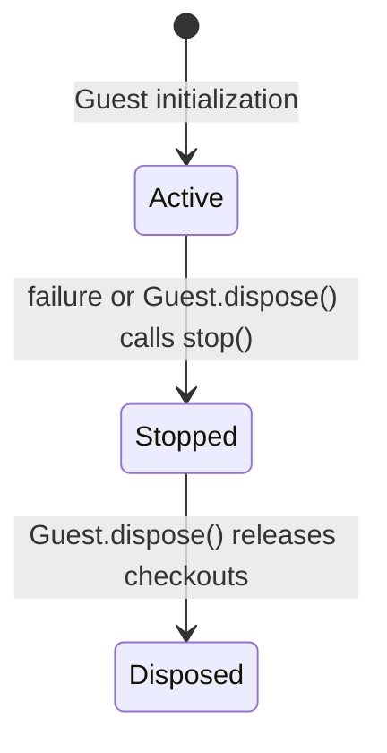
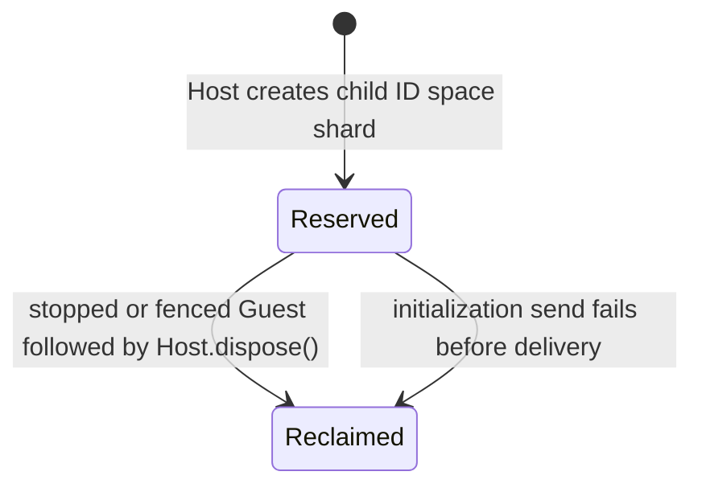

# Sandbox Demo

The tests in this folder exercise an example architecture for a SharedTree view in a sandbox.

The example contains these items:

* A protocol for messages between the Host and the Guest.
* An example implementation of the Host and the Guest.
* Tests that show usage patterns and validate the implementation.

This architecture gives applications access to the familiar, feature-rich SharedTree view inside a sandbox.
Application developers can use its existing APIs and conflict resolution instead of building custom alternatives.

## Terminology

Use the terms "Host" and "Guest" for the two sides.
These terms are similar to the terms for virtual machines.

### Participants and Synchronization

- **Host**: The SharedTree that connects to Fluid services.
- **Guest**: An independent tree checkout and its views, separated from the Host by a message protocol.
- **Peer**: Another Fluid client that collaborates with the Host through Fluid services, not through the sandbox protocol.
- **Session**: The lifetime of one Host-to-Guest connection, including its handle tables and pending requests.
  Nothing in the Guest is supported beyond its owning Host session.
- **Session failure**: A terminal protocol or synchronization error that requires the application to replace the Host/Guest pair.
  A `sessionFailure` message notifies the peer when the transport still works.
- **Sequenced edits**: Edits ordered by Fluid services.
  The **trunk** is the branch containing sequenced history.
- **Finalized-history boundary**: A commit through which history will not be rebased or replaced.
  The protocol's `trunkRevision` identifies this boundary, which may conservatively precede the newest finalized commit.
  SharedTree supplies its sequenced trunk head; checkouts without a supplied boundary use their current commit-graph root.
  An older boundary can require more history to be replayed and prevent optimizations based on finalized history.
  Guest initialization requires an initialized tree and schema at this boundary.
- **Host-local edits**: Edits on the Host that are not sequenced.
- **Guest-local edits**: Edits on the Guest that the Host has not acknowledged.
- **Host-originated edits**: Edits that the Host makes directly, not edits received from a Guest.
- **Main branch**: The Host branch that participates in Fluid collaboration.
  The Host also maintains a **local branch** that reconstructs the Guest's authoring state.
  The main view belongs to the application; the sandbox Host borrows it and owns its session branches.
- **Data change**: A sandbox message containing an encoded SharedTree change.
- **Acknowledgment**: A sandbox message confirming that the receiver applied a data change.
- **Timeline**: The tree's application-visible branch history, including support for history operations such as undo and redo.

### Transport and Validation

- **Structured clone**: The platform's copying mechanism used to deliver `MessagePort` data across the boundary.
  It does not preserve null record prototypes or Fluid handle symbols.
- **Record**: An object with string-keyed data properties, distinct from arrays, buffers, and handles.
  A **null-prototype record** has no inherited properties.
- **Transport codec**: The sandbox conversion layer in [transport.ts](./transport.ts).
  It copies supported values, normalizes record prototypes, and converts handles, buffers, and escaped records between local and wire representations.
- **Wire representation**: Structured-clone-compatible data sent through the port, with handle markers, escape records, and actual buffers.
- **Tree payload**: The encoded initial tree or encoded change carried by the sandbox.
  Its **value vocabulary** is the set of permitted values, independent of the structure required by a particular tree codec.
- **Semantic validation**: Sandbox message and payload checks performed after normalization or transport decoding.
  TypeBox validates schemas, including custom checks for local handles, records, and buffer placeholders.
  This is not complete validation of every message or encoded change.
- **Tree codec**: An existing SharedTree codec that interprets encoded tree content or changes.
  It receives local handles, not wire handle markers.

### Handles and Blobs

- **Local handle**: An actual `IFluidHandle` recognized by the Fluid handle symbol in the current runtime.
  It can be a Host handle or a **Guest proxy**, whose `get()` requests content from the Host.
- **Handle token**: A session-local index into the Host's table of authorized handles.
  Its **handle marker** is the wire record `{ type: "__sandbox_handle__", token }`.
  Tokens are not secrets or Host handle URLs.
- **Escape record**: The wire wrapper `{ type: "__sandbox_object__", entries }`, where `entries` contains key/value pairs.
  It preserves ordinary records whose `type` would otherwise be interpreted as a handle or escape marker.
- **Blob**: Binary content returned by handle resolution as an `ArrayBuffer`.
- **Blob request / response**: A Guest-to-Host request to resolve a handle token, followed by a Host-to-Guest response containing a blob or an error.
  A **blob request ID** matches the response to its outstanding request; it is distinct from a handle token.
- **Buffer placeholder**: A local null-prototype `{ arrayBufferMarker: true }` record associated with a buffer in a private WeakMap.
  Map membership, not the record's shape, identifies a real placeholder.
  Placeholders keep actual buffers out of schema validation and are not sent over the port.
- **Binding**: Registering a restored handle with the Host's SharedTree handle for Fluid attachment.
  Binding is separate from restoring a token or resolving a handle's content.

## Key Assumptions

1. While both endpoints and their ports remain active, each message between the Host and the Guest eventually arrives.
    A failed or torn-down endpoint may not deliver its final message.
2. Messages that move in the same direction arrive in the order that they were sent.
    This requirement applies in each direction.
    Messages that move in opposite directions can arrive in any relative order.
3. The Host and the Guest use the same version of the tree code.
    Thus, this protocol does not require version stabilization.
4. Each message is compatible with [MessagePort](https://developer.mozilla.org/en-US/docs/Web/API/MessagePort).
    This requirement includes initialization messages.
5. The Guest is valid only during its owning Host session.
    Behavior after that session ends is unsupported.

## Architecture

### Endpoint Options

`createHost` and `createGuest` each accept a named options object.
Their `HostOptions` and `GuestOptions` interfaces extend `SandboxEndpointOptions` in [common.ts](./common.ts).
The shared type defines the endpoint's port, logger, and optional protocol-error callback.
Supply a separate port and scoped logger for each endpoint.
The Host requires the application view and uses its checkout's runtime compressor; the Guest requires forest and codec options.
The Guest receives its own serialized ID space shard through initialization.
After initialization, the sandboxed client selects a schema with `guest.tree.viewWith(config)`.
If you omit the protocol-error callback, terminal errors are thrown asynchronously.

### Participants and Message Directions

The Host connects the Guest to the collaborative tree.
Blob requests use the same channel as changes and acknowledgments, but do not block tree synchronization while content resolves.


```mermaid
flowchart LR
    P["Peers"] <--> F["Fluid services"]
    F <--> H["Host<br/>Main and local branches<br/>Authorized handle table"]
    H <-->|"Branch updates, Guest changes, and acknowledgments"| G["Guest<br/>Host branch copy and local TreeView<br/>Handle proxies"]
    G -->|"Blob requests"| H
    H -->|"Blob responses: buffer or error"| G
```

### Full-Duplex Synchronization

The Guest keeps a checkout for the Host main branch and a separate checkout for Guest edits.
The Host sends branch transitions without waiting for outstanding Guest edits.
The Guest applies each transition to its Host branch copy, rebases its local edits, and acknowledges the update.
[GuestSynchronization](./guestSynchronization.ts) owns the hidden Host and authoring checkouts and the child ID space shard.
The [Guest](./guest.ts) owns its port, message routing, and local disposal.
GuestSynchronization creates and updates the authoring checkout and disposes it during Guest disposal.
Disposing the checkout also invalidates its authoring views.
After a failure, GuestSynchronization does not dispose the authoring checkout until application-managed cleanup.
The application can inspect it if it is still usable, but must not make further edits.
Application-managed cleanup calls `Guest.dispose()`, which releases both checkouts through GuestSynchronization.

The Host preserves the Guest's authoring state in its local branch.
It applies Guest changes there and merges them into main without rebasing the local branch itself.
Each change depends on the receiver knowing its IDs; see [ID Space Sharding](#id-space-sharding).
Only a Guest acknowledgment advances that branch over a Host update.
Each outstanding update retains the exact Host branch snapshot that was sent, because a revision can be rebased while a message is in flight.
The Host disposes each snapshot after acknowledgment, or when the session stops.

Ordered messages in each direction let the Host check a Guest change's main and trunk revisions against the last acknowledged update.
Revisions alone are not enough to select an authoring state from the current main branch.

### Initialization

Initialization transfers a snapshot at the oldest retained Host revision, followed by the retained commits in order.
The snapshot can be uninitialized if history still includes the original schema and content initialization.
Otherwise, it contains compressed tree content and its stored schema.
The Guest replays the commits before exposing its local view.
This preserves pending Host edits as commits that can be rebased, including insertions and deletions made before the session started.

The baseline revision aliases the independent checkout's initial head.
Branch validation recognizes this alias even when an update contains no commits.
Initialization commits use the same handle encoding and decoding as subsequent changes.
The serialized commit format preserves custom metadata in retained commits and later updates.
After serializing the snapshot and retained commits, the Host creates a child ID space shard of its runtime ID compressor.
The Host sends that ID space shard as part of `hostInitialization` through `MessagePort`.
The Guest deserializes the ID space shard before initializing its checkout or replaying commits.
This removes the need to share a live compressor object across the boundary.
See [ID Space Sharding](#id-space-sharding).

### ID Space Sharding

The Host keeps its runtime ID compressor and gives the Guest a separately deserialized child ID space shard.
The prototype requires a V3 runtime ID compressor; a V2 compressor cannot create the child shard.
The two compressors share a session ID, not an object reference.
The initial child state includes the IDs needed to load the compressed snapshot and replay retained commits.
After initialization, sharing a session ID alone does not give either compressor knowledge of new IDs.

For each Guest edit, `getChange()` serializes the change before the Guest captures a non-disposing child progress token.
The Host verifies that the token belongs to this session and does not move backward.
Consecutive Guest changes can report the same progress when they create no new IDs.
It synchronizes its compressor with the child before decoding the Guest change.

Host updates carry parent ID progress captured after their commits are encoded.
The Guest applies that progress before decoding the commits.
The Host also forwards finalized creation ranges in runtime order as `hostIdRange` messages, even when no tree update occurs.
Each range message includes parent progress, which the Guest applies before finalizing the range.
Ordered delivery ensures a range arrives before a later Host update that depends on it.
The Guest rejects out-of-order or repeated range IDs, progress for another shard, and progress that moves backward.
The sandbox does not call `takeNextCreationRange()` to manufacture these messages; range submission and finalization belong to the runtime.

Guest disposal is local and does not notify the Host.
After stopping or fencing the Guest, the orchestrator disposes the Host session to reclaim the shard from its last accepted progress.
See [Session Failure and Application-Managed Recreation](#session-failure-and-application-managed-recreation) for teardown and lost-connection behavior.
ID space sharding support was added in [PR 27559](https://github.com/microsoft/FluidFramework/pull/27559).

### Message Conversion and Validation

Both directions use this pipeline.
The sender and receiver can each be the Host or the Guest; the permitted message direction is checked on receipt.
Blue steps convert data, green steps validate it, and the yellow step crosses the structured-clone boundary.


```mermaid
flowchart TB
    subgraph Sending["Sender"]
        S["Local message<br/>Local handles and actual buffers"]
        N["Restricted copy and normalization<br/>Records to null prototypes<br/>Buffers to registered placeholders"]
        V["Semantic validation<br/>Message checks and TypeBox schemas"]
        E["Transport encoding<br/>Handles to tokens; colliding records escaped<br/>Buffer placeholders to actual buffers"]
        S --> N --> V --> E
    end

    W["MessagePort / structured clone<br/>Wire representation<br/>Record prototypes are not preserved"]
    E --> W

    subgraph Receiving["Receiver"]
        C["Restricted copy of the entire message<br/>Records to null prototypes<br/>Buffers to registered placeholders"]
        U["Transport unescaping<br/>Check handle and escape marker structure<br/>Restore authorized handles and ordinary records"]
        Q["Semantic validation<br/>Message checks and TypeBox schemas<br/>Reject buffer placeholders in tree payloads"]
        B["Unwrap only a validated blob-response field<br/>No recursive buffer restoration"]
        R["Route message<br/>Check direction and protocol state"]
        C --> U --> Q --> B --> R
    end

    W --> C
    R -->|"Data change"| T["Tree codec and change application<br/>Receives local handles"]
    R -->|"Blob request / response"| A["Resolve an authorized handle<br/>or settle a matching pending request"]
    R -->|"Acknowledgment"| K["Advance synchronization"]
    R -->|"Session failure"| X["Stop this endpoint<br/>Reject pending work<br/>Notify the application"]

    classDef conversion fill:#e8f1ff,stroke:#3166a3,color:#111;
    classDef validation fill:#e7f4e8,stroke:#397a42,color:#111;
    classDef boundary fill:#fff4cc,stroke:#967000,color:#111;
    class N,E,C,U,B conversion;
    class V,Q,R validation;
    class W boundary;
```

The entire incoming graph is restricted before marker validation or handle restoration.
Restoration alone neither binds nor resolves handles.
For Guest-to-Host changes, the Host applies the change to its local branch through the tree codec, merges into the main branch, and then acknowledges it.
Incoming validation or processing failures and outgoing normalization, validation, or encoding failures terminate the session.

Initialization is a separate entry point: the complete message, including the compressed tree, schema, retained commits, and serialized child compressor, follows normalization, validation, transport encoding, `MessagePort` structured clone, transport decoding, validation, and tree-codec initialization.

These diagrams show the implemented layers, not a complete security guarantee.
See [Protocol Validation and Security Hardening](#protocol-validation-and-security-hardening) for the validation still required before production use.

### Fluid Handles

Handle transport and resolution follow [Architecture](#architecture), with these constraints:

- Only blob resolution is supported; non-buffer results and resolution failures reject `get()`.
  Buffers are copied, never transferred and detached from the Host.
- Every entry in the Host's session-scoped handle array is authorized for that Guest.
  Tokens are allocated sequentially and checked for both incoming changes and blob requests.
  The Guest can return existing handles, but cannot introduce new or foreign handles.
- Only the Host performs binding and Fluid attachment; Guest proxies cannot attach.
- Equivalent Host handle paths reuse one token and Guest proxy.
  Each proxy caches one `get()` promise, including rejection.
- Tables and proxies are retained until session failure or disposal, which clears the tables and rejects pending Guest requests.
  No per-handle reclamation or sandbox-specific Fluid garbage collection mechanism is required.
- The transport codecs do not implement `IFluidSerializer` or provide JSON stringification.

### Transport Validation

The [pipeline](#message-conversion-and-validation) enforces these additional rules:

- **Restricted copying:** Accept null, undefined, booleans, finite numbers, strings, dense arrays, ordinary or null-prototype records, and buffers.
  Local handles are opaque leaves on send; received handles must use tokens.
  Reject unsupported objects, cycles, sparse arrays, accessors, symbol properties, and non-enumerable record properties.
  Copy repeated ordinary references independently.
- **Prototypes:** All copied, generated, and reconstructed records have null prototypes, as required by semantic validation.
  Arrays, buffers, and local handles have separate rules; buffers pass prototype and property checks before replacement.
- **Escaping:** Reject malformed escape records and duplicate keys.
  Do not reinterpret reconstructed roots as markers.
  Define own data properties so `__proto__`, `constructor`, and `prototype` remain valid keys.
- **Buffers:** Blob-response fields require registered buffer placeholders; tree payloads reject them.
  Marker-shaped user data remains ordinary data and cannot forge a buffer.
- **Identifiers and messages:** Use distinct branded types for handle tokens and blob request IDs; brands do not confer authorization.
  Handle-marker and blob-message schemas require nonnegative safe-integer IDs, required fields, and no extra properties.
  Blob responses contain either a blob or an error string, never both.
- **Protocol state:** Enforce the [message directions](#participants-and-message-directions), token authorization, and response matching against outstanding requests.
- **Local handles:** Legacy string-property lookalikes remain ordinary data.
  Removing the general `isFluidHandle` helper's legacy fallback is separate work.
- **Validator support:** Alternative validators must support the custom handle, buffer-placeholder, and null-prototype-record schema kinds or provide equivalent checks.

This boundary assumes genuine structured clone, not arbitrary same-realm JavaScript proxies.

### Session Failure and Application-Managed Recreation

[SandboxSessionEndpoint](./session.ts) treats protocol anomalies and synchronization failures as fatal: it stops the endpoint, rejects pending work, and reports the error to the application and, when possible, the peer.
Valid blob-resolution errors reject only `get()`, not the session.
Error reporting runs outside tree event dispatch to avoid interrupting main-tree edits.

Internal invariants use `assert` or `fail`; application misuse uses `UsageError`.
[SandboxProtocolError](./common.ts) identifies protocol data or state violations at either endpoint, including shared send/receive validation.
Operational errors retain their original classification.
Local session reports preserve the original error in `cause`; peer notifications carry only a diagnostic message, not an error classification.
These categories do not change which failures terminate the session.

The application owns teardown and recreation of the Host/Guest pair and sandbox.
Host disposal preserves the application's main view, including successfully merged edits whose acknowledgments failed.
Recovery uses fresh session objects, not reset breakers.

Call `Guest.dispose()` to synchronously stop Guest edits, release both Guest checkouts, and dispose its ID space shard.
Guest disposal does not notify the Host or reclaim its reserved child ID space.
The orchestrator must dispose the corresponding Host session after stopping the Guest, or after fencing a crashed iframe so its serialized shard cannot be reused.
Host disposal stops processing messages, reclaims the shard from the last accepted Guest progress, and releases its session branches.
Previously sent Guest changes that reach the Host before it stops can still be applied; other pending edits may be lost.
Pending Guest acknowledgments reject even if the Host subsequently applies an earlier change.
An outstanding Host update can also be discarded; the application-owned main view remains available.


```mermaid
sequenceDiagram
    participant Client as Orchestrator
    participant Guest
    participant Host
    participant Root as Host root ID compressor

    Note over Host,Root: Root reserves the active child ID space shard
    Client->>Guest: dispose()
    Guest->>Guest: Stop edits, release checkouts, dispose child shard
    Guest-->>Client: dispose() returns
    Client->>Host: dispose() after Guest is stopped or fenced
    Host->>Host: Stop receiving session messages
    Host->>Root: synchronizeWithShard(last accepted progress, disposed)
    Note over Host,Root: Root reclaims the child ID space shard
    Host->>Host: Dispose session branches, keep main view
```

The state names below belong to `GuestSynchronization`, not the Host's application-owned main view.
`Stopped` ends synchronization but keeps both checkouts until `Guest.dispose()` reaches `Disposed`.


```mermaid
stateDiagram-v2
    [*] --> Active: Guest initialization
    Active --> Stopped: failure or Guest.dispose() calls stop()
    Stopped --> Disposed: Guest.dispose() releases checkouts
```

The Host tracks the child ID space shard separately from the Guest synchronization state.
The orchestrator must stop or fence the Guest, ensuring it cannot send new changes or restart from its serialized shard, before disposing its Host session.
Host disposal stops processing session messages before using its latest accepted child progress to reclaim the allocation.
The Host has already learned the IDs used by every Guest change it accepted; unreported IDs in the fenced Guest are discarded.
An initialization send failure also reclaims a shard that the Host knows it did not deliver.


```mermaid
stateDiagram-v2
    [*] --> Reserved: Host creates child ID space shard
    Reserved --> Reclaimed: stopped or fenced Guest followed by Host.dispose()
    Reserved --> Reclaimed: initialization send fails before delivery
```

After a failure, GuestSynchronization leaves the authoring checkout available for inspection until the application calls `Guest.dispose()`.
GuestSynchronization releases both checkouts during cleanup.
Do not treat `sessionFailure` as proof of fencing: retained Guest references may still create IDs until disposal or iframe termination.
The Host remains active until the orchestrator disposes it, even after Guest disposal.
If the orchestrator does not dispose the Host, it continues sending updates and retains unacknowledged snapshots.

The tested failure paths preserve main-tree usability; see [Session Fault Isolation](#session-fault-isolation) for remaining work.

### Test Coverage

[Transport codec tests](./transport.spec.ts) and [end-to-end tests](./sandboxing.spec.ts) cover handle identity, concurrent resolution, resolution failures, escaping, and malformed handle/blob messages.
End-to-end tests also cover initialization, bidirectional handle edits, deletion/undo/redo, and application-managed session replacement after failures.
The Host, peer, and Guest edit cases run with separate compressors; integration with an isolated iframe is still pending.
Nested commit metadata, retained Host history, Guest revertibles, and branch rebases are covered by targeted tests.
The tests use real `MessagePort` channels; the sampled schedule tests use a two-channel relay to control delivery in each direction.
The ServiceClient integration test uses a test-only V3 override to verify a Guest edit through a real container.
Regression tests cover consecutive Guest changes authored before a concurrent insertion, empty baseline updates, and initialization with pending Host edits before and after history trimming.
ID-progress tests cover a delayed peer range and Host update while a Guest edit is pending, a repeated finalized range, and invalid parent progress.
Initialization tests also sequence concurrent Peer edits before the pending Host edits.
The schedule tests use `createFuzzDescribe`, `generateTestSeeds`, and `makeRandom` from `@fluid-private/stochastic-test-utils`.
Each step samples from the actions that are currently legal, including Guest deletions and Host/Peer insertions at the start.
This state-dependent sampling fits message schedules better than a fixed pairwise configuration matrix.
Each schedule starts with nonempty content and ends by draining all sandbox and Fluid messages and verifying convergence.

By default, the suite runs 50 deterministic seeds with 20 sampled steps each.
`FUZZ_TEST_COUNT` increases the number of seeds.
`FUZZ_STRESS_RUN=normal` increases each schedule to 100 steps while keeping seeds deterministic.
Every seed is a separate named test, and convergence failures include the action sequence.
The targeted regression tests remain separate from the sampled schedules.

Run these commands from `packages/dds/tree` after building the tests:

```bash
# Run the default sample.
pnpm test:mocha:esm --grep 'Synchronization schedules'

# Run more seeds at the default depth.
FUZZ_TEST_COUNT=500 pnpm test:mocha:esm --grep 'Synchronization schedules'

# Run more seeds with longer schedules.
FUZZ_TEST_COUNT=200 FUZZ_STRESS_RUN=normal pnpm test:mocha:esm --grep 'Synchronization schedules'

# Replay one seed from the default sample.
pnpm test:mocha:esm --grep 'Synchronization schedules seed 7$'
```

For a seed outside the default sample, set `FUZZ_TEST_COUNT` to at least the seed plus one.
To replay a normal stress run, also set `FUZZ_STRESS_RUN=normal` to preserve the schedule length.

## Remaining Work Before Production

Track only unfinished work here.
When completing an item, remove it or narrow it to the remaining work.
Move useful descriptions of implemented behavior to [Architecture](#architecture).
Preserve the scope and rationale of unresolved items when editing them.

Complete these items in any order.

Some tests will fail if you write them before you complete the implementation.
These failures do not prevent you from writing the tests.

### Runtime ID Compressor Version

The sandbox Host requires a V3 runtime ID compressor to create a child ID space shard.
The current ServiceClient runtime creates a V2 compressor.
The integration test overrides its live compressor to V3 only for an isolated test document; it does not establish production format compatibility.
Enable V3 through the runtime's document compatibility policy before using a ServiceClient Host outside this test.

### Protocol Validation and Security Hardening

Before using the sandbox with an untrusted participant, extend the existing [transport validation](#transport-validation):

- Complete validation of the full initialization payload.
- Validate codec-specific change structure before mutation, beyond the value vocabulary, to prevent partial application of malformed changes.
- Verify that tree codecs reject handles in structural-record positions, including record-node data, without traversing handle internals or invoking getters.
- Define resource limits for message size, nesting depth, outstanding requests, and blob data.
- Test malformed messages and protocol-state violations across the remaining message types.

### Session Fault Isolation

Complete the isolation guarantees of [session failure handling](#session-failure-and-application-managed-recreation):

- Isolate failures during main-tree merge; successful local-branch validation alone does not guarantee this.
- Invalidate retained Guest references and support cleanup of already-broken tree state.
- Integrate application-level failure coordination when the port cannot notify the peer.

### Host Lifetime Extensions

How the Host manages the lifetime of some data must be adjusted.
The Host revision manager must retain additional branches to support the Guest.

A branch-based solution should be able to address the Guest's use of revertables as well as local branches.
Prevent the Host from pruning any branches that the Guest could know about until confirming the Guest no longer retains them.

### Trunk Trimming for Guest (Not required for V1)

Keep an unlimited history only when the Guest is configured to do so.
Guest trunk trimming is not a requirement for V1 because timeline support disables this trimming.
In other configurations, make sure that the Guest does not keep an unlimited history.

### `MessagePort` and IFrame Testing

Add an integration test that uses an isolated iframe.
This test makes sure that the implementation does not depend on shared global values.

### Edge Case Unit Testing

Extend the existing [test coverage](#test-coverage) for concurrent Host and Guest edits, delayed and interleaved messages,
Guest reloads or disposal with messages in flight, and malformed messages.

Extend undo and redo coverage, including an operation that reverses a deletion after the Host would have normally discarded its data refreshers.

### Timeline

Make sure that timeline APIs such as `TreeView.branchHistory` operate in the Guest.

The Guest timeline must match the Host timeline.
The [full-duplex architecture](#full-duplex-synchronization) preserves branch transitions and retained initialization commits.
Complete these remaining tasks:

- Make sure that the timeline operates correctly for changes that are still local to the Guest.
- Define how much pre-session history the timeline retains beyond the history still available on the Host at initialization.
- Make sure that history operations on a local branch do not cause incorrect behavior.
- If the protocol uses our codecs, use versions that preserve commit metadata. One possible solution is to set the minimum collaboration version to the current version.

### Sampled Test Resource Usage (optional)

Profile memory use and runtime before further increasing the default seed count or depth of the schedule tests.
