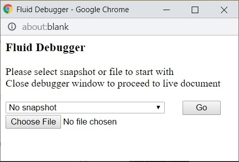
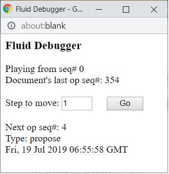

# @fluidframework/debugger

Fluid Debugger is useful tool to replay file history. This can be useful as learning tool, as well as tool to investigate corruption or performance issues, or as content recovery tool. It provides read-only document and ability to start with a particular snapshot (or no snapshot at all), and play ops one by one, or in big batches.

Fluid Debugger works as an adapter on top of any document storage. In other words, it can be integrated into any app using any storage endpoint (like SPO or Routerlicious) with minimal changes to application and can be used to replay history with full app code running, thus helping investigating bugs in any layer of application stack

<!-- AUTO-GENERATED-CONTENT:START (LIBRARY_README_HEADER) -->

<!-- prettier-ignore-start -->
<!-- NOTE: This section is automatically generated using @fluid-tools/markdown-magic. Do not update these generated contents directly. -->

## Using Fluid Framework libraries

When taking a dependency on a Fluid Framework library's public APIs, we recommend using a `^` (caret) version range, such as `^1.3.4`.
While Fluid Framework libraries may use different ranges with interdependencies between other Fluid Framework libraries,
library consumers should always prefer `^`.

If using any of Fluid Framework's unstable APIs (for example, its `beta` APIs), we recommend using a more constrained version range, such as `~`.

## Installation

To get started, install the package by running the following command:

```bash
npm i @fluidframework/debugger
```

## Importing from this package

This package leverages [package.json exports](https://nodejs.org/api/packages.html#exports) to separate its APIs by support level.
For more information on the related support guarantees, see [API Support Levels](https://fluidframework.com/docs/build/releases-and-apitags/#api-support-levels).

To access the `public` ([SemVer](https://semver.org/)) APIs, import via `@fluidframework/debugger` like normal.

To access the `legacy` APIs, import via `@fluidframework/debugger/legacy`.

## API Documentation

API documentation for **@fluidframework/debugger** is available at <https://fluidframework.com/docs/apis/debugger>.

<!-- prettier-ignore-end -->

<!-- AUTO-GENERATED-CONTENT:END -->


## How to Enable it

In order to use it, these changes are required:

1. Wrap existing storage:
    - If you have IDocumentService object, wrap it with **FluidDebugger.createFromService()** call (note that it's async call)
    - Or, If you have IDocumentServiceFactory, wrap it with **FluidDebugger.createFromServiceFactory()** call
2. In Dev Tools console, do
    > **localStorage.FluidDebugger = 1**
    >
    > > Fluid app has UI toggle for it - Settings | debbuger = on
3. Once you refresh page, look for blocked (by browser) pop-up window notification. Enable pop-ups for your app.

## How to disable it

1. In Dev Tools console, run
    > **delete localStorage.FluidDebugger**

## How it works

### Selecting where to start

Once debugger starts, you have the following choices on first screen:



1. Close window. Debugger will be disabled and normal document flow would proceed - document is read/write. In all other options document is read-only, i.e. no local changes are committed to storage.

2. Start with no snapshot, i.e. use only ops to play history of the file from start

3. Use a particular snapshot to start with (use dropdown). You will see a selection of snapshots (with cryptic names) as well as starting sequence number for each of them in dropdown, sorted (with latest at the top). Please note that dropdown is populated asynchronously - there is progress text on the page noting that.

4. Use snapshot stored on disk (_"snapshot.json"_), produced by [replay tool](../../tools/replay-tool/README.md). This option is useful if you want to validate that generation and loading of snapshot (from set of ops) does not introduce a bug. This is useful, given there is no other way to generate snapshot at particular point in time in the past. Notes:
    - Currently you can't play ops on top of snapshot in this mode (to be added in the future).
    - You can load snapshot from a different file (given above). As long as it's for same application, it does not matter if same file or storage endpoint is used to start an app.

### Playing ops

If you chose storage snapshot (not snapshot from file) or no snapshot, you are presented with a screen that allows you to play ops (on top of snapshot). You can chose any number of ops to play at once and click "Go" button:



Please note that playback is asynchronous, so even though Debugger UI might have acknowledged that ops where played out (and you can select next batch), application might be still in the process of processing previous batch.

## Internals, or useful piece to use in other workflows

Debugger consists of three mostly independent from each other pieces - UI, Controller & Storage layer. One can substitute UI and/or controller with alternative representation pretty easily, thus build different tool (like document recovery tool).

**IDebuggerController** is an interface that controls replay logic, but not UI. An implementation of this interface is provided: **DebugReplayController**

**IDebuggerUI** is an interface that controls UI and has no control logic. **DebuggerUI** is an implementation of that interface.

**FluidDebugger.createFluidDebugger()** is an example of binding logic & UI implementations

There are useful stand-alone implementations of **IDocumentStorageService** interface are provided as part of debugger:

1. **FileSnapshotReader** - file based storage. It reads content from file (snapshot.json) and expects **IFileSnapshot** format, uses content of such file to serve document requests.
2. **SnapshotStorage** - storage based on particular snapshot (in real storage). Requires snapshots' root ISnapshotTree to be provided at construction time.
3. **OpStorage** - op-based storage (i.e. it rejects all requests for snapshots / trees).

<!-- AUTO-GENERATED-CONTENT:START (README_FOOTER) -->

<!-- prettier-ignore-start -->
<!-- NOTE: This section is automatically generated using @fluid-tools/markdown-magic. Do not update these generated contents directly. -->

## Minimum Client Requirements

These are the platform requirements for the current version of Fluid Framework Client Packages.
These requirements err on the side of being too strict since within a major version they can be relaxed over time, but not made stricter.
For Long Term Support (LTS) versions this can require supporting these platforms for several years.

It is likely that other configurations will work, but they are not supported: if they stop working, we do not consider that a bug.
If you would benefit from support for something not listed here, file an issue and the product team will evaluate your request.
When making such a request please include if the configuration already works (and thus the request is just that it becomes officially supported), or if changes are required to get it working.

### Supported Runtimes

-   NodeJs ^20.10.0 except that we will drop support for it [when NodeJs 20 loses its upstream support on 2026-04-30](https://github.com/nodejs/release#release-schedule), and will support a newer LTS version of NodeJS (22) at least 1 year before 20 is end-of-life. This same policy applies to NodeJS 22 when it is end of life (2027-04-30).
-   Modern browsers supporting the es2022 standard library: in response to asks we can add explicit support for using babel to polyfill to target specific standards or runtimes (meaning we can avoid/remove use of things that don't polyfill robustly, but otherwise target modern standards).

### Supported Tools

-   TypeScript 5.4:
    -   All [`strict`](https://www.typescriptlang.org/tsconfig) options are supported.
    -   [`strictNullChecks`](https://www.typescriptlang.org/tsconfig) is required.
    -   [Configuration options deprecated in 5.0](https://github.com/microsoft/TypeScript/issues/51909) are not supported.
    -   `exactOptionalPropertyTypes` is currently not fully supported.
        If used, narrowing members of Fluid Framework types types using `in`, `Reflect.has`, `Object.hasOwn` or `Object.prototype.hasOwnProperty` should be avoided as they may incorrectly exclude `undefined` from the possible values in some cases.
-   [webpack](https://webpack.js.org/) 5
    -   We are not intending to be prescriptive about what bundler to use.
        Other bundlers which can handle ES Modules should work, but webpack is the only one we actively test.

### Module Resolution

[`Node16`, `NodeNext`, or `Bundler`](https://www.typescriptlang.org/tsconfig#moduleResolution) resolution should be used with TypeScript compilerOptions to follow the [Node.js v12+ ESM Resolution and Loading algorithm](https://nodejs.github.io/nodejs.dev/en/api/v20/esm/#resolution-and-loading-algorithm).
Node10 resolution is not supported as it does not support Fluid Framework's API structuring pattern that is used to distinguish stable APIs from those that are in development.

### Module Formats

-   ES Modules:
    ES Modules are the preferred way to consume our client packages (including in NodeJs) and consuming our client packages from ES Modules is fully supported.
-   CommonJs:
    Consuming our client packages as CommonJs is supported only in NodeJS and only for the cases listed below.
    This is done to accommodate some workflows without good ES Module support.
    If you have a workflow you would like included in this list, file an issue.
    Once this list of workflows motivating CommonJS support is empty, we may drop support for CommonJS one year after notice of the change is posted here.

    -   Testing with Jest (which lacks [stable ESM support](https://jestjs.io/docs/ecmascript-modules) due to [unstable APIs in NodeJs](https://github.com/nodejs/node/issues/37648))

## Contribution Guidelines

There are many ways to [contribute](https://github.com/microsoft/FluidFramework/blob/main/CONTRIBUTING.md) to Fluid.

-   Participate in Q&A in our [GitHub Discussions](https://github.com/microsoft/FluidFramework/discussions).
-   [Submit bugs](https://github.com/microsoft/FluidFramework/issues) and help us verify fixes as they are checked in.
-   Review the [source code changes](https://github.com/microsoft/FluidFramework/pulls).
-   [Contribute bug fixes](https://github.com/microsoft/FluidFramework/blob/main/CONTRIBUTING.md).

Detailed instructions for working in the repo can be found in the [Wiki](https://github.com/microsoft/FluidFramework/wiki).

This project has adopted the [Microsoft Open Source Code of Conduct](https://opensource.microsoft.com/codeofconduct/).
For more information see the [Code of Conduct FAQ](https://opensource.microsoft.com/codeofconduct/faq/) or contact [opencode@microsoft.com](mailto:opencode@microsoft.com) with any additional questions or comments.

This project may contain Microsoft trademarks or logos for Microsoft projects, products, or services.
Use of these trademarks or logos must follow Microsoft’s [Trademark & Brand Guidelines](https://www.microsoft.com/trademarks).
Use of Microsoft trademarks or logos in modified versions of this project must not cause confusion or imply Microsoft sponsorship.

## Help

Not finding what you're looking for in this README? Check out [fluidframework.com](https://fluidframework.com/docs/).

Still not finding what you're looking for? Please [file an issue](https://github.com/microsoft/FluidFramework/wiki/Submitting-Bugs-and-Feature-Requests).

Thank you!

## Trademark

This project may contain Microsoft trademarks or logos for Microsoft projects, products, or services.

Use of these trademarks or logos must follow Microsoft's [Trademark & Brand Guidelines](https://www.microsoft.com/en-us/legal/intellectualproperty/trademarks/usage/general).

Use of Microsoft trademarks or logos in modified versions of this project must not cause confusion or imply Microsoft sponsorship.

<!-- prettier-ignore-end -->

<!-- AUTO-GENERATED-CONTENT:END -->
