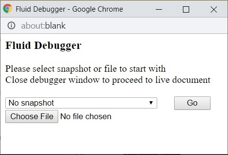
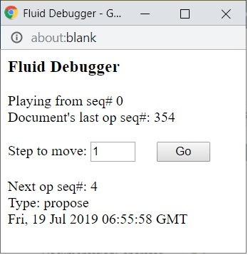

# @fluidframework/debugger

Fluid Debugger is useful tool to replay file history. This can be useful as learning tool, as well as tool to investigate corruption or performance issues, or as content recovery tool. It provides read-only document and ability to start with a particular snapshot (or no snapshot at all), and play ops one by one, or in big batches.

Fluid Debugger works as an adapter on top of any document storage. In other words, it can be integrated into any app using any storage endpoint (like SPO or Routerlicious) with minimal changes to application and can be used to replay history with full app code running, thus helping investigating bugs in any layer of application stack

<!-- AUTO-GENERATED-CONTENT:START (LIBRARY_README_HEADER) -->

<!-- prettier-ignore-start -->
<!-- NOTE: This section is automatically generated using @fluid-tools/markdown-magic. Do not update these generated contents directly. -->

## Using Fluid Framework libraries

For a dependency on a Fluid Framework library's public APIs, we recommend a `^` (caret) version range.
For example, use `^1.3.4`.

For a dependency on an unstable API, such as a `beta` API, we recommend a more restrictive version range.
For example, use a `~` version range.

## Installation

Run this command to install the package:

```bash
npm i @fluidframework/debugger
```

## Importing from this package

This package uses [package.json exports](https://nodejs.org/api/packages.html#exports) to separate APIs by support level.
For information about the support guarantees, read [API Support Levels](https://fluidframework.com/docs/build/releases-and-apitags/#api-support-levels).

Import the `public` ([Semantic Versioning (SemVer)](https://semver.org/)) APIs from `@fluidframework/debugger`.

Import the `legacy` APIs from `@fluidframework/debugger/legacy`.

## API Documentation

Read the **@fluidframework/debugger** API documentation at <https://fluidframework.com/docs/apis/debugger>.

<!-- prettier-ignore-end -->

<!-- AUTO-GENERATED-CONTENT:END -->


## How to Enable it

In order to use it, these changes are required:

1. Wrap existing storage:
    - If you have IDocumentService object, wrap it with **FluidDebugger.createFromService()** call (note that it's async call)
    - Or, If you have IDocumentServiceFactory, wrap it with **FluidDebugger.createFromServiceFactory()** call
2. In Dev Tools console, do
    > **localStorage.FluidDebugger = 1**
    >
    > > Fluid app has UI toggle for it - Settings | debbuger = on
3. Once you refresh page, look for blocked (by browser) pop-up window notification. Enable pop-ups for your app.

## How to disable it

1. In Dev Tools console, run
    > **delete localStorage.FluidDebugger**

## How it works

### Selecting where to start

Once debugger starts, you have the following choices on first screen:



1. Close window. Debugger will be disabled and normal document flow would proceed - document is read/write. In all other options document is read-only, i.e. no local changes are committed to storage.

2. Start with no snapshot, i.e. use only ops to play history of the file from start

3. Use a particular snapshot to start with (use dropdown). You will see a selection of snapshots (with cryptic names) as well as starting sequence number for each of them in dropdown, sorted (with latest at the top). Please note that dropdown is populated asynchronously - there is progress text on the page noting that.

4. Use snapshot stored on disk (_"snapshot.json"_), produced by [replay tool](../../tools/replay-tool/README.md). This option is useful if you want to validate that generation and loading of snapshot (from set of ops) does not introduce a bug. This is useful, given there is no other way to generate snapshot at particular point in time in the past. Notes:
    - Currently you can't play ops on top of snapshot in this mode (to be added in the future).
    - You can load snapshot from a different file (given above). As long as it's for same application, it does not matter if same file or storage endpoint is used to start an app.

### Playing ops

If you chose storage snapshot (not snapshot from file) or no snapshot, you are presented with a screen that allows you to play ops (on top of snapshot). You can chose any number of ops to play at once and click "Go" button:



Please note that playback is asynchronous, so even though Debugger UI might have acknowledged that ops where played out (and you can select next batch), application might be still in the process of processing previous batch.

## Internals, or useful piece to use in other workflows

Debugger consists of three mostly independent from each other pieces - UI, Controller & Storage layer. One can substitute UI and/or controller with alternative representation pretty easily, thus build different tool (like document recovery tool).

**IDebuggerController** is an interface that controls replay logic, but not UI. An implementation of this interface is provided: **DebugReplayController**

**IDebuggerUI** is an interface that controls UI and has no control logic. **DebuggerUI** is an implementation of that interface.

**FluidDebugger.createFluidDebugger()** is an example of binding logic & UI implementations

There are useful stand-alone implementations of **IDocumentStorageService** interface are provided as part of debugger:

1. **FileSnapshotReader** - file based storage. It reads content from file (snapshot.json) and expects **IFileSnapshot** format, uses content of such file to serve document requests.
2. **SnapshotStorage** - storage based on particular snapshot (in real storage). Requires snapshots' root ISnapshotTree to be provided at construction time.
3. **OpStorage** - op-based storage (i.e. it rejects all requests for snapshots / trees).

<!-- AUTO-GENERATED-CONTENT:START (README_FOOTER) -->

<!-- prettier-ignore-start -->
<!-- NOTE: This section is automatically generated using @fluid-tools/markdown-magic. Do not update these generated contents directly. -->

## Minimum Client Requirements

Fluid Framework client libraries support the platforms in this document.
These requirements are intentionally restrictive.
Within a major version series, we can relax these requirements, but we cannot make them stricter.
For a Long Term Support (LTS) version, we might need to support these platforms for several years.

Other configurations can work, but Fluid Framework does not support them.
If an unsupported configuration stops working, we do not classify this as a bug.
To request support for a configuration that is not listed, file an issue.
The product team will evaluate your request.
In the issue, specify the current status of the configuration:

-   The configuration works but needs official support.
-   The configuration does not work and requires changes.

### Supported Runtimes

-   Fluid Framework supports Node.js versions 22 and 24 while they receive [upstream support](https://nodejs.org/en/about/previous-releases).
    -   Fluid Framework will stop support for version 22 [when upstream support ends on 2027-04-30](https://github.com/nodejs/release#release-schedule).
    -   Fluid Framework does not support Node.js with the `--no-experimental-fetch` flag.
-   Fluid Framework supports modern browsers that support the ES2022 standard library.

### Supported Tools

-   [TypeScript 6.0](https://typescriptdocs.com/release-notes/TypeScript%206.0):
    -   Fluid Framework supports all [`strict`](https://www.typescriptlang.org/tsconfig) options.
    -   Set the build targets (`lib`, `target`) to `ES2022` or later.
    -   Enable [`strictNullChecks`](https://www.typescriptlang.org/tsconfig).
    -   Fluid Framework does not support [configuration options deprecated in TypeScript 6.0](https://typescriptdocs.com/release-notes/TypeScript%206.0#breaking-changes-and-deprecations-in-typescript-6-0).
    -   Fluid Framework does not fully support `exactOptionalPropertyTypes`.
        If you enable this option, do not use `in`, `Reflect.has`, `Object.hasOwn`, or `Object.prototype.hasOwnProperty` to narrow members of Fluid Framework types.
        These methods can incorrectly exclude `undefined` from the possible values.
-   [webpack](https://webpack.js.org/) 5
    -   We do not require a specific bundler.
        Other bundlers that handle ES Modules can work, but we actively test only webpack.

### Module Resolution

In TypeScript `compilerOptions`, use [`Node16`, `Node20`, `NodeNext`, or `Bundler`](https://www.typescriptlang.org/tsconfig#moduleResolution) module resolution.
These settings follow the [Node.js v12+ ESM Resolution and Loading algorithm](https://nodejs.github.io/nodejs.dev/en/api/v20/esm/#resolution-and-loading-algorithm).

Do not use `Node10` module resolution.

### Module Formats

-   ES Modules:
    Use ES Modules to consume Fluid Framework client packages, including in Node.js.
-   CommonJS:
    Fluid Framework does not officially support CommonJS in version 3.0 or later.

## Contribution Guidelines

You can [contribute](https://github.com/microsoft/FluidFramework/blob/main/CONTRIBUTING.md) to Fluid Framework in these ways:

-   Answer questions in [GitHub Discussions](https://github.com/microsoft/FluidFramework/discussions).
-   [Submit bug reports](https://github.com/microsoft/FluidFramework/issues) and help verify fixes.
-   Review [source code changes](https://github.com/microsoft/FluidFramework/pulls).
-   [Contribute bug fixes](https://github.com/microsoft/FluidFramework/blob/main/CONTRIBUTING.md).

For detailed instructions, read the [Fluid Framework wiki](https://github.com/microsoft/FluidFramework/blob/main/docs/content/Home.md).

This project follows the [Microsoft Open Source Code of Conduct](https://opensource.microsoft.com/codeofconduct/).
For more information, read the [Code of Conduct frequently asked questions](https://opensource.microsoft.com/codeofconduct/faq/).
For questions or comments, contact [opencode@microsoft.com](mailto:opencode@microsoft.com).

This project may contain Microsoft trademarks or logos for Microsoft projects, products, or services.
When you use these trademarks or logos, follow Microsoft's [Trademark and Brand Guidelines](https://www.microsoft.com/trademarks).
Do not use Microsoft trademarks or logos in a modified version of this project if the use causes confusion or implies Microsoft sponsorship.

## Help

Read the [Fluid Framework documentation](https://fluidframework.com/docs/) for information about Fluid Framework concepts and APIs.

To request information that the documentation does not contain, [create an issue](https://github.com/microsoft/FluidFramework/blob/main/docs/content/Contributing/Submitting-Bugs-and-Feature-Requests.md).

## Trademark

This project may contain Microsoft trademarks or logos for Microsoft projects, products, or services.

Use of these trademarks or logos must follow Microsoft's [Trademark & Brand Guidelines](https://www.microsoft.com/en-us/legal/intellectualproperty/trademarks/usage/general).

Use of Microsoft trademarks or logos in modified versions of this project must not cause confusion or imply Microsoft sponsorship.

<!-- prettier-ignore-end -->

<!-- AUTO-GENERATED-CONTENT:END -->
