# Eval App

A generic web GUI for running LLM evaluations. Any application can use it by providing its own generation logic, auth flow, and configuration via the `createEvalServer` API.

## Overview

The eval app is a configurable Node.js HTTP server that:

- Serves a self-contained React UI for configuring and launching eval runs
- Calls your app-provided `runGeneration` callback to produce artifacts
- Runs the eval framework (LLM-as-judge) on those artifacts
- Streams real-time progress to the browser via Server-Sent Events (SSE)
- Serves result files (summaries, scores, JSON) through API endpoints

## Eval Flow

```mermaid
%%{init: {'themeVariables': {'signalColor': '#ffffff', 'signalTextColor': '#ffffff', 'actorBkg': '#474a4a', 'actorBorder': '#474a4a', 'actorTextColor': '#F9FAFB', 'actorLineColor': '#6b6b6b'}}}%%
sequenceDiagram
    participant UI as Browser UI
    participant SRV as Eval Server
    participant AUTH as Auth Provider<br/>(optional)
    participant GEN as runGeneration<br/>(app callback)
    participant EF as EvalFramework
    participant JUDGE as LLM Judge<br/>(ILLMClient)

    rect rgb(88, 28, 135)
        Note over UI,AUTH: Phase 0 · Setup
        UI->>SRV: GET /api/config
        SRV-->>UI: appName · models · auth availability
        opt Auth configured
            UI->>SRV: POST /api/auth (SSE)
            SRV->>AUTH: runAuth(progress)
            AUTH-->>SRV: Authenticated
            SRV-->>UI: SSE complete
        end
    end

    rect rgb(30, 64, 175)
        Note over UI,GEN: Phase 1 · Generation
        UI->>SRV: POST /api/run-eval (SSE)<br/>{ dataset · model · judgeModel · customGenerationProperties? }
        SRV->>GEN: runGeneration({ dataset, model, judgeModel, customGenerationProperties? }, progress, signal)
        GEN-->>SRV: SSE progress events
        SRV-->>UI: Streaming progress
        GEN-->>SRV: { scenario · resultsDirPath · llmClient }
    end

    rect rgb(20, 83, 45)
        Note over SRV,JUDGE: Phase 2 · Evaluation
        Note over SRV: new EvalFramework({ judgeModel, llmClient })
        SRV->>EF: framework.run({ scenario, resultsDirPath })
        loop For each dataset artifact
            EF->>JUDGE: Judge model<br/>System + user prompt<br/>(rubrics · appInput · appOutput · images)
            JUDGE-->>EF: Per-rubric scores + reasoning
        end
        Note over EF: Aggregate · write result.json · summary.md
        EF-->>SRV: ScenarioEvalResult
        SRV-->>UI: SSE complete<br/>{ resultsDirPath · datasetSummaries · scenarioSummary }
    end
```



## Building

```bash
pnpm build
```

UI assets (`index.html`, `styles.css`) live at the package root and are resolved at runtime via `createRequire`, so the server can locate them regardless of whether the code runs from source, from `dist/`, or when bundled into a consuming application.

## Usage

Import `createEvalServer` and pass your app-specific configuration:

```typescript
import { createEvalServer } from '@fluidframework/eval-app';
import type { ProgressReporter } from '@fluidframework/eval-app';

createEvalServer({
  appName: 'My App',
  datasetsDir: '/path/to/datasets',
  resultsDir: '/path/to/results',
  defaultGeneratorModel: 'gpt-4o',
  defaultJudgeModel: 'gpt-4o',
  modelOptions: ['gpt-4o', 'gpt-4o-mini'],

  async runGeneration(request, progress, signal) {
    // Generate artifacts for request.dataset using request.model
    // Report progress via progress.progress() and progress.warn()
    // Respect signal for cancellation (signal.throwIfAborted())
    // Return { scenario, resultsDirPath, llmClient, customEvaluators? }
  },

  // Optional: auth support
  async checkAuth() {
    // Return true if the user is authenticated
  },
  async runAuth(progress) {
    // Run an interactive auth flow, report progress via progress.progress()
  },
});
```

The server starts on the configured port (default: 8150) and opens the UI.

## Configuration

The `EvalServerConfig` interface (see `types.ts`) accepts:

| Property                | Required | Description                                                                        |
| ----------------------- | -------- | ---------------------------------------------------------------------------------- |
| `appName`               | Yes      | Display name shown in the UI header and page title                                 |
| `datasetsDir`           | Yes      | Absolute path to the directory containing dataset JSON files                       |
| `resultsDir`            | Yes      | Absolute path to the directory where results are written                           |
| `defaultGeneratorModel` | Yes      | Default model for the generator dropdown                                           |
| `defaultJudgeModel`     | Yes      | Default model for the judge dropdown                                               |
| `modelOptions`          | Yes      | Available model options for UI dropdowns                                           |
| `runGeneration`         | Yes      | Callback that generates artifacts for a given dataset and model                    |
| `port`                  | No       | Port to listen on (default: 8150)                                                  |
| `checkAuth`             | No       | Callback to check if the user is authenticated. If omitted, auth UI is hidden      |
| `runAuth`               | No       | Callback to run an interactive auth flow. If omitted, the sign-in button is hidden |

### `runGeneration` callback

Your generation callback receives a `RunGenerationRequest` with `dataset`, `model`, `judgeModel`, and optional `customGenerationProperties` fields. It should:

1. Generate artifacts and write them to a run directory
2. Construct a `ScenarioArtifact` in memory with inline `llmEvalConfig` and per-dataset `input`/`output`/`images`
3. Report progress via the `ProgressReporter` (`progress.progress()`, `progress.warn()`)
4. Respect the `AbortSignal` for cancellation
5. Return a `RunGenerationResult` with `scenario`, `resultsDirPath`, `llmClient`, and optional `customEvaluators`

## Features

- **Dataset selection** -- dropdown of available scenario JSON files from `datasetsDir`
- **Custom dataset upload** -- paste custom scenario JSON directly in the UI
- **Model configuration** -- select generation and judge models from `modelOptions`
- **Real-time progress** -- streaming output via SSE during eval runs
- **Results browser** -- view summaries, scores, and artifacts from past runs
- **Auth management** -- check auth status and trigger interactive login (when `checkAuth`/`runAuth` are provided)

## API Endpoints

| Endpoint                           | Method | Description                                                             |
| ---------------------------------- | ------ | ----------------------------------------------------------------------- |
| `/`                                | GET    | Serves the React UI                                                     |
| `/api/config`                      | GET    | Returns app configuration (name, models, auth status)                   |
| `/api/options`                     | GET    | Lists available datasets with metadata                                  |
| `/api/runs`                        | GET    | Lists previous eval runs (sorted newest first)                          |
| `/api/runs/:name/summaries`        | GET    | Returns dataset summaries for a specific run                            |
| `/api/runs/:name/scenario-summary` | GET    | Returns the scenario-level summary for a run                            |
| `/api/run-eval`                    | POST   | Starts an eval run (SSE stream). Body: `{ dataset, model, judgeModel }` |
| `/api/stop-eval`                   | POST   | Stops a running eval                                                    |
| `/api/datasets/:file`              | GET    | Serves a dataset JSON file                                              |
| `/api/upload-dataset`              | POST   | Upload a custom dataset JSON                                            |
| `/api/results/*`                   | GET    | Serves files from the results directory                                 |
| `/api/auth-status`                 | GET    | Check if authenticated (requires `checkAuth`)                           |
| `/api/auth`                        | POST   | Start interactive auth (SSE stream, requires `runAuth`)                 |
| `/results`                         | GET    | Standalone results-only view                                            |

## SSE Events

The `/api/run-eval` and `/api/auth` endpoints stream Server-Sent Events:

| Event      | Data                                               | Description                                          |
| ---------- | -------------------------------------------------- | ---------------------------------------------------- |
| `progress` | `{ message: string }`                              | Progress update from the generation or auth callback |
| `complete` | `{ outputDir, datasetSummaries, scenarioSummary }` | Eval finished successfully                           |
| `error`    | `{ message: string }`                              | Eval failed                                          |
