# Eval Framework

A standalone evaluation framework that scores generated artifacts using an LLM-as-judge approach. It takes pre-generated artifacts and evaluates them against configurable rubrics.

## Eval Flow

```mermaid
%%{init: {'themeVariables': {'signalColor': '#ffffff', 'signalTextColor': '#ffffff', 'actorBkg': '#474a4a', 'actorBorder': '#474a4a', 'actorTextColor': '#F9FAFB', 'actorLineColor': '#6b6b6b'}}}%%
sequenceDiagram
    participant APP as Application
    participant EF as EvalFramework
    participant LJ as LlmAsJudgeEvaluator
    participant JUDGE as LLM Judge<br/>(ILLMClient)
    participant CE as Custom Evaluators<br/>(optional)

    rect rgb(30, 64, 175)
        Note over APP,EF: Phase 1 · Setup
        APP->>EF: new EvalFramework({ judgeModel, llmClient })
        APP->>EF: .run({ scenario, resultsDirPath })
    end

    rect rgb(20, 83, 45)
        Note over EF,CE: Phase 2 · Evaluation
        loop For each dataset artifact
            EF->>LJ: EvaluationContext<br/>(input · output · rubrics · images · prompt)
            LJ->>JUDGE: Judge model<br/>System prompt (rubrics + interpretation prompt)<br/>User prompt (appInput · appOutput · images)
            JUDGE-->>LJ: Per-rubric scores + reasoning
            Note over LJ: Parse · validate · format
            LJ-->>EF: EvaluationResult[] (score + reasoning per rubric)
            EF->>CE: EvaluationContext
            CE-->>EF: EvaluationResult[] (custom metrics)
        end
        Note over EF: Aggregate: per-rubric stats · reasoning · overall % · status
        EF-->>APP: ScenarioEvalResult
    Note over EF: Optionally writes result.json & summary.md to disk
    end
```



## What It Does

1. Receives a `ScenarioArtifact` with inline data (input, output, images, and eval config)
2. For each dataset, sends the data + rubrics (and optional images) to an LLM judge
3. The LLM scores the output across each rubric dimension (0–5 scale)
4. Aggregates scores and optionally writes results (`summary.md` + `result.json`) if `resultsDirPath` is provided

## Usage

The framework is a library — consumers instantiate `EvalFramework` and call `.run()` with a `ScenarioArtifact` object:

```typescript
import { EvalFramework } from '@fluidframework/eval-framework';

const framework = new EvalFramework({ logger, judgeModel, llmClient });
const result = await framework.run({
  scenario,
  resultsDirPath: '/path/to/results', // optional — omit to skip writing files
});
```

### Multimodal Evaluation (Images)

The framework supports passing images alongside structured data so LLM judges can visually evaluate rendered output. Images can be file paths or pre-encoded base64 data:

```typescript
// File path (read from disk at eval time):
const fromPath: DatasetArtifact = {
  name: 'slide-1',
  input: { messagePairs: [...] },
  output: { nodes: [...], edges: [...] },
  images: ['/path/to/screenshot.png'],
  metadata: {},
};

// Pre-encoded base64 data:
const fromBase64: DatasetArtifact = {
  name: 'slide-1',
  input: { messagePairs: [...] },
  output: { nodes: [...], edges: [...] },
  images: [{ type: 'base64', mediaType: 'image/png', data: 'iVBOR...' }],
  metadata: {},
};

// Multiple images (e.g., all slides for coherence evaluation):
const multiImage: DatasetArtifact = {
  name: 'coherence',
  input: { messagePairs: [...] },
  output: { nodes: [...], edges: [...] },
  images: ['/slides/slide-01.png', '/slides/slide-02.png', '/slides/slide-03.png'],
  metadata: {},
};
```

When images are present, the framework reads and base64-encodes file paths, then sends them as multimodal content blocks to the LLM judge. `ILLMClient` implementers must handle `ContentBlock[]` in `ChatMessage.content` (see below).

## Input: ScenarioArtifact

The eval framework receives a `ScenarioArtifact` — an in-memory object carrying all data needed for evaluation. The framework does not read any files (except optional image paths in `DatasetArtifact.images`).

```typescript
export type ScenarioArtifact = {
  name: string; // Scenario name
  llmEvalConfig: {
    // Inline eval configuration
    rubrics: {
      name: string; // Rubric dimension name
      description: string; // Scoring criteria
      optional?: boolean;
    }[];
    dataInterpretationPrompt?: string; // How to interpret the app's data
    defaultScale?: { min: number; max: number };
  };
  datasetArtifacts: {
    name: string; // Dataset name
    input?: JsonObject; // App input passed to the judge
    output: JsonObject; // App output to be evaluated
    images?: ImageInput[]; // File paths or base64 for visual evaluation
    metadata: JsonObject; // Pass-through metadata
  }[];
  modelType: string; // Model used for generation
  metadata: JsonObject;
  customResultProperties?: Record<string, string | number | boolean>;
};
```

## Output: Evaluation Results

Results are written per-scenario by the consumer. The framework returns structured `ScenarioEvalResult` objects.

### `result.json`

Full structured results for programmatic use:

```json
{
  "name": "Simple chat-to-board",
  "appMetadata": { "..." },
  "datasetResults": [
	{
	  "name": "Banana bread shopping list",
	  "appMetadata": { "..." },
	  "evalResult": [
		{
		  "rubricName": "Completeness",
		  "score": 4,
		  "reasoning": "The board covers 4 of 5 user requests...",
		  "executionTimeMs": 3200
		},
		{
		  "rubricName": "Node Type Correctness",
		  "score": 5,
		  "reasoning": "All node types match the requested outputs...",
		  "executionTimeMs": 2800
		}
	  ],
	  "resultMetadata": {
		"executionTimeMs": 15000,
		"timestamp": "2026-03-13T10:30:00.000Z",
		"judgeModel": "gpt-52-chat"
	  }
	}
  ],
  "resultMetadata": {
	"totalDatasets": 1,
	"averageScore": 4.2,
	"totalExecutionTimeMs": 18000,
	"judgeModel": "gpt-52-chat"
  }
}
```

Each dataset gets one `EvaluationResult` per rubric, with a `score` (0–5), `reasoning` (LLM explanation), and `executionTimeMs`. The scenario-level `averageScore` is the mean of all per-dataset average scores.

### `summary.md`

Human-readable markdown with score tables, written alongside `result.json`.

### Per-Dataset Directories

Each `dataset-{name}/` directory contains its own `summary.md` for that dataset's results.

## How Evaluation Works

### EvalFramework

The `EvalFramework` class:

1. Receives a `ScenarioArtifact` with inline eval config (rubrics + data interpretation prompt) and dataset data
2. For each dataset artifact, passes the inline `input`/`output`, rubrics, and optional images to the evaluator
3. Collects results and computes aggregate scores
4. Optionally writes `result.json` and `summary.md` to `resultsDirPath` if provided

### LLM-as-Judge Evaluator

The `LlmAsJudgeEvaluator` implements the `IEvaluator` interface:

1. Builds a system prompt defining the evaluation task and rubrics
2. Builds a user prompt serializing the input/output data (with embedded images when provided)
3. Calls the provided `ILLMClient` to get scoring
4. Parses the response to extract per-rubric scores (0–5) and reasoning
5. Returns one `EvaluationResult` per rubric dimension

### Custom Evaluators

Implement the `IEvaluator` interface:

```typescript
import type { IEvaluator, EvaluationContext } from './evaluators/evaluatorTypes.js';
import type { EvaluationResult } from './resultTypes.js';

class MyEvaluator implements IEvaluator {
  async evaluate(context: EvaluationContext): Promise<EvaluationResult[]> {
    // context.input  — the structured input data (DatasetArtifact.input)
    // context.output — the generated output (DatasetArtifact.output)
    // context.rubrics — rubric dimensions to score
    // context.images  — images for visual evaluation (file paths or base64)
    // context.dataInterpretationPrompt — how to interpret the data
    // context.judgeModel — LLM model to use
    return [
      {
        rubricName: 'My Metric',
        score: 4,
        reasoning: 'Explanation...',
        executionTimeMs: 100,
      },
    ];
  }
}
```

### Implementing ILLMClient (Multimodal)

When images are present, `ChatMessage.content` will be a `ContentBlock[]` instead of a plain string. Your `ILLMClient` implementation must handle both cases. Example for an OpenAI-compatible API:

```typescript
import type { ILLMClient, ChatMessage, ContentBlock } from '@fluidframework/eval-framework';

class MyLLMClient implements ILLMClient {
  async chatCompletion(messages: ChatMessage[]): Promise<string> {
    const mapped = messages.map((m) => {
      if (typeof m.content === 'string') {
        return { role: m.role, content: m.content };
      }
      // Map ContentBlock[] to OpenAI's multimodal format
      return {
        role: m.role,
        content: m.content.map((block) => {
          if (block.type === 'text') {
            return { type: 'text', text: block.text };
          }
          return {
            type: 'image_url',
            image_url: { url: `data:${block.mediaType};base64,${block.data}` },
          };
        }),
      };
    });

    const response = await fetch('https://api.openai.com/v1/chat/completions', {
      method: 'POST',
      headers: { 'Content-Type': 'application/json', Authorization: `Bearer ${apiKey}` },
      body: JSON.stringify({ model: 'gpt-4o', messages: mapped }),
    });
    const json = await response.json();
    return json.choices[0].message.content;
  }
}
```

## Testing

```bash
pnpm test reporter.test.ts
pnpm test llmAsJudgeEvaluator.test.ts
```
