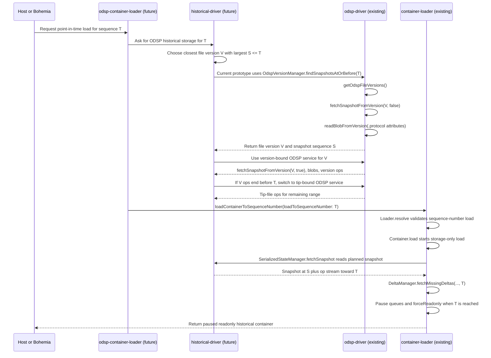

# Historical Loading Notes

This document explains historical loading in Fluid Framework.
It starts with the product idea, then explains package ownership, ODSP file-version mechanics, loader behavior, and the current prototype shape.

Historical loading means loading a Fluid document as it existed at an earlier point in time instead of loading the latest version.

## Why this exists

Most Fluid loads open the latest document state.
Some experiences need something different: they need to inspect the document at a specific point in its history.

The motivating scenario for this flow is NITL.
Copilot can make a change to a document, and that change can be auto-approved.
After approval, the experience needs to load or inspect the document at the exact point represented by that approved change, even if more edits happen later.

Examples:

- Show the document state produced by an auto-approved Copilot change.
- Show what the document looked like when a user performed an action.
- Compare current state with an earlier state.
- Investigate or explain a historical change.

For this work, the historical point is identified by a Fluid `sequenceNumber`.
A `sequenceNumber` is the global order number assigned to each operation in the document.

## The short story

Historical loading has four main steps:

1. The caller chooses the historical point it wants, called target `T`.
2. The loader carries `T` down through the load path.
3. ODSP historical support finds an ODSP file version whose Fluid snapshot sequence number is at or before `T`.
4. Fluid loads from that ODSP file version and replays operations until the document reaches `T`.

```text
choose target T
	-> find an ODSP file version with a base snapshot at or before T
	-> replay operations after the snapshot
	-> stop when the document reaches T
```

The result is a paused, read-only historical-view container whose state matches the requested point in history.
This is what this document means by materializing a point in time.

## Current status

This work is an alpha historical-load path for ODSP-backed documents.
It is not a general historical-load solution for every Fluid driver.

The current prototype has three important implementation facts:

- `container-loader` already has the generic sequence-number load mode. It can load from a base snapshot, replay only up to target `T`, pause, force readonly, and reject `connect()` or `getPendingLocalState()` on the returned historical container.
- `odsp-driver` currently contains `OdspVersionManager`, which uses ODSP file-version history to find a base snapshot at or before target `T`.
- Future package split work should move ODSP-specific host helpers into `odsp-container-loader` and historical driver/storage orchestration into `historical-driver`.

The most important design boundary is that `container-loader` must remain driver agnostic.
It should understand sequence-number loading, but it should not know how ODSP file versions work.

## Key terms

### Sequence number

A `sequenceNumber` is the global position of an operation in the document history.
It is the shared coordinate used by snapshots, operations, and replay.

### Target

The target is the sequence number the caller wants to load to.
This document usually calls it `T`.

### Snapshot

A snapshot is saved document state at some sequence number.
It is a starting point, not necessarily the exact requested historical point.

### Latest snapshot

The latest snapshot is the newest snapshot for the live document.
It is useful for normal loads, but historical loads must not blindly use it.
If the latest snapshot is newer than target `T`, Fluid cannot replay backward from it.
The important fallback for missing historical ops is usually not loading the latest snapshot; it is intentionally switching from a version-scoped op stream to the live tip-file op stream for any remaining ops.

### Base snapshot

The base snapshot is the snapshot Fluid starts from when reconstructing the requested historical state.
It must be at or before the target.

### Replay

Replay means applying operations after the base snapshot until the container reaches the target sequence number.

### Materialize

To materialize a point in time means to reconstruct an actual paused, read-only historical-view container state for that point.
It is more than finding a snapshot; it may also require replaying operations after the snapshot.

## End-to-end algorithm

The algorithm has one goal: materialize target sequence number `T` by loading the newest available base snapshot at or before `T`, then replaying every required op through `T`.

### Inputs

- `T`: the Fluid sequence number the host wants to load.
- ODSP file versions for the document.
- The live latest snapshot for the document.
- Op streams reachable through ODSP version-scoped URLs and the live tip-file URL.

### Definitions

- `V`: an ODSP file version.
- `S`: the Fluid snapshot sequence number for a base snapshot.
- `base`: the snapshot Fluid starts from.
- `next`: the next Fluid op sequence number required during replay.

For an ODSP file version, `S` is read from `V`'s `.protocol` attributes blob.
For the live latest snapshot, `S` is the latest snapshot's sequence number.

### High-level rule

```text
Choose the newest available base snapshot with sequence S where S <= T.
Then replay ops from S + 1 to T.
```

Usually that base snapshot comes from an ODSP file version.
If the live latest snapshot also has `S <= T`, it can be used as the base too.
That matters when ops from an older ODSP file version have been purged: a newer latest snapshot at or before `T` may need fewer replay ops and may avoid the purged range.

The latest snapshot cannot be used if its `S > T`, because Fluid cannot replay backward.

### Algorithm

1. **Build candidates.** For each ODSP file version `V`, read its `.protocol` attributes blob to get `S = attributes.sequenceNumber`, and add `{ source: "odspVersion", version: V, sequence: S }`. Also add `{ source: "latest", sequence: S }` from the live snapshot's sequence number.
2. **Filter and sort.** Discard candidates where `S > T`. Sort the rest newest-to-oldest by `S`. If none remain, fail with unavailable target.
3. **Op lookup shared by steps 4 and 6.** For a candidate `B` and sequence `next`:

	- If `B` is an ODSP file version, try `versions/{fileVersionId}/opStream`.
	- If not found there, or if `B` is `latest`, drop the version scope and try the live tip file's `opStream`.
	- Return found or not-found.

4. **Pick a base.** Starting with the largest `S`, run op lookup for every `next` from `S + 1` to `T`. If all are found, this candidate can reach `T`; use it. Otherwise reject it and try the next candidate.
5. **Load the base.** ODSP-version candidates load snapshot and blobs via `versions/{fileVersionId}/...`; `latest` loads via the normal path.
6. **Replay.** For each `next` from `S + 1` to `T`, run op lookup; fail if not found; apply only if it is exactly the next required sequence. Never skip ahead.
7. **Rejecting a base does not rule out newer ones.** A newer base can still work if it is `<= T` and starts after the gap. For example, if base `S = 100` is missing ops `120` through `122`, a newer base at `S = 125` can route around the gap for `T = 150`, but a base at `S = 170` cannot because Fluid cannot replay backward.
8. **On reaching `T`,** pause processing, force readonly, and return the historical container.

### Example 1: choose the closest base

Suppose the host asks for `T = 150`.

ODSP file versions might contain Fluid snapshots at these sequence numbers:

```text
V1 -> S = 40
V2 -> S = 100
V3 -> S = 180
```

The correct base is `V2`, because `100` is the closest snapshot sequence at or before `150`.
`V3` cannot be used because `180` is newer than the requested target, and Fluid cannot replay backward from `180` to `150`.
After choosing `V2`, Fluid loads the snapshot at `100` and replays ops `101` through `150`.

If the live latest snapshot were at `S = 140`, latest would be an even better base for `T = 150`.
Fluid would load latest at `140` and replay only ops `141` through `150`.
If latest were at `S = 170`, it could not be used for `T = 150` because Fluid cannot replay backward.

### Example 2: op fallback from version URL to tip-file URL

Fluid replays a contiguous op range from `S + 1` through `T`.

For each next required op, historical support first looks in the selected ODSP file version's op stream.
If that op does not exist inside the selected file version, historical support may drop `versions/{fileVersionId}/` from the op URL and look for that same op in the real tip file's op stream.
This is an explicit fallback for op reads only; the snapshot and blobs for the chosen base still come from the selected ODSP file version.

So replay can have up to two sources:

```text
first try:  versions/{fileVersionId}/opStream
fallback:   opStream on the live tip file
```

### Example 3: missing middle ops

The stitched op stream must still be contiguous.
If the version-contained ops end at `120`, and the tip-file ops start at `121`, replay can continue.
If the version-contained ops end at `120`, and the next available tip-file op is `130`, the load must fail because ops `121` through `129` are missing.
For example, if Fluid loaded a base snapshot at `S = 100`, then ops `120`, `121`, and `122` are required to reach any target after `122`.
If those ops are missing from both the version-contained op stream and the tip-file op stream, Fluid cannot jump from `119` to `123`.
That base cannot materialize the target.

The only way around that missing middle range is to choose a newer base snapshot that is still at or before `T`.
For example, a latest snapshot at `S = 125` can avoid missing ops `120` through `122` for target `T = 150`, because replay starts at `126`.
If no such newer base exists, the target is unavailable.

### Failure cases

- If replay cannot fetch enough contiguous operations to reach `T`, the load fails instead of waiting forever.
- If operations between `S + 1` and `T` have been purged, that base snapshot cannot materialize `T`.
- If there is a sequence-number gap between version-contained ops and tip-file ops, historical support must fail instead of silently skipping operations.

Switching from version-contained ops to tip-file ops only helps when the next needed op still exists in the tip file.
If replay from an older ODSP file version is blocked by purged ops, ODSP can try a newer base snapshot only if that snapshot is still at or before `T`; this may include the live latest snapshot when latest has `S <= T`.
If the next needed op is missing from both places and no newer base can skip past the missing range, ODSP reports the target as unavailable.

## Package ownership

The design is easiest to read by package boundary.
The important rule is that `container-loader` stays driver agnostic: it loads, replays, pauses, and forces readonly, but it does not know how ODSP history works.

- Host or Bohemia chooses the product point in time and converts it to Fluid sequence number `T`.
- Future `odsp-container-loader` exposes the ODSP-specific point-in-time load helper for hosts. It hides request headers, storage-only load settings, and driver setup, then calls `loadContainerToSequenceNumber`.
- Future `historical-driver` owns historical driver/storage orchestration. It chooses ODSP file version `V`, maps it to Fluid snapshot sequence `S`, composes version-bound and tip-bound ODSP reads, and exposes one snapshot/op stream view to the loader.
- Existing `odsp-driver` owns ODSP protocol details: file-version endpoint calls, version-scoped snapshot/blob/op reads, tip-file op reads, auth, epoch tracking, and retry behavior.
- Existing `container-loader` owns generic Fluid loading: carrying `loadToSequenceNumber`, validating the internal load mode, fetching the provided snapshot, replaying ops to `T`, pausing queues, forcing readonly, and returning the historical container.

### Current prototype location

`historical-driver` does not exist yet, so the prototype keeps part of that future responsibility in `odsp-driver`.
`OdspVersionManager` is the temporary home for selecting an ODSP file version and mapping it to a Fluid sequence number.
It currently calls the ODSP file versions endpoint, reads candidate version snapshots, finds the Fluid document attributes blob in `.protocol`, reads that blob from the same ODSP file version, and returns the closest usable version before or at target `T`.

When the package split happens, the selection/orchestration responsibility should move to `historical-driver`.
The raw ODSP I/O helpers can stay in `odsp-driver` or be reshaped into lower-level primitives that `historical-driver` calls.

### ODSP file-version facts

The ODSP historical path must use ODSP file-version history, not Fluid snapshot `getVersions`.
The relevant ODSP endpoint is:

```text
{apiRoot}/drives/{driveId}/items/{itemId}/versions
```

For SharePoint origins, `{apiRoot}` is `https://.../_api/v2.1`.
For OneDrive/ODC origins, `{apiRoot}` is `https://.../v2.1`.

An ODSP file version id is not itself a Fluid snapshot id or Fluid sequence number.
To decide whether ODSP file version `V` is usable for target `T`, historical selection must:

1. Load `V`'s snapshot tree through the version-scoped snapshot URL.
2. Find the Fluid document attributes blob, normally `.protocol`'s `attributes` blob entry. The current prototype also accepts the legacy root `.attributes` blob location.
3. Read that attributes blob through the same ODSP file version's attachment URL.
4. Use `attributes.sequenceNumber` as the Fluid snapshot sequence `S` for `V`.
5. Choose the closest usable version where `S <= T`, preferring the largest such `S`.

After choosing `V`, reads from that historical version must keep `versions/{fileVersionId}/` in the ODSP URL path.
The existing ODSP URL resolver already supports this shape for:

- `.../versions/{fileVersionId}/opStream/snapshots`
- `.../versions/{fileVersionId}/opStream/attachments`
- `.../versions/{fileVersionId}/opStream`

This is the boundary: do not discover history through Fluid storage `getVersions`, and do not mix a historical snapshot from ODSP file version `V` with blobs or ops accidentally read from the tip file.

## Load flow

This diagram shows the target architecture and notes where the current prototype sits.
Read it from top to bottom.
The future packages in the diagram do not exist yet; they show the intended ownership split.
Today, the `historical-driver` lane is mostly represented by ODSP storage code and `OdspVersionManager`.



## Why the target is a sequence number

Fluid operations are ordered by sequence number.
Snapshots record sequence numbers.
Delta storage fetches operations by sequence ranges.
Replay also uses sequence numbers.

That makes sequence number the most natural way to say:

```text
Load the document as it existed at this global point in history.
```

A snapshot id alone is not enough because the target may fall between two snapshots.

## Caller-facing load shape

Callers can request historical loading through the dedicated alpha load API:

```typescript
const loadProps: ILoadContainerToSequenceNumberProps = {
	request,
	loadToSequenceNumber: 123,
};

await loadContainerToSequenceNumber(loadProps);
```

Internally, this is carried through the existing loader sequence-number header:

```typescript
LoaderHeader.sequenceNumber // "fluid-sequence-number"
```

`loadContainerToSequenceNumber` preserves existing request headers, then overwrites the sequence-number header and sets an internal load mode with `opsBeforeReturn: "sequenceNumber"` and `deltaConnection: "none"`.
The `"sequenceNumber"` load mode is intentionally not part of the public/beta `IContainerLoadMode` surface.

## Loader propagation

The loader propagation is intentionally simple:

1. `loadContainerToSequenceNumber` writes the target and internal load mode into request headers, then delegates to `loadExistingContainer`.
2. `loadExistingContainer` remains the normal load helper and does not inspect historical-load props.
3. `Loader.resolve` reads the target and validates that it is paired with the internal sequence-number load mode and `deltaConnection: "none"`.
4. `Container.load` receives the target as part of load props.
5. `SerializedStateManager.fetchSnapshot` passes the target to snapshot fetch.
6. `IDocumentStorageService.getSnapshot` receives the target in alpha snapshot fetch options.

The loader does not decide which historical snapshot to use.
For this flow, that decision belongs to the ODSP driver.
Storage services must support the `getSnapshot` API for historical loads; otherwise Fluid fails clearly instead of falling back to the older snapshot-tree path, which cannot carry `loadToSequenceNumber`.

## Replay and pause

`loadContainerToSequenceNumber` uses the internal `"sequenceNumber"` load mode in `Container.load` to replay to a target and then stop.
`loadContainerPaused` is a separate internal helper that preserves the existing paused-load path: it loads with `deltaConnection: "none"`, installs its own listener, calls `connect()` when it needs trailing ops, and forces readonly mode.

The new sequence-number load mode works like this:

1. Load the container without processing trailing operations yet.
2. Check the base snapshot sequence number. If it is already at the target, pause immediately; if it is newer than the target, fail.
3. Install a listener so the container can detect when the target operation has been processed.
4. Attach the delta manager op handler and fetch trailing operations only up to the requested sequence number.
5. Fail if the bounded fetch cannot queue enough operations to reach the target.
6. Pause once the container reaches the requested sequence number.
7. Force the container readonly only for the sequence-number historical path and return the paused historical container.

Normal default, `"cached"`, and `"all"` loads also use the shared post-load wait block, but they must not be forced readonly.

Historical containers returned by `loadContainerToSequenceNumber` fail closed:

- `connect()` throws a `UsageError` instead of resuming queues and moving the container past the target.
- `getPendingLocalState()` throws a `UsageError` because pending state from a historical point cannot be safely retried against the latest document.
- If the container closes while waiting for the target operation, the target wait rejects and removes its listeners.

Important cases:

- If the base snapshot is already at the target, Fluid pauses immediately.
- If the base snapshot is before the target, Fluid replays forward.
- If the base snapshot is after the target, Fluid fails because it cannot replay backward.
- If the storage service does not support `getSnapshot`, Fluid fails because the older snapshot-tree path cannot carry the historical target.
- If bounded replay exhausts available trailing operations before reaching the target, Fluid fails clearly instead of waiting forever.
- If operations between the base snapshot and target were purged, Fluid cannot materialize that target from that base snapshot.

## ODSP behavior

ODSP has two snapshot paths:

- Normal load: return the latest snapshot, using the usual latest/cache path.
- Historical load: choose an ODSP file version whose Fluid snapshot sequence is at or before the requested target, then load through version-scoped ODSP URLs.

For historical loads, ODSP must not blindly return the cached latest snapshot.
A cached latest snapshot may be newer than the target, and a newer snapshot cannot be replayed backward.
The historical path is intentionally more ODSP-version-aware than normal load: it lists ODSP file versions, crafts URLs that include the selected file version, and lets normal Fluid snapshot/blob/op loading run inside that version-scoped view.

ODSP historical snapshot selection works like this:

1. The ODSP version manager calls the ODSP file versions endpoint: `{apiRoot}/drives/{driveId}/items/{itemId}/versions`.
2. It lazily inspects ODSP file-version candidates.
3. For each inspected file version, it uses version-scoped ODSP URLs such as `.../versions/{fileVersionId}/opStream/snapshots` and `.../versions/{fileVersionId}/opStream/attachments`.
4. It locates the Fluid document attributes blob in the candidate snapshot tree, normally at `.protocol`'s `attributes` blob entry, with a legacy root `.attributes` fallback.
5. It reads that attributes blob from the same ODSP file version, not from the tip file.
6. It uses `attributes.sequenceNumber` to map the ODSP file-version id to the Fluid snapshot sequence number.
7. It returns the closest usable ODSP file-version base snapshot whose sequence number is at or before the target. This means the largest discovered snapshot sequence `S` where `S <= T`.

The attributes step is the bridge between ODSP file-version history and Fluid history.
The ODSP file version id only identifies a saved file version; the Fluid `.protocol` attributes blob tells us the Fluid sequence number for the snapshot inside that version.

If no candidate exists, ODSP fails clearly instead of returning latest.
Returning latest would make the caller think the historical target was honored when it was not.

The current rough implementation keeps this behind `OdspVersionManager` inside `@fluidframework/odsp-driver`.
As described in [Package ownership](#package-ownership), the future `historical-driver` should own this selection/orchestration responsibility.

ODSP file versions also scope the APIs used to load a version.
Existing ODSP URL construction already supports embedding `versions/{fileVersionId}/` into snapshot, blob, attachment, and delta-storage URLs.
Historical loading needs to use that machinery so reads from a chosen ODSP file version do not accidentally read from the tip file.
Within that version-scoped URL space, Fluid behaves like a normal load: it asks for the snapshot, blobs, and ops through the driver.
The difference is that ODSP keeps those reads constrained to file version `V`.

If the selected ODSP file version does not contain all ops needed to reach `T`, historical loading may intentionally drop the file-version segment from the op URL and continue reading remaining ops from the live tip file.
That switch should be explicit driver orchestration, not an accidental mix of version-scoped and tip-file reads.
The stitched stream still has to be contiguous.
If restore behavior, retention, or missing ODSP history leaves a sequence-number gap, the load must fail rather than skip over that gap.

ODSP only chooses the base version and base snapshot during historical `getSnapshot`.
It does not, by itself, prove that all operations after the snapshot are still available.
See [Tradeoffs](#tradeoffs) for replay-op stitching and historical snapshot blob behavior.

ODSP emits `HistoricalSnapshotSelection` telemetry for point-in-time loads.
The event records the target sequence number, number of versions scanned, number of candidate snapshot reads, whether a base snapshot was found, the chosen ODSP file-version id and base snapshot sequence number when available, and the replay distance from base snapshot to target when available.

## Availability checks

Hosts may want to ask whether a historical point appears loadable before doing a full load.
That is what the point-in-time availability API is for.

The availability check answers questions like:

- Did ODSP find a base snapshot?
- Are the operations needed to replay from that snapshot to the target available?
- Were any operations between the base snapshot and target purged or otherwise missing?
- Is the document or version history inaccessible?
- Is the result unknown for some other reason?

For ODSP today, `materializable` means:

```text
ODSP found a base snapshot at or before the target and verified that the replay ops are available.
```

See [Tradeoffs](#tradeoffs) for the probe's replay-op fetch cost and retry behavior.

### Availability statuses

Current statuses include:

- `materializable`: a usable base snapshot was found and the required trailing operations are available.
- `missingBaseVersion`: no usable base snapshot was found.
- `permissionOrAccessDenied`: the document or version history could not be accessed.
- `notAvailable`: the availability probe is not available or could not determine availability.
- `missingOps`: a base snapshot exists but required trailing operations are missing or purged.

## Tradeoffs

This is an opt-in alpha path, so the first implementation favors a small, explicit correctness surface over shared caching or broader driver assumptions.

### Historical snapshot and attributes reads use version-scoped ODSP URLs

ODSP historical snapshot selection reads candidate snapshot trees and document attributes from ODSP file-version URLs.
Candidate inspection should stay lazy because each inspected ODSP file version may require a snapshot read and an attributes blob read.

The selected ODSP file version can then be loaded through the same version-scoped URL family.
This avoids mixing a historical snapshot with blobs from the tip file.

The tradeoff is extra round trips while scanning candidates.
If historical-load boot latency becomes important, prefer a version-manager cache or an explicit batched prefetch for the chosen candidate snapshot rather than downloading full snapshots for every candidate.

### Replay may need version ops and tip ops

An ODSP file version represents a point in the file's history, but the requested target sequence number may be after the end of that file version's contained op stream.
In that case, historical materialization may need to read ops from the selected ODSP file version first, then continue from the live tip file's op stream for the remaining range.

The future historical driver should own this stitching.
It must also handle gaps between ODSP file versions caused by retention or restore behavior.
If the required op range was purged, stitching cannot invent the missing operations; the driver must try a different base snapshot or report `missingOps`.

### Availability probes may fetch replay ops twice

The ODSP availability probe verifies replay-op availability by fetching the bounded replay range from `baseSnapshotSequenceNumber + 1` through the target sequence number in `opsBatchSize` pages and checking that the returned operations are contiguous.
Those operations are discarded after the probe.
A later historical load fetches the same replay range again through the normal delta-fetch path.

This double-fetch is an accepted alpha cost of the opt-in feasibility probe.
The probe is not a metadata-only guarantee and does not populate a shared replay cache.

### Retryable probe failures are retried, then normalized

Retryable ODSP failures from `canMaterializePointInTime` are allowed to escape ODSP status normalization so the storage retry layer can retry the advisory check.
If those retries are exhausted, the container-loader adapter reports `notAvailable` rather than failing the caller's probe.

## Common mistakes to avoid

- Do not use Fluid storage `getVersions` to discover ODSP historical file versions. Historical ODSP support must use the ODSP file versions endpoint.
- Do not treat an ODSP file version id as a Fluid sequence number. Read the Fluid `.protocol` attributes blob and use `attributes.sequenceNumber`.
- Do not read historical snapshot blobs or version-contained ops from tip-file URLs. Version-bound reads must keep `versions/{fileVersionId}/` in the ODSP URL path.
- Do not return the latest snapshot when no usable historical base snapshot exists. That would make the caller think target `T` was honored when it was not.
- Do not treat tip-file op fallback as a snapshot fallback. Dropping `versions/{fileVersionId}/` is only for intentionally reading remaining ops from the live file when version-contained ops are insufficient.
- Do not put ODSP-specific version selection in `container-loader`. The loader should only understand generic sequence-number load, replay, pause, and readonly behavior.
- Do not stitch across sequence-number gaps. Version-contained ops plus tip-file ops must still form one contiguous stream to `T`.
- Do not assume a base snapshot at or before `T` is enough. The full op range from `S + 1` through `T` must still be available.
- Do not assume `canMaterializePointInTime` is metadata-only or populates a replay-op cache. The probe may fetch replay ops and a later load may fetch them again.

## What this implementation guarantees

This implementation guarantees that:

- A caller can express a historical target as a sequence number.
- The loader carries that target down to storage snapshot fetch.
- ODSP uses ODSP file-version history when it sees the target.
- ODSP fails when it cannot find a usable base snapshot.
- Hosts can ask ODSP whether the point-in-time load appears available.
- ODSP reports `missingOps` when a usable base snapshot exists but the required replay operations are unavailable.

## What this implementation does not guarantee

This implementation does not guarantee that:

- This flow works for non-ODSP drivers.
- A snapshot fetch alone produces the final historical state.
- Every requested point-in-time load is available; ODSP may still report missing base versions or missing replay operations.

## Technical reference

This section lists the main files and API names for contributors who need to work on the code.

### Suggested reading order

1. `packages/loader/container-loader/src/createAndLoadContainerUtils.ts` for the caller-facing `loadContainerToSequenceNumber` helper.
2. `packages/loader/container-loader/src/loader.ts` for request-header validation and internal load-mode requirements.
3. `packages/loader/container-loader/src/container.ts` for historical load props, pause/readonly behavior, and `canMaterializePointInTime(container, target)`.
4. `packages/loader/container-loader/src/serializedStateManager.ts` for passing `loadToSequenceNumber` into storage snapshot fetch.
5. `packages/loader/container-loader/src/deltaManager.ts` for bounded replay to target `T`.
6. `packages/drivers/odsp-driver/src/odspDocumentStorageManager.ts` for the current ODSP historical `getSnapshot` and availability behavior.
7. `packages/drivers/odsp-driver/src/odspVersionManager.ts` for ODSP file-version enumeration, `.protocol` attributes mapping, and version-scoped snapshot/blob reads.
8. `packages/drivers/odsp-driver/src/odspDriverUrlResolver.ts` for the existing `fileVersion` URL shape used by snapshot, attachment, and delta-storage endpoints.

### Caller-facing target

- `packages/common/container-definitions/src/loader.ts` defines `LoaderHeader.sequenceNumber`.
- `packages/loader/container-loader/src/createAndLoadContainerUtils.ts` defines `ILoadContainerToSequenceNumberProps.loadToSequenceNumber` and `loadContainerToSequenceNumber`.

### Loader and container propagation

- `packages/loader/container-loader/src/loader.ts` reads the target from request headers and requires the internal `opsBeforeReturn: "sequenceNumber"` load mode when `LoaderHeader.sequenceNumber` is present.
- `packages/loader/container-loader/src/container.ts` carries the target on `IContainerLoadProps`, forwards it into snapshot fetch, implements the internal sequence-number replay/pause mode, and exposes the alpha `canMaterializePointInTime(container, target)` free function.
- `packages/loader/container-loader/src/serializedStateManager.ts` passes the target into `getSnapshot` options when loading from storage.
- `packages/loader/container-loader/src/deltaManager.ts` bounds sequence-number replay fetches and rejects if queued operations cannot reach the target.
- `packages/loader/container-loader/src/container.ts` blocks `connect()` and `getPendingLocalState()` on historical containers with `UsageError`.
- `packages/loader/container-loader/src/loadPaused.ts` is the legacy/internal paused-load helper; it does not use the new sequence-number load mode.

### Storage and driver APIs

- `packages/common/driver-definitions/src/storage.ts` defines `ISnapshotFetchOptionsAlpha.loadToSequenceNumber`.
- `packages/common/driver-definitions/src/storage.ts` defines `IPointInTimeMaterializationTarget`, `PointInTimeMaterializationAvailability`, and standalone `IPointInTimeMaterializationStorageService.canMaterializePointInTime`.

### Storage wrappers and ODSP implementation

- `packages/loader/container-loader/src/containerStorageAdapter.ts` forwards `canMaterializePointInTime` to storage.
- `packages/loader/container-loader/src/retriableDocumentStorageService.ts` forwards `canMaterializePointInTime` through retry behavior.
- `packages/loader/container-loader/src/protocolTreeDocumentStorageService.ts` forwards `canMaterializePointInTime` through protocol-tree wrapping.
- `packages/drivers/odsp-driver/src/odspVersionManager.ts` enumerates ODSP file versions, inspects version-scoped snapshots and attributes blobs, and maps ODSP file versions to Fluid sequence numbers.
- `packages/drivers/odsp-driver/src/odspDocumentStorageManager.ts` delegates ODSP historical base-version selection to `OdspVersionManager`, implements availability checks, and checks replay-op availability.
- Future `historical-driver` should own version-bound/tip-bound service composition and replay-op stitching.
- Future `odsp-container-loader` should own ODSP-specific container load helpers and depend on both ODSP driver behavior and the driver-agnostic container loader.

## Testing guidance

Tests should cover behavior the current implementation actually provides:

- `loadContainerToSequenceNumber` forwards `loadToSequenceNumber` into `LoaderHeader.sequenceNumber`.
- Existing request headers are preserved while target headers are added or overwritten by the dedicated historical-load props.
- `Loader.resolve` rejects malformed manual sequence-number headers, including missing, non-integer, negative, unpaired, or connectable sequence-number targets.
- `SerializedStateManager.fetchSnapshot` passes `loadToSequenceNumber` into snapshot fetch options when loading from storage.
- `SerializedStateManager.fetchSnapshot` rejects historical loads when the storage service does not support the `getSnapshot` API.
- The legacy/internal `loadContainerPaused` helper keeps its existing connect-driven paused-load behavior.
- `loadContainerToSequenceNumber` pauses at the requested sequence number, forces readonly, blocks `connect()` and `getPendingLocalState()`, and rejects clearly when trailing operations cannot reach the target.
- Default, `"cached"`, and `"all"` normal loads remain writable and are not forced readonly by the shared post-load wait block.
- ODSP `getSnapshot({ loadToSequenceNumber })` selects the closest ODSP file version before or at the target, meaning the largest Fluid snapshot sequence `S` where `S <= T`.
- ODSP historical loads do not use a latest snapshot whose sequence number is greater than the target.
- ODSP historical selection uses the ODSP file versions endpoint, not Fluid storage `getVersions`.
- ODSP historical selection maps ODSP file version ids to Fluid sequence numbers by reading the Fluid `.protocol` attributes blob and using `attributes.sequenceNumber`.
- ODSP historical snapshot selection reads attributes blobs from version-scoped ODSP file-version URLs, not from the tip file.
- ODSP historical snapshot, blob, and op reads keep `versions/{fileVersionId}/` in the ODSP URL path for version-bound reads.
- ODSP historical op reads intentionally drop `versions/{fileVersionId}/` only when switching from version-contained ops to live tip-file ops for the remaining range.
- ODSP historical replay detects sequence-number gaps when stitching version-contained ops with tip-file ops.
- ODSP `getSnapshot({ loadToSequenceNumber })` fails when ODSP file versions contain no usable base snapshot.
- ODSP `canMaterializePointInTime` reports `materializable` when a usable base snapshot exists and required replay ops are available.
- ODSP `canMaterializePointInTime` may download the bounded replay-op range to verify availability, and callers should not expect those ops to be cached for a following load.
- ODSP `canMaterializePointInTime` reports `missingBaseVersion` when ODSP file versions contain no usable base snapshot.
- ODSP `canMaterializePointInTime` reports `missingOps` when a usable base snapshot exists but required replay ops are missing.
- ODSP `canMaterializePointInTime` reports `permissionOrAccessDenied` for access-related ODSP failures.

Tests should avoid claiming that this flow works for non-ODSP drivers.
For ODSP, tests can claim base snapshot selection, but full final materialization requires replay to the requested target.

As ODSP support expands, add tests for:

- Successful historical materialization at a requested sequence number.
- Loading when the base snapshot is older than the target and trailing operations are required.
- Loading when the target is after the selected ODSP file version's op stream and replay must continue from the tip-file op stream.
- Failure when version-contained ops and tip-file ops have a sequence-number gap.
- Failure when trailing operations are unavailable.
- Cache and no-cache behavior.
- Telemetry or error properties that help diagnose unavailable historical loads.

## Reviewer checklist

Reviewers should verify that:

- The caller-facing load API is the dedicated alpha `loadContainerToSequenceNumber` path, not alpha props added to beta `loadExistingContainer`.
- `ILoadContainerToSequenceNumberProps` contains only the request, host/driver wiring, and `loadToSequenceNumber`; it does not accept `pendingLocalState`.
- `loadExistingContainer` remains the normal latest-load helper and does not inspect historical-load props.
- The historical helper preserves existing request headers, then overwrites `LoaderHeader.sequenceNumber` and the internal load mode required for this flow.
- The internal `opsBeforeReturn: "sequenceNumber"` mode is not exposed through the public/beta `IContainerLoadMode` type.
- `Loader.resolve` rejects malformed sequence-number requests and requires the sequence-number header to be paired with the internal sequence-number load mode.
- The target is not dropped between helper props, headers, container load props, and alpha snapshot fetch options.
- The returned historical container is paused at the requested sequence number and should be treated as a read-only historical view.
- The returned historical container enforces that historical view by staying readonly and rejecting `connect()` and `getPendingLocalState()`.
- Readonly enforcement is scoped to `opsBeforeReturn: "sequenceNumber"`; normal default, `"cached"`, and `"all"` loads remain writable.
- If trailing operations cannot reach the requested sequence number, the load rejects with a clear unavailable-target error rather than hanging.
- Loader/container code does not try to validate ODSP-specific historical availability; base snapshot selection and availability probing stay behind the storage/driver boundary.
- Point-in-time materialization probing uses the standalone alpha `IPointInTimeMaterializationStorageService` capability rather than extending `IDocumentStorageService`.
- ODSP historical `getSnapshot` skips the latest snapshot cache and does not fall back to latest when no usable historical base snapshot exists.
- ODSP historical `getSnapshot` uses ODSP file-version history to choose the historical base snapshot rather than falling back to normal latest-load behavior.
- ODSP historical selection chooses the closest ODSP file version before or at `T`, not just the first arbitrary file version before `T`.
- If version-contained ops are insufficient, ODSP may intentionally drop the file-version URL segment for remaining op reads from the live tip file.
- When version-contained ops are stitched with tip-file ops, the resulting op range is contiguous from `S + 1` through `T`.
- ODSP historical selection uses ODSP file-version history, not Fluid storage `getVersions`.
- ODSP historical selection reads `.protocol` attributes from the same ODSP file version before comparing a candidate to target `T`.
- Version-bound snapshot, blob, and op reads keep the selected ODSP file version in the URL and do not fall back to tip-file URLs unless the historical driver intentionally switches to tip-file ops for the remaining range.
- Availability statuses do not over-claim trailing operation availability, marker retention, or support from non-ODSP drivers.
- Tests only assert behavior that the current implementation actually provides, with focused coverage for exact replay to the target and the unsupported-driver `notAvailable` fallback.
