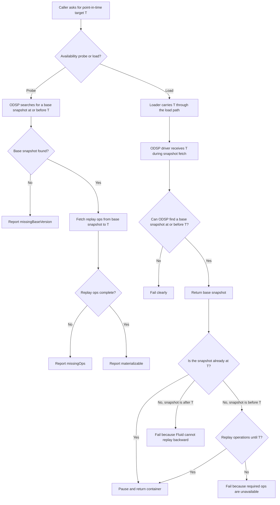
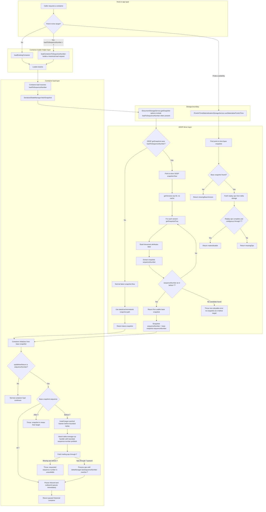

# Historical Loading Notes

This document explains historical loading in Fluid Framework.
It starts with the product idea and then moves into the implementation details.

Historical loading means loading a Fluid document as it existed at an earlier point in time instead of loading the latest version.

## Why this exists

Most Fluid loads open the latest document state.
Some experiences need something different: they need to inspect the document at a specific point in its history.

The motivating scenario for this flow is NITL.
Copilot can make a change to a document, and that change can be auto-approved.
After approval, the experience needs to load or inspect the document at the exact point represented by that approved change, even if more edits happen later.

Examples:

- Show the document state produced by an auto-approved Copilot change.
- Show what the document looked like when a user performed an action.
- Compare current state with an earlier state.
- Investigate or explain a historical change.

For this work, the historical point is identified by a Fluid `sequenceNumber`.
A `sequenceNumber` is the global order number assigned to each operation in the document.

## The short story

Historical loading has four main steps:

1. The caller chooses the historical point it wants, called target `T`.
2. The loader carries `T` down through the load path.
3. The ODSP driver finds a snapshot at or before `T`.
4. Fluid replays operations after that snapshot until the document reaches `T`.

```text
choose target T
	-> find a base snapshot at or before T
	-> replay operations after the snapshot
	-> stop when the document reaches T
```

The result is a paused, read-only historical-view container whose state matches the requested point in history.
This is what this document means by materializing a point in time.

## Key terms

### Sequence number

A `sequenceNumber` is the global position of an operation in the document history.
It is the shared coordinate used by snapshots, operations, and replay.

### Target

The target is the sequence number the caller wants to load to.
This document usually calls it `T`.

### Snapshot

A snapshot is saved document state at some sequence number.
It is a starting point, not necessarily the exact requested historical point.

### Base snapshot

The base snapshot is the snapshot Fluid starts from when reconstructing the requested historical state.
It must be at or before the target.

### Replay

Replay means applying operations after the base snapshot until the container reaches the target sequence number.

### Materialize

To materialize a point in time means to reconstruct an actual paused, read-only historical-view container state for that point.
It is more than finding a snapshot; it may also require replaying operations after the snapshot.

## Conceptual flow



## What each layer is responsible for

### Host or app

The host decides which historical point it wants.
It should provide a target sequence number, not a snapshot id and not a client-local marker.

If the host starts with an app marker, it must first resolve that marker to a global sequence number.

### Container loader

The loader carries the target through the load path.
It does not know whether the service has the needed historical data.
It should not try to validate service-specific history.

### ODSP driver

For this flow, ODSP receives the target and decides how to find a useful base snapshot.
It searches recent ODSP versions and chooses a snapshot at or before the target.

### Runtime and delta processing

After the base snapshot is loaded, Fluid may need to apply operations after that snapshot.
This replay step is what brings the container from the base snapshot to the requested target.

## Detailed layer flow

The conceptual flow above hides some implementation details.
This diagram shows how the same target moves through the loader, container, storage boundary, ODSP, and replay layers.



## Why the target is a sequence number

Fluid operations are ordered by sequence number.
Snapshots record sequence numbers.
Delta storage fetches operations by sequence ranges.
Replay also uses sequence numbers.

That makes sequence number the most natural way to say:

```text
Load the document as it existed at this global point in history.
```

A snapshot id alone is not enough because the target may fall between two snapshots.

## Caller-facing load shape

Callers can request historical loading through the dedicated alpha load API:

```typescript
const loadProps: ILoadContainerToSequenceNumberProps = {
	request,
	loadToSequenceNumber: 123,
};

await loadContainerToSequenceNumber(loadProps);
```

Internally, this is carried through the existing loader sequence-number header:

```typescript
LoaderHeader.sequenceNumber // "fluid-sequence-number"
```

`loadContainerToSequenceNumber` preserves existing request headers, then overwrites the sequence-number header and sets an internal load mode with `opsBeforeReturn: "sequenceNumber"` and `deltaConnection: "none"`.
The `"sequenceNumber"` load mode is intentionally not part of the public/beta `IContainerLoadMode` surface.

## Loader propagation

The loader propagation is intentionally simple:

1. `loadContainerToSequenceNumber` writes the target and internal load mode into request headers, then delegates to `loadExistingContainer`.
2. `loadExistingContainer` remains the normal load helper and does not inspect historical-load props.
3. `Loader.resolve` reads the target and validates that it is paired with the internal sequence-number load mode and `deltaConnection: "none"`.
4. `Container.load` receives the target as part of load props.
5. `SerializedStateManager.fetchSnapshot` passes the target to snapshot fetch.
6. `IDocumentStorageService.getSnapshot` receives the target in alpha snapshot fetch options.

The loader does not decide which historical snapshot to use.
For this flow, that decision belongs to the ODSP driver.
Storage services must support the `getSnapshot` API for historical loads; otherwise Fluid fails clearly instead of falling back to the older snapshot-tree path, which cannot carry `loadToSequenceNumber`.

## Replay and pause

`loadContainerToSequenceNumber` uses the internal `"sequenceNumber"` load mode in `Container.load` to replay to a target and then stop.
`loadContainerPaused` is a separate internal helper that preserves the existing paused-load path: it loads with `deltaConnection: "none"`, installs its own listener, calls `connect()` when it needs trailing ops, and forces readonly mode.

The new sequence-number load mode works like this:

1. Load the container without processing trailing operations yet.
2. Check the base snapshot sequence number. If it is already at the target, pause immediately; if it is newer than the target, fail.
3. Install a listener so the container can detect when the target operation has been processed.
4. Attach the delta manager op handler and fetch trailing operations only up to the requested sequence number.
5. Fail if the bounded fetch cannot queue enough operations to reach the target.
6. Pause once the container reaches the requested sequence number.
7. Force the container readonly only for the sequence-number historical path and return the paused historical container.

Normal default, `"cached"`, and `"all"` loads also use the shared post-load wait block, but they must not be forced readonly.

Historical containers returned by `loadContainerToSequenceNumber` fail closed:

- `connect()` throws a `UsageError` instead of resuming queues and moving the container past the target.
- `getPendingLocalState()` throws a `UsageError` because pending state from a historical point cannot be safely retried against the latest document.
- If the container closes while waiting for the target operation, the target wait rejects and removes its listeners.

Important cases:

- If the base snapshot is already at the target, Fluid pauses immediately.
- If the base snapshot is before the target, Fluid replays forward.
- If the base snapshot is after the target, Fluid fails because it cannot replay backward.
- If the storage service does not support `getSnapshot`, Fluid fails because the older snapshot-tree path cannot carry the historical target.
- If bounded replay exhausts available trailing operations before reaching the target, Fluid fails clearly instead of waiting forever.

## ODSP behavior

ODSP has two snapshot paths:

- Normal load: return the latest snapshot, using the usual latest/cache path.
- Historical load: search for a base snapshot at or before the requested target.

For historical loads, ODSP intentionally skips the latest snapshot cache.
A cached latest snapshot may be newer than the target, and a newer snapshot cannot be replayed backward.

ODSP historical snapshot selection works like this:

1. List recent ODSP versions.
2. Read each candidate snapshot tree.
3. Read the document attributes for that candidate.
4. Find the candidate's sequence number.
5. Return the first candidate whose sequence number is at or before the target.

If no candidate exists, ODSP fails clearly instead of returning latest.
Returning latest would make the caller think the historical target was honored when it was not.

ODSP only chooses the base snapshot during historical `getSnapshot`.
It does not prove that all operations after the snapshot are still available.

ODSP emits `HistoricalSnapshotSelection` telemetry for point-in-time loads.
The event records the target sequence number, number of versions scanned, number of candidate snapshot reads, whether a base snapshot was found, the chosen base snapshot sequence number when available, and the replay distance from base snapshot to target when available.

## Availability checks

Hosts may want to ask whether a historical point appears loadable before doing a full load.
That is what the point-in-time availability API is for.

The availability check answers questions like:

- Did ODSP find a base snapshot?
- Are the operations needed to replay from that snapshot to the target available?
- Is the document or version history inaccessible?
- Is the result unknown for some other reason?

For ODSP today, `materializable` means:

```text
ODSP found a base snapshot at or before the target and verified that the replay ops are available.
```

### Availability statuses

Current statuses include:

- `materializable`: a usable base snapshot was found and the required trailing operations are available.
- `missingBaseVersion`: no usable base snapshot was found.
- `permissionOrAccessDenied`: the document or version history could not be accessed.
- `notAvailable`: the availability probe is not available or could not determine availability.
- `missingOps`: a base snapshot exists but required trailing operations are missing.

## What this implementation guarantees

This implementation guarantees that:

- A caller can express a historical target as a sequence number.
- The loader carries that target down to storage snapshot fetch.
- ODSP uses a historical snapshot search when it sees the target.
- ODSP fails when it cannot find a usable base snapshot.
- Hosts can ask ODSP whether the point-in-time load appears available.
- ODSP reports `missingOps` when a usable base snapshot exists but the required replay operations are unavailable.

## What this implementation does not guarantee

This implementation does not guarantee that:

- This flow works for non-ODSP drivers.
- A snapshot fetch alone produces the final historical state.
- Every requested point-in-time load is available; ODSP may still report missing base versions or missing replay operations.

## Technical reference

This section lists the main files and API names for contributors who need to work on the code.

### Caller-facing target

- `packages/common/container-definitions/src/loader.ts` defines `LoaderHeader.sequenceNumber`.
- `packages/loader/container-loader/src/createAndLoadContainerUtils.ts` defines `ILoadContainerToSequenceNumberProps.loadToSequenceNumber` and `loadContainerToSequenceNumber`.

### Loader and container propagation

- `packages/loader/container-loader/src/loader.ts` reads the target from request headers and requires the internal `opsBeforeReturn: "sequenceNumber"` load mode when `LoaderHeader.sequenceNumber` is present.
- `packages/loader/container-loader/src/container.ts` carries the target on `IContainerLoadProps`, forwards it into snapshot fetch, implements the internal sequence-number replay/pause mode, and exposes the alpha `canMaterializePointInTime(container, target)` free function.
- `packages/loader/container-loader/src/serializedStateManager.ts` passes the target into `getSnapshot` options when loading from storage.
- `packages/loader/container-loader/src/deltaManager.ts` bounds sequence-number replay fetches and rejects if queued operations cannot reach the target.
- `packages/loader/container-loader/src/container.ts` blocks `connect()` and `getPendingLocalState()` on historical containers with `UsageError`.
- `packages/loader/container-loader/src/loadPaused.ts` is the legacy/internal paused-load helper; it does not use the new sequence-number load mode.

### Storage and driver APIs

- `packages/common/driver-definitions/src/storage.ts` defines `ISnapshotFetchOptionsAlpha.loadToSequenceNumber`.
- `packages/common/driver-definitions/src/storage.ts` defines `IPointInTimeMaterializationTarget`, `PointInTimeMaterializationAvailability`, and standalone `IPointInTimeMaterializationStorageService.canMaterializePointInTime`.

### Storage wrappers and ODSP implementation

- `packages/loader/container-loader/src/containerStorageAdapter.ts` forwards `canMaterializePointInTime` to storage.
- `packages/loader/container-loader/src/retriableDocumentStorageService.ts` forwards `canMaterializePointInTime` through retry behavior.
- `packages/loader/container-loader/src/protocolTreeDocumentStorageService.ts` forwards `canMaterializePointInTime` through protocol-tree wrapping.
- `packages/drivers/odsp-driver/src/odspDocumentStorageManager.ts` implements ODSP historical snapshot selection, base-version availability checks, and replay-op availability checks.

## Testing guidance

Tests should cover behavior the current implementation actually provides:

- `loadContainerToSequenceNumber` forwards `loadToSequenceNumber` into `LoaderHeader.sequenceNumber`.
- Existing request headers are preserved while target headers are added or overwritten by the dedicated historical-load props.
- `Loader.resolve` rejects malformed manual sequence-number headers, including missing, non-integer, negative, unpaired, or connectable sequence-number targets.
- `SerializedStateManager.fetchSnapshot` passes `loadToSequenceNumber` into snapshot fetch options when loading from storage.
- `SerializedStateManager.fetchSnapshot` rejects historical loads when the storage service does not support the `getSnapshot` API.
- The legacy/internal `loadContainerPaused` helper keeps its existing connect-driven paused-load behavior.
- `loadContainerToSequenceNumber` pauses at the requested sequence number, forces readonly, blocks `connect()` and `getPendingLocalState()`, and rejects clearly when trailing operations cannot reach the target.
- Default, `"cached"`, and `"all"` normal loads remain writable and are not forced readonly by the shared post-load wait block.
- ODSP `getSnapshot({ loadToSequenceNumber })` selects the closest recent snapshot at or before the target.
- ODSP `getSnapshot({ loadToSequenceNumber })` fails when recent versions contain no usable base snapshot.
- ODSP `canMaterializePointInTime` reports `materializable` when a usable base snapshot exists and required replay ops are available.
- ODSP `canMaterializePointInTime` reports `missingBaseVersion` when recent versions contain no usable base snapshot.
- ODSP `canMaterializePointInTime` reports `missingOps` when a usable base snapshot exists but required replay ops are missing.
- ODSP `canMaterializePointInTime` reports `permissionOrAccessDenied` for access-related ODSP failures.

Tests should avoid claiming that this flow works for non-ODSP drivers.
For ODSP, tests can claim base snapshot selection, but full final materialization requires replay to the requested target.

As ODSP support expands, add tests for:

- Successful historical materialization at a requested sequence number.
- Loading when the base snapshot is older than the target and trailing operations are required.
- Failure when trailing operations are unavailable.
- Cache and no-cache behavior.
- Telemetry or error properties that help diagnose unavailable historical loads.

## Reviewer checklist

Reviewers should verify that:

- The caller-facing load API is the dedicated alpha `loadContainerToSequenceNumber` path, not alpha props added to beta `loadExistingContainer`.
- `ILoadContainerToSequenceNumberProps` contains only the request, host/driver wiring, and `loadToSequenceNumber`; it does not accept `pendingLocalState`.
- `loadExistingContainer` remains the normal latest-load helper and does not inspect historical-load props.
- The historical helper preserves existing request headers, then overwrites `LoaderHeader.sequenceNumber` and the internal load mode required for this flow.
- The internal `opsBeforeReturn: "sequenceNumber"` mode is not exposed through the public/beta `IContainerLoadMode` type.
- `Loader.resolve` rejects malformed sequence-number requests and requires the sequence-number header to be paired with the internal sequence-number load mode.
- The target is not dropped between helper props, headers, container load props, and alpha snapshot fetch options.
- The returned historical container is paused at the requested sequence number and should be treated as a read-only historical view.
- The returned historical container enforces that historical view by staying readonly and rejecting `connect()` and `getPendingLocalState()`.
- Readonly enforcement is scoped to `opsBeforeReturn: "sequenceNumber"`; normal default, `"cached"`, and `"all"` loads remain writable.
- If trailing operations cannot reach the requested sequence number, the load rejects with a clear unavailable-target error rather than hanging.
- Loader/container code does not try to validate ODSP-specific historical availability; base snapshot selection and availability probing stay behind the storage/driver boundary.
- Point-in-time materialization probing uses the standalone alpha `IPointInTimeMaterializationStorageService` capability rather than extending `IDocumentStorageService`.
- ODSP historical `getSnapshot` skips the latest snapshot cache and does not fall back to latest when no usable historical base snapshot exists.
- Availability statuses do not over-claim trailing operation availability, marker retention, or support from non-ODSP drivers.
- Tests only assert behavior that the current implementation actually provides, with focused coverage for exact replay to the target and the unsupported-driver `notAvailable` fallback.
