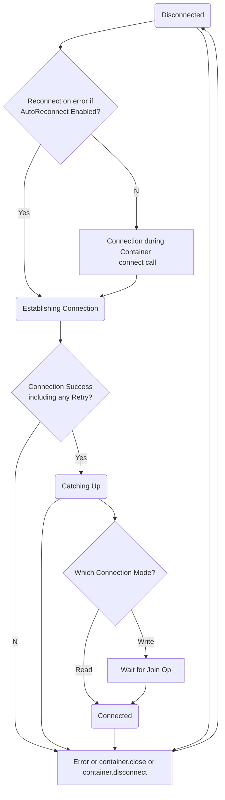

# @fluidframework/container-loader

**Topics covered below:**

- [@fluidframework/container-loader](#fluidframeworkcontainer-loader)
  - [Using Fluid Framework libraries](#using-fluid-framework-libraries)
  - [Installation](#installation)
  - [Importing from this package](#importing-from-this-package)
  - [API Documentation](#api-documentation)
  - [Fluid Loader](#fluid-loader)
  - [Expectations from host implementers](#expectations-from-host-implementers)
  - [Expectations from container runtime and data store implementers](#expectations-from-container-runtime-and-data-store-implementers)
  - [Container Lifetime](#container-lifetime)
    - [Loading](#loading)
    - [Connectivity](#connectivity)
    - [Closure](#closure)
      - [`Container.close()`](#containerclose)
      - [`Container.dispose()`](#containerdispose)
  - [Audience](#audience)
  - [ClientID and client identification](#clientid-and-client-identification)
  - [Error handling](#error-handling)
  - [Connectivity events](#connectivity-events)
  - [Connection State Transitions Flow Chart](#connection-state-transitions-flow-chart)
  - [Readonly states](#readonly-states)
    - [`readonly`](#readonly)
    - [`permissions`](#permissions)
    - [`forced`](#forced)
    - [`storageOnly`](#storageonly)
  - [Dirty events](#dirty-events)
  - [Minimum Client Requirements](#minimum-client-requirements)
    - [Supported Runtimes](#supported-runtimes)
    - [Supported Tools](#supported-tools)
    - [Module Resolution](#module-resolution)
    - [Module Formats](#module-formats)
  - [Contribution Guidelines](#contribution-guidelines)
  - [Help](#help)
  - [Trademark](#trademark)

**Related topics covered elsewhere:**

-   [Quorum and Proposals](../../../server/routerlicious/packages/protocol-base/README.md)

<!-- AUTO-GENERATED-CONTENT:START (LIBRARY_README_HEADER) -->

<!-- prettier-ignore-start -->
<!-- NOTE: This section is automatically generated using @fluid-tools/markdown-magic. Do not update these generated contents directly. -->

## Using Fluid Framework libraries

When taking a dependency on a Fluid Framework library's public APIs, we recommend using a `^` (caret) version range, such as `^1.3.4`.
While Fluid Framework libraries may use different ranges with interdependencies between other Fluid Framework libraries,
library consumers should always prefer `^`.

If using any of Fluid Framework's unstable APIs (for example, its `beta` APIs), we recommend using a more constrained version range, such as `~`.

## Installation

To get started, install the package by running the following command:

```bash
npm i @fluidframework/container-loader
```

## Importing from this package

This package leverages [package.json exports](https://nodejs.org/api/packages.html#exports) to separate its APIs by support level.
For more information on the related support guarantees, see [API Support Levels](https://fluidframework.com/docs/build/releases-and-apitags/#api-support-levels).

To access the `public` ([SemVer](https://semver.org/)) APIs, import via `@fluidframework/container-loader` like normal.

To access the `legacy` APIs, import via `@fluidframework/container-loader/legacy`.

## API Documentation

API documentation for **@fluidframework/container-loader** is available at <https://fluidframework.com/docs/apis/container-loader>.

<!-- prettier-ignore-end -->

<!-- AUTO-GENERATED-CONTENT:END -->

## Fluid Loader

The loader makes up the minimal kernel of the Fluid runtime. This kernel is responsible for providing access to
Fluid storage as well as consensus over a quorum of clients.

Storage includes snapshots as well as the live and persisted operation stream.

The consensus system allows clients within the collaboration window to agree on container's properties. One
example of this is the npm package that should be loaded to process operations applied to the container.

## Expectations from host implementers

It's expected that host will listen to various events described in other sections of this document and conveys correctly (in some form) information to the user to ensure that user is aware of various situations and is not going to lose data.
Please see specific sections for more details on these states and events - this section only serves as a summary and does not go into details.

1. ["disconnected" and "connected"](#Connectivity-events) event: Host can either notify user about no connectivity (and potential data loss if container is closed) or disallow edits via `Container.forceReadonly(true)`
2. ["closed"](#Closure) event: If raised with error, host is responsible for conveying error in some form to the user. Container is left in disconnected & readonly state when it is closed (because of error or not).
3. ["readonly"](#Readonly-states) event: Host should have some indication to user that container is not editable. User permissions can change over lifetime of Container, but they can't change per connection session (in other words, change in permissions causes disconnect and reconnect). Hosts are advised to recheck this property on every reconnect.
4. [Dirty events](#Dirty-events): Host should have some reasonable UX / workflows to ensure user does not lose edits unexpectedly. I.e. there is enough signals (potentially including blocking user from closing container) ensuring that all user edits make it to storage, unless user explicitly choses to lose such edits.
5. [Closing or disposing containers](#containerclose): For most cases, you should use the `IContainer.dispose(...)` API to free up resources. If you intend on using the container after closure, or need to pass some critical error to the container, use the `IContainer.close(...)` API.

## Expectations from container runtime and data store implementers

1. Respect ["readonly" state](#Readonly-states). In this state container runtime (and data stores) should not allow changes to local state, as these changes will be lost on container being closed.
2. Maintain Ops in flight until observed they are acknowledged by server. Resubmit any lost Ops on reconnection. This is done by DDSes in stock implementations of container & data store runtimes provided by Fluid Framework
3. Respect "["disconnected" and "connected"](#Connectivity-events) states and do not not submit Ops when disconnected.
4. Respect ["dispose"](#Closure) event and treat it as combination of "readonly" and "disconnected" states. I.e. it should be fully operatable (render content), but not allow edits. This is equivalent to "closed" event on container for hosts, but is broader (includes container's code version upgrades).
5. Notify Container about presence or lack of unsaved changed through IContainerContext.updateDirtyContainerState callback. This is required for [Dirty events](#Dirty-events) to correctly represent state of user edits to host.

## Container Lifetime

### Loading

Container is returned as result of Loader.resolve() call. Loader can cache containers, so if same URI is requested from same loader instance, earlier created container might be returned. This is important, as some of the headers (like `pause`) might be ignored because of Container reuse.

`ILoaderHeader` in [loader.ts](../../common/container-definitions/src/loader.ts) describes properties controlling container loading.

### Connectivity

Usually container is returned when state of container (and data stores) is rehydrated from snapshot. Unless `IRequest.headers.pause` is specified, connection to ordering service will be established at some point (asynchronously) and latest Ops would be processed, allowing local changes to flow form client to server. `Container.connectionState` indicates whether connection to ordering service is established, and [Connectivity events](#Connectivity-events) are notifying about connectivity changes. While it's highly recommended for listeners to check initial state at the moment they register for connectivity events, new listeners are called on registration to propagate current state. That is, if a container is disconnected when both "connected" and "disconnected" listeners are installed, newly installed listeners for "disconnected" event will be called on registration.

### Closure

Container can be closed directly by host by calling `Container.close()` and/or `Container.dispose()`. If the container is expected to be used upon closure, or you need to pass your own critical error to the container, use the `close()` API. Otherwise, use the `dispose()` API. The differences between these methods are detailed in the sections below.

#### `Container.close()`

Once closed, container terminates connection to ordering service, and any local changes (former or future) do not propagate to storage. This method is to be used when the container **IS** still expected to be used and the container needs to be switched to a "safe" state for viewing. For example, allowing a user to copy the content out of a container.

The "closed" state effectively means the container is disconnected forever and cannot be reconnected.

If after some time a closed container is no longer needed, calling `Container.dispose()` will dispose the runtime resources.

Container can also be closed and/or disposed by runtime itself as result of some critical error. Critical errors can be internal (like violation in op ordering invariants), or external (file was deleted). Please see [Error Handling](#Error-handling) for more details.

When container is closed, the following is true (in no particular order):

1. Container.closed property is set to true
2. "closed" event fires on container with optional error object (indicating reason for closure; if missing - closure was due to host closing container)
3. "readonly" event fires on DeltaManager & Container (and Container.readonly property is set to true) indicating to all data stores that container is read-only, and data stores should not allow local edits, as they are not going to make it.
4. "disconnected" event fires, if connection was active at the moment of container closure.

`"closed"` event is available on Container for hosts.

#### `Container.dispose()`

Once disposed, container terminates connection to ordering service, and any local changes (former or future) do not propagate to storage. This method is to be used when the container is **NOT** expected to be used anymore.

When container is disposed, the following is true (in no particular order):

1. Container.closed property is set to true
2. "disposed" event fires on container
3. "disconnected" event fires, if connection was active at the moment of container disposal.
4. "dispose" event fires on container runtime

`"disposed"` event is available on Container for hosts. `"dispose"` event is delivered to container runtime when container is disposed, but container runtime can be also disposed when new code proposal is made and new version of the code (and container runtime) is loaded in accordance with it.

## Audience

`Container.audience` exposes an object that tracks all connected clients to same container.

-   `getMembers()` can be used to retrieve current set of users
-   `getMember()` can be used to get IClient information about particular client (returns undefined if such client is not connected)
-   `"addMember"` event is raised when new member joins
-   `"removeMember"` event is raised when an earlier connected member leaves (disconnects from container)

`getMembers()` and `"addMember"` event provide _IClient_ interface that describes type of connection, permissions and user information:

-   clientId is the key - it is unique ID for a session. Please see [ClientID and client identification](#ClientId-and-client-identification) for more details on it, as well as how to properly differentiate human vs. agent clients and difference between client ID & user ID.
-   IClient.mode in particular describes connectivity mode of a client:
    -   "write" means client has read/write connection, can change container contents, and participates in Quorum
    -   "read" indicates client as read connection. Such clients can't modify container and do not participate in quorum. That said, "read" does not indicate client permissions, i.e. client might have read-only permissions to a file, or maybe connected temporarily as read-only, to reduce COGS on server and not "modify" container (any read-write connection generates join & leave messages that modify container and change "last edited by" property)

Please note that if this client losses connection to ordering server, then audience information is not reset at that moment. It will become stale while client is disconnected, and will refresh the moment client connects back to container. For more details, please see [Connectivity events](#Connectivity-events) section

## ClientID and client identification

`Container.clientId` exposes ID of a client. Ordering service assigns unique random IDs to all connected clients. Please note that if same user opened same container on 3 different machines, then there would be 3 clientIDs tracking 3 sessions for the same user.

A single user connecting to a container may result in multiple sessions for the container (and thus multiple clientID). This is due to various agents (including summarizing agents) working along humans. You can leverage `IClient.details.capabilities.interactive` to differentiate humans vs. agents. This property should be used to filter out bots when exposing user presence (like in coauth gallery)

IClient.user represents user ID (in storage) and can be used to identify sessions from same user (from same or different machines).

## Error handling

There are two ways errors are exposed:

1. At open time, by returning rejected promise from Loader.resolve() or Loader.request()
2. As a `"closed"` event on container, when container is closed due to critical error.
3. As a `"warning"` event on container.

Critical errors can show up in #1 & #2 workflows. For example, data store URI may point to a deleted file, which will result in errors on container open. But file can also be deleted while container is opened, resulting in same error type being raised through "error" handler.

Errors are of [ICriticalContainerError](../../common/container-definitions/src/error.ts) type, and warnings are of [ContainerWarning](../../common/container-definitions/src/error.ts) type. Both have `errorType` property, describing type of an error (and appropriate interface of error object):

```ts
     readonly errorType: string;
```

There are 4 sources of errors:

1. [ContainerErrorTypes](../../common/container-definitions/src/error.ts) - errors & warnings raised at loader level
2. [DriverErrorTypes](../../common/driver-definitions/src/driverError.ts) - errors that are likely to be raised from the driver level
3. [OdspErrorTypes](../../drivers/odsp-driver/src/odspError.ts) and [RouterliciousErrorTypes](../../drivers/routerlicious-driver/src/documentDeltaConnection.ts) - errors raised by ODSP and R11S drivers.
4. Runtime errors, like `"summarizingError"`, `"dataCorruptionError"`. This class of errors is not pre-determined and depends on type of container loaded.

`ICriticalContainerError.errorType` is a string, which represents a union of 4 error types described above. Hosting application may package different drivers and open different types of containers, and only hosting application may have enough information to enumerate all possible error codes in such scenarios.

Hosts must listen to `"closed"` event. If error object is present there, container was closed due to error and this information needs to be communicated to user in some way. If there is no error object, it was closed due to host application calling Container.close() (without specifying error).
When container is closed, it is no longer connected to ordering service. It is also in read-only state, communicating to data stores not to allow user to make changes to container.

## Connectivity events

Container raises two events to notify hosting application about connectivity issues and connectivity status.

-   `"connected"` event is raised when container is connected and is up-to-date, i.e. changes are flowing between client and server.
-   `"disconnected"` event is raised when container lost connectivity (for any reason).

Container also exposes `Container.connectionState` property to indicate current state.

In normal circumstances, container will attempt to reconnect back to ordering service as quickly as possible. But it will scale down retries if computer is offline. That said, if IThrottlingWarning is raised through `"warning"` handler, then container is following storage throttling policy and will attempt to reconnect after some amount of time (`IThrottlingWarning.retryAfterSeconds`).

Container will also not attempt to reconnect on lost connection if `Container.disconnect()` was called prior to loss of connection. This can be useful if the hosting application implements "user away" type of experience to reduce cost on both client and server of maintaining connection while user is away. Calling `Container.connect()` will reenable automatic reconnections, but the host might need to allow extra time for reconnection as it likely involves token fetch and processing of a lot of Ops generated by other clients while it was not connected.

Data stores should almost never listen to these events (see more on [Readonly states](#Readonly-states)), and should use consensus DDSes if they need to synchronize activity across clients. DDSes listen for these events to know when to resubmit pending Ops.

Hosting application can use these events in order to indicate to user when user changes are not propagating through the system, and thus can be lost (on browser tab being closed). It's advised to use some delay (like 5 seconds) before showing such UI, as network connectivity might be intermittent. Also if container was offline for very long period of time due to `Container.disconnect()` being called, it might take a while to get connected and current.

Please note that hosts can implement various strategies on how to handle disconnections. Some may decide to show some UX letting user know about potential loss of data if container is closed while disconnected. Others can force container to disallow user edits while offline (see [Readonly states](#Readonly-states)).

It's worth pointing out that being connected does not mean all user edits are preserved on container closure. There is latency in the system, and loader layer does not provide any guarantees here. Not every implementation needs a solution here (games likely do not care), and thus solving this problem is pushed to framework level (i.e. having a data store that can expose `'dirtyDocument'` signal from ContainerRuntime and request route that can return such data store).

## Connection State Transitions Flow Chart



## Readonly states

User permissions can change over lifetime of Container. They can't change during single connection session (in other words, change in permissions causes disconnect and reconnect). Hosts are advised to recheck this property on every reconnect.

DeltaManager will emit a `"readonly"` event when transitioning to a read-only state. Readonly events are accessible by data stores and DDSes (through ContainerRuntime.deltaManager). It's expected that data stores adhere to requirements and expose read-only (or rather 'no edit') experiences.

`Container.readOnlyInfo` (and `DeltaManager.readOnlyInfo`) indicates to the host if the file is writable or not.
It contains the following properties:

### `readonly`

One of the following:

-   `true`: Container is read-only. One or more of the additional properties listed below will be `true`.
-   `undefined`: Runtime does not know yet if file is writable or not. Currently we get a signal here only when websocket connection is made to the server.
-   `false`: Container.forceReadonly() was never called or last call was with false, plus it's known that user has write permissions to a file.

### `permissions`

There are two cases when it's `true`:

1. User has no write permissions to modify this container (which usually maps to file in storage, and lack of write permissions by a given user)
2. Container was closed, either due to critical error, or due to host closing container. See [Container Lifetime](#Container-lifetime) and [Error Handling](#Error-handling) for more details.

### `forced`

`true` if the Container is in read-only mode due to the host calling `Container.forceReadonly(true)`.
This can be useful in scenarios like:

-   Loss of connectivity, in scenarios where host chooses method of preventing user edits over (or in addition to) showing disconnected UX and warning user of potential data loss on closure of container.
-   Special view-only mode in host. For example can be used by hosts for previewing container content in-place with other host content, and leveraging full-screen / separate window experience for editing.

### `storageOnly`

Storage-only mode is a read-only mode in which the container does not connect to the delta stream and is unable to submit or receive ops. This is useful for viewing a specific version of a document.

## Dirty events

The Container runtime can communicate with the container to get the container's current state. In response, the container will raise two events - `"dirty"` and `"saved"` events. Transitions between these two events signify presence (or lack of) user changes that were not saved to storage. In other words, if container is dirty, closing it at that moment will result in data loss from user perspective, because not all user changes made it to storage.
This information can be used by a host to build appropriate UX that allows user to be confident in the platform. For example, a host may chose to show a dialog asking the user if they want to save their changes before closing. Instead of, or in addition to this, the host may choose to show "Saving..." and "Saved" text somewhere in UX. Coupled with lack of connectivity to ordering service (and appropriate notification to the user) that may create enough continuous notification to user not to require a blocking dialog on closing.
Note that when an active connection is in place, it's just a matter of time before changes will be flushed to storage unless there is some source of continuous local changes being generated that prevents container from ever being fully saved. But if there is no active connection, because the user is offline, for example, then a document may stay in a dirty state for very long time.

`Container.isDirty` can be used to get current state of container.

<!-- AUTO-GENERATED-CONTENT:START (README_FOOTER) -->

<!-- prettier-ignore-start -->
<!-- NOTE: This section is automatically generated using @fluid-tools/markdown-magic. Do not update these generated contents directly. -->

## Minimum Client Requirements

These are the platform requirements for the current version of Fluid Framework Client Packages.
These requirements err on the side of being too strict since within a major version they can be relaxed over time, but not made stricter.
For Long Term Support (LTS) versions this can require supporting these platforms for several years.

It is likely that other configurations will work, but they are not supported: if they stop working, we do not consider that a bug.
If you would benefit from support for something not listed here, file an issue and the product team will evaluate your request.
When making such a request please include if the configuration already works (and thus the request is just that it becomes officially supported), or if changes are required to get it working.

### Supported Runtimes

-   NodeJs ^20.10.0 except that we will drop support for it [when NodeJs 20 loses its upstream support on 2026-04-30](https://github.com/nodejs/release#release-schedule), and will support a newer LTS version of NodeJS (22) at least 1 year before 20 is end-of-life. This same policy applies to NodeJS 22 when it is end of life (2027-04-30).
-   Running Fluid in a Node.js environment with the `--no-experimental-fetch` flag is no longer supported.
-   Modern browsers supporting the es2022 standard library: in response to asks we can add explicit support for using babel to polyfill to target specific standards or runtimes (meaning we can avoid/remove use of things that don't polyfill robustly, but otherwise target modern standards).

### Supported Tools

-   TypeScript 5.4:
    -   All [`strict`](https://www.typescriptlang.org/tsconfig) options are supported.
    -   [`strictNullChecks`](https://www.typescriptlang.org/tsconfig) is required.
    -   [Configuration options deprecated in 5.0](https://github.com/microsoft/TypeScript/issues/51909) are not supported.
    -   `exactOptionalPropertyTypes` is currently not fully supported.
        If used, narrowing members of Fluid Framework types types using `in`, `Reflect.has`, `Object.hasOwn` or `Object.prototype.hasOwnProperty` should be avoided as they may incorrectly exclude `undefined` from the possible values in some cases.
-   [webpack](https://webpack.js.org/) 5
    -   We are not intending to be prescriptive about what bundler to use.
        Other bundlers which can handle ES Modules should work, but webpack is the only one we actively test.

### Module Resolution

[`Node16`, `NodeNext`, or `Bundler`](https://www.typescriptlang.org/tsconfig#moduleResolution) resolution should be used with TypeScript compilerOptions to follow the [Node.js v12+ ESM Resolution and Loading algorithm](https://nodejs.github.io/nodejs.dev/en/api/v20/esm/#resolution-and-loading-algorithm).
Node10 resolution is not supported as it does not support Fluid Framework's API structuring pattern that is used to distinguish stable APIs from those that are in development.

### Module Formats

-   ES Modules:
    ES Modules are the preferred way to consume our client packages (including in NodeJs) and consuming our client packages from ES Modules is fully supported.
-   CommonJs:
    Consuming our client packages as CommonJs is supported only in NodeJS and only for the cases listed below.
    This is done to accommodate some workflows without good ES Module support.
    If you have a workflow you would like included in this list, file an issue.
    Once this list of workflows motivating CommonJS support is empty, we may drop support for CommonJS one year after notice of the change is posted here.

    -   Testing with Jest (which lacks [stable ESM support](https://jestjs.io/docs/ecmascript-modules) due to [unstable APIs in NodeJs](https://github.com/nodejs/node/issues/37648))

## Contribution Guidelines

There are many ways to [contribute](https://github.com/microsoft/FluidFramework/blob/main/CONTRIBUTING.md) to Fluid.

-   Participate in Q&A in our [GitHub Discussions](https://github.com/microsoft/FluidFramework/discussions).
-   [Submit bugs](https://github.com/microsoft/FluidFramework/issues) and help us verify fixes as they are checked in.
-   Review the [source code changes](https://github.com/microsoft/FluidFramework/pulls).
-   [Contribute bug fixes](https://github.com/microsoft/FluidFramework/blob/main/CONTRIBUTING.md).

Detailed instructions for working in the repo can be found in the [Wiki](https://github.com/microsoft/FluidFramework/wiki).

This project has adopted the [Microsoft Open Source Code of Conduct](https://opensource.microsoft.com/codeofconduct/).
For more information see the [Code of Conduct FAQ](https://opensource.microsoft.com/codeofconduct/faq/) or contact [opencode@microsoft.com](mailto:opencode@microsoft.com) with any additional questions or comments.

This project may contain Microsoft trademarks or logos for Microsoft projects, products, or services.
Use of these trademarks or logos must follow Microsoft’s [Trademark & Brand Guidelines](https://www.microsoft.com/trademarks).
Use of Microsoft trademarks or logos in modified versions of this project must not cause confusion or imply Microsoft sponsorship.

## Help

Not finding what you're looking for in this README? Check out [fluidframework.com](https://fluidframework.com/docs/).

Still not finding what you're looking for? Please [file an issue](https://github.com/microsoft/FluidFramework/wiki/Submitting-Bugs-and-Feature-Requests).

Thank you!

## Trademark

This project may contain Microsoft trademarks or logos for Microsoft projects, products, or services.

Use of these trademarks or logos must follow Microsoft's [Trademark & Brand Guidelines](https://www.microsoft.com/en-us/legal/intellectualproperty/trademarks/usage/general).

Use of Microsoft trademarks or logos in modified versions of this project must not cause confusion or imply Microsoft sponsorship.

<!-- prettier-ignore-end -->

<!-- AUTO-GENERATED-CONTENT:END -->
