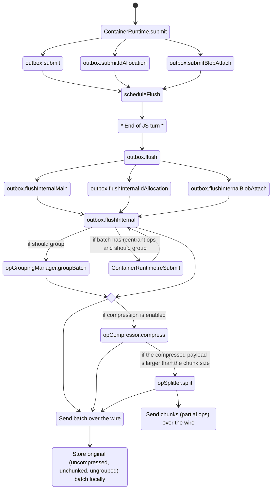

# Configs and feature gates for solving the 1MB limit.

## Table of contents

- [Configs and feature gates for solving the 1MB limit.](#configs-and-feature-gates-for-solving-the-1mb-limit)
  - [Table of contents](#table-of-contents)
  - [Introduction](#introduction)
    - [How batching works](#how-batching-works)
  - [Compression](#compression)
    - [Single message batch update](#single-message-batch-update)
  - [Grouped batching](#grouped-batching)
    - [Changes in op semantics](#changes-in-op-semantics)
  - [Chunking for compression](#chunking-for-compression)
  - [Configuration](#configuration)
  - [Note about performance and latency](#note-about-performance-and-latency)
  - [How it works](#how-it-works)
  - [How it works (Grouped Batching disabled) -Outdated-](#how-it-works-grouped-batching-disabled--outdated-)
    - [Outdated - Main code no longer creates empty ops](#outdated---main-code-no-longer-creates-empty-ops)
  - [How the overall op flow works](#how-the-overall-op-flow-works)
    - [Outbound](#outbound)
    - [Inbound](#inbound)

## Introduction

There is a current limitation regarding the size of the payload a Fluid client can send and receive. [The limit is 1MB per payload](https://github.com/microsoft/FluidFramework/issues/9023) and it is currently enforced explicitly with the `BatchTooLarge` error which closes the container.

There are three features which can be used to work around this size limit: "grouped batching", "batch compression", and "compressed batch chunking". This document describes how to enable/disable them, along with a brief description of how they work. The features are enabled by default.

By default, the runtime is configured with a max batch size of `716800` bytes, which is lower than the 1MB limit. The reason for the lower value is to account for possible overhead from the op envelope and metadata.

### How batching works

Batching in the context of Fluid ops is a way in which the framework accumulates and applies ops. A batch is a group of ops accumulated within a single JS turn, which will be broadcasted in the same order to all the other connected clients and applied synchronously. Additional logic and validation ensure that batches are never interleaved, nested or interrupted and they are processed in isolation without interleaving of ops from other clients.

The way batches are formed is governed by the `FlushMode` setting of the `IContainerRuntimeOptions` and it is immutable for the entire lifetime of the runtime and subsequently the container.

```
export enum FlushMode {
    /**
     * In Immediate flush mode the runtime will immediately send all operations to the driver layer.
     */
    Immediate,

    /**
     * When in TurnBased flush mode the runtime will buffer operations in the current turn and send them as a single
     * batch at the end of the turn. The flush call on the runtime can be used to force send the current batch.
     */
    TurnBased,
}
```

What this means is that `FlushMode.Immediate` will send each op in its own payload to the server, while `FlushMode.TurnBased` will accumulate all ops in a single JS turn and send them together in the same payload. Technically, `FlushMode.Immediate` can be simulated with `FlushMode.TurnBased` by interrupting the JS turn after producing only one op (for example by pausing the execution to wait on a promise). Therefore, for all intents and purposes, `FlushMode.Immediate` enables all batches to have only one op.

**By default, Fluid uses `FlushMode.TurnBased`** as:

-   it is more efficient from an I/O perspective (batching ops overall decrease the number of payloads sent to the server)
-   reduces concurrency related bugs, as it ensures that all ops generated within the same JS turn are also applied by all other clients within a single JS turn. Clients using the same pattern can safely assume ops will be applied exactly as they are observed locally. The alternative would be for ops to be both produced and applied with interruptions (which may involve processing input or rendering), invalidating the state based off which the changes were produced.

As `FlushMode.TurnBased` accumulates ops, it is the most vulnerable to run into the 1MB socket limit.

## Compression

**Compression targets payloads which exceed the max batch size and it is enabled by default.**. The `IContainerRuntimeOptions.compressionOptions` property, of type `ICompressionRuntimeOptions` is the configuration governing how compression works.

`ICompressionRuntimeOptions` has two properties:

-   `minimumBatchSizeInBytes` – the minimum size of the batch for which compression should kick in. If the payload is too small, compression may not yield too many benefits. To target the original 1MB issue, a good value here would be to match the default maxBatchSizeInBytes (972800), however, experimentally, a good lower value could be at around 614400 bytes. Setting this value to `Number.POSITIVE_INFINITY` will disable compression.
-   `compressionAlgorithm` – currently, only `lz4` is supported.

Compression is relevant for both `FlushMode.TurnBased` and `FlushMode.Immediate` as it only targets the contents of the ops and not the number of ops in a batch. Compression is opaque to the server and implementations of the Fluid protocol do not need to alter their behavior to support this client feature.

Compressing a batch yields a batch with the same number of messages. It compresses all the content, shifting the compressed payload into the first op,
leaving the rest of the batch's messages as empty placeholders to reserve sequence numbers for the compressed messages.

### Single message batch update

Compression has been updated to only receive and compress batches containing a single message. While it remains possible to read compressed batches with empty operations, the system will no longer write them. Therefore, if grouping is disabled, compression must also be disabled.

## Grouped batching

With Grouped Batching enabled (it's on by default), all batch messages are combined under a single "grouped" message _before compression_. Upon receiving this new "grouped" message, the batch messages will be extracted, and they each will be given the same sequence number - that of the parent "grouped" message.

The purpose for enabling grouped batching before compression is to eliminate the empty placeholder messages in the chunks. These empty messages are not free to transmit, can trigger service throttling, and in extreme cases can _still_ result in a batch too large (from empty op envelopes alone).

Grouped batching is only relevant for `FlushMode.TurnBased`, since `OpGroupingManagerConfig.opCountThreshold` defaults to 2. Grouped batching is opaque to the server and implementations of the Fluid protocol do not need to alter their behavior to support this client feature.

Grouped Batching can be disabled by setting `IContainerRuntimeOptions.enableGroupedBatching` to `false`.

See [below](#how-grouped-batching-works) for an example.

### Changes in op semantics

Grouped Batching changed a couple of expectations around message structure and runtime layer expectations. Specifically:

-   Batch messages observed at the runtime layer no longer match messages seen at the loader layer (i.e. grouped form at loader layer, ungrouped form at runtime layer)
-   Once the ContainerRuntime ungroups the batch, the client sequence numbers on the resulting messages can only be used to order messages with that batch (having the same sequenceNumber)
-   Messages within the same batch now all share the same sequence number
-   All ops in a batch must also have the same reference sequence number to ensure eventualy consistency of the model. The runtime will "rebase" ops in a batch with different ref sequence number to satisfy that requirement.
    -   What causes ops in a single JS turn (and thus in a batch) to have different reference sequence number? "Op reentrancy", where changes are made to a DDS inside a DDS 'onChanged' event handler.

## Chunking for compression

**Op chunking for compression targets payloads which exceed the max batch size after compression.** So, only payloads which are already compressed. By default, the feature is enabled.

The `IContainerRuntimeOptions.chunkSizeInBytes` property is the only configuration for chunking and it represents the size of the chunked ops, when chunking is necessary. When chunking is performed, the large op is split into smaller ops (chunks). This config represents both the size of the chunks and the threshold for the feature to activate. The value enables a trade-off between large chunks / few ops and small chunks / many ops. A good value for this would be at around 204800. Setting this value to `Number.POSITIVE_INFINITY` will disable chunking.

This config would govern chunking compressed batches only. We will not be enabling chunking across all types of ops/batches but **only when compression is enabled and when the batch is compressed**, and its payload size is more than `IContainerRuntimeOptions.chunkSizeInBytes`.

Chunking is relevant for both `FlushMode.TurnBased` and `FlushMode.Immediate` as it only targets the contents of the ops and not the number of ops in a batch. Chunking is opaque to the server and implementations of the Fluid protocol do not need to alter their behavior to support this client feature.

## Configuration

These features are configured via `IContainerRuntimeOptions`, passed to the `ContainerRuntime.loadRuntime` function.
Default values are specified in code in [containerRuntime.ts](../containerRuntime.ts).

## Note about performance and latency

In terms of performance and impact on latency, the results greatly depend on payload size, payload structure, network speed and CPU speed. Therefore, customers must perform the required measurements and adjust the settings according to their scenarios.

In general, compression offers a trade-off between higher compute costs, lower bandwidth consumption and lower storage requirements, while chunking slightly increases latency due to the overhead of splitting an op, sending the chunks and reconstructing them on each client. Grouped batching heavily decreases the number of ops observed by the server and slightly decreases the bandwidth requirements as it merges all the ops in a batch into a single op and also eliminates the op envelope overhead.

## How it works

Virtualization works as an intermediate step in the Runtime layer, as the closest step to sending/receiving ops via the Loader layer.

Given the following baseline batch:

```
+---------------+---------------+---------------+---------------+---------------+
| Op 1          | Op 2          | Op 3          | Op 4          | Op 5          |
| Contents: "a" | Contents: "b" | Contents: "c" | Contents: "d" | Contents: "e" |
+---------------+---------------+---------------+---------------+---------------+
```

Grouped batch:

```
+---------------------------------------------------------------------------------------------------------------------+
| Op 1                   Contents: +----------------+---------------+---------------+---------------+---------------+ |
| Type: "groupedBatch"             | Op 1           | Op 2          | Op 3          | Op 4          | Op 5          | |
|                                  | Contents: "a"  | Contents: "b" | Contents: "c" | Contents: "d" | Contents: "e" | |
|                                  +----------------+---------------+---------------+---------------+---------------+ |
+---------------------------------------------------------------------------------------------------------------------+
```

Compressed batch:

```
+-------------------------------------------------------------------------------------------------------------------------+
| Op 1                   Logical   +------------------------------------------------------------------------------------+ |
| Compression: 'lz4'     Contents: | Type: "groupedBatch"                                                               | |
| Compressed buffer: "wxyz"        | +----------------+---------------+---------------+---------------+---------------+ | |
|                                  | | Op 1           | Op 2          | Op 3          | Op 4          | Op 5          | | |
|                                  | | Contents: "a"  | Contents: "b" | Contents: "c" | Contents: "d" | Contents: "e" | | |
|                                  | +----------------+---------------+---------------+---------------+---------------+ | |
|                                  +------------------------------------------------------------------------------------+ |
+-------------------------------------------------------------------------------------------------------------------------+
```

Can produce the following chunks:

```
+------------------------------------------------+
| Chunk 1/2    Contents: +---------------------+ |
|                        | +-----------------+ | |
|                        | | Contents: "wx" | | |
|                        | +-----------------+ | |
|                        +---------------------+ |
+------------------------------------------------+
```

```
+-----------------------------------------------+
| Chunk 2/2    Contents: +--------------------+ |
|                        | +----------------+ | |
|                        | | Contents: "yz" | | |
|                        | +----------------+ | |
|                        +--------------------+ |
+-----------------------------------------------+
```

The chunks are sent to service to be sequenced, and broadcast to all clients.

-   On the receiving end, the client will accumulate chunks 1 through n-1 and keep them in memory (in this example, it's just Chunk 1).
-   When the final chunk is received, the original large, decompressed op will be rebuilt, and the runtime will then process the batch as if it is a compressed batch.

Decompressed batch:

```
+---------------------------------------------------------------------------------------------------------------------+
| Op 1                   Contents: +----------------+---------------+---------------+---------------+---------------+ |
| SeqNum: 2                        | Op 1           | Op 2            | Op 3        | Op 4          | Op 5          | |
| Type: "groupedBatch"             | Contents: "a"  | Contents: "b" | Contents: "c" | Contents: "d" | Contents: "e" | |
|                                  +----------------+---------------+---------------+---------------+---------------+ |
+---------------------------------------------------------------------------------------------------------------------+
```

Ungrouped batch:

```
+-----------------+-----------------+-----------------+-----------------+-----------------+
| Op 1            | Op 2            | Op 3            | Op 4            | Op 5            |
| Contents: "a"   | Contents: "b"   | Contents: "c"   | Contents: "d"   | Contents: "e"   |
| SeqNum: 2       | SeqNum: 2       | SeqNum: 2       | SeqNum: 2       | SeqNum: 2       |
| ClientSeqNum: 1 | ClientSeqNum: 2 | ClientSeqNum: 3 | ClientSeqNum: 4 | ClientSeqNum: 5 |
+-----------------+-----------------+-----------------+-----------------+-----------------+
```

## How it works (Grouped Batching disabled) -Outdated-

### Outdated - Main code no longer creates empty ops

If we have a batch with a size larger than the configured minimum required for compression (in the example let’s say it’s 850 bytes), as following:

```
+-----------+-----------+-----------+-----------+
| Op 1      | Op 2      | Op 3      | Op 4      |
| SeqNum: 1 | SeqNum: 2 | SeqNum: 3 | SeqNum: 4 |
| Size: 100 | Size: 150 | Size: 200 | Size: 400 |
+-----------+-----------+-----------+-----------+
```

The total size of the batch is 850 bytes. The client which needs to send the batch would compress the batch to a smaller size (200 bytes) and will send a new batch like the following:

```
+--------------------+-----------+-----------+-----------+
| Op 1               | Op 2      | Op 3      | Op 4      |
| SeqNum: 1          | SeqNum: 2 | SeqNum: 3 | SeqNum: 4 |
| Size: 200          | Size: 0   | Size: 0   | Size: 0   |
| Compression: 'lz4' |           |           |           |
+--------------------+-----------+-----------+-----------+
```

The first op in the batch is the only one with content (which is opaque due to it being compressed), the rest of the ops serve only to reserve the sequence numbers so that the state machine which rebuilds the original batch on the receiving client can reconstruct the original batch.

When the batch is received by a client, it will detect the first op as being compressed, it will decompress it and store it in memory. For each empty op subsequently received, it will fetch the uncompressed content from memory and rebuild the original ops. The original ops are then processed by the runtime and applied accordingly.
So, compression virtualizes the batch.

After compression, the first op in the batch can exceed 1MB, therefore it would still be rejected. In this case, another layer of virtualization is added after compression (and before decompression, symmetrically on the receiving end).

The first op in the compressed batch can be chunked into smaller ops which can be sent outside the original batch. However, to conveniently maintain the batch semantics, the last chunk (the chunk which triggers rebuilding the original op) is the first op in the new batch.

To illustrate, let’s take the large batch below:

```
+--------------------+-----------+-----------+-----------+
| Op 1               | Op 2      | Op 3      | Op 4      |
| SeqNum: 1          | SeqNum: 2 | SeqNum: 3 | SeqNum: 4 |
| Size: 900          | Size: 0   | Size: 0   | Size: 0   |
| Compression: 'lz4' |           |           |           |
+--------------------+-----------+-----------+-----------+
```

This will produce the following batches:

```
+-----------+
| Chunk 1/3 |
| SeqNum: 1 |
| Size: 300 |
+-----------+

```

```
+-----------+
| Chunk 2/3 |
| SeqNum: 2 |
| Size: 300 |
+-----------+

```

```
+-----------+-----------+-----------+-----------+
| Chunk 3/3 | Op 2      | Op 3      | Op 4      |
| SeqNum: 3 | SeqNum: 4 | SeqNum: 5 | SeqNum: 6 |
| Size: 300 | Size: 0   | Size: 0   | Size: 0   |
+-----------+-----------+-----------+-----------+
```

The first 2 chunks are sent in their own batches, while the last chunk is the first op in the last batch which contains the ops reserving the required sequence numbers.

## How the overall op flow works

### Outbound

The outbound view is how ops are accumulated and sent by the runtime with `FlushMode.TurnBased` (default).



With `FlushMode.Immediate`(deprecated) the difference is that ops are no longer accumulated in batches, but flushed as they are submitted, instead of waiting for the end of the JS turn. All the other components work in the exact same manner with the difference that they operate on batches with length 1.

### Inbound

There is no concept of batch in the inbound view when we receive the ops. Ops are being received and processed one-by-one and the batch is reconstructed in the runtime layer. This requires individual components to maintain their own internal state in order to keep track of the batch.


Note that a "system op" originating outside the ContainerRuntime will pass through this flow entirely.
