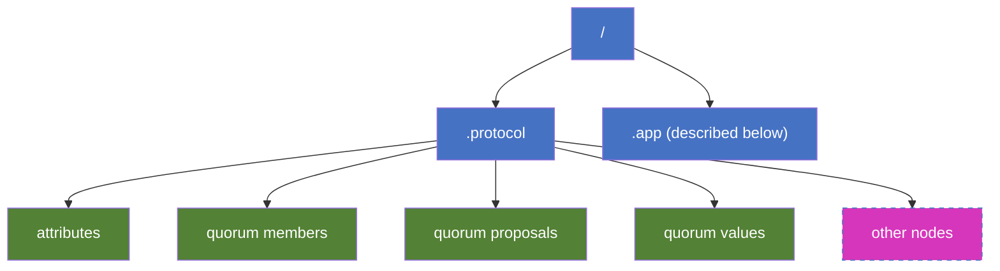
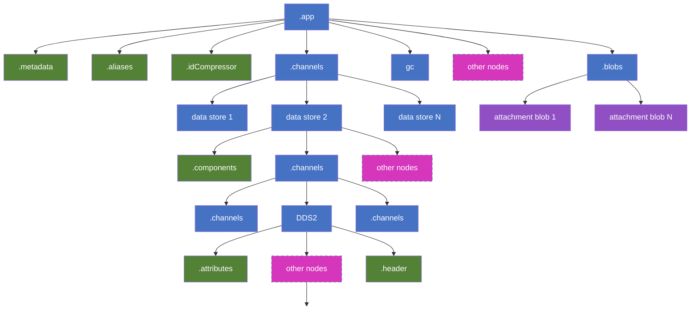
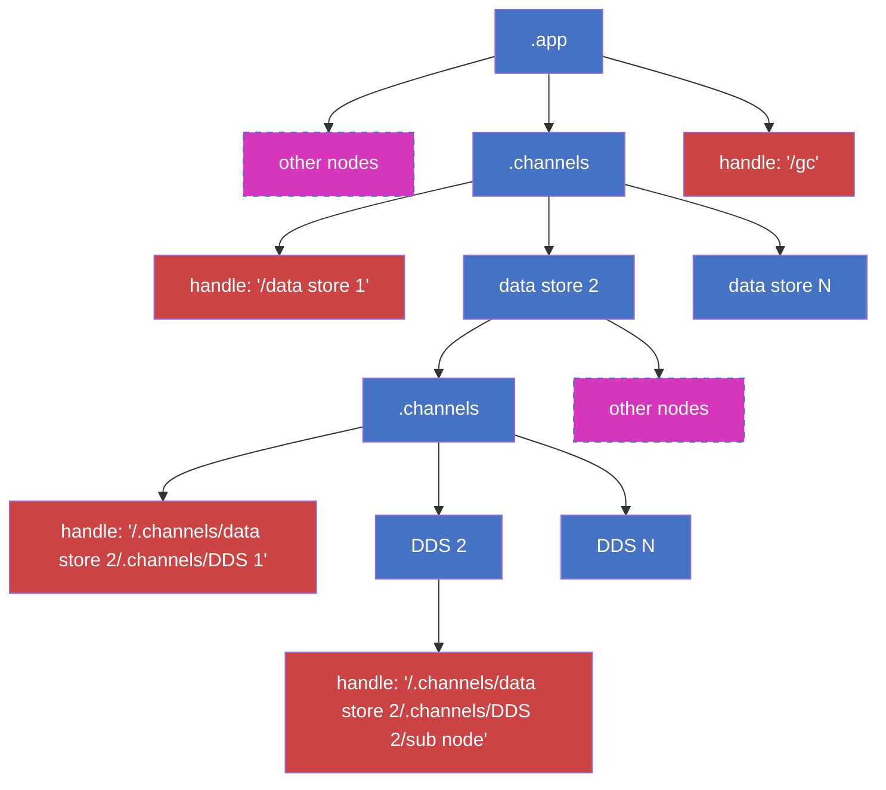

# Summary and snapshot formats

## Table of contents

- [Summary and snapshot formats](#summary-and-snapshot-formats)
	- [Table of contents](#table-of-contents)
	- [Introduction](#introduction)
		- [Summary Format](#summary-format)
		- [Snapshot Format](#snapshot-format)
		- [Summary / Snapshot Tree Visualization](#summary--snapshot-tree-visualization)
			- [Protocol tree](#protocol-tree)
			- [App tree](#app-tree)
			- [Summary tree distinction - Incremental summaries](#summary-tree-distinction---incremental-summaries)

## Introduction

This document describes the format of summaries and snapshots. For learning the differences between summaries and snapshots, see the FAQ section [here](https://fluidframework.com/docs/faq/#whats-the-difference-between-a-summary-and-a-snapshot).

The following sections describe the fundamental structure of a summary / snapshot tree as produced by the runtime, explains the various node types within the tree along with their respective data, and shows the distinctions between a summary tree and a snapshot tree.

### Summary Format

Summary is uploaded to storage and is the container's state at a point in time. A summary is represented by an `ISummaryTree` which is defined in [summary.ts in the protocol-definitions package][summary-protocol] and has the following basic structure (some optional properties are removed for simplicity):

```typescript
export interface ISummaryTree {
	type: SummaryType.Tree;
	tree: { [path: string]: SummaryObject };
}
export type SummaryType =
	| SummaryType.Attachment
	| SummaryType.Blob
	| SummaryType.Handle
	| SummaryType.Tree;
export type SummaryObject = ISummaryTree | ISummaryBlob | ISummaryHandle | ISummaryAttachment;
```

Each tree node in a summary tree is represented by the `ISummaryTree` interface above and contains the following:

-   `type` - `SummaryType.Tree`
-   `tree` - A list of children of the tree node. Each child node has the following format:

    `<tree name>`: `<SummaryObject>` where `tree name` is the name given to the child node and `SummaryObject` is one of the following:

    -   `ISummaryTree` - A subtree which has the same structure as this node. For example, container runtime will have subtrees for its data store which in turn will have subtrees for its DDSes.

    -   `ISummaryBlob` - A blob that has some content for this node. For example, a DDS's node has a ".attributes" blob for its attributes such as type, snapshot versions, etc. It may have additional blobs for the actual user content in the DDS.

        ```typescript
        export interface ISummaryBlob {
        	type: SummaryType.Blob;
        	content: string | Uint8Array;
        }
        ```

    -   `ISummaryAttachment` - This is used for attachment blobs that are uploaded to and downloaded from storage directly. The contents of these blobs are not part of the summary. Storage returns an ID after the attachment has been uploaded and this ID is included in the summary attachment. For example, a DDS can upload some of its large content directly to storage and include its ID in the summary.

        ```typescript
        export interface ISummaryAttachment {
        	type: SummaryType.Attachment;
        	id: string;
        }
        ```

    -   `ISummaryHandle` - A summary handle is used for incremental summaries. If a node hasn't changed since the last successful summary, instead of sending it's entire contents, it can send a "handle" which is a path to its summary tree object in the last summary. For example, if a data store or DDS did not change since the last summary, the runtime will use a handle for the entire data store instead of re-sending the entire subtree. The same concept applies for a summary blob or a summary attachment and the "handleType" should be set according to the type of the node. An example of "handle" that a DDS sends would be something like: "/_dataStoreId_/_ddsId_".

        ```typescript
        export interface ISummaryHandle {
            type: SummaryType.Handle;
            handleType: SummaryTypeNoHandle;
            handle: string;
        }
        export type SummaryTypeNoHandle =
            | SummaryType.Tree
            | SummaryType.Blob
            | SummaryType.Attachment;
        ```

### Snapshot Format

Snapshot is downloaded from the storage (typically on document load) and is the container's state at a point in time. A snapshot is represented by an `ISnapshotTree` which is defined in [storage.ts in the protocol-definitions package][storage-protocol] and has the following basic structure (some optional properties are removed for simplicity):

```typescript
export interface ISnapshotTree {
	blobs: { [path: string]: string };
	trees: { [path: string]: ISnapshotTree };
}
```

Each node in a snapshot tree is represented by the above interface and contains the following:

-   `blobs` - A list of blobs that have the contents for the node. For example, a DDS's node has a ".attributes" blob for its attributes such as type, snapshot versions, etc. It may have additional blobs for the actual user content in the DDS. Each blob in the list has the following format:

    `<blob name>`: `<unique blob id>` where `blob name` is the name given to the blob by the node and `unique blob id` is the id that uniquely represents the blob's content in storage.

    When a node needs the content of a blob, it fetches it from storage by calling `readBlob` and providing the `unique blob id`.

    > Note: Summary attachments (described in summary format) are also part of this list.

-   `trees` - A list of subtrees of the node. For example, container runtime will have subtrees for its data store which in turn will have subtrees for its DDSes. Each subtree in the list has the following format:

    `<tree name>`: `<snapshot tree>` where `tree name` is the name given to the subtree by the node and `snapshot tree` is its content in `ISnapshotTree` format.

### Summary / Snapshot Tree Visualization

This section shows what a typical summary or snapshot tree in a container looks like. Some key things to note:

-   The diagrams in this section show some examples of existing blobs / trees that are added at each node and doesn't show an exhaustive list.
-   The blue boxes represent summary tree nodes.
-   The green boxes represent summary blobs.
-   The purple boxes represent summary attachments.
-   The pink boxes represent other nodes - either existing nodes that are not shown or new nodes that may be added in the future. A node can be a tree, blob or attachment.

A typical tree uploaded to or downloaded from storage looks like the following:



`Protocol tree` - This is the tree named `.protocol` and contains protocol level information for the container. These are used by the container to initialize.

`App tree` - This is the tree named `.app` and contains the container's state and data. The subtree under .app is what is generated by the container runtime.

#### Protocol tree

The contents of the protocol tree are:

-   `attributes blob` - Attributes such as the sequence number the summary was taken at.
-   `quorum members blob` - The members in the quorum at the time summary was taken.
-   `quorum proposals blob` - The quorum proposals at the time summary was taken.
-   `quorum values blob` - The quorum values at the time summary was taken.
-   Other blobs and trees may be added at this level as needed.

#### App tree

This is what the ".app" tree looks like which is generated by the container runtime during summary upload. The same is passed to container runtime during snapshot download:



-   `Container`: The root represents the container or container runtime node. Its contents are described below:

    -   `.metadata blob` - The container level metadata such as creation time, create version, etc.
    -   `.aliases blob` - The list of aliases for data stores and the corresponding internal id.
    -   `.idCompressor blob` - The data for the ID compressor.
    -   `.blobs tree` - The snapshot for the attachment blobs added by the blob manager. The individual attachment blobs are present as summary attachments (`ISummaryAttachment`).
    -   `gc tree` - The snapshot for garbage collection added by the garbage collector.
    -   `.channels tree` - The subtrees for all the data stores.
    -   There may be other blobs and trees added at this level as needed.

-   `Data store`: Data store snapshot trees are under ".channels" subtree of container runtime's tree. Its contents are described below:

    -   `.component blob` - The attributes for a data store such as the package name, snapshot version, etc.
    -   `.channels tree` - The subtrees for all its DDSs.
    -   There may be other blobs and trees added at this level as needed.

-   `DDS`: DDS snapshot trees are under ".channels" subtree of its parent data store's tree. Its contents are described below:
    -   `.attributes blob` - The attributes for a DDS such as the type, snapshot version, etc.
    -   `.header blob` - Added by some DDSs and may contains its data. Note that all DDSs may not add this.
    -   A DDS may add other blobs and / or trees to represent its data. Basically, a DDS can write its data in any form

#### Summary tree distinction - Incremental summaries

In the visualization above, a summary tree differs from a snapshot tree in the following way:
A summary tree supports incremental summaries via summary handles. Any node in the tree that has not changed since the previous successful summary can send a summary handle (`ISummaryHandle`) instead of sending its entire contents in a full summary. The following diagram shows this with an example where certain parts of the summary tree use a summary handle. It is a zoomed in version of the same app tree as above where nodes where summary handles are marked in red:



[summary-protocol]: /common/lib/protocol-definitions/src/summary.ts
[storage-protocol]: /common/lib/protocol-definitions/src/storage.ts
