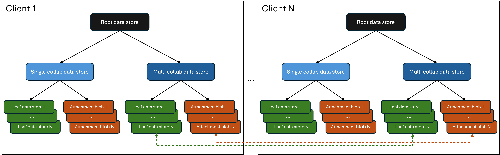

# @fluid-internal/test-service-load

_Note: This tool has dependencies on Microsoft-internal systems._

NodeJs-based test to simulate many clients and a high rate of op generation.

## Goal

The goal of these tests is to validate that garbage collection (GC) works correctly and there are no unexpected errors. The most
core aspects of these tests are:
* Reference data stores and have them send ops, i.e., use them.
* Unreference data stores and have them stop sending ops, i.e., stop using them.
* Re-reference previously unreferenced data stores safely. Basically don't use data stores after they are GC'd.
* Collaborate with other clients that are connected to the document. Basically, mimic typical user scenarios where users
work on same or different parts of a document simultaneously.

# Architecture

The following picture shows how the clients / containers are set up. The dashes line indicate collaboration happening between data stores.


There are n clients that are running in parallel and each client does the following when the test is run:
* It starts by loading a root data store and calling "run" on it.
* Root data store - This data store does the following:
  * It controls how long the test runs and propagates the result back to the test runner. Basically, it sends ops with a delay between each op until the total number of ops reach a specific count.
  * It loads two child data stores - a collab data store and a non-collab data store and calls "run" on them.
* Collab data store - This data stores collaborates with other clients connected to the document. It continuously sends ops with a delay between each and after every few ops, it performs one of the following activities:
  * CreateAndReference - It creates a leaf data store, references it and calls "run" on it.
  * Unreference - It unreferences a previously referenced leaf data store. It also calls "stop" on it so that it does not do any activity.
  * Revive - It references a previously unreferenced leaf data store. It does so safely such that inactive or GC'd data stores are not referenced as that can lead to use-after-delete errors.
All other clients are listening to these activities, they may choose to call "run" or "stop" on their local copy of the corresponding leaf data store. This is the collaboration part which mimics user scenarios where multiple users collaborate on same part of the document simultaneously.
* Non-collab data store - This data store does not collaborate with other clients. It works exactly the same way as the collab data store expect that other clients do not listen to activities of other clients.
This mimics user scenarios where multiple users work on different parts of a document simultaneously.
* Leaf data store - This data store does not create any data stores and hence is the leaf node in the reference hierarchy. It continuously sends ops with a delay between each op until "stop" is called on it. It mimics user actions on a part of a document.

## Pre-requisites

* Run [getkeys](/tools/getkeys/README.md) at some point to enable your machine to retrieve required OAuth tokens and passwords.
_You do not need to run it more than once, it will persist the keys for future sessions._
* If you are using a username not already present in `testConfig.json`,
then you'll need to add the password to the `login__odsp__test__accounts` environment variable. The format is simple:

```json
{"user@foo.com": "pwd_foo", "user@bar.com": "pwd_bar", ...}
```

If you intend to check in the new username, please reach out to someone on the team who can add the creds to Azure Key Vault.

## Usage

This package runs in two different modes: Orchestrator Mode and Test Runner mode

### Orchestrator Mode

_This is the main entry point to the test - this Orchestrator process will spawn many Test Runner processes._

```bash
node ./dist/nodeStressTest.js [--url <url>] [--tenant <tenant>] [--profile <profile>] [--debug] [--log <filterTerm>]
```

### Test Runner Mode

_This is not typically invoked manually - rather, the Orchestrator process spawns Test Runners using this mode._
_See the call to `child_process.spawn` in the source code to refer to arguments used to launch in this mode_

### npm scripts

There are several npm scripts in [package.json](./package.json) to make it quicker to launch this tool. Among others:
`npm run start` - Launches in Orchestrator Mode with default options
`npm run debug` - Debugs in Orchestrator Mode with `--debug` provided to allow for attaching to child test runners.

### URL

When running the stress tests, there will be a URL printed in console, after the line "Connecting to new Container targeting with url:".
This URL can be passed as-is to Fluid Debugger as well as fetch-tool.

### Options

#### --driver, -d

Specifies which test driver to use: odsp, routerlicious, tinylicious. The config for the drivers is pulled from the environment. See [Test Driver](../test-drivers/README.md).

#### --driverEndpoint, -e

Specifies which endpoint of test driver to use: odsp, odsp-df for odsp driver or frs, r11s, docker for routerlicious driver.

#### --profile, -p

Specifies which test profile to use from [testConfig.json](./testConfig.json). Defaults to **ci**.

#### --testId, -id

If present, the test will load an existing data store for the given test id rather than creating a new container and data store.
(Required when `--runId` is provided)

#### --runId, -r

If present, launch in Test Runner mode with the given runId (to distinguish from other concurrent test runners).
`--url` is required, since the test runner needs to know which data store to connect to.

#### --debug, -dbg

Launches each test runner with `--inspect-brk` and a unique Node debugging port. (Not compatible with `--runId`)

#### --createTestId

If the `testId` argument is specified, the `createTestId` flag determines whether to load an exisiting
document corresponding to the `testId` specified, or create a new one. When `createTestId` is set to true,
a new document is created, and when `createTestId` is false, we try to load an existing document.

#### --log, -l

Overrides DEBUG environment variable for telemetry logging to console.
If DEBUG env variable is unset and this is not provided, only errors will print.
The value passed here should be a filter string for the logger namespace.

>To print all messages, provide `--log '*'` or `--log 'fluid:*'`. For example, to filter to only Container logs,
provide something like: `-l 'fluid:telemetry:Container:*'`.

## Trademark

This project may contain Microsoft trademarks or logos for Microsoft projects, products, or services. Use of these trademarks
or logos must follow Microsoft's [Trademark & Brand Guidelines](https://www.microsoft.com/en-us/legal/intellectualproperty/trademarks/usage/general).
Use of Microsoft trademarks or logos in modified versions of this project must not cause confusion or imply Microsoft sponsorship.
