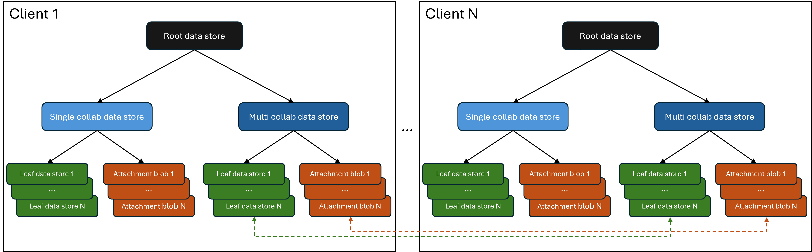

# @fluid-internal/test-service-load

_Note: This tool has dependencies on Microsoft-internal systems._

NodeJs-based test to simulate many clients and a high rate of op generation.

## Goal

The goal of these tests is to validate that garbage collection (GC) works correctly and there are no unexpected errors. These are the core things that this test does:

1. Create and reference data stores / attachment blobs and use them. Data stores - send ops, attachment blobs - retrieve them.
2. Unreference data stores / attachment blobs and stop using them. Data stores - stop sending ops, attachment blobs - stop retrieving them.
3. Re-reference previously unreferenced data stores / attachment blobs safely, i.e., until the session expires. Basically, reuse them until they are garbage collected.
4. In some cases, collaborate with other clients that are connected to the document. This mimics typical user scenarios where some parts of a document are worked on by multiple collaborators simultaneously whereas other parts are worked on by a single collaborator. Both these scenarios are important because they test different aspects of the system.

## Architecture

The following picture shows how the clients / containers are set up. The dashed line indicate collaboration happening between clients.

There are n clients that are running in parallel. Each client has the following objects and starts by loading a root data store:

-   Root data store - This data store does the following:
    -   It controls how long the test runs and propagates the result back to the test runner. It does this by sending ops with a delay between each op until the total number of ops reach a specific count.
    -   It loads two child data stores - a single collab data store and a multi collab data store and calls "run" on them.
-   Multi collab data store - This data stores collaborates with 2 other clients connected to the document. It continuously sends ops with a delay between each and after every few ops, it performs one of the following activities:
    -   CreateAndReference - It creates a leaf data store and attachment blob, references it and calls "run" on it.
    -   Unreference - It unreferences a previously referenced leaf data store and attachment blob. It also calls "stop" on it so that it does not do any activity.
    -   Revive - It references a previously unreferenced leaf data store and attachment blob. It does so until the client session expires.
        The collaborator clients are listening to these activities and they call "run" or "stop" on their local copy of the corresponding leaf data store / attachment blob. This is the collaboration part which mimics user scenarios where multiple users collaborate on same part of the document simultaneously.
    -   None - No activity. This mimics scenarios where a data store and / or it's DDSes don't change across summaries. This is important because when this happens, GC / summary data from the previous summary is used and it goes down a different code path.
-   Single collab data store - This data store does not collaborate with other clients. It works exactly the same way as the multi collab data store, except that other clients do not listen to activities of other clients.
    This mimics user scenarios where multiple users work on different parts of a document simultaneously.
-   Leaf data store - This data store does not create any data stores and hence is the leaf node in the reference hierarchy. It continuously sends ops with a delay between each op until "stop" is called on it. It mimics a user interacting with a part of a document.
-   Attachment blob object - This corresponds to an attachment blob created by one of the data stores above. It continuously retrieves the attachment blob with a delay between each them until "stop" is called on it. It mimics a user uploading / downloading an image, etc.
