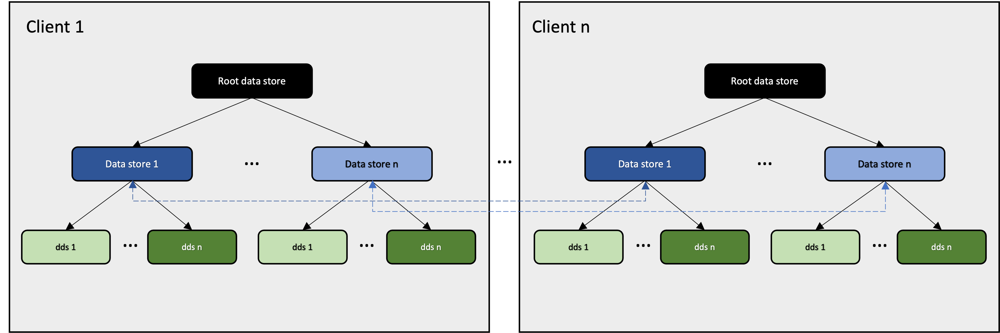

# @fluid-internal/test-service-load

_Note: This tool has dependencies on Microsoft-internal systems._

NodeJs-based test to simulate many clients and a high rate of op generation.

## Goal

The goal of these tests is to be able to stress the summarization system like in real world scenarios. We want to be able to run our system through real user-like activities over time and validate that things work as expected. The tests stresses the summarization subsystem in the following ways:

1.  Summarization happens over a period - Users keep collaborating over a document which triggers summarization. Depending on the load on the system, the rate at which summarization happens will differ.
2.  Summarization is done by different clients - The user client that is chosen as summarizer goes away and a new summarizer client is chosen.
3.  Summarization happens with different configurations - We support different summary configurations that users can configure via container runtime options. We should ensure that summarizations happen correctly with different configs that may change over time.
4.  Summarization is triggered by changing different parts of a document - The tests should not change everything in the document all the time but randomly change some parts of it. Users work on certain parts of a document and that is what triggers summarizations. Plus, this will ensure that summarization happens incrementally which is a crucial part of the summarization system. The tests should change some data stores and some DDSes within a data store so we get incremental coverage for both.
5.  Summaries are eventually consistent - Summaries should be eventually consistent, i.e., a summary taken at reference sequence# N should always be the same regardless of how a summarizer got there. It could have started at seq# 0 or loaded from a summary between seq# and seq# N. The content of the summary should be the same. We have had eventual consistency issues in the past and may have more currently. For example, local changes in summarizer cause eventual consistency issues.
6.  Summarization happens for different DDSs - We should test the summaries produced by all our DDSs. Each DDS has its own summarization logic, and they should have their own unit test. However, the overall summarization can affect the DDSs too. For example, local changes in summarizer can affect eventually consistency and each DDS may have different ways of handling it.
7.  Summarization has local changes - This is a negative scenario. Ideally, summarizer should not have local changes, but we don't disallow or prevent it today and our customers do use it. So, it's worth testing it to ensure that things work despite these (as well as possible). And it will also help us validate improvements we are making in this area. The scenarios are described in the next section (Local changes in summarizer).
8.  Summaries with attachment blobs - BlobManager summarizes all attachment blobs, and these can be referenced in DDS summaries. The test should upload and retrieve attachment blobs.

> Note: These tests are a work-in-progress. Currently, 1-4 are implemented and the rest will be coming in soon.

## Architecture

The following picture shows how the clients / containers are set up. The dashed line indicate collaboration happening between clients.

There are n clients that are running in parallel. Each client has the following objects and starts by loading a root data store:

-   Root data store - This data store does the following:
    -   It controls how long the test runs and propagates the result back to the test runner. It continuously sends ops with a delay between each and after every few ops, it performs one of the following activities:
    -   Create - It creates a leaf data store and calls "run" on it.
    -   None - No activity. This mimics scenarios where a data store change across summaries. This is important because it tests incremental summary - summary data from the previous summary is used and it goes down a different code path.
-   Leaf data store - This data stores collaborates with other clients connected to the document. It continuously sends ops with a delay between each and after every few ops, it performs one of the following activities:
    -   Create - It creates a new DDS.
    -   UpdateOneDDS - It updates one DDS at random by sending an op for it.
    -   UpdateTwoDDS - It updates two DDSes at random by sending an op for each.
    -   None - No activity. This mimics scenarios where a DDSes don't change across summaries. This is important because it tests incremental summary - summary data from the previous summary is used and it goes down a different code path.
