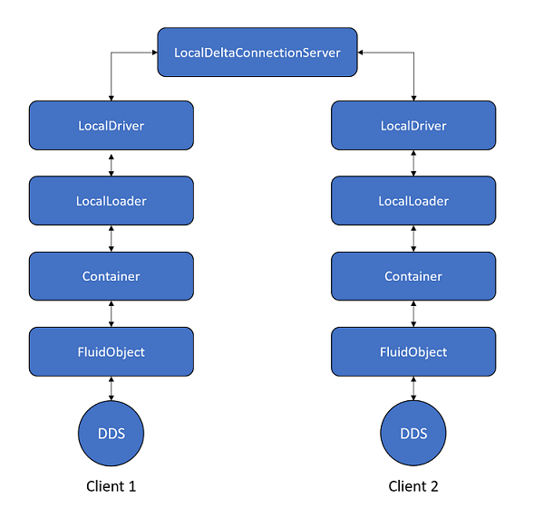

# @fluidframework/test-utils

This package contains utilities for writing end-to-end tests in Fluid Framework. It helps in the creation of a simple hosting application to test Fluid objects and other functionalities of the system.

Internal note: Currently, it also has a load side-effect when loaded under mocha where `@fluid-internal/mocha-test-setup` is used. The side-effect will attempt to inject an error 15ms before a test case would otherwise timeout.

<!-- AUTO-GENERATED-CONTENT:START (LIBRARY_README_HEADER:devDependency=TRUE) -->

<!-- prettier-ignore-start -->
<!-- NOTE: This section is automatically generated using @fluid-tools/markdown-magic. Do not update these generated contents directly. -->

## Using Fluid Framework libraries

For a dependency on a Fluid Framework library's public APIs, we recommend a `^` (caret) version range.
For example, use `^1.3.4`.

For a dependency on an unstable API, such as a `beta` API, we recommend a more restrictive version range.
For example, use a `~` version range.

## Installation

Run this command to install the package:

```bash
npm i @fluidframework/test-utils -D
```

## Importing from this package

This package uses [package.json exports](https://nodejs.org/api/packages.html#exports) to separate APIs by support level.
For information about the support guarantees, read [API Support Levels](https://fluidframework.com/docs/build/releases-and-apitags/#api-support-levels).

Import the `public` ([Semantic Versioning (SemVer)](https://semver.org/)) APIs from `@fluidframework/test-utils`.

Import the `legacy` APIs from `@fluidframework/test-utils/legacy`.

## API Documentation

Read the **@fluidframework/test-utils** API documentation at <https://fluidframework.com/docs/apis/test-utils>.

<!-- prettier-ignore-end -->

<!-- AUTO-GENERATED-CONTENT:END -->

## Local Code Loader

`LocalCodeLoader` in `localCodeLoader.ts` is a simple code loader that can load a Fluid package with a given entry point. It can be used to load multiple different Fluid packages with different sources (`IFluidCodeDetails`).

It should be created by passing in a list of source to entry point mapping. Then entry point can be an `IFluidDataStoreFactory`, `IRuntimeFactory` or a `fluidExport`:

```typeScript
// The fluidEntryPoint type.
export type fluidEntryPoint = Partial<IProvideRuntimeFactory & IProvideFluidDataStoreFactory & IFluidModule>;

// Constructor for LocalCodeLoader.
constructor(packageEntries: Iterable<[IFluidCodeDetails, fluidEntryPoint]>);
```

On load, it retrieves the `fluidEntryPoint` matching the package in the `IFluidCodeDetails` and loads it.

## Local Loader

`localLoader.ts` contains couple of methods:

### `createLocalLoader`

This method creates a simple `Loader` that can be used to resolve a Container or request a Fluid object.

It should be created with a list of source to entry point mappings (of type `fluidEntryPoint` as explained in [LocalCodeLoader](#Local-Code-Loader) section above), an `ILocalDeltaConnectionServer` and an `IUrlResolver`:

```typeScript
export function createLocalLoader(
    packageEntries: Iterable<[
        IFluidCodeDetails,
        Partial<IProvideRuntimeFactory & IProvideFluidDataStoreFactory & IFluidModule>
    ]>,
    deltaConnectionServer: ILocalDeltaConnectionServer,
    urlResolver: IUrlResolver,
): ILoader;
```

-   It creates a `LocalCodeLoader` using the `fluidEntryPoint` list to load Container code.
-   It creates a `DocumentServiceFactory` which serves as the driver layer between the container and the server.

### `createAndAttachContainer`

This method creates and attaches a `Container` with the given `source` and an `attachRequest`. An `ILoader` should also be passed in that will be used to load the `Container`. The `attachRequest` format varies per url resolver. Most resolvers have helper methods for creating attach requests. You should use the
helper method on the url resolver passed to the loader to generate the `attachRequest`:

```typescript
export async function createAndAttachContainer(
	source: IFluidCodeDetails,
	loader: ILoader,
	attachRequest: IRequest,
): Promise<IContainer>;
```

The usual flow is to create a `LocalLoader` by calling `createLocalLoader` and then using it to call `createAndAttachContainer`. However, this should work with any `ILoader`.

## Test Fluid Object

`testFluidObject.ts` provides `TestFluidObject` and `TestFluidObjectFactory` that help in the testing of Distributed Data Structures (DDS).
It can be used to create a Fluid object (TestFluidObject) with a given set of DDSes which can then be retrieved later as required.

For example, if you need a Fluid object with couple of SharedStrings, a SharedDirectory and a SparseMatrix, create a `TestFluidObjectFactory` as follows and use this factory to create the Fluid object:

```typeScript
new TestFluidObjectFactory([
    [ "sharedString1" /* id */, SharedString.getFactory() ],
    [ "sharedString2" /* id */, SharedString.getFactory() ],
    [ "directory" /* id */, SharedDirectory.getFactory() ],
    [ "matrix" /* id */, SparseMatrix.getFactory() ],
]);
```

The `TestFluidObject` will then create the above DDSes when initializing and they can then be retrieved by calling `getSharedObject` on it and providing the `id` that was used to create it:

```typeScript
const sharedString1 = testFluidObject.getSharedObject<SharedString>("sharedString1");
const sharedString1 = testFluidObject.getSharedObject<SharedString>("sharedString2");
const directory = testFluidObject.getSharedObject<SharedDirectory>("directory");
const matrix = testFluidObject.getSharedObject<SparseMatrix>("matrix");
```

> If you want a DDS to be part of the registry so that it can be created later but don't want `TestFluidObject` to create it during initialization, use `id` as `undefined` in the `TestFluidObjectFactory` creation.

## Op Processing Controller

`OpProcessingController` provides control over op processing in the tests. It lets you pause and resume the op processing in the containers / fluid objects. It also lets you wait until the ops have been processed by them and the server.

`OpProcessingController` should be created by passing in the `ILocalDeltaConnectionServer` that is used in the test. You can then register the Fluid objects / containers whose ops you want to control with it.

For example, consider the scenario where you perform some operations on a DDS and want to verify that the remote client's DDS have applied the operations. You have to wait until the op is sent to the server, the server processes the op, sends it to the remote client and the remote client processes the op.

You can use the `OpProcessingController` to wait for all that to happen by calling `process` on it. Check how [SharedStringTest](../end-to-end-tests/src/test/sharedStringEndToEndTests.spec.ts) does that.

## Usage

The typical usage for testing a Fluid object is as follows:

1. Create a `LocalDeltaConnectionServer`:

    ```typescript
    const deltaConnectionServer: ILocalDeltaConnectionServer = LocalDeltaConnectionServer.create();
    ```

2. Create a `LocalResolver`:

    ```typescript
    const urlResolver: IUrlResolver = new LocalResolver();
    ```

3. Create an `IFluidCodeDetails` and a `TestFluidObjectFactory` which will serve as the Fluid entry point (code details to factory mapping):

    ```typescript
    const codeDetails: IFluidCodeDetails = {
    	package: "sharedStringTestPackage",
    	config: {},
    };
    const entryPoint = new TestFluidObjectFactory([["sharedString", SharedString.getFactory()]]);
    ```

    > This can replaced by any `IFluidDataStoreFactory` or `IRuntimeFactory`. When the loader is asked to resolve a Container with the above code details, it will load the above factory.

4. Create a local `Loader`:

    ```typescript
    const loader: ILoader = createLocalLoader(
    	[[codeDetails, entryPoint]],
    	deltaConnectionServer,
    	urlResolver,
    );
    ```

5. Create and attach a `Container` by giving it a `documentId` which is used as a URL to resolve the container:

    ```typescript
    const documentId = "testDocument";
    const container = await createAndAttachContainer(
    	codeDetails,
    	loader,
    	urlResolver.createCreateNewRequest(documentId),
    );
    ```

    > We used the same `IFluidCodeDetails` that was used to create the `Loader` in step 3.

6. Get the `Fluid object (TestFluidObject)` by using `getEntryPoint()` API on `IContainer`. Then get the `DDS` to test:

    ```typescript
    const fluidObject = await container.getEntryPoint();
    const sharedString = await fluidObject.getSharedObject<SharedString>("sharedString");
    ```

    > The `ITestFluidObject` would have already created a `SharedString` based off the parameters we provided when creating the `TestFluidObjectFactory` in step 2.

7. To truly test collaboration, create a second `Loader`, `Container`, `fluid object` and `DDS` which will serve as a remote client:
    ```typescript
    const documentUrl = `https://localhost/${documentId}`;
    const loader2: ILoader = createLocalLoader(
    	[[codeDetails, entryPoint]],
    	deltaConnectionServer,
    	urlResolver,
    );
    const container2 = await loader2.resolver({ url: documentUrl });
    const fluidObject = await container2.getEntryPoint();
    const sharedString2 = await fluidObject2.getSharedObject<SharedString>("sharedString");
    ```
    > It is important to use the same `ILocalDeltaConnectionServer` to create the `Loader` and the same `documentId` to load the `Container`. This will make sure that we load the `Container` that was created earlier and do not create a new one.

These steps are demonstrated in the image below:



> Note that the LocalDriver is created by the `createLocalLoader` method and does not need to explicitly created.

## Example

The above usage is taken from [SharedStringTest](../end-to-end-tests/src/test/sharedStringEndToEndTests.spec.ts) which is a very basic example of how to use these utils.

There are a number of other examples (some a little more complex) in the same [directory](../end-to-end-tests/src/test).

<!-- AUTO-GENERATED-CONTENT:START (README_FOOTER) -->

<!-- prettier-ignore-start -->
<!-- NOTE: This section is automatically generated using @fluid-tools/markdown-magic. Do not update these generated contents directly. -->

## Minimum Client Requirements

Fluid Framework client libraries support the platforms in this document.
These requirements are intentionally restrictive.
Within a major version series, we can relax these requirements, but we cannot make them stricter.
For a Long Term Support (LTS) version, we might need to support these platforms for several years.

Other configurations can work, but Fluid Framework does not support them.
If an unsupported configuration stops working, we do not classify this as a bug.
To request support for a configuration that is not listed, file an issue.
The product team will evaluate your request.
In the issue, specify the current status of the configuration:

-   The configuration works but needs official support.
-   The configuration does not work and requires changes.

### Supported Runtimes

-   Fluid Framework supports Node.js versions 22 and 24 while they receive [upstream support](https://nodejs.org/en/about/previous-releases).
    -   Fluid Framework will stop support for version 22 [when upstream support ends on 2027-04-30](https://github.com/nodejs/release#release-schedule).
    -   Fluid Framework does not support Node.js with the `--no-experimental-fetch` flag.
-   Fluid Framework supports modern browsers that support the ES2022 standard library.

### Supported Tools

-   [TypeScript 6.0](https://typescriptdocs.com/release-notes/TypeScript%206.0):
    -   Fluid Framework supports all [`strict`](https://www.typescriptlang.org/tsconfig) options.
    -   Set the build targets (`lib`, `target`) to `ES2022` or later.
    -   Enable [`strictNullChecks`](https://www.typescriptlang.org/tsconfig).
    -   Fluid Framework does not support [configuration options deprecated in TypeScript 6.0](https://typescriptdocs.com/release-notes/TypeScript%206.0#breaking-changes-and-deprecations-in-typescript-6-0).
    -   Fluid Framework does not fully support `exactOptionalPropertyTypes`.
        If you enable this option, do not use `in`, `Reflect.has`, `Object.hasOwn`, or `Object.prototype.hasOwnProperty` to narrow members of Fluid Framework types.
        These methods can incorrectly exclude `undefined` from the possible values.
-   [webpack](https://webpack.js.org/) 5
    -   We do not require a specific bundler.
        Other bundlers that handle ES Modules can work, but we actively test only webpack.

### Module Resolution

In TypeScript `compilerOptions`, use [`Node16`, `Node20`, `NodeNext`, or `Bundler`](https://www.typescriptlang.org/tsconfig#moduleResolution) module resolution.
These settings follow the [Node.js v12+ ESM Resolution and Loading algorithm](https://nodejs.github.io/nodejs.dev/en/api/v20/esm/#resolution-and-loading-algorithm).

Do not use `Node10` module resolution.

### Module Formats

-   ES Modules:
    Use ES Modules to consume Fluid Framework client packages, including in Node.js.
-   CommonJS:
    Fluid Framework does not officially support CommonJS in version 3.0 or later.

## Contribution Guidelines

You can [contribute](https://github.com/microsoft/FluidFramework/blob/main/CONTRIBUTING.md) to Fluid Framework in these ways:

-   Answer questions in [GitHub Discussions](https://github.com/microsoft/FluidFramework/discussions).
-   [Submit bug reports](https://github.com/microsoft/FluidFramework/issues) and help verify fixes.
-   Review [source code changes](https://github.com/microsoft/FluidFramework/pulls).
-   [Contribute bug fixes](https://github.com/microsoft/FluidFramework/blob/main/CONTRIBUTING.md).

For detailed instructions, read the [Fluid Framework wiki](https://github.com/microsoft/FluidFramework/blob/main/docs/content/Home.md).

This project follows the [Microsoft Open Source Code of Conduct](https://opensource.microsoft.com/codeofconduct/).
For more information, read the [Code of Conduct frequently asked questions](https://opensource.microsoft.com/codeofconduct/faq/).
For questions or comments, contact [opencode@microsoft.com](mailto:opencode@microsoft.com).

This project may contain Microsoft trademarks or logos for Microsoft projects, products, or services.
Use of these trademarks or logos must follow Microsoft’s [Trademark & Brand Guidelines](https://www.microsoft.com/trademarks).
Use of Microsoft trademarks or logos in modified versions of this project must not cause confusion or imply Microsoft sponsorship.

## Help

Read the [Fluid Framework documentation](https://fluidframework.com/docs/) for information about Fluid Framework concepts and APIs.

To request information that the documentation does not contain, [create an issue](https://github.com/microsoft/FluidFramework/blob/main/docs/content/Contributing/Submitting-Bugs-and-Feature-Requests.md).

## Trademark

This project may contain Microsoft trademarks or logos for Microsoft projects, products, or services.

Use of these trademarks or logos must follow Microsoft's [Trademark & Brand Guidelines](https://www.microsoft.com/en-us/legal/intellectualproperty/trademarks/usage/general).

Use of Microsoft trademarks or logos in modified versions of this project must not cause confusion or imply Microsoft sponsorship.

<!-- prettier-ignore-end -->

<!-- AUTO-GENERATED-CONTENT:END -->
