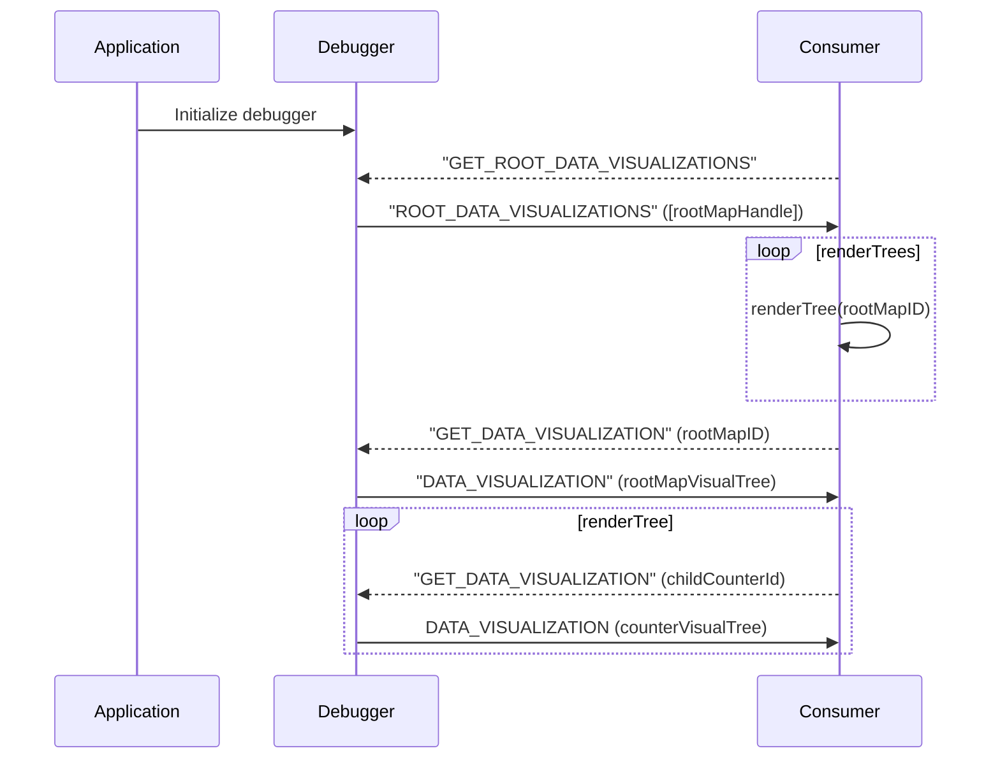

# @fluid-tools/client-debugger DDS Visualization

This directory contains a system for describing Fluid Distributed Data Structure (DDS) visuals in a declarative manner, and for communicating incremental updates to those visuals.

This system is designed to be compatible with the message-passing-based approach taken by the debugger, such that consumers can process the visuals however they wish.

-   In particular, this enables tooling that may live in another process; e.g. Chromium Browser Extensions.

## The Flow

For the purpose of demonstrating the intended usage flow of the system, we will be looking at it from the context of the debugger, rather than viewing this system in isolation.

When initializing the debugger, the initializing consumer may optionally provide a root DDS(s) they wish to have visualized by the tooling.
If they do not specify this, then the tooling will not generate any visuals.

To initiate "rendering" (generating visual summary trees), the consumer passes the `GET_ROOT_DATA_VISUALIZATIONS` to request the "root" visual summary.
This call will return a flat list of "handle" nodes, which include a unique identifier assigned by the system for the corresponding DDS.

The handle node is not useful on its own, but consumers can use its ID to request a visual summary of the corresponding DDS from the system.
The `GET_DATA_VISUALIZATION` message is used to request such a "rendering" for an individual DDS.

The flow looks something like the following:


Additionally, once a given DDS has been "rendered" for the first time, it will continue to broadcast automatic updates each time its contents change (i.e. each time the "op" event is fired on the DDS object).
Consumers can simply continue to listen for the `DATA_VISUALIZATION` message in order to receive updates as changes are made in the application.

The visual tree for a given DDS will always contain the unique DDS ID (so message consumers can correlate them correctly).
Their data format is likely best described by the code, so we won't go into it in too much depth here.
See `./VisualTree` for a type-wise breakdown.

At a high level, the DDS trees contain:

1.  Their ID
2.  Some root visual metadata
3.  Child trees / values

    -   These children will **always** be either nested visuals describing primitive data or a handle node pointing to another DDS.
        When such a node is encountered, the consumer may post another `GET_DATA_VISUALIZATION` message requesting the corresponding "rendering".

### Example

For an example, consider a relatively simple application "schema", which is provided to the debugger at initialization:

```typescript
{
	rootMap: SharedMap;
}
```

The application represents its state as a single root `SharedMap`, whose child values are numeric counters, backed by `SharedCounter`s.

To visualize the entire tree, the flow might look something like the following:



## Laziness

The system has designed to be lazy.
Visualizer nodes will only be generated for a given DDS Handle once they have been reached by rendering some "parent" DDS.

But once it has been reached, the system will ensure that messages are posted for all subsequent changes to that DDS.

## Incrementality

The above flow examples illustrate the granularity at which consumers can observe DDS visualizations; namely, per DDS.
For now, this is the most granular level of updates the system supports.

For small / simple DDSs like `SharedCounter`, this is likely fine.
For larger DDSs like `SharedTree`, this may become a performance issue.
We may wish to consider broadcasting visual tree _diffs_ for changes after the initial "render", rather than broadcasting the entire state.

## Dependency Tracking

The system is designed to walk the input list of DDSs like trees.
When a Fluid Handle is encountered while walking one of these trees, a corresponding "visualizer" node is generated and stored to generate visual trees for its DDS on demand.

For the time being, the system does not do any dependency tracking.
That is, if a DDS that was at one point reachable by walking one of the input trees becomes unreachable, the system will continue to store the associated visualizer.
This is a potential memory leak that will want to be addressed before we publish our MVP.

**TODO**: investigate existing dependency tracking libraries we can take advantage of.
Otherwise, just storing weak references to the DDSs/Handles + interval-based state cleanup will probably be sufficient.
