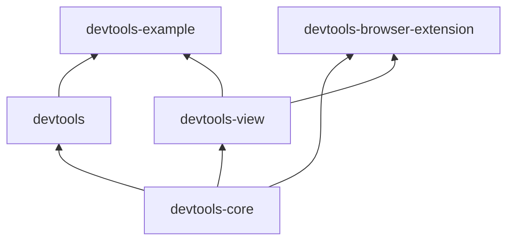

# Devtools

This directory contains a series of libraries that comprise our Fluid Framework developer tools solution, as well as a [Chromium]()-based browser extension, and an example application demonstrating the developer tooling in action.

## Packages

-   [devtools-core](devtools-core/README.md): Low-level Devtools API powering the overall experience.
    -   This library corresponds to Fluid's "1st party" API surface, and is not necessarily intended to be directly used by external customers.
    -   It communicates with consumers (e.g. our `devtools-view`) via message-passing.
-   [devtools](devtools/README.md): Higher level Devtools API built upon `devtools-core`.
    -   This library is the one we expect our external customers to use.
        It works in terms of our higher-level [Container abstraction](), and is implemented as a thin wrapper around `devtools-core`.
-   [devtools-view](devtools-view/README.md): Visual experience for use with
    -   This package contains a simple [React]()-based view for interacting with the underlying Devtools libraries.
        For now, it is `private` and exists strictly to power our browser extension.
-   [devtools-browser-extension](devtools-browser-extension/README.md): Browser extension for Chromium-based browsers (for now, Edge and Chrome).
    -   This package is relatively light-weight.
        It implements the necessary scripting logic to ensure the extension's view (`devtools-view`) is able to communicate with the corresponding webpage.

Additionally, we have an sample application intended to help us test the end-to-end developer tooling experience, as well as to serve as an example for developers looking to integrate the developer tools into their own application.
It lives under [devtools-example](devtools-example/README.md).

## Architecture

Since our developer tools suite is designed to enable browser devtools experiences, our architecture is constrained in a few ways.
The most notable of these is that the runtime library aspects must communicate with the consuming views via **message-passing**.
