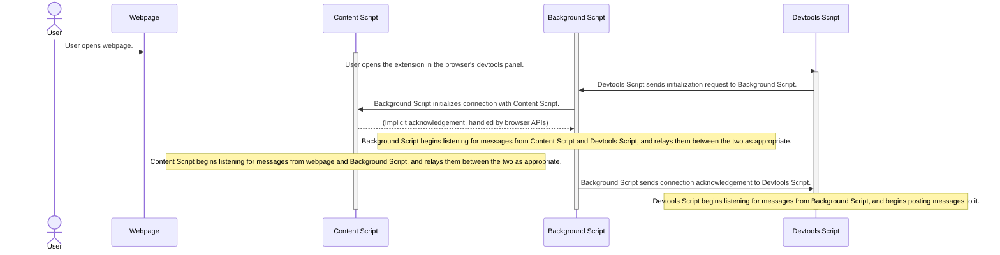

# @fluid-internal/devtools-browser-extension

This package contains a browser (Chrome) developer tools extension for use with [@fluidframework/devtools][].
It offers visual insights into the workings of the Fluid Framework in your application.

It is currently compatible with [Chromium](https://www.chromium.org/Home/)-based browsers (e.g. [Chrome](https://www.google.com/chrome/) and [Edge](https://www.microsoft.com/en-us/edge/)).

## Artifacts

-   Chrome browser extension: <https://aka.ms/fluid/devtool/chrome>
-   Edge browser extension: <https://aka.ms/fluid/devtool/edge>

Note: this package does not generate any library artifacts, so it is marked as `private` in its `package.json`.

## Background

### Devtools Extensions

This package runs as a [Devtools Extension](https://developer.chrome.com/docs/extensions/mv3/devtools/) in Chromium-based browsers that support them.

For an overview on how Devtools extensions work, see [here](https://developer.chrome.com/docs/extensions/mv3/devtools/#content-script-to-devtools).

For a helpful how-to guide for making a Devtools Extension, see [here](https://learn.microsoft.com/en-us/microsoft-edge/extensions-chromium/developer-guide/devtools-extension).

#### Initialization Flow

These details are covered by the above articles, but they are a bit obfuscated, so we'll elaborate here for clarity.

Background notes:

-   The `Background Script` is launched alongside the browser itself and runs for its lifetime.
    -   When run, it establishes a listener to be notified by the `Devtools Script` when the Devtools view is launched and needs to begin communicating with the tab (associated webpage).
    -   A single instance of this script is always running, and is responsible for pairing **all Devtools views** with **all associated webpages**.
-   The `Content Script` is launched alongside the webpage (specifically, it is injected into the webpage when the webpage is launched).
-   When run, it establishes a listener to be notified by the `Background Script` when it should begin relaying messages between the `Background Script` and the webpage (e.g. when the Devtools view is opened by the user).
-   A single instance of this script is injected into **each open tab**, and is responsible only for bridging communication between that tab and the singular `Background Script` service worker.
-   The `Devtools Script` is launched when the user opens our extension view in the browser's devtools panel.
-   When run, it establishes a connection with the `Background Script`, requesting that a connection be established such that information can flow from the `Content Script` injected into the tab (associated webpage) to the `Devtools Script` using the `Background Script` as a bridge.

What does this look like in terms of user flow?

## Working in the Package

### Building

To build the package, run `npm run build` in a terminal at the root directory of this package.

### Testing

#### Automated Testing

This package uses two different testing libraries for its unit vs end-to-end tests.
To run all of the automated tests, run `npm run test` in a terminal from the root directory of this package.

##### Unit Tests

This package uses [mocha](https://mochajs.org/) for its unit tests.
To run just the unit tests, run `npm run test:mocha` in a terminal from the root directory of this package.

##### End-To-End Tests

This package uses [jest](https://jestjs.io/) and a small backing test app to test end-to-end scenarios in a browser environment.
To run the automated end-to-end tests, run `npm run test:jest` in a terminal from the root directory of this package.

#### Local Extension Testing

To use a local build of this extension in your browser:

1. Build this package and its dependencies.
   Your extension files should be generated under the build output directory (`dist/bundle`) in this package directory.
2. Load the unpacked extension in the browser by following [these instructions](https://developer.chrome.com/docs/extensions/mv3/getstarted/development-basics/#load-unpacked).
    - For [Windows Subsystem for Linux (WSL)](https://learn.microsoft.com/en-us/windows/wsl/about) users, your Linux files should be at a \\wsl$ path.
      In File Explorer or any other Windows application that can browse files, navigate to the path: \\wsl$.
    - If you are working in a [Codespace](https://code.visualstudio.com/docs/remote/codespaces) with Visual Studio Code, you can download the build artifacts by right-clicking on `dist/bundle` in the `Explorer` view and clicking `download`. This will download the files to your local machine, which you can upload to the browser.

#### Sending local usage data to Kusto

When doing development on the Devtools browser extension, usage telemetry can be optionally generated and sent to Kusto. To do so, follow these instructions. Note that this is only available to internal Fluid Framework devs.

1. Create a .env file in the devtools-browser-extension's root folder.
2. The file should have a single line that reads `DEVTOOLS_TELEMETRY_TOKEN=PLACEHOLDER_KEY`. Replace PLACEHOLDER_KEY with the ingestion key. Currently this Consult Alejandro/Wayne to receive this key.
3. Run `pnpm run build` to build the extension.
4. Load the unpacked extension in the browser by following the instructions above.
5. When using the extension on the Devtools example app, ensure that Send Usage Telemetry is toggled in Settings.
6. After using the extension, go to the Office Fluid Test database in Kusto and query the `office_fluid_devtools_generic` table.

You should now see the Devtools usage telemetry events appear!

### Publishing

Note: The browser extensions may only be published by Microsoft employees.
For details on the steps required, see [here](https://eng.ms/docs/experiences-devices/opg/office-shared/fluid-framework/fluid-framework-internal/fluid-framework/docs/infrastructure/devtools/publishing-the-browser-extension) (Microsoft only).

#### Store Assets

The following are links to image assets intended for use in the extension store pages:

- Logo (128 x 128 pixels): https://storage.fluidframework.com/static/images/devtools/logo.png
- Large marquee (1400 x 560 pixels): https://storage.fluidframework.com/static/images/devtools/marquee-large.png
- Small marquee (440 x 280 pixels): https://storage.fluidframework.com/static/images/devtools/marquee-small.png
- Sample screenshots (either 640 x 400 pixels or 1280 x 800 pixels)
  - Audience View: https://storage.fluidframework.com/static/images/devtools/screenshots/audience-view.png
  - Data View: https://storage.fluidframework.com/static/images/devtools/screenshots/data-view.png
  - Telemetry View: https://storage.fluidframework.com/static/images/devtools/screenshots/telemetry-view.png

Updates to these assets can only be made by a Microsoft Fluid team member.
If you update these images, be sure to update each of the browser extension store pages with the new images.

<!-- AUTO-GENERATED-CONTENT:START (README_FOOTER) -->

<!-- prettier-ignore-start -->
<!-- NOTE: This section is automatically generated using @fluid-tools/markdown-magic. Do not update these generated contents directly. -->

## Contribution Guidelines

There are many ways to [contribute](https://github.com/microsoft/FluidFramework/blob/main/CONTRIBUTING.md) to Fluid.

-   Participate in Q&A in our [GitHub Discussions](https://github.com/microsoft/FluidFramework/discussions).
-   [Submit bugs](https://github.com/microsoft/FluidFramework/issues) and help us verify fixes as they are checked in.
-   Review the [source code changes](https://github.com/microsoft/FluidFramework/pulls).
-   [Contribute bug fixes](https://github.com/microsoft/FluidFramework/blob/main/CONTRIBUTING.md).

Detailed instructions for working in the repo can be found in the [Wiki](https://github.com/microsoft/FluidFramework/wiki).

This project has adopted the [Microsoft Open Source Code of Conduct](https://opensource.microsoft.com/codeofconduct/).
For more information see the [Code of Conduct FAQ](https://opensource.microsoft.com/codeofconduct/faq/) or contact [opencode@microsoft.com](mailto:opencode@microsoft.com) with any additional questions or comments.

This project may contain Microsoft trademarks or logos for Microsoft projects, products, or services.
Use of these trademarks or logos must follow Microsoft’s [Trademark & Brand Guidelines](https://www.microsoft.com/trademarks).
Use of Microsoft trademarks or logos in modified versions of this project must not cause confusion or imply Microsoft sponsorship.

## Help

Not finding what you're looking for in this README? Check out [fluidframework.com](https://fluidframework.com/docs/).

Still not finding what you're looking for? Please [file an issue](https://github.com/microsoft/FluidFramework/wiki/Submitting-Bugs-and-Feature-Requests).

Thank you!

## Trademark

This project may contain Microsoft trademarks or logos for Microsoft projects, products, or services.

Use of these trademarks or logos must follow Microsoft's [Trademark & Brand Guidelines](https://www.microsoft.com/en-us/legal/intellectualproperty/trademarks/usage/general).

Use of Microsoft trademarks or logos in modified versions of this project must not cause confusion or imply Microsoft sponsorship.

<!-- prettier-ignore-end -->

<!-- AUTO-GENERATED-CONTENT:END -->

<!-- Links -->

[@fluidframework/devtools]: https://github.com/microsoft/FluidFramework/tree/main/packages/tools/devtools/devtoor
