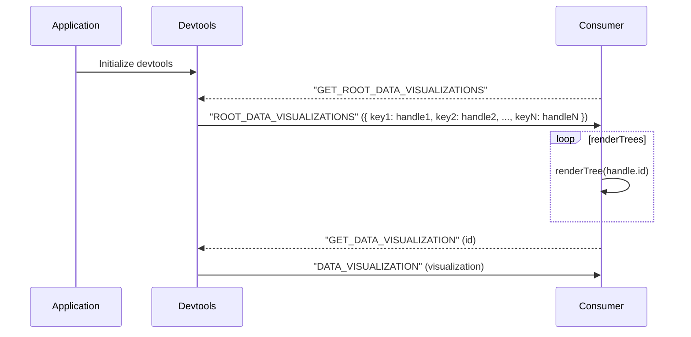

# SharedTree Visualizer

This documentation provides brief explanations on SharedTree and the mechanism behind the SharedTree visualizer.

SharedTree provides schematization of diverse node types requiring a careful attention when designing the tree.

SharedTree Visualizer leverages SharedTree API to access the different schema types and constructs a visual representation object that is compatible with the `@fluid-internal/devtools-view` package.

## What is a SharedTree?

A SharedTree is a DDS which stores application's data in a hierarchical structure from a strictly defined schema.

You may be interested in the following resources for more details:

-   https://fluidframework.com/docs/data-structures/tree/
-   https://github.com/microsoft/FluidFramework/tree/main/packages/dds/tree
-   https://github.com/microsoft/FluidFramework/tree/main/packages/dds/tree/docs

### Terms

Below are some of the SharedTree terminology that will be helpful in order to understand the remaining parts of the document:

-   `schema`: Specifies the overarching structure of the tree. Such as specific set of properties and node types of each
    -   `ObjectNode`: a TypeScript-like object with one or more named child properties. `ObjectNode` has a schema of type `ObjectNodeStoredSchema`.
    -   `MapNode`: a set of zero or more key-value pairs similar to a JavaScript Map object, but the keys can only be strings. `MapNode` has a schema of type `MapNodeStoredSchema`.
    -   `LeafNode`: a SharedTree node which can only contain a value and cannot have fields. `LeafNode` has a schema type `LeafNodeStoredSchema`.
-   `node`:
-   `field`:

## SharedTree Visualizer

Additionally, once a given DDS has been "rendered" for the first time, it will continue to broadcast automatic updates each time its contents change (i.e. each time the "op" event is fired on the DDS object).
Consumers can simply continue to listen for the `DATA_VISUALIZATION` message in order to receive updates as changes are made in the application.

The visual tree for a given DDS will always contain the unique DDS ID (so message consumers can correlate them correctly).
Their data format is likely best described by the code, so we won't go into it in too much depth here.
See `./VisualTree` for a type-wise breakdown.

At a high level, the DDS trees contain:

1.  Their ID
2.  Some root visual metadata
3.  Child trees / values

    -   These children will **always** be either nested visual trees describing primitive data, or a handle node pointing to another DDS.
        When such a node is encountered, the consumer may post another `GET_DATA_VISUALIZATION` message requesting the corresponding "rendering".

## Follow-Up Work

These follow-up items were noted above, but we will enumerate them here for completeness:

1.  Dependency tracking to avoid memory leaks
1.  Broadcast data _diffs_ instead of complete summaries.
    -   GraphQL might give us some nice options here.

Other follow-up items:

1.  Update batching
    -   For DDSs receiving rapid updates, we may not wish to broadcast updates on every single edit ("op" event).
        It would likely be worth introducing some simple, minimal time threshold in which we will post updates.
1.  Verify that the proposed flow is fast enough to prevent visual delays on the consumer side.
    -   I.e. we don't want the devtools extension to be displaying lots of spinners while it and the devtools chat back and forth.
