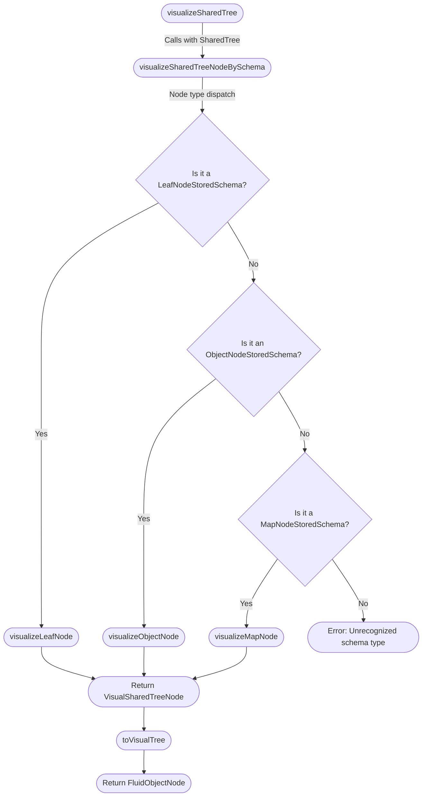

# SharedTree Visualizer

This documentation provides brief explanations on SharedTree and the mechanism behind the SharedTree visualizer.

SharedTree provides schematization of diverse node types requiring a careful attention when designing the tree.

SharedTree Visualizer leverages SharedTree API to access the different schema types and constructs a visual representation object that is compatible with the `@fluid-internal/devtools-view` package.

## What is a SharedTree?

A SharedTree is a DDS which stores application's data in a hierarchical structure from a strictly defined schema.

You may be interested in the following resources for more details:

-   https://fluidframework.com/docs/data-structures/tree/
-   https://github.com/microsoft/FluidFramework/tree/main/packages/dds/tree
-   https://github.com/microsoft/FluidFramework/tree/main/packages/dds/tree/docs

### Terms

Below are some of the SharedTree terminology that will be helpful in order to understand the remaining parts of the document:

-   `schema`: Specifies the overarching structure of the tree. Such as specific set of properties and node types of each
    -   `ObjectNode`: a TypeScript-like object with one or more named child properties. `ObjectNode` has a schema of type `ObjectNodeStoredSchema`.
    -   `MapNode`: a set of zero or more key-value pairs similar to a JavaScript Map object, but the keys can only be strings. `MapNode` has a schema of type `MapNodeStoredSchema`.
    -   `LeafNode`: a SharedTree node which can only contain a value and cannot have fields. `LeafNode` has a schema type `LeafNodeStoredSchema`.
-   `node`:
-   `field`:

## SharedTree Visualizer Logic

## Function Description

-   `visualizeSharedTreeNodeBySchema()`
    -   Main recursive helper function that creates a visual representation of a SharedTree node based on its schema type. It decides how to process the node (as a leaf, object, or map node) depending on the schema provided.
-   `visualizeLeafNode()`
    -   Converts a leaf node into its visual representation, specifically handling nodes that do not contain any child nodes.
-   `visualizeObjectNode()`
    -   Visualizes an object node, potentially containing multiple child nodes. It distinguishes between array nodes and non-array nodes using a specific key (EmptyKey), which represents an implicit array if present alone.
-   `visualizeMapNode()`
    -   Handles the visualization of map nodes, which are key-value pairs that may vary dynamically.
-   `createToolTipContents()`
    -   Generates tooltip content for nodes. In the SharedTree Visualizer context, it provides schema details (e.g., schemaName, allowedTypes) in a `VisualTreeNode` which is compatible in `@fluid-internal/devtools-view`.
-   `toVisualTree()`
    -   Converts the entire visual representation of the SharedTree returned from the `visualizeSharedTreeNodeBySchema()` to a `VisualChildNode` type which is compatible for visualization in `@fluid-internal/devtools-view`.

## Follow-Up Work

These follow-up items were noted above, but we will enumerate them here for completeness:

1. Stronger type validation of the returned object from the `toVisualTree()` which is dispatched to the `@fluid-internal/devtools-view`.
2. Establishing a more unified data type for the tooltip contents that is dispatched to the `@fluid-internal/devtools-view` and contain more rigorous information on the SharedTree schema.
