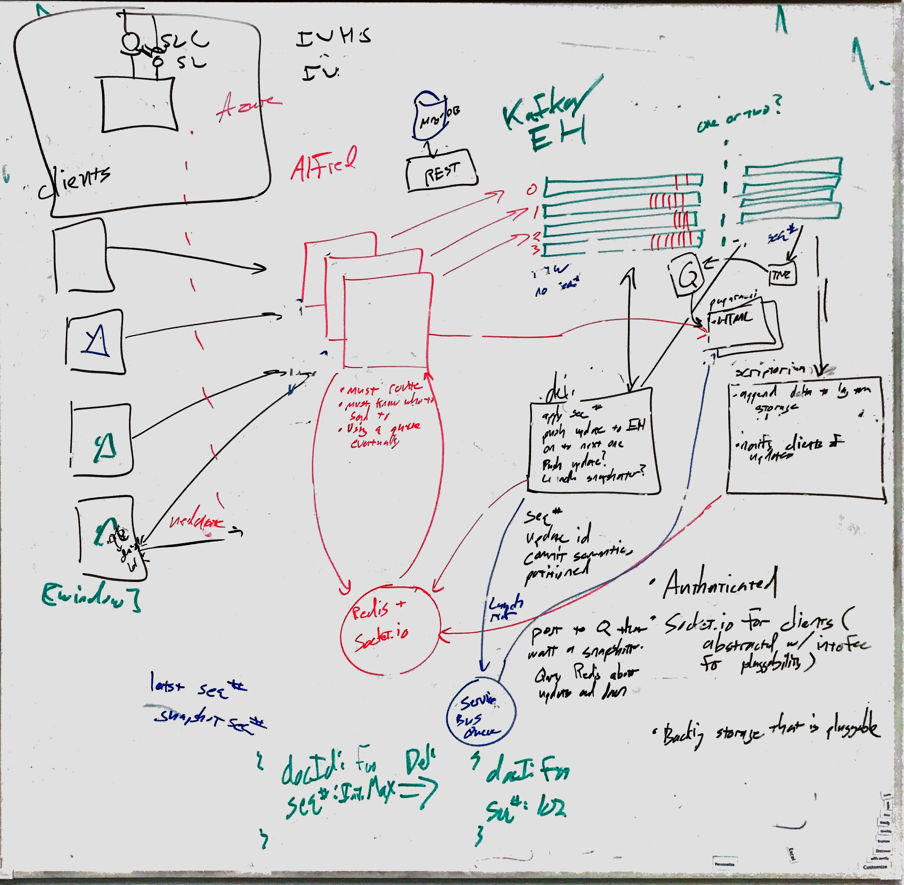

# Routerlicious

Routerlicious handles the receiving of delta operations and is responsible for the ordering and assignment of a
sequence number to them. Once assigned it is also responsible for notifying connected clients of a new sequence
number.

This repository splits the code into two separate sections. The core API is contained within src/api. This section
contains the core routerlicious code. But stubs out connections to external services behind provided interfaces.
This code is shared between clients and services.

A server implementation is contained within various other folders. These are named based on the architecture image below. This makes use of the API but provides implementations of
the interfaces. For instance connections are handled with socket.io. And cross machine communication is handled
via Redis.

The services follow the [twelve factor](https://12factor.net) methodology and are considered [cattle and not pets](http://cloudscaling.com/blog/cloud-computing/the-history-of-pets-vs-cattle/).

## Building and Running

### Prerequisities

Standalone 
* [Git LFS](https://git-lfs.github.com/) (comes by default with most git installations)
* [Docker](https://www.docker.com/)

For Development
* [Node v8.x](https://nodejs.org/en/)

### Development 

For the development setup we map your source tree directly into the container. This allows you to build/edit on your local
machine with your toolchain of choice. And the output is then run inside the container.

To start the service for development run the following commands:

* `npm install`
* `npm run build`
* `npm start`

If you also need debugging you can run:

* `npm run start:debug` - which will allow you to attach a debugger

### Standalone

You can also just run the service directly with Docker. To do so you first need to authenticate to our private
container registry by running:

* `docker login -u prague -p /vM3i=D+K4+vj+pgha=cg=55OQLDWj3w prague.azurecr.io`

Docker Compose is used to run the service locally. To start up an instance of the service simply run the following two commands.

* `docker-compose build`
* `docker-compose up`

## CI/CD

We make use of continuous integration and deployment via VSTS at https://offnet.visualstudio.com/officenet/

## Design principals

* Screw the Client
* Perf === Magic

## Architecture



## Distributed data structures

The API currently exposes four distributed data structures

* Text
* Map
* Cell
* Ink

## Logging

### Service

We make use of [Winston](https://github.com/winstonjs/winston) for logging on the service side. Winston adds in some nice features over the usual console like log levels, timestamps, formatting, etc...

It's easy to use though. Just import our configured logger via:

import { logger } from "../utils";

And then you can do logger.info in place of console.log as well as logger.error, logger.warn, logger.verbose, logger.silly to target different levels. The default filter only displays info and above (so error, warning, and info). But you can change this within logger.ts.

### Libraries

Within internal libraries we make use of the [debug](https://github.com/visionmedia/debug) library. Debug allows a
library to log messages to a namespace. By default these messages aren't displayed but can be enabled by the app
that is making use of the library. Debug is a popular package used by most major node modules (express, socket.io, etc...).

For our node apps enabling library logging is as simple as setting the DEBUG environment variable - i.e.

`DEBUG=routerlicious:*,connect:compress,connect:session`

This is already done in our docker compose files for our own internal libraries which are all under the routerlicous namespace.

In the browser you can enable them by setting localStorage.debug variable.

`localStorage.debug = 'routerlicious:*'`

After which you will need to reload the page.

## Viewing Snapshots

Git is used to store document snapshots and provide revision history. The git storage model maps well to our own
stream of delta messages. And git semantics as applied to document collaboration provide interesting areas for further
exploration (i.e. branching, forking, merging documents).

To view the git stored snapshots simply run

```
git clone ssh://git@localhost:3022/home/git/prague
cd prague
git checkout <document id>
```

Or `git clone ssh://git@gitrest.westus2.cloudapp.azure.com/home/git/prague` for our production site.

From there you can use your git repository management tool of choice to inspect the various documents and revisions
stored in the repository.
