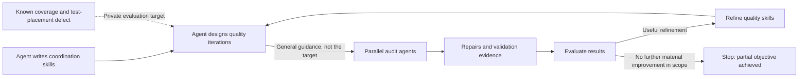

# Sea: Rust Service Presentation Draft

Status: refreshed collection complete at `92ecf30f4a7`: 60 browser samples, 180 passing repeated service samples, and 104 storage attempts; unsuccessful and invalid attempts retained separately.
Format: video under two minutes; audience [TBD: assumed technical audience].
Original documentation review: `47448965bef3459d8ae52a6c19a2ff63cec5b3b4`; current storage contracts rechecked at the refreshed revision.
Measurement date: 2026-09-20 (UTC).
Source and performance refresh: `92ecf30f4a7d17db882cc39e7c60d8d19c1042ba`, after the session-prefix and storage-pipeline changes.
The Node/WASM measurement harness required a one-line update to the current submit API; source, binaries, and harness hashes plus the tracked patch are retained in the [refresh evidence](measurements/refresh-92ecf30/README.md).
Historical browser baseline: `6b90ec847902393fae178da1893eb14964be08ad`; source inventory: `c5b9e4901226c73feb2b2909184f37defbb9a82f`; exploratory service loads: `427a6493177a89c1daf42e7296e86974efdbfd77`; repeated service loads: `782051315cc`.
Native generator and source-test inventory tooling: `3685c1985ab`; corrected fractional worker pacing and follow-up repeat matrix: `9449261083b`.
Buffered-file and eight-core harness support: `354fc17264f157897ef4ff674569de2af51adf44`.
Wrapped runs record their exact command and environment; direct collector campaigns retain configurations, revision, working-tree status, settings, and artifact hashes in manifests without a separate wrapper record.

## Video Outline

| Time | Visual | Message |
| --- | --- | --- |
| 0-15 seconds | Simplified architecture diagram | What Sea does |
| 15-75 seconds | AI workflow diagram, revealed in stages | Agent-written coordination skills, parallel iterations, private evaluation, refinement, and partial success before a plateau |
| 75-90 seconds | Source-size and matched-load memory bars | Source lines to maintain and service memory, with values labeled directly |
| 90-105 seconds | Small-op and large-op throughput bars | Repeated passing delivered operations/s and payload MiB/s |
| 105-115 seconds | Closing caption | Experimental single-host system; local comparison; quality improvements are not exhaustive assurance |

The sections below provide supporting notes, not a script to read in full.
Keep methodology and detailed results outside the video, with a short scope caption on each chart.
The AI workflow is the main narrative; charts should be understandable without a spoken explanation of their axes.

## AI Workflow Story

### Draft Narration

I used AI to build the development process as well as the service.
I had an agent write reusable skills for coordinating parallel groups of agents, which we call iterations.
Then I had an agent use that framework to design and run quality iterations.

That agent knew about a quality problem I wanted the process to catch: a bug fix had exposed missing test coverage, and the regression test added afterward was poorly placed.
The agents doing the audits were not told that specific target.
They had to work from the code, its contracts, and the general quality guidance.

We used the results to refine the skills and repeat the audits.
The hidden objective was partly achieved, then the process stopped producing further improvements within that scope.
The lesson was not that the code was now defect-free, but that the workflow itself could be tested, improved, and stopped when further runs stopped helping.

### Visual Aid



Reveal the diagram in three stages: coordination skills, the audit/refinement loop, then the stopping result.
Keep the private-target branch visually separate from the instructions sent to audit agents.
This is a conceptual workflow, not a claim that every command or validation step ran concurrently or without human direction.
Use a qualitative outcome caption, not an invented numerical code-quality score or improvement curve.

### Evidence and Wording Checks

The narration's private-target setup and partial outcome come from the project author's account.
Before recording, attach the exact defect, initial regression test, relevant iteration range, skill changes, and remaining unmet objective: [TBD].
Do not imply that a defect was deliberately inserted; this was an existing weakness used as an evaluation target.

The current [quality-iteration skill](../.github/skills/rust-service-quality-iteration/SKILL.md) keeps private evaluation expectations out of worker prompts, requires tests that discriminate the owning behavior, and defines scope-bounded stopping conditions.
[Iteration 0016's skill review](historical/iterations/0016/skill-review.md) records a focused repair, retention of the refined guidance, and a decision to stop unconditional reruns.
[Iteration 0017's convergence assessment](historical/iterations/0017/phase-3-report.md#convergence-assessment) records a later bounded audit with repairs and deferrals, not exhaustive coverage.
These records support the method and its limits; they do not by themselves establish the complete private-evaluation chronology.

"Converged" here means that further runs stopped finding material improvements within the chosen scope and budget.
It does not mean that every quality defect was found, the hidden objective was fully achieved, or future reassessment cannot help.

## 1. What Is Sea?

Sea (Snapshotted Event Archive) is an experimental Rust service for ordered application events, immutable blob trees, and snapshots.
Applications recover by loading a snapshot and replaying later events.
You can use it locally or over WebTransport, with shared native and browser client implementation and selectable storage backends.
Fluid integration is an adapter, not a requirement of the core service.

**Presentation question:** What can a smaller, application-independent service model offer, and what does it leave out?

This is a speculative learning project, not a proposed production replacement for an existing Fluid service.
The measurements below describe selected local workloads, not production capacity, cost, or readiness.

## 2. How It Fits Together


This is a simplified logical view; storage can use memory, buffered-file, or durable-file backends.
Those backends are alternatives, not replicas.
The sequencer owns event ordering, session-prefix recovery, author membership, and snapshot publication authority.
Applications own event meaning, snapshot content, and when snapshots are generated.
Optional session decorators support compression and encryption.
Ephemeral signals are separate from persisted events and are omitted from this diagram.

Sources: [project overview](README.md) and [architecture](SEA_ARCHITECTURE.md).

## 3. Advantages to Evaluate

| Design property present today | Potential advantage, not yet a measured conclusion | Evidence to present |
| --- | --- | --- |
| Application-independent events, blobs, and snapshots | Reuse beyond Fluid applications | [TBD: brief counter example or application trace] |
| Local and remote access through session contracts | Reuse application logic across environments | [TBD: equivalent local and remote correctness trace] |
| Memory, buffered-file, and durable-file backends | Choose persistence costs explicitly | [TBD: latency, throughput, and resource results labeled by acknowledgment guarantee] |
| Snapshot loading followed by event replay | Reduce recovery work relative to replaying full history | [TBD: time to usable state versus replay backlog] |
| Direct SharedTree integration alongside the Fluid driver | Explore reduced runtime overhead and batched backlog processing | [TBD: optional matched trace; list omitted runtime features] |

Rust and WebTransport are implementation choices, not proof of a performance advantage.
A comparison between complete stacks cannot attribute a difference to language alone.

### Headline Selection

Use four simple two-series charts across two video frames, leaving time for the AI workflow diagram.
Retain detailed results and source-category breakdowns in the appendix.
Report neutral or unfavorable results too.

| Question | Proposed measurement and boundary | Result placeholder | Proposed visual |
| --- | --- | --- | --- |
| How much source is maintained? | Repository-owned native/server dependency scopes, including tests and conditional code | Sea: 19,211; Tinylicious: 35,927 source lines; these scopes do not provide equivalent features | Source lines to maintain; scope caveat must remain visible |
| How much memory does the service use? | Main service process at 500 ops/s, with identical document/client counts and duration | Small payload: Sea 42.49 versus Tinylicious 168.53 MiB; large payload: 74.75 versus 220.72 MiB; medians of ten run means at `92ecf30f4a7` with the corrected harness | Service memory at 500 ops/s; resident set size (RSS) in MiB |
| How efficiently are small operations handled? | Minimal clients, 64-byte payloads, four service cores, one observer per writer | Native Sea WebSocket median: 23,997.75 ops/s; WebTransport: 11,998.20; Tinylicious: 749.75; ten passing runs per tested load at the refreshed revision | Tested delivered ops/s, not exact maxima or a capacity speedup ratio |
| How efficiently are large operations handled? | Same clients with 8,192-byte payloads | Native Sea WebSocket median: 93.7383 MiB/s; WebTransport: 46.8641; Tinylicious: 5.8574; ten passing runs per tested load at the refreshed revision | Tested payload MiB/s; actual wire bandwidth was not measured |

### Chart Presentation Rules

- Label Sea and Tinylicious directly, with absolute values and units on each bar; keep their order and colors consistent.
- Start bar axes at zero; avoid stacked categories, dual axes, legends that require cross-reference, and decorative effects.
- Put one comparison in each chart and one short conditions caption beneath it: same machine, resource budget, payload size, fan-out, and persistence mode as applicable.
- Show repeated-run variability with a simple range marker defined in the caption; do not imply precision beyond the data.
- Select the workload and source-count scope before seeing results, not whichever makes Sea look best.
- Use a memory load that both systems sustain, not each system's different maximum; retained history and run duration must match.
- Keep CPU/load curves, latency/error thresholds, scaling sweeps, and detailed bandwidth accounting in the report.
   If a scaling curve is the strongest finding, replace a chart rather than adding another crowded visual.

The repeated samples and backlog curves have been reviewed; use the tables below as chart inputs.
Do not turn different tested lower bounds into a maximum-throughput speedup ratio.
Tinylicious now has ten-repeat points at 750 ops/s for both payloads on one and four service cores, in addition to the 500 ops/s matched-resource point.
For the throughput video frame, label the bars as tested loads and name the client, transport, and storage; no exact capacity maximum was established for either stack.

"Source lines to maintain" describes source scope, regardless of whether people or AI produced it.
Exclude generated output, vendored dependencies, and build artifacts from that count; include maintained generators and templates.
Disclose runtime dependencies and required companion services separately rather than implying that excluded code has no operational or maintenance cost.
Line count is a source-size indicator, not a direct measure of complexity, quality, or maintenance effort.

For throughput, count unique operations and recipient deliveries separately so additional readers cannot silently inflate the operation rate.
Report useful payload bandwidth separately from protocol overhead and ingress/egress wire traffic.
Measure the whole service process group, including required Tinylicious companion processes, and report client resource use separately.

Tinylicious is a local-development baseline, not a proxy for a deployed Routerlicious or ODSP service.
The original two stress configurations use memory-backed operation storage, but have different protocols, metadata, and service responsibilities.
The newer durable-file comparison explicitly adds synchronized persistence and is not durability-equivalent to Tinylicious's default operation database.
Sea buffered-file provides a useful non-durable file-storage comparison, but still writes operation journals to the operating system while Tinylicious keeps its operation database in memory.
Buffered-file acknowledgment does not guarantee power-loss survival; current recovery truncates structurally incomplete tails but rejects corrupt frames.
Treat this as a labeled stack trade-off comparison without a language-only speedup headline.

Reuse existing client-overhead benchmarks as supporting evidence in the report, after checking their measurement boundaries and configurations.
Keep application-client overhead separate from minimal-client service-capacity results.
Snapshot recovery, compression on/off, and browser artifact size are optional follow-ups, not headline experiments for this video.

## 4. Limitations and Trade-offs

| Boundary | Current limitation | Consequence for the presentation |
| --- | --- | --- |
| Deployment and availability | Single-host server; no replication or cross-host fencing | Do not infer high availability, distributed durability, or scale-out capacity |
| Durability | Durable-file requires synchronized-prefix integrity under interrupted append/truncate, reliable flushes, and crash-atomic creation; target-platform power-cut qualification is outstanding | Distinguish deterministic recovery tests from actual power-loss qualification; do not equate buffered and durable acknowledgments |
| Retention | No garbage collection for events, snapshots, blobs, directories, or unattached uploads | Short runs do not establish bounded long-term storage or memory use |
| Security | Built-in host lacks authentication and multi-tenant policy | Controlled experimental environments only; encryption is not access control |
| Confidentiality | Encryption leaves directory names, topology, ordering metadata, and snapshot metadata visible | Do not describe the archive as hiding all application metadata |
| Fluid compatibility | Automatic reconnect, offline merge, loading groups, and garbage-collection policy remain incomplete | Passing selected integration tests is not production driver compatibility |
| Network access | QUIC/UDP WebTransport does not pass through TCP-only Codespaces forwarding; an optional WebSocket transport has different constraints | Record the actual transport; do not label WebSocket results as WebTransport results |
| Build and delivery | Network-isolated CI currently has a documented Cargo dependency-restoration gap | Local build success is not evidence of a working production delivery pipeline |

Sources: [known issues](KNOWN_ISSUES.md), [durable backend assumptions](crates/sea-file-durable/README.md#power-loss-model), and [architecture](SEA_ARCHITECTURE.md).
Recheck these limitations at the measurement commit before presenting them.

### Validation Evidence

At the refreshed revision, Cargo formatting, strict all-target/all-feature Clippy, warning-free rustdoc, all-target build, all-target/all-feature tests, release binary builds, documentation checking, scoped policy, and root `pnpm build:fast` all passed.
The historical Clippy failure below is resolved at this revision.
Root build regenerated release SIMD WASM and production-minified browser bundles; native server and generator were rebuilt together.
All 60 browser samples passed convergence checks, and all 180 corrected repeated service samples passed with zero final errors or missing deliveries.
The harness API repair passed a 32-document smoke at 500 ops/s and its Biome check; it changes no service implementation or customer API.
The full non-Rust `./test.sh` was not rerun for this recollection.
Validation logs and exact campaign commands are retained in the [refresh evidence](measurements/refresh-92ecf30/summary.json).

#### Historical Validation

The following paragraphs describe the earlier collection only, including failures that no longer apply to the refreshed revision.

The connection-limit change passed the canonical Cargo formatting, Clippy, rustdoc, build, and all-target/all-feature test gates.
Its unit test checks the unchanged default, accepted bounds, invalid inputs, and preservation of other transport settings.
The scoped policy check, documentation check, and repository `pnpm build:fast` passed after generated JSON formatting was corrected.
Optimized browser smoke tests and ten repetitions of all six browser paths passed their convergence checks.
The stress harness checks exact payload, uniqueness, and per-document order at both the writer and observer, then drains outstanding deliveries.
The full non-Rust `./test.sh` suite was not run for this collection task.
The earlier successful Cargo and repository-build logs were in `/tmp` and did not survive the host reboot.
Those passes are observations recorded during collection, not independently retained logs in this evidence directory.

For the native-generator follow-up, focused benchmark tests and Clippy, Cargo formatting, rustdoc, workspace build, scoped policy, and the repository build passed.
The later full-workspace Clippy gate failed on the server entrypoint's 102-line `main` exceeding its 100-line limit; that entrypoint was not changed by the native follow-up.
The first full-workspace test gate had a timeout in `host::tests::native_client_round_trip_in_every_storage_mode`; its isolated retry and the final full-workspace rerun both passed.
The final formatting, rustdoc, workspace build, full-workspace tests, policy, and repository build passed after restoring the benchmark package's default executable.
Clippy remains an unresolved full-workspace gate, so this is not a clean all-gates pass.
The [follow-up test log](measurements/2026-09-20/followup-test.log), [isolated retry](measurements/2026-09-20/followup-roundtrip-retry.log), [rustdoc](measurements/2026-09-20/followup-rustdoc.log), [workspace build](measurements/2026-09-20/followup-build.log), and [repository build](measurements/2026-09-20/followup-root-build.log) are retained.
Final [full-workspace tests](measurements/2026-09-20/followup-final-test.log), [Clippy failure](measurements/2026-09-20/followup-final-clippy.log), and [repository build](measurements/2026-09-20/followup-final-root-build.log) are also retained.
After the storage-selection harness change, formatting, rustdoc, workspace build/tests, documentation, and scoped policy passed again; [storage follow-up tests](measurements/2026-09-20/storage-final-test.log) and the [same unresolved Clippy failure](measurements/2026-09-20/storage-final-clippy.log) are retained.
No server, native generator, Rust source, or Cargo build input changed for this storage sweep; the optimized binaries were reused with hashes recorded in each manifest.
For the buffered-file/eight-core report update, all 63 attempts were reconciled against matrices, manifests, and raw results; all 48 reported threshold entries and local report links were checked.
The server and native generator hashes match across both storage sweeps and the binaries retained after cleanup.
This reporting follow-up changes documentation only; Rust build/test gates were not rerun, and the previously recorded full-workspace Clippy failure remains unresolved.

Tests can support specific ordering, replay, and lifecycle claims.
They do not establish production availability, security, unlimited capacity, or survival of physical power loss.
Single-round-trip document loading and complete direct SharedTree summary support need verification before being presented as capabilities.

## 5. Provisional Conclusion

Sea explores a reusable service model with explicit storage choices and native/browser access.
Its appeal is the separation of application logic, coordination, transport, and persistence.
The evidence separates promising multi-document service behavior from an unfavorable Fluid-adapter browser result.

- Demonstrated within this workload: native Sea WebSocket passed ten runs each at 24,000 small operations/s and 12,000 large operations/s with four service cores; native WebTransport passed at 12,000 and 6,000 respectively; Tinylicious passed at 750 for both payloads on one and four cores.
- At the refreshed matched 500 ops/s load, Sea service RSS and CPU were lower than Tinylicious; throughput-point memory must not substitute for this equal-work comparison.
- Important unfavorable result: the refreshed optimized Tinylicious browser path had a median of 3,421 operations/s versus 1,360 for Sea's WebTransport Fluid path in the existing benchmark.
- AI workflow lesson: evaluation-driven skill refinement partly achieved the private objective; stopping did not establish complete code quality.
- Appropriate use today: controlled experiments with application-specific validation.
- Candidate engineering priorities: investigate the buffered-file regressions and inconsistent durable-file stalls/startup failures, alongside the Fluid adapter and higher-load WebTransport path; long-term retention remains a separate requirement.

## Collected Evidence

### Source Lines to Maintain

Source counts use cloc 2.06, distributed as pinned npm `cloc@2.6.0`, at clean revision `92ecf30f4a7`.
The [source inventory script](scripts/presentation-collect.mjs) counts tracked Rust, TypeScript, and JavaScript sources.
Duplicate-content files are counted separately because both paths are maintained.
Generated source-count evidence is disposable; the script and Git revision provide reproducibility.
From the repository root at that revision, regenerate the inventory in a temporary directory:

```bash
cargo build --manifest-path rust-service/Cargo.toml --release -p sea-benchmarks --bin presentation-test-spans
node rust-service/scripts/presentation-collect.mjs source "$(mktemp -d)"
```

| Scope | Files | Code lines | Comment lines | Test/support code subset | Other code |
| --- | ---: | ---: | ---: | ---: | ---: |
| Sea native server local non-development dependency closure | 50 | 19,211 | 2,045 | 7,090 | 12,121 |
| Tinylicious local server dependency closure | 335 | 35,927 | 7,538 | 10,775 | 25,152 |
| Tinylicious wrapper only, a subset of the preceding row | 35 | 2,442 | 356 | 472 | 1,970 |
| Sea TypeScript clients and adapters, separate from native scope | 24 | 5,628 | 716 | 2,669 | 2,959 |

The dependency scopes follow manifests, not linker reachability.
They include tests, Rust inline tests, and conditionally compiled features.
The refreshed inventory uses the same dependency scopes and test classification as the [earlier expanded inventory](measurements/2026-09-20/source-breakdown/source-summary.json): test directory/file names plus syntax-derived Rust `#[cfg(test)]` module and test-function spans.
Compared with the preceding session-refactor inventory at `470af450878`, Sea native code increased by 1,549 lines, including 852 test/support lines, and one file.
Tinylicious and TypeScript adapter counts are unchanged.
These updated source counts do not by themselves refresh the historical performance measurements.
Test/support code is a subset of code lines, not a number of test cases; comments are a separate cloc category.
The corresponding test/support comment counts are 28, 809, 33, and 50 for the four rows above.
Complex Rust conditional expressions, test fixtures outside recognized paths, and integration tests outside the selected `src` scopes are not included in that subset.
Therefore "other code" is not a claim that every remaining line runs in production.
Generated entrypoints, package-version files, build output, and external dependencies are excluded.
The Tinylicious closure includes shared service modules with responsibilities beyond this experiment.
These are inventories, not equivalent implementations or a quantified maintenance-effort reduction.

### Optimized Browser Baseline

The [refreshed browser baseline](measurements/refresh-92ecf30/browser/run.json) ran ten repetitions per path at `92ecf30f4a7`, each with 100 warmup and 1,000 measured edits.
All 60 samples passed convergence checks; the [earlier baseline](measurements/2026-09-20/optimized-client-baseline/run.json) remains historical evidence.
The existing benchmark uses a lightweight SharedObject carrying captured SharedTree operation bodies, with Fluid envelopes and ID allocation on applicable paths, one writer, and one observer.
It verifies final convergence.

| Path | Storage backend | Median operations/s | Minimum to maximum operations/s |
| --- | --- | ---: | ---: |
| Rust local direct | Sea memory | 9,225 | 8,361-9,569 |
| Rust local Fluid | Sea memory | 2,222 | 2,201-2,261 |
| TypeScript local | Browser `sessionStorage` database | 810 | 735-948 |
| Rust WebTransport, Fluid | Sea memory | 1,360 | 1,293-1,385 |
| Rust WebTransport, direct | Sea memory | 2,872 | 2,769-2,952 |
| Tinylicious | In-memory database; filesystem Git summaries | 3,421 | 2,912-3,606 |

Native Rust and WebAssembly (WASM) use release builds; WASM also enables SIMD.
All browser benchmark bundles use esbuild minification and an explicit production `NODE_ENV` definition.
No webpack bundle participates in this benchmark, and no custom Cargo profile or link-time optimization was introduced.
Earlier unminified browser samples are retained but superseded.

Browser and service processes shared an eight-core affinity set, and path order was fixed.
The external services lived across their ten browser samples, so their peak RSS includes different histories and startup effects.
Those peaks are not the matched-load memory comparison.
The direct paths omit Fluid runtime responsibilities and cannot be presented as drop-in equivalent drivers.

### Refreshed Service Measurements

All tables in this section use the merged revision and supersede the historical service sections below.
The [machine-readable summary](measurements/refresh-92ecf30/summary.json) includes raw-sample metrics, manifests, build hashes, commands, sample standard deviations, nearest-rank p95, and per-worker backlog-quarter means.
The original 80-attempt refresh had a stale Node/WASM submit call: all 60 Sea attempts failed, while 20 Tinylicious samples passed.
Those attempts are retained but excluded from the corrected comparison; the entire alternating matrix was rerun, not just the failed rows.
No production optimization was made during recollection.
Changes since the historical measurements include both session-prefix identity removal and storage-pipeline work, so differences cannot be attributed solely to storage optimization.

#### Matched Resources and Node/WASM Loads

All 80 corrected samples passed: ten fresh processes per point, 32 documents, one writer and observer each, three seconds of warmup, and ten measured seconds.
The matched 500 ops/s loads use four service cores and four separate physical generator cores.
Sea uses memory storage and its Node/WASM WebSocket client; Tinylicious uses its Node Socket.IO client, in-memory operation database, and filesystem Git summaries.
RSS is the median of ten measured-window means, with its full range; CPU is the median, where 100% means one occupied core.
Latency is the median of each run's worst-worker p95, not a pooled percentile.

| Payload | Service | Mean RSS median (min-max), MiB | CPU, % | Worst-worker p95 median, ms |
| --- | --- | ---: | ---: | ---: |
| 64 bytes | Sea | 42.49 (42.40-42.64) | 9.43 | 0.46 |
| 64 bytes | Tinylicious | 168.53 (167.57-170.99) | 38.81 | 2.14 |
| 8,192 bytes | Sea | 74.75 (74.69-74.86) | 14.85 | 0.71 |
| 8,192 bytes | Tinylicious | 220.72 (218.28-222.40) | 48.09 | 3.04 |

Every matched sample delivered 500 ops/s during the window.
Compared with the historical medians, Sea RSS changed from 44.00 to 42.49 MiB for small payloads and from 107.19 to 74.75 MiB for large payloads.
This is an equal-work process-memory comparison, not a long-term bounded-memory guarantee.

The remaining Node/WASM Sea memory points also passed ten runs each:

| Payload | Service cores | Delivered ops/s median (min-max) | Payload MiB/s | CPU, % | RSS median, MiB | Worst-worker p95 range, ms |
| --- | ---: | ---: | ---: | ---: | ---: | ---: |
| 64 bytes | 1 | 11,997.15 (11,975.00-11,998.90) | 0.7322 | 78.72 | 73.05 | 2.66-14.76 |
| 64 bytes | 4 | 15,998.05 (15,994.30-15,999.80) | 0.9764 | 153.92 | 86.47 | 3.07-3.24 |
| 8,192 bytes | 1 | 5,998.75 (5,997.70-5,999.50) | 46.8652 | 79.50 | 421.57 | 6.97-10.94 |
| 8,192 bytes | 4 | 7,997.95 (7,997.10-7,999.00) | 62.4840 | 143.86 | 550.85 | 3.22-10.57 |

#### Native Transport and Tinylicious Repeats

All 100 follow-up samples passed, ten per point, with alternating point order and the same timing and document counts.
Sea uses release native generators, one single-thread Tokio process per generator core, and memory storage.
The six Sea rows use four service cores and four separate generator cores; WebTransport includes QUIC/TLS while loopback WebSocket is unencrypted.

| Transport | Payload | Offered ops/s | Delivered ops/s median (min-max) | Payload MiB/s | CPU, % | RSS median, MiB | Worst-worker p95 range, ms |
| --- | --- | ---: | ---: | ---: | ---: | ---: | ---: |
| WebSocket | 64 bytes | 12,000 | 11,999.00 (11,996.20-12,002.10) | 0.7324 | 119.05 | 78.18 | 0.98-1.02 |
| WebTransport | 64 bytes | 12,000 | 11,998.20 (11,996.60-12,000.90) | 0.7323 | 157.63 | 49.79 | 2.19-2.64 |
| WebSocket | 64 bytes | 24,000 | 23,997.75 (23,994.40-24,001.70) | 1.4647 | 229.20 | 111.16 | 1.89-2.04 |
| WebSocket | 8,192 bytes | 6,000 | 5,999.50 (5,998.70-6,000.00) | 46.8711 | 93.43 | 423.80 | 0.94-0.99 |
| WebTransport | 8,192 bytes | 6,000 | 5,998.60 (5,998.00-5,999.70) | 46.8641 | 156.70 | 399.58 | 2.64-2.87 |
| WebSocket | 8,192 bytes | 12,000 | 11,998.50 (11,996.00-12,000.10) | 93.7383 | 180.82 | 804.47 | 1.87-1.91 |

At paired loads, WebSocket still uses less service CPU and has lower latency, while WebTransport uses less RSS; unequal security and implementation prevent a protocol-only conclusion.
Median summed generator CPU-seconds are 8.13, 9.72, 15.27, 8.11, 12.53, and 15.69 in table order.
No individual native-repeat generator exceeded 4.00 CPU-seconds across warmup, measurement, and drain, leaving headroom in these repeated workloads.

Tinylicious's repeated 750 ops/s points also passed all ten samples each, using four Node generator cores:

| Payload | Service cores | Delivered ops/s median (min-max) | Payload MiB/s | CPU, % | Worst-worker p95 range, ms |
| --- | ---: | ---: | ---: | ---: | ---: |
| 64 bytes | 1 | 749.90 (748.90-750.10) | 0.0458 | 64.76 | 5.70-12.89 |
| 64 bytes | 4 | 749.75 (749.40-750.10) | 0.0458 | 62.70 | 2.79-3.14 |
| 8,192 bytes | 1 | 749.65 (745.60-749.90) | 5.8566 | 78.62 | 8.91-60.22 |
| 8,192 bytes | 4 | 749.75 (748.90-749.90) | 5.8574 | 77.68 | 3.52-5.30 |

All repeated samples drained with zero errors or missing deliveries.
Window-end pending totals reached 221 in the Node/WASM campaign and 44 in the native/Tinylicious campaign; the automatic flag alone does not establish stable queues indefinitely.
Every native Sea repeat ended its measured window with zero pending operations; the follow-up's pending deliveries were Tinylicious's.
These are repeated passing tested loads, not capacity maxima or a cross-stack capacity ratio.

#### Storage and Core Exploration

The refresh contains 104 attempts: 48 probes of historical passing/failing points, 43 refinements, 12 final midpoints, and one corrected midpoint.
There are 57 threshold passes, 42 completed threshold failures, and five pre-measurement failures.
Two of those five are invalid 4,250 ops/s native configurations: dividing by four generators gives a fractional rate, but the native worker requires an integer.
The corrected 4,252 ops/s probe passed; the other three startup failures are durable-file at 120 large ops/s and remain unresolved.
All outcomes remain in the evidence, including the low-rate durable failures and buffered-file regressions.

Sea uses native WebSocket for every storage cell; Tinylicious retains its Node Socket.IO configuration.
Storage files stay on the workspace ext4 loop device, not `/tmp`; fresh services and documents retain history for three warmup and ten measured seconds.
Service affinity is CPU 2, CPUs 2,4,6,8, or CPUs 0,2,4,6,8,10,12,14; all generators use four distinct cores at 16,18,20,22.
Every call submits one event; the workload's serial per-document queue does not deliberately fill the backend's grouped-append window.

Rates below are offered ops/s, written as highest observed threshold pass / higher completed threshold failure.
They are single-point observations, not repeated capacity brackets; durable rows especially are non-monotonic.

| Payload | Service cores | Sea memory | Sea buffered-file | Sea durable-file, inconsistent | Tinylicious in-memory DB | Tinylicious LevelDB |
| --- | ---: | ---: | ---: | ---: | ---: | --- |
| 64 bytes | 1 | 9,500 / 10,000 | 7,000 / 8,000 | 4,000 / 6,000 | 950 / 1,000 | 250 / 500 |
| 64 bytes | 4 | 46,000 / 48,000 | 26,000 / 28,000 | 2,000 / 4,000 | 950 / 1,050 | 900 / 950 |
| 64 bytes | 8 | 88,000 / 92,000 | 46,000 / 48,000 | 2,000 / 4,000 | 950 / 1,050 | 900 / 950 |
| 8,192 bytes | 1 | 6,000 / 6,500 | 4,252 / 4,500 | 500 / 1,000 | 850 / 900 | 100 / 250 |
| 8,192 bytes | 4 | 28,000 / 30,000 | 17,000 / 18,000 | 2,000 / 4,000 | 850 / 900 | 100 / 250 |
| 8,192 bytes | 8 | 38,000 / 40,000 | 30,000 / 32,000 | 160 / 500 | 800 / 850 | 100 / 250 |

Tinylicious supports selecting its file-backed LevelDB adapter with `db:inMemory=false` and `db:path`; both database configurations also use filesystem Git summary storage.
The [original LevelDB follow-up](measurements/tinylicious-leveldb/README.md) retains six pre-load failures at the pinned revision: the adapter lacked the `checkpoints` collection.
The [repaired LevelDB follow-up](measurements/tinylicious-leveldb-fixed/README.md) supplies the table's LevelDB column using the same workload, CPU allocation, and workspace ext4 filesystem.
Unlike the other columns and source counts, these results include an uncommitted Tinylicious compatibility repair on top of `92ecf30f4a7`: checkpoint records are indexed by `_id`, and inserting an upsert retains its filter's identity fields.
The repair passed all 22 Tinylicious tests, including checkpoint update, isolation, deletion, and database-reopen coverage; both storage modes also passed 500 ops/s smoke checks.
There are 33 new boundary attempts: six threshold passes, 26 completed threshold failures, and one pre-load harness failure because the database marker was checked before LevelDB finished opening.
The marker check now runs after document creation and connection, before load; the failed attempt remains in the evidence.
These attempts and three new smoke/control runs are separate from both the original blocked follow-up and the 104 storage attempts summarized above.
The lower observed passes are not proof of a capacity ceiling: one-core small payloads fail at 500 ops/s with 109 ms worst-worker p95, and large payloads fail at 250 ops/s with 128-361 ms p95, despite no final errors or missing deliveries.
The gaps between lower passing and failing observations were not exhaustively searched, and these are not repeated capacity brackets.
File-backed LevelDB alone must not be equated with Sea's synchronized durable acknowledgment contract; the current adapter's writes do not explicitly request synchronous persistence.

Passing retains the original criteria: at least 98% of offered work submitted and delivered in-window, each worker p95 and scheduling lag at most 100 ms, and no final errors or missing deliveries.
Backlog trend is not part of that flag.
Four-core buffered-file at 17,000 large ops/s passed with 398 pending operations and summed backlog-quarter means rising from 0 to 1.9, 20.4, and 197.8; all drained, but this is not a stable-queue claim.
At 26,000 small ops/s, its quarter means were 77.8, 13.7, 505.2, and 488.0 despite zero pending at window end.
The lower 24,000-small and 16,000-large probes passed; the highest passing rows should not replace the repeated memory-only chart points.

Eight-core memory at 88,000 small ops/s delivered 87,956.4 with 69.71 ms p95, 709.84% service CPU, and 121 pending operations before drain.
The busiest generator used 12.56 CPU-seconds over approximately 13 seconds, leaving little headroom; the 92,000 failure is not an isolated server ceiling.
Eight-core memory at 38,000 large ops/s delivered 37,992.8 (296.82 payload MiB/s), with 7.79 ms p95 and 4,025.55 MiB peak RSS.
At 40,000, the sampled RSS reached about 4,161 MiB and the service was terminated by the 4 GiB guard, causing missing deliveries.
The retained-history memory boundary moved from the old 19,000/20,000 observations but still prevents a long-term capacity claim.

Buffered-file's highest small-op passes fell from the historical 32,000 to 26,000 on four cores and 60,000 to 46,000 on eight cores.
Its one-core large pass fell from 4,500 to 4,252, while eight-core large delivery now passes at 30,000 because the old memory guard no longer intervenes at 20,000.
These mixed results are consistent with the [storage optimization report's](STORAGE_OPTIMIZATION.md) unresolved singleton handoff cost, but this remote experiment does not isolate that cost or attribute a causal fraction.

Durable-file cannot be summarized as a clean speedup: one-core 120-large-op latency failed at 6,236 ms before a retry passed; four-core 700-small failed before passing; four/eight-core 120-large attempts had resets or startup failures despite later higher-load passes.
The eight-core 500-large failure had 816.56 ms p95, whereas four cores passed at 2,000 large ops/s.
The underlying cause of this variability is unisolated, and additional cores did not consistently help.
Tinylicious's highest passing points also accumulated late-window backlog and drained; no indefinite queue stability is inferred.

Current durable-file appends only new frames to the existing journal and synchronizes once per event batch, with no retained-history copy or per-append directory synchronization.
Creation still uses synchronized staging and rename.
Acknowledgment depends on the [documented interrupted-tail and synchronized-prefix integrity assumptions](crates/sea-file-durable/README.md#power-loss-model), not merely the presence of `fsync`; physical power-cut qualification is outstanding.
Buffered-file does not synchronize each append, and both file modes retain complete history in memory.
Tinylicious's default operation database is in memory, so these are labeled stack comparisons, not equal-durability tests.

### Historical Service Workload and Exploratory Boundaries

Everything from this heading through the historical native comparison describes the pre-session/storage-refactor binaries, not the current implementation.
In particular, the replacement-journal durability explanation below is historical and is superseded by the current append contract above.

This table supersedes the original Node/WASM exploratory boundaries with **release native Sea generators over unencrypted WebSocket**, holding transport fixed across **memory**, **buffered-file**, and **durable-file** storage.
Tinylicious uses its **Node Routerlicious Socket.IO client, in-memory document/operation database, and filesystem Git summary storage**.
All new cells use 32 independent documents, one writer and one observer per document, four generator processes on separate physical cores, three seconds of warmup, and ten seconds of measurement.
Each cell starts a fresh service and fresh documents; no application snapshots are requested.

The [finer sweep](measurements/2026-09-20/native-storage-fine/run.json) contains 48 samples, followed by [14 targeted midpoint and lower durable-rate probes](measurements/2026-09-20/native-storage-midpoints/cells/manifest.json).
The [62-cell summary](measurements/2026-09-20/native-storage-summary.json) reconciles configurations and raw results against both manifests and retains latency, resources, errors, and per-worker backlog-quarter means.
The subsequent [48-attempt buffered-file/eight-core sweep](measurements/2026-09-20/buffered-eight/cells/manifest.json), [12 refinements](measurements/2026-09-20/buffered-eight-midpoints/cells/manifest.json), and [three final midpoints](measurements/2026-09-20/buffered-eight-final/cells/manifest.json) add 63 attempts at revision `354fc17264f`.
All 63 configurations and raw results reconcile with their matrices, manifests, and aggregates; 62 reached measurement and one durable-file attempt failed before workers were ready.
The new campaigns used the same optimized server and native generator binaries; no service data-path code changed.
These are **single-sample exploratory boundaries**, not ten-repeat capacity estimates or exact maxima; the existing repeated results below remain separate.

All table rates are **offered operations/s**, written as **passing / nearby failing** under the short-run thresholds.

| Payload | Service cores | Sea memory, native WebSocket | Sea buffered-file, native WebSocket | Sea durable-file, native WebSocket | Tinylicious, Node Socket.IO |
| --- | ---: | ---: | ---: | ---: | ---: |
| 64 bytes | 1 | 9,000 / 10,000 | 5,000 / 6,000 | 300 / 400 | 950 / 1,000 |
| 64 bytes | 4 | 44,000 / 46,000 | 32,000 / 34,000 | 600 / 700 | 950 / 1,050 |
| 64 bytes | 8 | 76,000 / 80,000 (backlog guard) | 60,000 / 62,000 | 600 / 700 (resets) | 950 / 1,050 |
| 8,192 bytes | 1 | 5,500 / 6,000 | 4,500 / 5,000 | 80 / 120 | 800 / 850 |
| 8,192 bytes | 4 | 19,000 / 20,000 (RSS guard) | 18,000 / 19,000 | 120 / 160 | 800 / 850 |
| 8,192 bytes | 8 | 19,000 / 20,000 (RSS guard) | 19,000 / 20,000 (RSS guard) | 120 / 160 | 800 / 850 |

Memory probes used 1,000 ops/s small-payload steps on one core and 4,000 on four cores, followed by a 46,000 midpoint; large-payload steps were 500 and 2,000, followed by a 19,000 midpoint.
Durable small-payload probes used 200 ops/s steps followed by 300/700 midpoints; large-payload failures at 200 prompted a 40/80/120/160 sweep.
Tinylicious used 50 ops/s steps from 800 to 950, followed by 1,000 on one core and 1,050 on four cores.
The earlier four-core 1,000-small-op sample passed with a 95.38 ms p95; it is not pooled into this new sweep or treated as a robust boundary.
Buffered-file refinements narrowed the final gaps to 1,000 small ops/s on one core, 2,000 small ops/s on four/eight cores, and 500-1,000 large ops/s.
Eight-core memory passed at 72,000 and 76,000 small ops/s before the 80,000 failure; neither the highest threshold pass nor the nearby failed point establishes an isolated server ceiling.

Passing means at least 98% of offered operations were submitted and delivered within the measurement window, each worker's operation-latency p95 and maximum scheduling lag were at most 100 ms, and final delivery had no missing operations or errors.
The automatic flag does not check backlog trend; retained backlog curves must also be reviewed before calling a rate sustainable.
Latency p95 is computed separately for each worker and includes measured operations delivered during the drain period.
It is not a pooled global percentile or a durable-write acknowledgment latency percentile.

At the four one/four-core memory passing points in table order, delivered rates were 8,999.9, 43,994.9, 5,499.3, and 18,993.1 ops/s, with worst-worker p95 values of 2.70, 4.68, 3.10, and 3.09 ms.
All ended with zero pending operations.
The corresponding nearby failures had p95 values of 208.93, 167.97, and 103.59 ms for the first three of those points.
At 46,000 small ops/s, the service used 392.69% CPU while the busiest generator used 8.02 CPU-seconds over approximately 13 seconds; the earlier four-core generator saturation is no longer the observed limit.
The 19,000-large-op sample peaked at 4,083.36 MiB RSS, very close to the 4 GiB guard; 20,000 crossed the guard at 4,135.90 MiB and was terminated.
That boundary is a retained-history memory-budget limit, not a demonstrated processing ceiling.
The one-core 6,000-large-op failure contrasts with the earlier passing native sample at that rate, illustrating variability near the latency threshold.

The one/four-core durable-file passing loads delivered 300.0, 599.6, 80.0, and 119.6 ops/s, with worst-worker p95 values of 9.19, 9.75, 22.31, and 30.92 ms.
Their service CPU use was 11.48%, 29.40%, 6.05%, and 10.95%; generators were not CPU-saturated.
At the nearby failed loads, worst-worker p95 rose to 1,319.40, 1,632.30, 198.70, and 1,647.73 ms, with growing queues.
The passing four-core durable points ended with three and two pending operations respectively, all drained; the large-payload quarter-window means increased slightly even at the passing rate.
Higher durable overload samples also had connection resets and missing deliveries; all remain in the evidence rather than being discarded.

Sea's [durable-file contract](crates/sea-file-durable/README.md) synchronizes a complete replacement journal, atomically publishes it, and synchronizes its directory before write acknowledgment.
Each mutation copies the retained journal, so cumulative write cost grows quadratically with history for fixed-size records.
These fresh-history, ten-second results on the Codespace's ext4 loop device do not establish long-term capacity or qualify actual power-loss survival.
Tinylicious's default in-memory operation database does not provide equivalent durability; the table compares configured stacks, not equal persistence guarantees.

Buffered-file uses the same file-storage engine but appends without synchronizing each write, avoiding durable-file's replacement-journal publication cost.
It is a useful comparison without durable acknowledgment, not identical persistence to Tinylicious's in-memory operation database.
Both Sea file modes retain complete history in memory as well as on disk; buffered-file does not remove the retained-history RSS limit.
See the [file-storage contract](crates/sea-file/README.md#persistence-model) for acknowledgment and recovery differences.

At buffered-file's one/four/eight-core small-payload passing points, delivered rates were 5,000.1, 31,986.8, and 59,986.7 ops/s, with worst-worker p95 values of 1.56, 49.47, and 9.69 ms.
Service CPU use was 58.90%, 380.67%, and 732.09%; nearby failures had p95 values of 131.60, 399.00, and 114.23 ms.
The four-core 34,000 probe used 398.30% CPU and accumulated backlog; the eight-core 62,000 failure instead had transient queues, five pending operations at window end, and no missing deliveries after drain.
The passing 60,000 probe's queues cleared in the second half of the window.
For large payloads, buffered-file delivered 4,499.3, 17,997.8, and 18,996.4 ops/s at its one/four/eight-core passing points, with p95 values of 39.97, 4.36, and 3.61 ms and zero pending operations at window end.
The one-core 5,000 and four-core 19,000 failures had p95 values of 463.00 and 106.74 ms; both drained, but the latter ended with 2,241 pending operations and sharply rising late-window backlog.

Eight-core memory delivered 75,946.9 small ops/s at the 76,000 offered point, with 15.42 ms worst-worker p95 and 659.52% service CPU.
However, summed per-worker backlog-quarter means rose from 14.4 to 18.5, 75.0, and 136.4 operations, and 286 operations were pending at window end before draining successfully.
This is a threshold pass, not evidence of stable queues at 76,000 ops/s; the 72,000 sample had transient quarter means of 21.6, 4.2, 16.3, and 4.8.
At 80,000 and 88,000, workers hit the bounded-backlog guard and stopped generating normally, with missing deliveries; their reduced service CPU is not proof of spare processing capacity.
The busiest generator used 11.24 CPU-seconds at 76,000 and 11.53 at 80,000, including warmup and drain; high-load generator headroom is much smaller than in the earlier repeated campaign.
Maximum scheduling lag stayed below 10 ms at those points, so a pacing-lag failure was not observed, but the client/server bottleneck remains unisolated.

Eight-core memory and buffered-file both passed at 19,000 large ops/s, delivering 18,996.8 and 18,996.4 respectively, with peak RSS of 4,084.84 and 4,085.01 MiB.
Both crossed the 4 GiB guard at 20,000, reaching 4,139.96 and 4,138.93 MiB; their connection resets and missing deliveries follow guard-triggered termination.
These are memory-budget boundaries, not demonstrated processing ceilings.

Eight-core durable-file delivered 599.7 small and 119.6 large ops/s at its passing points, with p95 values of 8.06 and 30.55 ms and service CPU of 35.55% and 12.90%.
The 700-small-op failure had four transport resets, eight missing deliveries, and only 657.2 delivered ops/s despite a 9.54 ms p95; its cause is not established as a storage-throughput ceiling.
An earlier 800-small-op attempt failed before workers were ready and is not a throughput sample; the completed 800 retry delivered 770.3 ops/s with 394.27 ms p95 and growing queues.
The 160-large-op failure delivered 142.9 ops/s with 1,477.30 ms p95 and growing queues.
Eight cores did not improve the highest passing durable rates over four cores in this sweep.

Tinylicious's one/four-core passing small-payload probes had p95 values of 87.98 ms on one core and 77.87 ms on four, with 89 and 87 pending operations at the window end.
The 800-large-op probes had p95 values of 74.09 and 25.91 ms, with 58 and 68 pending operations.
All drained, but late-window queues grew; passing the short-run thresholds is not evidence of indefinite queue stability.
The four-core 1,050-small-op and 850-large-op failures were close to the threshold at 100.11 and 101.18 ms, so repeated validation is needed before claiming precise capacity brackets.
On eight cores, Tinylicious delivered 941.3 small ops/s at 950 offered and 795.5 large ops/s at 800 offered, with p95 values of 81.41 and 22.63 ms and service CPU of 87.29% and 85.32%.
Those passes ended with 88 and 45 pending operations; summed backlog-quarter means rose to 39.8 and 9.0 in the final quarter, and all drained.
The nearby 1,050-small-op and 850-large-op failures had p95 values of 104.71 and 101.13 ms.
The larger affinity set did not improve Tinylicious's highest passing offered rates over four cores in this configuration.

Generators use CPUs 16,18,20,22, separate from service CPU 2, CPUs 2,4,6,8, or the eight-core set 0,2,4,6,8,10,12,14.
All 63 new attempts finished before disk cleanup; their retained logs contain no `ENOSPC` or "no space left" errors.
Generated runtime journals were subsequently removed to reclaim disk space, while results, manifests, and logs were verified unchanged; the [evidence index](measurements/2026-09-20/README.md#artifact-structure) records that cleanup.
The original [48-cell coarse sweep](measurements/2026-09-20/stress-coarse/run.json) and [16-cell Node/WASM refinement](measurements/2026-09-20/stress-refinement/run.json) remain historical evidence; their higher-load generator pressure is not used as a native server ceiling.
This updated table does not measure QUIC/WebTransport, the Fluid runtime, many writers on one document, or wide-area networking.
The separate transport comparison below remains memory-only.
Application payload is an eight-digit sequence followed by ASCII `x` characters, submitted one operation per call without application batching.
One observer's unique deliveries determine throughput; writer echoes are checked but do not increase the reported rate.
Payload MiB/s excludes envelopes, echoes, TLS, and other wire overhead; actual wire bandwidth is unknown.

### Historical Repeated Service Results

The [completed campaign](measurements/2026-09-20/stress-repeated/run.json) contains 80 fresh-process samples: ten for each of eight points.
All 80 passed the automatic criteria, with zero correctness errors and zero missing deliveries after draining.
The manifest matches every raw result and aggregate entry.
The host reboot occurred after completion; no samples were replaced or combined across host sessions.
The [machine-readable summary](measurements/2026-09-20/repeated-summary.json) includes all samples, metric ranges, nearest-rank p95, and sample standard deviations.
For the repeated stress results, the median averages the two central values.

#### Matched-Load Resources

Both services received 500 ops/s across 32 documents and 64 clients, with four service cores and four separately pinned generator cores.
Storage: **Sea memory** versus **Tinylicious in-memory database with filesystem Git summaries**; transport: WebSocket versus Socket.IO.
Each fresh run used three seconds of warmup and ten seconds of measurement, retaining its entire event history.
RSS values below are medians of the ten measured-window mean RSS values, not peak memory.
CPU values are medians, with 100% representing one fully occupied core.

| Payload | Service | Mean RSS median (min-max), MiB | CPU, % | Worst-worker latency p95 median, ms |
| --- | --- | ---: | ---: | ---: |
| 64 bytes | Sea | 44.00 (43.87-44.10) | 9.68 | 0.49 |
| 64 bytes | Tinylicious | 168.89 (167.45-170.49) | 38.60 | 2.51 |
| 8,192 bytes | Sea | 107.19 (107.02-107.34) | 14.95 | 0.78 |
| 8,192 bytes | Tinylicious | 220.60 (217.89-224.43) | 48.60 | 3.13 |

Median delivered throughput was 500 ops/s in every group.
One Sea large-payload run delivered 499.9 ops/s within the measurement window; all other matched-load runs delivered 500.
Matched-load backlog samples contained at most one outstanding operation per worker, and every worker had zero pending operations at the end of its measurement window.
These measurements show lower Sea process RSS and CPU at this load, not bounded long-term memory or equal service functionality.

#### Tested Sea and Tinylicious Throughput

Storage: **Sea memory backend**; **Tinylicious in-memory database with filesystem Git summaries**.
Transport/client: **Sea WebSocket with release Node/WASM**, or **Tinylicious Socket.IO with Node**; generators: **four processes on four physical cores**, separate from service cores.
Each row passed all ten fresh runs with the same document counts, client allocation, and timing as the matched-load experiment.
Sea rows come from the original campaign; Tinylicious rows come from the later native/Tinylicious follow-up, not simultaneous paired runs.
The values describe tested lower bounds, not maxima.

| Service | Payload | Service cores | Delivered ops/s median (min-max) | Payload MiB/s median | CPU median, % | Worst-worker latency p95 range, ms |
| --- | --- | ---: | ---: | ---: | ---: | ---: |
| Sea | 64 bytes | 1 | 11,997.9 (11,995.5-12,000.0) | 0.7323 | 84.52 | 2.94-57.29 |
| Tinylicious | 64 bytes | 1 | 749.9 (749.0-750.1) | 0.0458 | 62.71 | 5.42-15.28 |
| Sea | 64 bytes | 4 | 15,997.3 (15,995.1-15,999.4) | 0.9764 | 157.51 | 3.14-3.32 |
| Tinylicious | 64 bytes | 4 | 749.8 (749.7-750.1) | 0.0458 | 62.30 | 2.41-3.51 |
| Sea | 8,192 bytes | 1 | 5,999.0 (5,995.2-6,000.4) | 46.8668 | 85.40 | 6.75-25.68 |
| Tinylicious | 8,192 bytes | 1 | 749.35 (747.8-749.6) | 5.8543 | 79.07 | 11.56-41.43 |
| Sea | 8,192 bytes | 4 | 7,998.2 (7,996.3-7,999.7) | 62.4855 | 146.60 | 8.81-10.69 |
| Tinylicious | 8,192 bytes | 4 | 749.5 (747.8-750.0) | 5.8555 | 77.43 | 3.61-23.54 |

The latency range is across each run's worst worker p95, not a pooled global operation percentile.
One one-core small-payload run had a 57.29 ms worst-worker p95; it remains in the result and passed the predeclared 100 ms limit.
Pacing at the warmup boundary can place a few extra submissions in the measured window, explaining the 6,000.4 ops/s sample at a nominal 6,000 ops/s.
Median mean RSS at the four Sea points was 129.67, 161.66, 816.19, and 1,077.15 MiB respectively.
Those RSS values are not comparisons against Tinylicious at equal work.

Measured-window backlog curves and quarter-window means show transient queues rather than sustained accumulation.
Some large-payload runs ended with pending deliveries, at most 28 across all workers, and all drained successfully.
This supports sustained delivery over the ten-second window, not indefinite operation or a stable memory footprint.
Higher exploratory rates hit service CPU or generator limits and are retained as failures.
Tinylicious's repeated 750 ops/s points below establish additional tested loads, not its maximum; a cross-stack capacity speedup is not justified.

### Historical Native Transport and Tinylicious Follow-up

The native follow-up uses the shared Rust session client in a release binary, with one ordered submission queue per document.
Each of four generator processes runs a single-thread Tokio runtime pinned to its own physical core (CPUs 16,18,20,22).
All 32 documents still have one writer and one observer, with the same payloads, three-second warmup, ten-second measurement, correctness checks, latency threshold, and overload guards.
The existing native client supplies WebTransport; a benchmark-only adapter supplies WebSocket without adding a supported production client API.
Tinylicious continues to use its Routerlicious Node client on the same four generator cores.

**Storage in every follow-up cell:** Sea memory; Tinylicious in-memory document/operation database with filesystem Git summary storage.
**Security difference:** WebTransport includes QUIC/TLS and certificate pinning; local WebSocket and Socket.IO are unencrypted.
These are full client/transport/server path comparisons, not an equal-security comparison of framing overhead alone.
Neither Sea file backend is measured in this transport-follow-up campaign; the newer exploratory storage comparison above includes buffered-file and durable-file.

#### Exploratory Results

The [native boundary sweep](measurements/2026-09-20/followup-explore/run.json) retained 36 cells.
Eight Tinylicious cells failed before load generation because 750 and 1,250 total ops/s produce fractional per-worker rates, which the harness incorrectly rejected.
Those are invalid performance samples, not Tinylicious failures.
The [corrected retry](measurements/2026-09-20/followup-tiny-retry/run.json) reran every affected configuration: all four 750 ops/s probes passed, while all four 1,250 ops/s probes exceeded the 100 ms latency limit.

| Payload | Service cores | Native Sea WebSocket | Native Sea WebTransport | Tinylicious Socket.IO |
| --- | ---: | --- | --- | --- |
| 64 bytes | 1 | 12,000 ops/s failed; no lower native point tested | 12,000 passed; 24,000 failed | 750 passed; 1,000 and 1,250 failed |
| 64 bytes | 4 | 24,000 passed; 48,000 failed | 12,000 passed; 24,000 failed | 750 and 1,000 passed; 1,250 failed |
| 8,192 bytes | 1 | 6,000 passed; 12,000 failed | 6,000 passed; 12,000 failed | 750 passed; 1,000 and 1,250 failed |
| 8,192 bytes | 4 | 12,000 passed; 24,000 hit the RSS guard | 6,000 passed; 12,000 failed | 750 passed; 1,000 and 1,250 failed |

These are single samples used to select repeat points, not capacity estimates.
Native WebSocket's one-core 12,000-small-op failure contrasts with the earlier Node/WASM passing point; client implementation and pacing can change the result even without a server change.
The native WebSocket one-core 6,000-large-op probe passed with a 93.61 ms worst-worker p95, close to the 100 ms threshold.
At four service cores, passing native WebSocket 24,000-small-op and 12,000-large-op probes used about 3.9 and 4.0 CPU-seconds per generator over roughly 13 seconds, leaving substantial generator CPU headroom.
The passing native WebTransport 12,000-small-op and 6,000-large-op probes used about 2.5 and 3.2 CPU-seconds per generator.
Higher WebTransport probes accumulated backlog without saturating generator CPU; the specific server, transport, or client-serialization bottleneck has not been isolated.

The 24,000-large-op WebSocket probe reached 4,168.50 MiB service RSS after 10.51 seconds, causing the 4 GiB guard to terminate the service.
Its connection resets are guard-triggered and must not be presented as an independent WebSocket defect.
Retained history still grows with workload duration; higher throughput does not remove the retention limitation.

#### Repeated Comparison

The [predeclared follow-up campaign](measurements/2026-09-20/followup-repeat/cells/manifest.json) contains ten fresh runs per point, alternating point order on successive repetitions.
It pairs WebSocket and WebTransport at 12,000 small or 6,000 large ops/s with four service cores, repeats the higher passing WebSocket rates, and tests Tinylicious at 750 ops/s on one and four service cores.
All 100 samples completed from 06:04:44 to 06:29:09 UTC and passed, with zero correctness errors and zero missing deliveries after draining.
Every raw cell and configuration matches the manifest and aggregate; no sample was replaced.
The [follow-up summary](measurements/2026-09-20/followup-summary.json) retains all ten groups, sample values, ranges, nearest-rank p95, sample standard deviations, and per-worker backlog-quarter means.
Tinylicious's four repeated points appear in the preceding throughput table.

The following native Sea rows all use **memory storage**, **four service cores**, and **four native generator cores**.
CPU and RSS are service-process medians; RSS is the median of measured-window means.

| Transport | Payload | Offered ops/s | Delivered ops/s median (min-max) | Payload MiB/s median | CPU, % | RSS, MiB | Worst-worker p95 range, ms |
| --- | --- | ---: | ---: | ---: | ---: | ---: | ---: |
| WebSocket | 64 bytes | 12,000 | 11,998.9 (11,995.9-12,001.4) | 0.7324 | 121.24 | 128.37 | 1.00-1.06 |
| WebTransport | 64 bytes | 12,000 | 11,998.75 (11,996.6-12,000.9) | 0.7323 | 168.48 | 100.58 | 2.63-3.02 |
| WebSocket | 64 bytes | 24,000 | 23,998.0 (23,995.7-24,000.0) | 1.4647 | 233.62 | 212.74 | 1.97-2.19 |
| WebSocket | 8,192 bytes | 6,000 | 5,999.35 (5,998.6-6,001.2) | 46.8699 | 100.62 | 816.11 | 0.95-1.03 |
| WebTransport | 8,192 bytes | 6,000 | 5,999.15 (5,997.7-5,999.5) | 46.8684 | 163.71 | 792.25 | 2.77-3.27 |
| WebSocket | 8,192 bytes | 12,000 | 11,998.2 (11,995.5-12,001.3) | 93.7359 | 193.01 | 1,589.76 | 1.94-2.06 |

At the paired loads, WebSocket used less service CPU and had lower latency, while WebTransport used less service RSS.
This result includes different transport implementations and unequal encryption costs; it does not isolate protocol overhead or establish universal transport rankings.
The higher WebSocket points are validated lower bounds, not a demonstration that WebTransport could not sustain any intermediate rate.

Across the ten runs, median total CPU-seconds across the four generators were 8.22, 10.21, 15.48, 8.10, 12.78, and 15.97 in table order.
The busiest individual generator used at most 4.12 CPU-seconds over approximately 13 seconds at the highest passing native load, about 32% of its allocated core; warmup and drain are included, so this is not a measured-window utilization statistic.
Tinylicious generators used median totals of 3.08, 3.06, 3.70, and 3.73 CPU-seconds across four cores, in its throughput-table order.
The original generator-limited workloads also had four physical generator cores, not one; the one-document exploratory workloads used one.

All native repeat workers ended their measurement window with zero pending operations.
Measured backlog samples were zero at both lower WebSocket loads and the large WebTransport load; other native points had transient per-worker peaks of 58, 6, and 5 operations, with quarter-window means returning near zero.
Tinylicious had transient per-worker sampled peaks up to 18 operations and up to 23 pending operations across all workers at the window end; all drained.
Some Tinylicious late-window quarter means were higher, so these short runs do not establish indefinite queue stability.
The comparison demonstrates delivery and latency over the specified ten-second window, not bounded long-term memory or exact maximum throughput.

### Changes Made for Collection

| Commit | Change | Effect on interpretation |
| --- | --- | --- |
| `6b90ec847902393fae178da1893eb14964be08ad` | Minified production browser benchmark bundles | Supersedes the unoptimized browser baseline; applies to both stacks |
| `c5b9e4901226c73feb2b2909184f37defbb9a82f` | Bounded `SEA_MAX_CONNECTIONS` setting, default unchanged at 16 | Campaigns use 128 per listener to admit 64 clients; this is not a data-path optimization |
| `427a6493177a89c1daf42e7296e86974efdbfd77` | Measurement wrapper, source inventory, and bounded minimal-client harness | Records provenance, resource curves, correctness checks, and failed cells |
| `782051315cc` | Predeclared ten-repeat campaign | Separates exploratory rate selection from subsequent validation |
| `3685c1985ab` | Release native generator for WebTransport and benchmark-only WebSocket, explicit result metadata, syntax-aware source test inventory | Removes Node/WASM from Sea load generation; does not change the server data path |
| `9449261083b` | Fractional per-worker Node pacing validation and predeclared follow-up matrix | Repairs invalid Tinylicious 750/1,250 ops/s probes; original failed attempts retained |
| `b3c7834c861` | Restore `sea-benchmarks` as the default Cargo executable after adding tool binaries | Preserves existing benchmark commands; made after measurement, with no measured code changes |
| `0e02b228dc8` | Select and verify memory/durable-file per stress cell | Enables the finer storage sweep without changing server or native generator code; defaults remain memory |
| `354fc17264f` | Allow buffered-file storage and eight service cores in the stress harness | Adds storage/core configurations while preserving four separately pinned generator cores; measured binaries unchanged |
| `64e89787d62` | Replace operation IDs with session-prefix recovery | Changes client API, wire/archive formats, metadata, and retained state; historical and refreshed builds differ beyond storage alone |
| `47159ea46be`, `d51e9c34dd5`, `92ecf30f4a7` | Bounded storage pipeline, grouped durable appends, idle completion optimization, cancellation test repair | Current storage no longer copies retained journals on every mutation; merged revision rebuilt and validated before recollection |
| Working-tree harness repair | Remove obsolete operation-ID argument from the Node/WASM benchmark submit call | Restores compatibility with the merged API; no service data-path optimization; failed campaign retained and complete corrected matrix rerun |

The merged service implementation changes are committed; the reporting task's one-line harness compatibility repair is not yet committed.
No additional service data-path optimization was made during recollection.

## Appendix: Collection Method

The original collection criteria below remain the comparison standard.
Completed scope and deviations are recorded explicitly; unmeasured items are not inferred from other results.

### Scope and Fairness

1. Inventory existing client benchmarks and confirm comparable Sea and Tinylicious configurations.
2. Pin source revisions and configurations, then run relevant correctness checks for each compared path.
3. Use identical application changes, payload distributions, final states, client counts, and snapshot policies where semantics allow.
   Record differences in persistence, transport, membership, and application features explicitly.
4. Separate storage-only, transport, and end-to-end application measurements.
   Do not substitute a local append benchmark for remote user-visible latency.
5. Use optimized builds and a documented machine and network setup.
   Stop unrelated workloads for measurement only with approval; label loopback results as loopback results.
   Run both stacks on this machine sequentially with equal service CPU and memory budgets, alternating run order.
   Reserve separate CPU capacity for load generators, run them in separate processes, and monitor their utilization.
6. Use one unmeasured warmup and at least ten independent measured repetitions per case, following the [benchmark specification](BENCHMARKS.md).
   Preserve median, p95, minimum, maximum, and sample standard deviation with sample counts and units.
   Distinguish operation-latency percentiles within runs from variation across runs; do not average p95 values into a combined p95.
7. Retain errors, timeouts, overload behavior, and unsuccessful runs alongside successful results.
   Verify equal useful work and final state before computing ratios.

### Service Stress Tests

- Run separate small-operation and large-operation tests, choosing payload sizes within both services' supported limits.
- Exercise many minimal clients on one document and clients spread across independent documents.
   Fix recipient fan-out and batching for each comparison.
- Increase offered load in controlled steps, recording delivery rate, latency, errors, timeouts, queue growth, CPU consumption, and resident memory over a defined steady-state interval.
   Record idle usage and peak memory as well.
- Define sustainable throughput before collection: delivery keeps up with offered work, queues do not grow continuously, and agreed latency/error limits hold.
   Record the first failing load step and its symptoms, not just the best successful point.
- Use a small service CPU-allocation sweep to distinguish per-core efficiency from parallel scaling.
   Keep generator capacity fixed and sufficient; report a generator or host limit as an inconclusive service ceiling.
- Bound each run by duration, queue size, and memory limits so overload does not exhaust the shared machine.
   Do not stop or reconfigure existing development services without approval.

Implemented bounds are 8,192 pending operations and 1,000,000 submitted operations per generator, a sampled 4 GiB service-RSS termination threshold, and a 120-second per-cell wrapper timeout.
The RSS guard is not a hard memory cgroup limit.
No timeout occurred in the completed exploratory sweeps.
The wrapper's timeout does not guarantee descendant-process cleanup; timeout outcomes require an explicit process check.
The many-clients-on-one-document workload and idle-memory measurements remain uncollected.

These tests establish local stack behavior, not wide-area network capacity or a language-only comparison.
Shared client/server hardware and loopback traffic remain limitations even with equal resource budgets.

### Historical Evidence Record

This table records the original campaigns; the [refresh index](measurements/refresh-92ecf30/README.md) records current provenance and outcomes.

| Field | Observed value |
| --- | --- |
| Source | Revisions listed above; wrapped runs record status and tracked patch, direct collector manifests record revision/status; report and measurement artifacts were untracked during collection |
| Tools and build | Rust 1.98.1, Node 22.23.2, Chromium 152.0.7977.82; Cargo release native/WASM, WASM SIMD, production minified browser bundles |
| Hardware and storage | AMD EPYC 7763 VM; 32 logical CPUs, 16 exposed cores; 135,064,977,408 bytes RAM; ext4 on `/dev/loop4`; inspected CPU and memory cgroups unlimited |
| Environment | Debian 13.6, kernel 6.8.0-1064-azure; shared Codespace; loopback; WebSocket/Socket.IO unencrypted; browser and native WebTransport use QUIC/TLS and local certificates |
| CPU placement | Stress service pinned to CPU 2, CPUs 2,4,6,8, or CPUs 0,2,4,6,8,10,12,14; four generators on 16,18,20,22, distinct exposed physical cores; editor processes and VM host remain uncontrolled |
| Service settings | Sea memory backend, or explicitly selected buffered-file/durable-file in storage sweeps; 128 connections per listener; Tinylicious default in-memory document/operation database plus filesystem Git summary storage; fresh service and documents per stress cell; no application-requested snapshots or application compression/encryption |
| Workload | Deterministic 64-byte or 8,192-byte ASCII payload; one writer plus observer per document; 1 or 32 documents in coarse sweep; 32 in longer sweeps |
| Metric definitions | Observer delivery within measured window; worker monotonic-clock submit-to-observe latency; main service `/proc` RSS and CPU every 250 ms; 100% CPU means one full core; generator CPU includes warmup and drain |
| Resource boundary | Main service PID including its threads, not a general process-tree sampler; these configurations run without external companion services; clients measured separately |
| Runs | Ten browser samples per path; 48 coarse and 16 longer exploratory cells; original 80 repeats finished before reboot (02:09:24-02:28:20 UTC); follow-up 36 probes, eight corrected retries, and 100 repeats (06:04:44-06:29:09 UTC); follow-up point order alternates |
| Finer storage exploration | 48 native memory/durable-file/Tinylicious probes (06:42:57-06:55:00 UTC), followed by 14 targeted midpoint probes; single samples, fresh processes and history, all outcomes retained |
| Buffered-file and eight cores | 48 attempts, 12 refinements, and three final midpoints at `354fc17264f`; 62 reached measurement and one failed before worker readiness; single samples, not repeated capacity estimates |
| Reproduction | Exact commands in wrapper `run.json` where present; direct collector campaigns retain matrices/manifests without wrapper metadata; workload configurations and binary/WASM/script SHA-256 hashes in service campaign manifests; logs and raw curves retained |

Use `unknown` for unavailable metadata rather than inferring it.
Browser JavaScript heap alone does not represent total browser memory or WebAssembly memory.
Use a single observer or an explicit clock-synchronization method for cross-client latency.
Label startup, first-load, warm-cache, and steady-state measurements separately.

### Decisions Before Collection

- [x] Use an under-two-minute video centered on the AI workflow, with a brief architecture view and simple source-size, memory, and throughput charts.
- [x] Use this machine for a local Sea versus Tinylicious comparison.
- [ ] Confirm the AI narration and link the private evaluation's exact defect, iteration sequence, partial success, and stopping evidence.
- [ ] Confirm audience and define comparable service guarantees.
- [x] Select the application trace, storage modes, transport, and client placement.
- [x] Inventory reusable client benchmarks and identify missing stress-test instrumentation.
- [x] Finalize the bounded run matrix, source-count boundaries, and overload criteria.
- [x] Agree on CPU/memory allocations, measurement time budget, and artifact location.