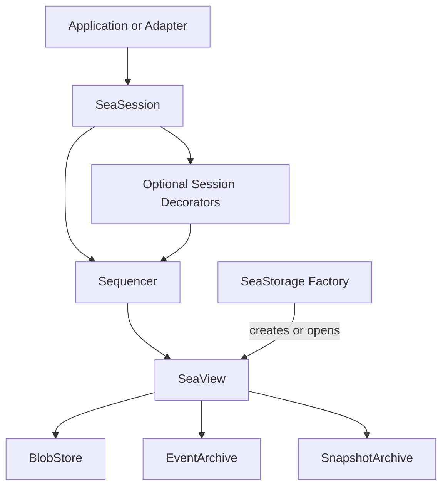

# Sea Architecture

Sea separates durable document state, multi-user coordination, transport, and application policy.
The core traits are independent of storage backends, network transports, and application frameworks.
For setup and usage, start with the [README](README.md); for package dependencies, see [workspace architecture](WORKSTREAMS.md).

## System Layers

Applications use the session contracts locally or through WebTransport.
The sequencer turns an exclusively opened document into a shared service for multiple clients.
Optional session decorators add compression, encryption, or remote access without changing the application's session interface.

## Document Storage

The [`sea-core::storage`](crates/sea-core/src/storage/mod.rs) module defines independently useful components and their composition into a document:

| Abstraction | Role |
| --- | --- |
| [`BlobStore`](crates/sea-core/src/storage/blob_store.rs) | Stores immutable, content-addressed blobs and directory trees. |
| [`EventArchive`](crates/sea-core/src/storage/event_archive.rs) | Stores ordered, opaque application events. |
| [`SnapshotArchive`](crates/sea-core/src/storage/snapshot_archive.rs) | Stores materialized state associated with committed event positions. |
| [`Archive`](crates/sea-core/src/storage/ordered_archive.rs) | Common append-only history contract for event and snapshot archives, with bounded reads and live streams. |
| [`SeaStorage`](crates/sea-core/src/storage/mod.rs) | Allocates document identities and creates or reopens one exclusive writable set of components per document. |
| [`SeaView`](crates/sea-core/src/storage/mod.rs) | Composes those components into a document reader/writer and enforces cross-component dependencies. This is a concrete type, not a trait. |

The key composition rule is that referenced data must be available before a reference to it is published: blob trees before dependent events, and events before dependent snapshots.
Recovery must preserve those dependencies as well as event order.
[`ReferenceableStore` and `StorageHandle`](crates/sea-core/src/storage/referenceable_store.rs) express this distinction between a value's identity and evidence that a store can make it available.
This lets `SeaView` coordinate publication without requiring a distributed transaction across its components.

[Memory](crates/sea-memory/README.md), [buffered-file](crates/sea-file/README.md), and [durable-file](crates/sea-file-durable/README.md) backends implement `SeaStorage` with different persistence guarantees.
Storage does not manage client membership, submission deduplication, or publisher election; those belong to the session layer.

### Snapshots and Replay

A snapshot represents application state through a committed event.
That event's `EventPosition` identifies the snapshot's version within the document.
Applications reconstruct state by loading a snapshot and replaying subsequent events, then continue receiving live events.
[`LoadStart`](crates/sea-core/src/storage/mod.rs) controls the starting point, including replay from the beginning without a snapshot.

Sea stores snapshot content but does not interpret it or decide when to generate it.
Applications own both responsibilities, including representing nonempty initial state in the event history.
See the [core contracts](crates/sea-core/README.md) for snapshot selection and read semantics.

## Multi-User Sessions

The [`sea-core::session`](crates/sea-core/src/session.rs) traits separate three capabilities above storage:

| Trait | Role |
| --- | --- |
| `SeaArchive` | Content access, snapshot loading, and event history with live delivery. |
| `SeaAuthorSession` | Ordered event submission, stable operation identities, outcome resolution, and author membership lifecycle. Extends `SeaArchive`. |
| `SeaSnapshotCoordinator` | Snapshot participation, publisher authority, and conditional publication. Extends `SeaArchive`. |
| `SeaSession` | Marker trait for types implementing `SeaArchive`, `SeaAuthorSession`, and `SeaSnapshotCoordinator`. Adds no methods; automatically implemented for types satisfying those traits. |

[`sea-sequencer`](crates/sea-sequencer/README.md) implements these contracts over one exclusive `SeaView`, shared across client memberships.
It owns author identity, submission deduplication, reference validation, event ordering, and snapshot publication authority.
Committed submission identities survive recovery; active memberships and publisher authority do not.
The server owns document runtime management, including opening and sharing sequencers.

Snapshot participants may observe only (`ReadOnly`), let Sea select a publisher (`SeaSelected`), or use application-owned election (`ClientSelected`).
Client-selected publishers suppress Sea selection.
Selection grants publication authority; it does not schedule snapshot generation.
The [session contracts](crates/sea-core/src/session.rs) define lifecycle, retry, and publication rules.

## Optional Session Decorators

Session decorators wrap sessions, preserving the same API surface while adding functionality.
Decorators can be stacked in application-chosen order, including repeated layers.
Their order determines where and how operations are transformed.

### Transport

[`sea-webtransport`](crates/sea-webtransport/README.md) carries the session contracts over [WebTransport](https://developer.mozilla.org/en-US/docs/Web/API/WebTransport) and supports both native and browser clients.

TODO: sea-webtransport is supposed to support single round trip document loads, including op streaming. Make sure this actually works (including getting needed blobs), and note it here and it the web-transport readme, citing the APi used to do this (SeaSession::load?).

[`sea-webtransport-server`](crates/sea-webtransport-server/README.md) owns endpoint binding, connection acceptance, document routing, transport liveness, TLS, and shutdown.
It consumes the shared protocol; the production client does not depend on the server, sequencer, or storage implementations.

### Payload Decorators

| Decorator | Role |
| --- | --- |
| [`CompressionSession`](crates/sea-compression/README.md) | Compresses event payloads and blob content. |
| [`EncryptionSession`](crates/sea-encryption/README.md) | Encrypts and authenticates event payloads and blob content. |
| [`StatefulCompressionSession`](crates/sea-stateful-compression/README.md) | Compresses payloads using a shared immutable dictionary. |

TODO: StatefulCompressionSession is supposed to apply cross op stream compression for events, which would require every snapshot to track the compressor state of every editor.
EIther fix this or remove it.

## Application Adapters

Some adapters which wrap sessions to implement different APIs are provided.

`sea-webtransport` includes TypeScript binding for its WASM build.

TODO: its a bit odd that bindings for SeaSession are coming from `sea-webtransport`.
Making a dedicated master WASM package which wraps everything WASM users might need, and uses crate features to limit its size would be better.

[`SeaDriver`](tests/minimal-fluid-driver/README.md) is a Fluid driver, allowing Fluid applications to run on Sea. It maps Fluid sequence numbers, messages, summaries, blob trees, and reconnection behavior onto the Sea model.

`DirectSharedTreeClient` skips most of the Fluid runtime logic and directly integrates Sea events into SharedTree for much lower overhead.
It also can apply batched updates to the tree for much faster handling of op backlogs (regular Fluid drivers could do this, but currently do not beyond their limited op bunching). The direct SharedTree integration used Sea's built in service assisted summarizer selection instead of Fluid's.

TODO: Direct shared tree integration needs summary support. Maybe initially use a separate tree as thats known to work and just having one it likely to break due to current assumptions in SharedTree.
TODO: Direct shared tree integration should ideally not need a separate summary tree, and should be able to work off the existing tree, but this is not implemented.

## Contract Validation

[`sea-conformance`](crates/sea-conformance/README.md) defines observable laws shared by implementations of the core contracts.
Focused tests validate behavior owned by each crate; integration and browser tests validate composition across boundaries.
Follow the [documentation policy](DEVELOPMENT.md#documentation-policy) and [behavioral test policy](DEVELOPMENT.md#behavioral-test-policy) when making changes.
Record a [decision](decisions/) when changing shared semantics, public contracts, protocol behavior, crate responsibilities, or application integration policy.
