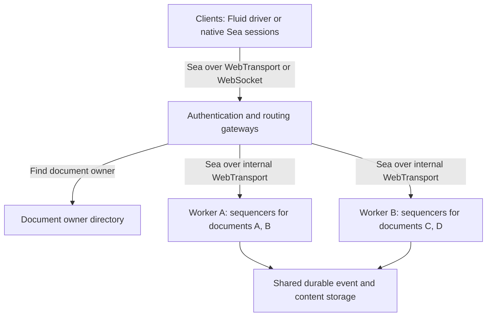
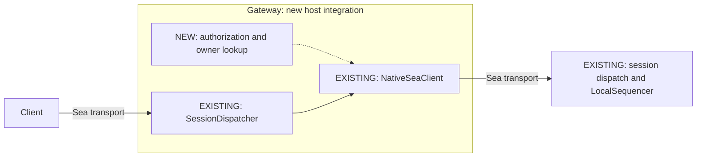

# Sea at Scale

**Architectural proposal, September 22, 2026.**

Sea already provides the core collaboration and multi-hop transport mechanisms for a document-sharded service.
A deployment could combine those mechanisms with managed infrastructure and a small set of new integration modules, rather than build a new collaboration or forwarding stack.
Azure is one example of an ecosystem with the infrastructure needed; the architecture is not Azure-specific.
This proposal describes a path to scale, not a claim that Sea is production-ready.

## The Architecture

Distribute documents across workers, with one active sequencer per document.
An authentication and routing gateway connects each client to the worker that owns its document.
Store durable data independently of workers so ownership can move during maintenance or after failure.

Gateways and workers can scale independently.
Clients connected through different gateways still reach the same document sequencer.
Adding workers increases capacity across documents; a single hot document remains subject to its ordering authority's capacity.
The same arrangement can be repeated across regions, with each document assigned a home region.

## Multi-Hop Support Already Exists

A Sea transport client is itself a session that another Sea server can expose.
The gateway can therefore authenticate a caller, locate the document, open an upstream session, and serve that session through the existing dispatcher.
It does not need to interpret Fluid operations or translate them into a separate internal protocol.

The [composition tests](crates/sea-integration-tests/tests/session_composition.rs) exercise this arrangement today.
The `repeated_stress` configuration passes sessions through three real loopback network hops, with compression and encryption layers between them.
It checks collaboration, reconnects, snapshots, and ordered delivery; rejection probes verify that submissions traverse every hop.
This establishes the forwarding foundation, not distributed failover: the tests retain an in-memory sequencer and do not exercise production authentication or cross-gateway signals.

## Existing and New Pieces

| Area | Already in Sea | Addition for this deployment |
| --- | --- | --- |
| Collaboration | Ordered events, membership, snapshots, replay, and session recovery contracts | Cross-worker ownership and recovery coordination |
| Transport | WebTransport, optional WebSocket, multi-hop dispatch, compression, and encryption | Gateway host connecting authorization and routing to existing sessions |
| Access and placement | Host extension points and document-local session capabilities | Identity-provider integration, document permissions, delegated authority, and owner directory |
| Storage | Storage interfaces, conformance tests, and memory/file backends | Backend using managed durable storage, with enforced single-writer ownership |
| Fluid integration | Driver, automatic summaries, incremental snapshots, client garbage-collection state, and signals | Production reconnect/compatibility qualification, cross-gateway signal routing, and backend retention |
| Hosting | Native server and local resource limits | Infrastructure configuration, tenant quotas, idle eviction, and operational monitoring |

Authentication and owner lookup have narrow responsibilities and can use standard identity and database services.
The gateway's forwarding mechanism is already implemented; the new host connects it to those policies.
Storage and ownership also have defined boundaries, but require more correctness work than ordinary integration code.
See [Sea architecture](SEA_ARCHITECTURE.md) and the [Fluid driver guide](packages/sea-driver/README.md) for the current implementation.

## Infrastructure Example

The architecture needs familiar infrastructure capabilities, not a Sea-specific cloud platform.
For example, an Azure deployment could use:

| Need | Example Azure service |
| --- | --- |
| Run gateways and workers | Azure Kubernetes Service or Virtual Machine Scale Sets |
| Route public transport connections | Standard Load Balancer for QUIC traffic, plus WebSocket-capable ingress |
| Store immutable content and snapshots | Blob Storage |
| Store ownership and ordered event metadata | Cosmos DB as a candidate transactional backend |
| Integrate identity, secrets, and telemetry | Microsoft Entra ID, workload identity, Key Vault, and Azure Monitor |

Other infrastructure can fill the same roles without changing the session architecture.
Managed services provide building blocks, not a ready-made Sea backend: storage semantics, transport support, performance, and cost still need validation.

## The Important Remaining Work

The main unproven boundary is **distributed storage and safe ownership transfer**.
Storage must reject writes from a replaced owner, preserve committed event order and referenced content, and let a replacement determine what committed before failure.
Sea's existing client-side recovery and resubmission let gateways and workers lose volatile in-flight queues during failover.
No additional retry system or intermediate request-queue recovery is needed.
The new failover code must establish the old session's final committed prefix.

Production operation also needs bounded history and resource use, retention, and failure testing of the full Fluid path.
Existing automatic summaries and client garbage collection do not collect Sea's backend data or eliminate the driver's retained-history scan at startup.
These are meaningful qualification tasks, not reasons to rebuild the existing collaboration stack.
See [known issues](KNOWN_ISSUES.md) for current limits.

A useful first demonstration is two gateways routing collaborators to the same document worker.
The next decisive test is transferring that document after a worker fails between committing an event and acknowledging it.
Together, these show both the value of Sea's existing composition model and the correctness of the new ownership integration.