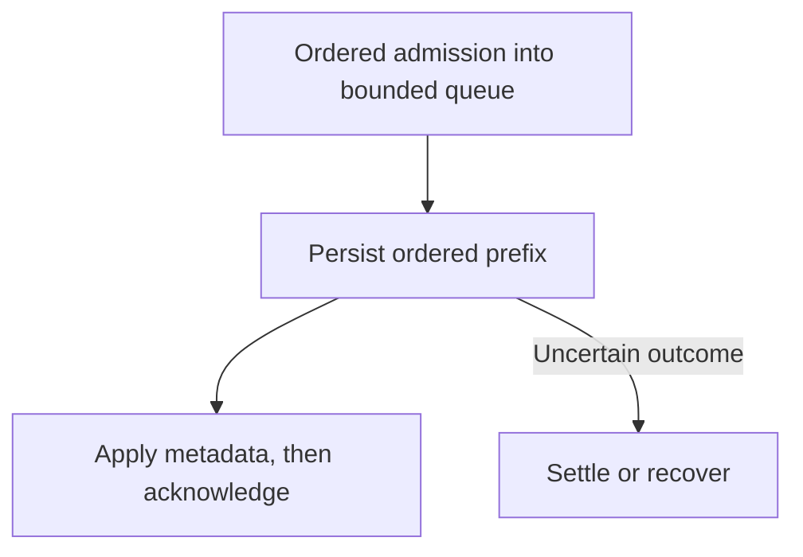

# Sea Sequencer

`sea-sequencer::session` provides multi-user sessions over one exclusively owned `sea_core::storage::SeaView`.
The `sea_core::session` traits define content/history, author, and snapshot-coordination facets; `SeaSession` is their convenience marker.

## Runtime

Move a view into `session::LocalSequencer::<Storage>::recover`, then call `open_session` for each author connection.
Recovery restores internal checkpoint state and replays only the bounded suffix after its applied position.
It rejects malformed envelopes and invalid references; equal submissions remain distinct events.
Active authority and publisher selection are runtime-local.
`announce_membership` optionally publishes immutable public member metadata in the same archive order as application events.
Announced memberships receive a service-authored departure on close, shutdown, or recovery; unannounced memberships produce no control records.
Recovery closes outstanding announcements before admitting fresh sessions.
Session identities are document-scoped nonzero `u64` values allocated by `open_session`, not selected by callers.
Reservations cover up to 256 consecutive values and are checkpointed before any identity in the range is exposed.
Recovery skips the reservation's unused remainder; identities are never reused, and exhaustion rejects allocation without wrapping.
The returned session exposes its identity through `session_id()`.
Sessions are independent; opening another session does not close an earlier one.
Sea stores session incarnations, not author identities; applications own attribution in payloads or public membership metadata.

All sessions share one view and mutation order:



Admission is bounded to 256 queued plus in-flight entries and 4 MiB of charged input bytes, including identities and envelope allowance.
Allocator overhead and temporary batch encoding are additional bounded costs; waiting callers retain their inputs, so hosts must also bound outstanding requests.
Oversized inputs terminate their session; full queues backpressure before admission.
A retained, cooperatively polled future performs persistence without holding the runtime mutex or spawning a task.
It yields after completed work to avoid starving receipt delivery.
Lifecycle and snapshot operations block admission, drain the queue, then hold the runtime mutex during their control I/O.
Closing a session is idempotent across clones, removes its minimum-reference contribution and publisher registration, and does not close another session.
Closing the last session does not close the runtime.
`shutdown` first settles pending work, closes all memberships, and releases the view even when closed session handles remain alive.
Operations already holding resources and backend streams or availability handles may retain ownership according to their contracts; drop these before assuming reopening is possible.

## Delivery

Application submissions carry sequencer metadata in the existing private envelope codec.
Opt-in membership transitions use a distinct persisted envelope and are delivered as `SessionEventKind::Joined` and `SessionEventKind::Left`.
Application events are delivered as `SessionEventKind::Application`, without a separate operation identity.
Exact announcement retries return the original position; changing metadata is rejected.
Membership metadata is public control data and is not transformed by payload compression or encryption.
`read` lazily initializes the view's bounded or live read and preserves its progress and error classification.
Closing or replacing membership terminates its initialized live reads.
Loads use `LoadStart`, returning a selected handle-based snapshot and the live suffix without an atomic captured head.
Backend monitored streams provide gap-free catch-up and live delivery.
Publisher observations use coalescing watch streams because intermediate publisher states need not all be delivered.

## Ordered Append and Recovery

The required append contract is strict order and termination at the first failure.
Accepted application events form a prefix of the submissions on one append stream.
A rejection, invalid request, or transport failure ends that stream's authority; later queued submissions must not be accepted.
Concurrent local callers must poll submission futures in their intended order; constructing futures or spawning tasks in that order is not sufficient.
Cloned handles share a per-membership admission gate: submissions first polled in sequence keep that order across capacity waits, so a smaller successor cannot bypass a waiting input.
Native builds disable Tokio cooperative-budget yielding only for the first gate acquisition; the remaining work stays cooperative, and WASM needs no Tokio runtime.
The gate releases on queue admission, not persistence, and waiting for it holds no runtime/lifecycle lock.
Close can therefore drain admitted work without waiting for unadmitted callers.
Batches preserve admission order, including multiple distinct submissions from one session.

| Outcome | Required behavior |
| --- | --- |
| Invalid prepared entry | Revoke its session; earlier prepared work may settle, later same-session entries are rejected. |
| Cancel before admission | Remove the waiting input; successors may proceed without revoking membership. |
| Cancel after admission | Revoke membership, even before dispatch; dispatched work may still commit its prefix. |
| Failed session with queued work | Reject undispatched entries; settle the retained backend future. |
| Missing batch results | Reject without resubmission. |
| Ambiguous multi-entry results | Poison the runtime until recovery. |
| Success | Apply the committed prefix to runtime metadata before acknowledging; readers expose backend commits, never queue admission. |

Each event retains its session identity and the reference position describing the sequenced history known when it was constructed.
Earlier application events from that session identify its preceding local work.
SEA treats payloads as opaque and cannot adjust an event for a different submission context.

For announced sessions, the durable leave record is the final sequencing barrier.
It follows every accepted event from that session, and no event from that session may be accepted afterward.
Closing an append stream must settle admitted work before writing its leave.
Unknown storage outcomes must block progress or require recovery, never produce a leave that falsely claims finality.
Connection loss alone is not proof of completion; server failure detection and cleanup must establish that barrier.
An independent read session can replay through the leave even when the old connection and its reads have ended.

To recover non-idempotent application events:

1. Read the old session's history through its leave record.
2. Count its application events to determine the accepted submission prefix; joins and leaves do not count.
3. Reconcile the accepted history with local state.
4. Transform the unaccepted suffix as required by the application and submit it under a fresh session.

The reader needs the relevant session history, or equivalent prefix accounting in a snapshot.
Lost acknowledgments do not change the committed prefix.
There is no operation-ID lookup or submission deduplication API.
Each submit call is new, even when its payload and reference equal an earlier submission.
Announcement failures also revoke authority; transport dispatch terminates malformed author requests before they reach the sequencer.
Clients and decorators enforce the same failed-prefix rule.
The Fluid driver's explicit recovery helper verifies the old terminal prefix and requires an application-owned suffix transformation under a fresh session.
Normal Fluid containers delegate pending-state processing and rebasing to the runtime.
See [known issues](../../KNOWN_ISSUES.md) for remaining implementation limits.

## Minimum Reference Floor

The document-wide minimum reference is a durable, nondecreasing admission floor, independent of membership.
Each event carries its reference; every new application append is checked, including submissions with no reference.
A submission below the committed floor terminates its stream; a reader may still open behind the floor to catch up.
Slow writers must catch up and transform their unaccepted suffix under a fresh session.

Application/membership envelopes persist the resulting floor atomically with their events, making advances ordered for live and replay readers.
Failed appends do not advance it; recovery rejects decreasing, forward, or context-inconsistent metadata and restores the floor before admitting mutations.
Only committed advances are enforceable; policy heuristics and debouncing must not affect correctness.

Advancement policy combines cooperative member progress with a 1024-entry lag window, requiring 64 committed entries beyond the current floor before a window advance.
Positions are opaque ordered values; numeric spacing does not affect this policy.
Only the final candidate in a storage batch may advance the floor, preventing speculative advances from rejecting another entry in that batch.
Earlier entries carry the frozen committed floor; an invalid final candidate defers advancement.
An advance cannot exceed its carrying event's reference or lower the floor.
Idle readers cannot indefinitely pin progressing writers; quiescent documents need no timer or extra append.

Snapshots retain their exact event boundary, whose immutable envelope retains the floor at publication.
The current backend retains that event and all history; snapshot consumers can read the boundary event, and recovery restores the internal checkpoint and suffix before admitting mutations.
Any future compaction must preserve this floor metadata with the snapshot rather than discard the boundary envelope.
The Fluid adapter maps the floor into its dense sequence space.

Persisted application/membership encodings are `SEAQ6`/`SEAM5` with fixed-width numeric session identities; earlier envelopes are rejected.
Wire protocol version 11 carries allocated identities in opening responses; rebuild clients and servers together.
There is no supported data migration from the experimental earlier formats.

## Internal Checkpoints

The `SEAC3` checkpoint contains the exact applied position, durable minimum-reference floor, outstanding announcement envelopes, and the inclusive session-allocation reservation.
The lag-window history is runtime-only: recovery ends outstanding sessions with leave messages and clears the window before admitting fresh sessions.
The committed floor remains monotonic; historical reference availability is resolved through storage.
It retains no historical session or submission set.
Outstanding announcement state scales with still-outstanding memberships, not total retained history.
Historical reference checks use the storage resolver when a position is outside the recent window.

Before admitting another batch or lifecycle event, 256 applied entries trigger publication.
With batches limited to 256 entries, at most 511 event entries follow the last sequencer checkpoint.
Reservation publication captures the same exact applied prefix and does not invent an event position.
Publication failure or cancellation stops mutation until reopening; failures cannot silently extend the tail.
Recovery appends terminal departures for restored outstanding announcements before returning fresh authority, using the same cadence during those departures.

Internal metadata publication is independent of application snapshots and publisher nomination.
File storage maintains fixed-size settled-tail cursors independently of sequencer checkpoints; hash-addressed content and byte-offset events need no reconstructed historical index.
Memory storage keeps its already resident history and retains its in-process consistency validation on reopening.
See the [checkpoint design and evidence](../../CHECKPOINT_PLAN.md) for publication ordering, tests, and implementation costs.

## Submission Identity and Settlement

The sequencer assigns no operation IDs and retains no historical submission-deduplication index.
A client recognizes its own accepted submissions by session and application-event ordinal; other events have immutable archive positions.
Applications may carry their own identifiers in opaque payloads without Sea interpreting them.
Blob identities in submissions are resolved through the current view before publication; wire identities never fabricate availability handles.
The sequencer never resubmits an append internally.
After returned ambiguity it obtains an authoritative head and scans the bounded candidate range.
This reconciliation applies to singleton appends; ambiguous grouped persistence requires reopening instead of attempting per-entry reordering or replay.
An exact committed envelope resolves success; a complete settled empty range yields a definitive rejection.
Under the required prefix contract, rejection terminates the old append stream; recovery and transformed resubmission belong to the caller.
A failed head or incomplete scan yields `RecoveryRequired` and prevents further mutations or claims of absence.

The runtime retains an owned mutation future before first polling backend work.
Dropping a caller future does not drop that backend future or treat cancellation as settlement.
The next state-dependent operation, including close or shutdown, drives the same future to settlement before continuing.
There is no background task or assumed executor, including on WASM; with no further operation, cancelled work may remain pending.
Dropping the whole runtime can still cancel its retained future: the owner must then follow backend settlement/recovery rules before acquiring a replacement view.
An unreconcilable runtime must be discarded and recovered; it cannot use `shutdown` to claim successful settlement.

## Snapshots

The snapshot's event position is its document-scoped version identity.
Nonempty initial application state is an explicit initialization event referencing its uploaded tree followed by a normal snapshot, not an initial-snapshot exception.
Fluid's sequence-number mapping remains its adapter's responsibility.
The session returns availability handles; transports must resolve received identities at the local boundary.

New publication requires an expected parent equal to the latest version and an advancing event position.
Exact position/root retries return the stored publication even after later snapshots; another root at that position conflicts.
There is no separate snapshot-operation-ID index.
Returned ambiguity is resolved only when lookup confirms the requested position/root.
Absence or lookup failure does not establish publication settlement, so it yields `RecoveryRequired` rather than permitting an unsafe retry.

`coordinate_snapshots` registers client-selected, Sea-selected, or read-only participation.
Client-selected publishers suppress Sea nomination; otherwise the lexically first eligible session is nominated.
Nomination changes issue a fresh checked fence, preventing stale authority from becoming valid again.
Publication checks authority at admission; revoking a stream does not roll back an already admitted mutation.
Dropping a coordination stream revokes its own registration synchronously and notifies remaining publishers.
Replacing a registration does not allow an older stream's eventual drop to revoke the replacement.

## Validation

From `rust-service/`:

```bash
cargo test -p sea-sequencer
cargo rustc -p sea-sequencer --lib -- -D missing-docs
RUSTDOCFLAGS="-D warnings" cargo doc -p sea-sequencer --all-features --no-deps
```

Tests cover session conformance, membership, ordered admission, snapshots, floors, and recovery.
[`src/fault_tests.rs`](src/fault_tests.rs) exercises rejection, ambiguous commits, cancellation, retained ownership, and bounded batching.
Admission probes establish actual queue entry rather than inferring it from a scheduler yield.
