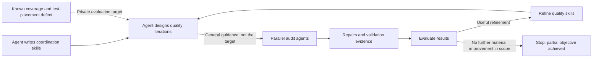
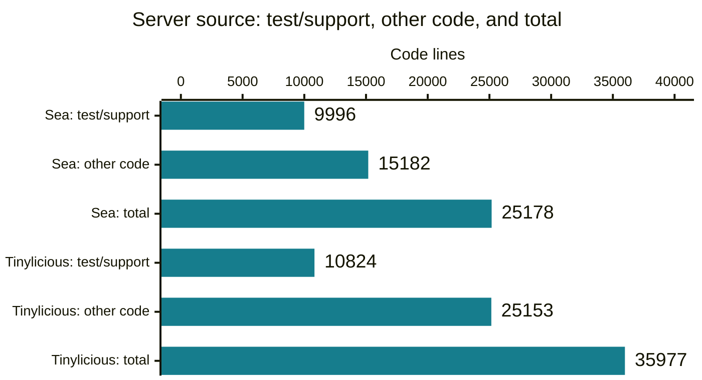
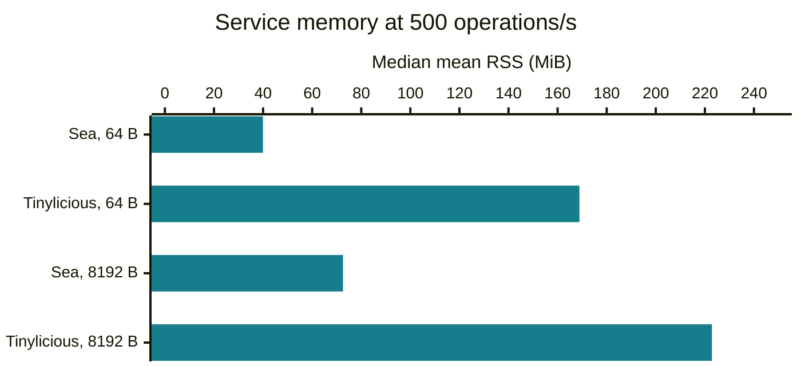
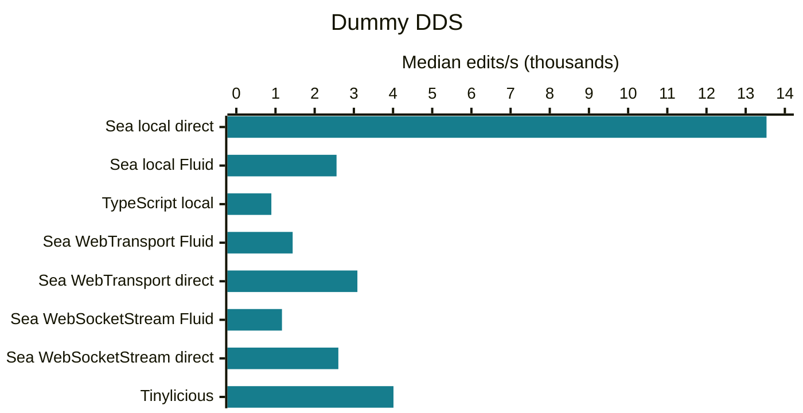
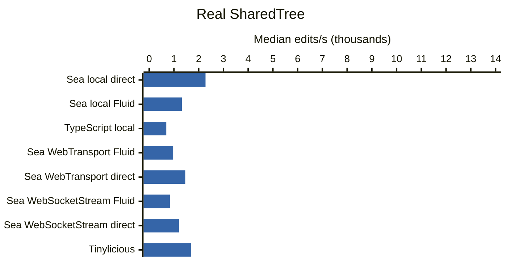

# Sea: Project Overview

Project record as of 2026-09-23; measurements use the revisions listed below.
For the current implementation and limitations, start with the [project README](../README.md).

Sea (Snapshotted Event Archive) is an experimental Rust service for ordered application events, immutable blob trees, and snapshots.
Applications own event meaning and snapshot content; the service owns ordering and publication authority.
Fluid integration is optional.

This overview describes the architecture, development workflow, measured behavior, and known limitations.
Sea is a single-host experiment, not a production replacement for an existing Fluid service.
For setup and usage, see the [project README](../README.md); for service contracts, see the [architecture guide](../SEA_ARCHITECTURE.md).

## Architecture

Native and browser clients access the sequencer locally or over a network transport.
Storage options include memory, buffered-file, and durable-file backends with different persistence guarantees.
The built-in host uses a shared live-event cache by default while retaining storage as the authority for recovery and historical catch-up.


## AI-Assisted Development

See the [agentic-development guide](AGENTIC_DEVELOPMENT.md) for the workflow, representative iterations, human involvement, and what the records can establish about effectiveness.

The project used agent-written reusable skills to coordinate parallel groups of agents and to design and run quality iterations.
The coordinator knew a private evaluation target: a bug fix had exposed missing coverage, and the added regression test was poorly placed.
The audit agents received general quality guidance, not that target.

The skills were refined and the audits repeated.
The objective was partly achieved, then further runs stopped producing material improvements within the chosen scope.
That was a stopping condition, not evidence that the code was defect-free.



The diagram does not imply fully autonomous or concurrent execution of every step.
The private-target account comes from the project author and does not describe deliberate defect seeding.
Supporting records: [quality-iteration skill](../../.github/skills/rust-service-quality-iteration/SKILL.md), [iteration 0016 skill review](iterations/0016/skill-review.md), and [iteration 0017 convergence assessment](iterations/0017/phase-3-report.md#convergence-assessment).
They support the method and its limits, not the complete private-evaluation chronology.

## Measurement Scope

The complete current campaign used clean commit `240798434cf591f4db2366a1a3b6b6a7438bd015`.
The 72-sample summary campaign used `22309cf9d169c4f7986b6ce1db184427269f9656`; the only intervening change makes point-in-time file inventory tolerate an atomic temporary-file rename between directory enumeration and `stat`.
It does not change service, client, workload, timing, or persistence behavior.
The corrected native WebTransport groups used `4bdd92ee38a7e599fbdc0116b11b4080d604e421` plus the benchmark lifecycle fix described below.

All file-backed Sea and Tinylicious service data used fresh owned directories directly under `/tmp`.
The host reported AMD EPYC 9V74, Linux `6.8.0-1064-azure`, Node.js `22.23.2`, Rust `1.98.1`, and 32 logical CPUs.
`/tmp` was ext4 on `/dev/sda1[/containerTmp]`; benchmark artifacts remained outside service-data directories.

The campaign retained:

- 180 primary repeated stress attempts and 20 bounded replacement attempts;
- 30 post-fix native WebTransport attempts and three bounded replacements;
- 135 capacity probes across all 30 storage/core/payload rows;
- 160 passing browser samples;
- 72 passing summary and cold-load samples;
- complete Sea and Tinylicious end-to-end test inventories;
- current source and production dependency inventories.

The [retained dataset](measurements/overview-refresh-20260923/README.md) contains every value used below.
These are local, single-host stack comparisons with different features, transports, and persistence guarantees.
They are not production capacity estimates or language-only comparisons.

## At a Glance

Throughput cells give **64-byte / 8,192-byte offered operations/s**.
Sea eight-core capacity uses eight service cores and eight separate generator cores; Tinylicious uses four generators because its measured ceiling does not require more.
Values are the highest observed threshold pass, not repeated maximum-capacity estimates.
The corresponding higher failure appears in [Storage and Core Exploration](#storage-and-core-exploration).
✅ marks a favorable measured result or a shared positive outcome within the stated scope, not overall superiority.

| Aspect | Snapshotted Event Archive (Sea) | Tinylicious |
| --- | --- | --- |
| Language | Rust | TypeScript |
| Runtime | ✅ Native or WASM | JavaScript |
| First-party code | ✅ 25,178 lines:<br>9,996 test/support + 15,182 other | 35,977 lines:<br>10,824 test/support + 25,153 other |
| Transitive dependencies | ✅ 161 crates:<br>155 external + 6 workspace | 318 npm packages:<br>306 external + 12 workspace |
| Representative libraries | Tokio, Quinn/wtransport, rustls, Serde, Postcard | Express, Socket.IO, isomorphic-git, LevelDB, Winston |
| Supported streams | ✅ WebTransport, WebSocketStream, WebSocket | WebSocket via Socket.IO<br>(❌ no application-level receive backpressure) |
| Recorded end-to-end test execution | ✅ 691 passed, 0 failed | ✅ 4,049 passed, 0 failed |

| Aspect | Snapshotted Event Archive (Sea) | Tinylicious |
| --- | --- | --- |
| Operation throughput: memory<br>(64 B / 8,192 B payload)<br>(8 cores) | ✅ 68,000 / 28,000 ops/s | 1,000 / 800 ops/s |
| Operation throughput: disk, buffered<br>(64 B / 8,192 B payload)<br>(8 cores) | ✅ 44,000 / 36,000 ops/s | 1,100 / 100 ops/s (LevelDB) |
| Operation throughput: durable<br>(64 B / 8,192 B payload)<br>(8 cores) | ✅ 5,000 / 4,000 ops/s | ❌ No durable acknowledgment in tested configuration |
| Memory at matched 500 ops/s<br>(64 B / 8,192 B payload)<br>(4 cores) | ✅ 39.94 / 72.56 MiB RSS | 168.89 / 222.87 MiB RSS |

Source scopes include tests and different feature sets; dependency and test counts are not quality scores.
Sea's WebTransport and WebSocketStream paths support streaming backpressure; ordinary WebSocket uses bounded fail-stop receive queues instead.
Tinylicious's disk entry is LevelDB without explicitly synchronized writes and is not durability-equivalent to Sea durable-file.

<details>
<summary>Test scope, dependency counting, and guarantees</summary>

The current Sea run completed with **691 passing, 0 failing, and 493 pending**.
Its totals comprise 689 current-version passes and 486 pending cases, plus two historical-loader entry-point passes and seven pending historical cases.
Those two local historical-loader passes are entry-point coverage, not Sea compatibility coverage.

The current Tinylicious default run completed with **4,049 passing, 0 failing, and 1,921 pending**.
It includes generated layer and cross-client compatibility configurations, so its denominator is not comparable to Sea's current-version-only selection.
Comparing current-version identities retains the previously established shared set: Sea passes all 669 recorded Tinylicious current-version passes plus 20 cases Tinylicious skips.

Reproduce from `packages/test/test-end-to-end-tests/`:

```bash
node scripts/seaRunner.mjs --no-bail
pnpm run test:realsvc:tinylicious
```

Dependency counts are deduplicated by package name and version and exclude the root package.
Sea includes normal and build edges plus proc macros for Linux x86-64 with `websocket-stream`; development-only edges are excluded.
Tinylicious uses its installed production graph with workspace links normalized.
Crates and npm packages are not equivalent units.

```bash
cargo tree --manifest-path rust-service/Cargo.toml --locked \
  --package sea-webtransport-server --features websocket-stream \
  --target x86_64-unknown-linux-gnu --edges normal,build --prefix none --format '{p}'
pnpm --dir server/routerlicious --filter tinylicious list --prod --depth Infinity --json
```

</details>

## Source Lines to Maintain

Repository-owned dependency scopes, including tests; not equivalent feature sets or a measure of maintenance effort.



| Scope | Files | Code lines | Comment lines | Test/support code subset | Other code |
| --- | ---: | ---: | ---: | ---: | ---: |
| Sea native server local non-development dependency closure | 58 | 25,178 | 2,534 | 9,996 | 15,182 |
| Tinylicious local server dependency closure | 335 | 35,977 | 7,538 | 10,824 | 25,153 |
| Tinylicious wrapper only, a subset of the preceding row | 35 | 2,492 | 356 | 521 | 1,971 |
| Sea TypeScript clients and adapters, separate from native scope | 24 | 5,618 | 718 | 2,686 | 2,932 |

cloc 2.06 counts tracked Rust, TypeScript, and JavaScript.
Scopes follow local non-development manifest edges, not linker reachability; generated entry points, package-version files, build output, and external dependencies are excluded.
Test/support classification uses path/name conventions plus syntax-derived Rust test spans.
See the [collection scripts guide](../scripts/README.md#commands) to regenerate the inventory.

## Matched-Load Resources

500 operations/s; 32 documents, one writer and observer each; four service cores plus four generator cores.
Sea memory with the production Node/WASM WebSocket client versus Tinylicious's in-memory database, Socket.IO client, and filesystem Git summaries.
Each row contains ten fresh passing runs with three warmup seconds and ten measured seconds.



| Payload | Service | Mean RSS median (min-max), MiB | CPU, % | Worst-worker p95 median, ms |
| --- | --- | ---: | ---: | ---: |
| 64 bytes | Sea | 39.94 (39.86-40.05) | 8.65 | 0.46 |
| 64 bytes | Tinylicious | 168.89 (167.70-170.39) | 36.95 | 2.78 |
| 8,192 bytes | Sea | 72.56 (72.47-72.82) | 12.14 | 0.63 |
| 8,192 bytes | Tinylicious | 222.87 (221.26-227.90) | 48.55 | 3.23 |

RSS is the median of run means; CPU is the median, with 100% equal to one occupied core.
Latency is the median of run worst-worker p95 values.
All 40 samples delivered the offered load with exact acknowledgments and zero missing deliveries.

## Repeated Throughput

Memory-backed operation storage; 32 documents and the same timing boundaries as matched load.
Rates are tested loads, not capacity maxima; payload bandwidth excludes protocol overhead.

### Native Sea Transports

Four service cores and four separate native generator cores.
WebTransport includes QUIC/TLS; loopback WebSocket is unencrypted.

| Transport | Payload | Offered ops/s | Outcome | Delivered ops/s median (min-max) | CPU, % | RSS median, MiB | Worst-worker p95 range, ms |
| --- | --- | ---: | --- | ---: | ---: | ---: | ---: |
| WebSocket | 64 bytes | 12,000 | 10/10 pass | 11,999.5 (11,997.0-12,004.0) | 135.34 | 73.53 | 1.07-1.18 |
| WebTransport | 64 bytes | 12,000 | 10/10 pass | 11,998.8 (11,997.3-12,000.6) | 122.75 | 43.68 | 1.09-1.33 |
| WebTransport control | 64 bytes | 10,000 | 10/10 pass | 9,999.0 (9,997.8-10,000.5) | 106.04 | 39.22 | 0.96-1.07 |
| WebSocket | 64 bytes | 24,000 | 10/10 pass | 23,996.1 (23,994.1-24,000.2) | 266.54 | 100.89 | 2.23-2.41 |
| WebSocket | 8,192 bytes | 6,000 | 10/10 pass | 5,999.6 (5,998.6-6,001.4) | 88.58 | 623.01 | 0.84-0.86 |
| WebTransport | 8,192 bytes | 6,000 | 10/10 pass | 5,999.1 (5,998.2-5,999.9) | 160.65 | 399.15 | 1.89-2.23 |
| WebSocket | 8,192 bytes | 12,000 | 10/10 pass | 11,998.9 (11,996.9-12,000.3) | 176.35 | 1,223.90 | 1.56-1.69 |

The original native WebTransport campaign left each connection's authoritative opening event stream unread and opened a second content stream for observation.
Flow control on the abandoned live stream eventually stalled the connection, producing transport disconnects and incomplete drains.
The corrected generator consumes the opening stream through `load`; both small-event groups and the repeated large-event control then passed exact drain in all ten accepted samples.

### Tinylicious

Node Socket.IO, in-memory database, and filesystem Git summaries; four generator cores.

| Payload | Service cores | Delivered ops/s median (min-max) | CPU, % | Worst-worker p95 range, ms |
| --- | ---: | ---: | ---: | ---: |
| 64 bytes | 1 | 749.8 (749.5-750.0) | 64.76 | 5.10-10.46 |
| 64 bytes | 4 | 749.8 (749.5-750.0) | 63.67 | 2.92-3.35 |
| 8,192 bytes | 1 | 749.8 (745.8-749.9) | 78.85 | 6.49-29.90 |
| 8,192 bytes | 4 | 749.3 (748.6-749.9) | 81.07 | 4.28-10.97 |

### Node/WASM Sea Client

WebSocket and Sea memory; four generator cores.
The historical one-core 12,000-small point failed all ten runs at full service-core saturation, so a bounded 10,000-small replacement group was collected and passed 10/10.

| Payload | Service cores | Offered ops/s | Delivered ops/s median (min-max) | CPU, % | RSS median, MiB | Worst-worker p95 range, ms |
| --- | ---: | ---: | ---: | ---: | ---: | ---: |
| 64 bytes | 1 | 10,000 | 9,998.2 (9,997.0-9,999.3) | 82.41 | 59.50 | 2.80-7.12 |
| 64 bytes | 4 | 16,000 | 15,997.0 (15,995.0-15,999.6) | 157.77 | 74.10 | 2.45-3.45 |
| 8,192 bytes | 1 | 6,000 | 5,999.1 (5,996.8-6,000.4) | 77.96 | 425.23 | 4.70-9.21 |
| 8,192 bytes | 4 | 8,000 | 7,998.5 (7,996.1-7,999.6) | 130.55 | 556.09 | 2.75-10.46 |

## Optimized Browser Results

Ten repetitions per path and DDS mode; 100 warmup edits and 1,000 measured edits.
Every one of the 160 samples passed writer/observer convergence.
Median edits/s averages the two central raw values and ranges are observed minima and maxima.





| Path | Storage backend | Dummy DDS | Real SharedTree |
| --- | --- | ---: | ---: |
| Sea local direct | Sea memory | 13,532 (12,887-14,006) | 2,276 (2,078-2,326) |
| Sea local Fluid | Sea memory | 2,558 (2,415-2,585) | 1,319 (1,295-1,342) |
| TypeScript local | Browser `sessionStorage` database | 894 (806-960) | 691 (644-720) |
| Sea WebTransport, Fluid | Sea memory | 1,438 (1,369-1,495) | 968 (922-980) |
| Sea WebTransport, direct | Sea memory | 3,090 (2,986-3,376) | 1,457 (1,437-1,470) |
| Sea WebSocketStream, Fluid | Sea memory | 1,165 (1,111-1,179) | 841 (822-847) |
| Sea WebSocketStream, direct | Sea memory | 2,604 (2,575-2,646) | 1,204 (1,187-1,224) |
| Tinylicious | In-memory database; filesystem Git summaries | 4,011 (3,508-4,417) | 1,694 (1,640-1,799) |

Both DDS modes use one scalar edit per turn, no per-turn convergence wait, then final convergence.
Direct paths omit Fluid runtime responsibilities and are not drop-in equivalent Fluid drivers.
Browser and service processes share CPUs `8,10,12,14,16,18,20,22`.
External Sea cases explicitly enable the live cache; Sea and Tinylicious service data use separate owned `/tmp` directories.

## Storage and Core Exploration

**Offered operations/s: highest observed threshold pass / higher observed failure.**
Single-run probes, not repeated capacity estimates.
Sea uses native WebSocket; Tinylicious uses Node Socket.IO.
All use 32 documents, three warmup seconds, ten measured seconds, and fresh data.
Eight-core Sea rows use eight generator processes; other rows use four.

| Payload | Service cores | Sea memory | Sea buffered-file | Sea durable-file | Tinylicious in-memory DB | Tinylicious LevelDB |
| --- | ---: | ---: | ---: | ---: | ---: | ---: |
| 64 bytes | 1 | 6,000 / 7,000 | 3,000 / 4,000 | 2,000 / 4,000 | 1,000 / 1,100 | 500 / 800 |
| 64 bytes | 4 | 36,000 / 40,000 | 20,000 / 24,000 | 4,000 / 6,000 | 1,000 / 1,100 | 1,000 / 1,100 |
| 64 bytes | 8 | 68,000 / 72,000 | 44,000 / 48,000 | 5,000 / 6,000 | 1,000 / 1,100 | 1,100 / 1,300 |
| 8,192 bytes | 1 | 6,000 / 7,000 | 2,500 / 3,000 | 2,000 / 4,000 | 800 / 900 | 100 / 200 |
| 8,192 bytes | 4 | 24,000 / 28,000 | 16,000 / 20,000 | 4,000 / 8,000 | 800 / 900 | 100 / 200 |
| 8,192 bytes | 8 | 28,000 / 30,000 | 36,000 / 38,000 | 4,000 / 6,000 | 800 / 900 | 100 / 200 |

Passing requires at least 98% submitted and delivered in-window; every worker p95 and scheduling lag at most 100 ms; exact Sea acknowledgment and drain integrity; and zero final errors or missing deliveries.
Some higher Sea failures terminated on exact-drain or the 4 GiB guard rather than returning a normal threshold result.
The bracket records the observed boundary, not a diagnosis of the limiting resource.

The live cache changes the file-backed result substantially: caught-up readers receive the event published by the sequencer rather than each independently reopening the just-written record.
Buffered eight-core throughput is now 44,000 / 36,000 small/large operations/s versus the prior cache-disabled overview's 10,000 / 9,000.
Durable results are also much higher, but remain sensitive to acknowledgment batching, per-document concurrency, and failure mode.

## Summary and Cold-Load Measurement Campaign

Sea buffered-file and durable-file are compared with Tinylicious LevelDB operation storage and filesystem Git summary storage.
The fixture contains eight SharedMaps with either 32 or 512 values of 1,024 bytes each: 256 KiB or 4 MiB of application values.
It crosses pseudorandom hexadecimal and repeated text, full and incremental summary modes, and all three backends.
All 72 samples passed snapshot-fingerprint, map-content, and 200-tail-operation verification.

Each paired timing cell gives **full / incremental** mode, in milliseconds, and is the median of three independent documents.
Upload covers the storage call.
Download uses a fresh service/client and reads every unique blob with fanout eight.
Cold load restarts the service and client, realizes all eight DDSes, and replays the tail.
The OS page cache is not cleared.

| Application values | Data | Backend | Summary upload | Complete snapshot download | Process-cold document load |
| --- | --- | --- | ---: | ---: | ---: |
| 256 KiB | Pseudorandom hex text | Sea buffered | 21.6 / 11.7 | 120.9 / 118.9 | 174.3 / 171.6 |
| 256 KiB | Pseudorandom hex text | Sea durable | 24.8 / 16.4 | 120.0 / 118.6 | 173.1 / 174.6 |
| 256 KiB | Pseudorandom hex text | Tinylicious LevelDB | 48.6 / 34.8 | 151.8 / 151.1 | 243.3 / 246.2 |
| 256 KiB | Repeated text | Sea buffered | 19.9 / 11.7 | 122.2 / 119.0 | 175.4 / 173.9 |
| 256 KiB | Repeated text | Sea durable | 25.1 / 16.5 | 118.4 / 119.6 | 173.1 / 175.4 |
| 256 KiB | Repeated text | Tinylicious LevelDB | 48.8 / 34.9 | 146.6 / 149.3 | 222.0 / 217.8 |
| 4 MiB | Pseudorandom hex text | Sea buffered | 91.6 / 27.2 | 206.4 / 204.9 | 256.5 / 269.3 |
| 4 MiB | Pseudorandom hex text | Sea durable | 97.9 / 28.5 | 208.8 / 212.1 | 283.3 / 270.6 |
| 4 MiB | Pseudorandom hex text | Tinylicious LevelDB | 123.6 / 45.5 | 527.5 / 522.1 | 613.9 / 605.8 |
| 4 MiB | Repeated text | Sea buffered | 92.3 / 27.8 | 202.5 / 202.1 | 264.9 / 274.2 |
| 4 MiB | Repeated text | Sea durable | 101.3 / 35.4 | 207.3 / 206.1 | 274.5 / 264.9 |
| 4 MiB | Repeated text | Tinylicious LevelDB | 119.7 / 47.9 | 491.7 / 488.6 | 562.9 / 553.1 |

At 4 MiB of pseudorandom hex text, incremental upload was 3.37 times faster than full upload on buffered Sea and 2.72 times faster on Tinylicious.
Buffered Sea's incremental cold load was 2.25 times faster than Tinylicious in this workload.
Three repetitions provide observed medians, not confidence bounds.

### Summary and Operation Sizes

Full summaries contain zero handles and incremental summaries contain nine.
The following are apparent file bytes measured after initial attachment and growth caused by the acknowledged update summary.
Tinylicious's initial column includes Git storage; its initial LevelDB files add approximately 1.3 KiB.
Sea uses a mixed journal, so its initial column includes document records as well as summary content.

| Application values | Data | Sea initial journal | Tinylicious initial Git files | Sea update growth | Tinylicious update growth |
| --- | --- | ---: | ---: | ---: | ---: |
| 256 KiB | Pseudorandom hex text | 277,837 | 147,170 | 19,283 | 35,227 |
| 256 KiB | Repeated text | 277,837 | 8,644 | 19,283 | 23,616 |
| 4 MiB | Pseudorandom hex text | 4,372,045 | 2,288,998 | 20,566 | 28,396 |
| 4 MiB | Repeated text | 4,372,045 | 70,947 | 20,566 | 20,282 |

Content-addressed storage avoids rewriting all unchanged bytes in both summary modes.
Tinylicious Git compression substantially reduces repeated-content size; Sea's optional compression decorator is not enabled.
Tinylicious emitted 675 existing `Collection.deleteMany: Method not implemented` checkpoint-cleanup errors across its 24 samples.
All persistence assertions passed, but these samples do not establish healthy checkpoint cleanup or steady-state retention.

The initial summary campaign stopped at sample 66 when inventory raced an atomic durable cursor rename.
The replacement campaign restarted from sample one after the inventory-only repair and passed all 72 cells.
No sample from the interrupted campaign is pooled with the accepted results.

## Scope and Limitations

- Results are short single-host loopback measurements on a shared virtual machine.
- Passing capacity probes establish only observed bounds under this workload.
- Persistence modes do not have equal acknowledgment or power-loss guarantees.
- The OS page cache remains warm across process-cold summary reads.
- Browser path order is fixed, not randomized or interleaved.
- Direct browser paths omit Fluid runtime responsibilities.
- Source, dependency, and test counts describe different feature sets and are not quality or maintenance scores.
- Native WebTransport results after the opening-stream lifecycle fix are not directly comparable with the original broken-stream samples.
- Tinylicious checkpoint cleanup errors remain unresolved.
- Sea is experimental and lacks production hardening, distributed failover, and physical-device durability qualification.
