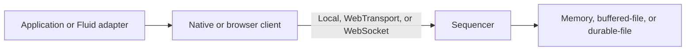
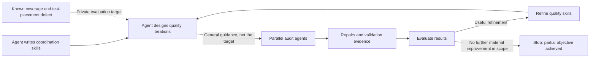
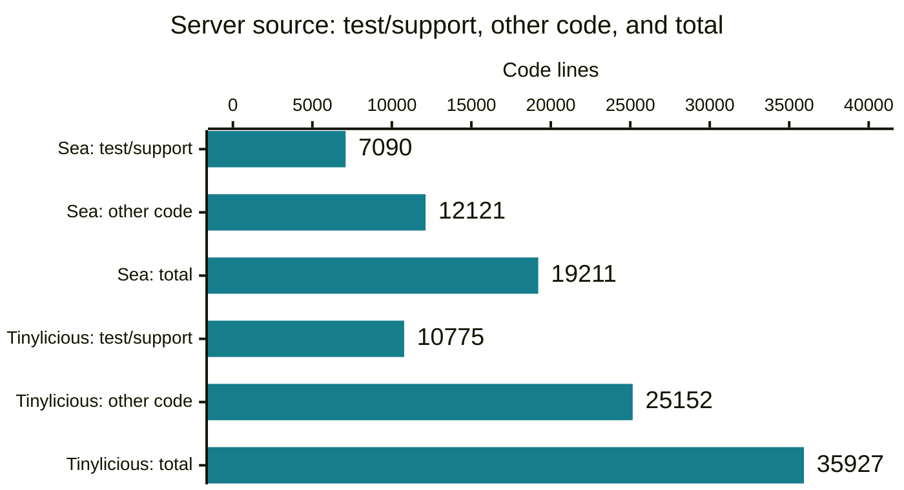
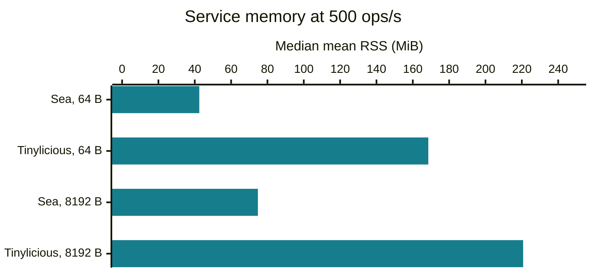
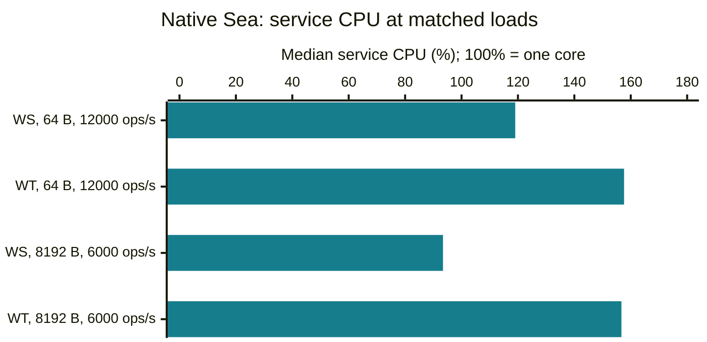
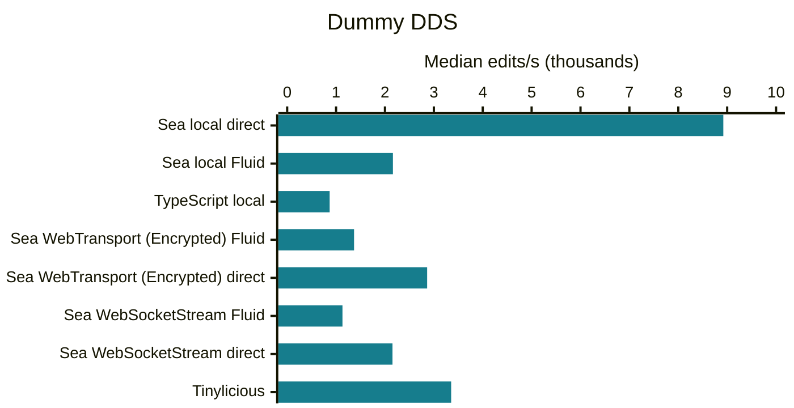
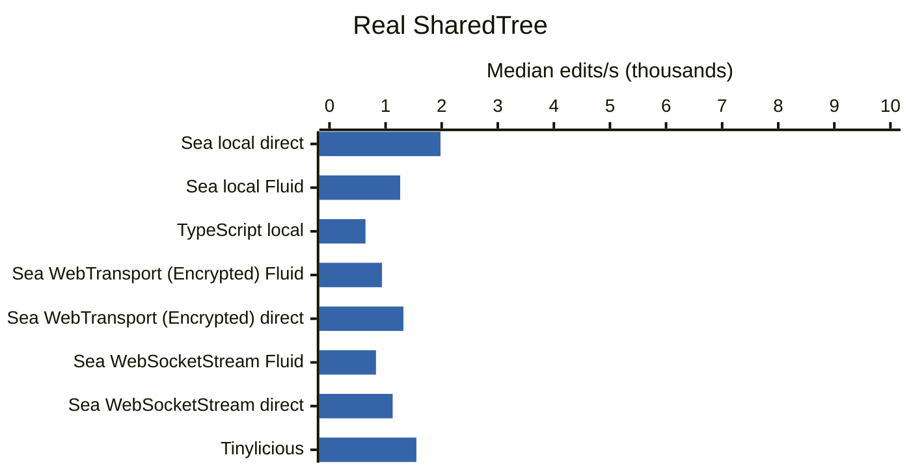

# Sea: Project Overview

Project record as of 2026-09-21; measurements use the revisions listed below.
For the current implementation and limitations, start with the [project README](../README.md).

Sea (Snapshotted Event Archive) is an experimental Rust service for ordered application events, immutable blob trees, and snapshots.
Applications own event meaning and snapshot content; the service owns ordering and publication authority.
Fluid integration is optional.

This overview describes the architecture, development workflow, measured behavior, and known limitations.
Sea is a single-host experiment, not a production replacement for an existing Fluid service.
For setup and usage, see the [project README](../README.md); for service contracts, see the [architecture guide](../SEA_ARCHITECTURE.md).

## Architecture

Native and browser clients access the sequencer locally or over a network transport.
Storage options include memory, buffered-file, and durable-file backends with different persistence guarantees.



## AI-Assisted Development

See the [agentic-development guide](AGENTIC_DEVELOPMENT.md) for the workflow, representative iterations, human involvement, and what the records can establish about effectiveness.

The project used agent-written reusable skills to coordinate parallel groups of agents and to design and run quality iterations.
The coordinator knew a private evaluation target: a bug fix had exposed missing coverage, and the added regression test was poorly placed.
The audit agents received general quality guidance, not that target.

The skills were refined and the audits repeated.
The objective was partly achieved, then further runs stopped producing material improvements within the chosen scope.
That was a stopping condition, not evidence that the code was defect-free.



The diagram does not imply fully autonomous or concurrent execution of every step.
The private-target account comes from the project author and does not describe deliberate defect seeding.
Supporting records: [quality-iteration skill](../../.github/skills/rust-service-quality-iteration/SKILL.md), [iteration 0016 skill review](iterations/0016/skill-review.md), and [iteration 0017 convergence assessment](iterations/0017/phase-3-report.md#convergence-assessment).
They support the method and its limits, not the complete private-evaluation chronology.

## Measurement Scope

**Measured 2026-09-20:** service/source results at Sea `92ecf30f4a7`; paired browser results at `9cb45f707ab`, with benchmark-only changes for WebSocketStream; Tinylicious LevelDB includes repair `cf89ceb2ec1`.
**End-to-end tests refreshed 2026-09-21:** Sea passes all 669 recorded Tinylicious current-version passes, plus 20 more.
160 retained passing browser samples (80 per distributed data structure (DDS) mode; one additional failed campaign retained), 180 passing repeated service samples, 104 storage probes, and 33 additional LevelDB probes.
Local, single-host stack comparisons: different features, transports, and persistence guarantees; not production capacity or a language-only comparison.

## At a Glance

Throughput cells give **64-byte / 8,192-byte offered ops/s**, using eight service cores and four separate generator cores.
These are single-run threshold passes from the storage exploration, not repeated capacity estimates or equal-durability comparisons.
✅ marks a favorable measured result or a shared positive outcome within the stated scope, not overall superiority.

| Aspect | Snapshotted Event Archive (SEA) | Tinylicious |
| --- | --- | --- |
| Language | Rust | TypeScript |
| Runtime | ✅ Native or WASM | JavaScript |
| First part Code | ✅ 19,211 lines:<br>7,090 test/support + 12,121 other | 35,927 lines:<br>10,775 test/support + 25,152 other |
| Transitive dependencies | ✅ 163 crates:<br>156 external + 7 workspace | 317 npm packages:<br>305 external + 12 workspace |
| Representative libraries | Tokio, Quinn/wtransport, rustls, Serde, Postcard | Express, Socket.IO, isomorphic-git, LevelDB, Winston |
| Supported Streams | ✅ WebTransport, WebSocketStream, WebSocket | WebSocket via Socket.IO<br>(❌ no application-level receive backpressure) |
| Fluid end-to-end tests<br>(689 selected tests) | ✅ 100% | ✅ 100% |

| Aspect | Snapshotted Event Archive (SEA) | Tinylicious |
| --- | --- | --- |
| Op throughput: memory<br>(64 B / 8,192 B payload)<br>(8 cores) | ✅ 88,000 / 38,000 ops/s | 950 / 800 ops/s |
| Op throughput: disk, buffered<br>(64 B / 8,192 B payload)<br>(8 cores) | ✅ 46,000 / 30,000 ops/s | 900 / 100 ops/s (LevelDB) |
| Op throughput: durable<br>(64 B / 8,192 B payload)<br>(8 cores) | ✅ 2,000 / 160 ops/s<br>(inconsistent) | ❌ No durable ack in tested config |
| Memory at matched 500 ops/s<br>(64 B / 8,192 B payload)<br>(4 cores) | ✅ 42.49 / 74.75 MiB RSS | 168.53 / 220.72 MiB RSS |

Source scopes include tests and different feature sets; dependency and test counts are not quality scores.
Sea's WebTransport and WebSocketStream paths support streaming backpressure; ordinary WebSocket uses bounded fail-stop receive queues instead.
RSS values are medians of ten run means; small/large payload order matches the throughput rows.
Matched-load RSS and repeated-throughput results below retain their recorded core counts; no eight-core matched-load repeat was collected.
Test selections differ, and pending tests are not passes.

<details>
<summary>Feature comparison: test scope, dependency counting, and guarantees</summary>

**Tests:** the refreshed Sea run started at 2026-09-21 00:49:50 UTC on `8cee1f04f0a` plus three test-allowlist changes, using the existing memory-backed WebSocket runner.
The full run completed in 62.628 seconds: **691 passed, 0 failed, 493 pending**.
The newly enabled 31 attach-lifecycle and two SharedString grouped-batching cases passed in two focused runs and again in the full suite, without changing assertions or timeouts.
Sea's runner selects current-version APIs, but standalone historical suites also register tests outside that selection.
The totals therefore comprise **689 current-version passes and 486 pending cases**, plus two historical-loader entry-point passes using the local driver and seven pending historical cases (six compression cases and one legacy-chunking case).
Those two local passes are not Sea compatibility coverage.

Tinylicious's default selection includes compatibility coverage and has a different denominator.
Its split comes from the Tinylicious JUnit report dated 2026-09-19 21:16:07 UTC, whose totals match the [integration validation record](INTEGRATION_TEST_CONFIGURATION_PLAN.md): 4,049 passes and 1,921 pending tests.
The compatibility matrix repeats scenarios with old/new loader, driver, container-runtime, and data-store-runtime combinations, as well as different-version clients creating and loading documents.
These are additional configurations of many of the same scenarios, not thousands of distinct service features.

| Tinylicious test group | Passed | Pending |
| --- | ---: | ---: |
| Current-version `Non-Compat` configurations | 661 | 502 |
| Current-version load/summarize benchmarks outside the matrix | 8 | 4 |
| Generated layer-compatibility configurations | 1,950 | 716 |
| Generated cross-client compatibility configurations | 1,422 | 698 |
| Explicit historical-loader and legacy-chunking cases outside the matrix | 8 | 1 |
| Total | 4,049 | 1,921 |

Classification uses each JUnit test's `classname`, with the standalone compression, entry-point, and legacy-chunking suites counted as compatibility because they explicitly request historical APIs.
Comparing individual test identities confirms that Sea passes every one of Tinylicious's 669 recorded current-version passes, plus 20 cases Tinylicious skips: 11 reentry, four message-size/chunking, four blob/compression, and one snapshot-refresh case.
Both current-version inventories contain 1,175 cases; Sea skips 486 and Tinylicious skips 506.
Remaining skips include local-only coverage, capability restrictions, service-specific behavior, and disabled regressions; they are not all irrelevant.
Both recorded runs passed every executed test; neither demonstrates 100% coverage of all Fluid behavior.

Reproduce the newly enabled selection, then the full Sea suite, from `packages/test/test-end-to-end-tests/`:

```bash
pnpm build:test:esm
node scripts/seaRunner.mjs --grep 'Validate Attach lifecycle|SharedString grouped batching' --no-bail
node scripts/seaRunner.mjs --no-bail
```

**Dependencies:** counted at `9cb45f707ab` for Linux x86-64, deduplicated by package name and version, excluding the server/package root.
The Sea graph includes default features plus `websocket-stream`, normal dependencies, build dependencies, and proc-macro dependencies; development-only edges are excluded.
Tinylicious uses its installed production graph, including resolved optional dependencies, with workspace links normalized through their package manifests and all dependency occurrences traversed.
The figures exclude the Rust standard library, the Node.js runtime, and separate client applications; packages and crates are not equivalent units of size or complexity.
Representative library names identify responsibilities, not measured dependency sizes.

Reproduce the graph inputs from the repository root:

```bash
cargo tree --manifest-path rust-service/Cargo.toml --locked \
  --package sea-webtransport-server --features websocket-stream \
  --target x86_64-unknown-linux-gnu --edges normal,build --prefix none --format '{p}'
pnpm --dir server/routerlicious --filter tinylicious list --prod --depth Infinity --json
```

**Backpressure:** SEA's [transport contract](../crates/sea-webtransport/README.md) distinguishes streaming receive backpressure from the ordinary WebSocket compatibility adapter.
The latter fails on overflow at 4 MiB or 256 queued messages per socket; it cannot pause incoming browser messages and does not bound total process memory.
Tinylicious's [runner](../../server/routerlicious/packages/tinylicious/src/runner.ts) leaves operation and connection throttlers unset; Socket.IO/TCP buffering is not an equivalent documented application-level receive-backpressure contract.

**Disk and durability:** the Tinylicious disk entry is LevelDB without explicitly synchronized writes, not a configured synchronous durability mode.
The cross denotes no equivalent per-operation synchronized acknowledgment guarantee in this configuration.
SEA durable-file results are inconsistent, and physical power-loss qualification remains outstanding.
See the storage exploration below for failed probes and queue-growth caveats.

</details>

## Source Lines to Maintain

Repository-owned dependency scopes, including tests; not equivalent feature sets or a measure of maintenance effort.



For each service, test/support plus other code equals the total; comments are counted separately.

| Scope | Files | Code lines | Comment lines | Test/support code subset | Other code |
| --- | ---: | ---: | ---: | ---: | ---: |
| Sea native server local non-development dependency closure | 50 | 19,211 | 2,045 | 7,090 | 12,121 |
| Tinylicious local server dependency closure | 335 | 35,927 | 7,538 | 10,775 | 25,152 |
| Tinylicious wrapper only, a subset of the preceding row | 35 | 2,442 | 356 | 472 | 1,970 |
| Sea TypeScript clients and adapters, separate from native scope | 24 | 5,628 | 716 | 2,669 | 2,959 |

<details>
<summary>Source-count method and reproduction</summary>

cloc 2.06 (`cloc@2.6.0`) counts tracked Rust, TypeScript, and JavaScript at clean revision `92ecf30f4a7`, before the Tinylicious repair.
Scopes follow manifests, not linker reachability; duplicate-content paths and conditional code are included.
Generated entrypoints, package-version files, build output, and external dependencies are excluded.
The Tinylicious closure includes shared service responsibilities beyond this experiment.

Test/support classification uses directory/file names and syntax-derived Rust `#[cfg(test)]` module and test-function spans.
It excludes complex conditional expressions, unrecognized fixtures, and integration tests outside selected `src` scopes; "other code" does not mean production-only code.
Test/support comment counts are 28, 809, 33, and 50 in table order.

To regenerate at the pinned revision, follow the source-inventory instructions in the [collection scripts guide](../scripts/README.md#commands).
Run from the repository root and use a disposable output directory.

</details>

## Matched-Load Resources

500 ops/s; 32 documents, one writer and observer each; four service cores plus four generator cores.
Sea memory with Node/WebAssembly (WASM) WebSocket versus Tinylicious in-memory database with Node Socket.IO and filesystem Git summaries.
Ten fresh runs per row; three warmup seconds and ten measured seconds.



| Payload | Service | Mean RSS median (min-max), MiB | CPU, % | Worst-worker p95 median, ms |
| --- | --- | ---: | ---: | ---: |
| 64 bytes | Sea | 42.49 (42.40-42.64) | 9.43 | 0.46 |
| 64 bytes | Tinylicious | 168.53 (167.57-170.99) | 38.81 | 2.14 |
| 8,192 bytes | Sea | 74.75 (74.69-74.86) | 14.85 | 0.71 |
| 8,192 bytes | Tinylicious | 220.72 (218.28-222.40) | 48.09 | 3.04 |

RSS is the median of run means; CPU is the median, with 100% equal to one occupied core.
Latency is the median of run worst-worker p95 values, not a pooled percentile.
Every matched sample delivered 500 ops/s; retained history and duration match.

## Repeated Throughput

Memory-backed operation storage; same document counts and timing as the matched-load test.
All rows passed ten fresh runs with zero final errors or missing deliveries.
Rates are tested loads, not capacity maxima; payload bandwidth excludes protocol overhead.

### Native Sea Transports

Four service cores and four separate native generator cores.
WebTransport includes QUIC/TLS; loopback WebSocket is unencrypted.



WS = WebSocket; WT = WebTransport.
The chart pairs equal offered loads within each payload size; the table also includes higher WebSocket-only loads.

| Transport | Payload | Offered ops/s | Delivered ops/s median (min-max) | Payload MiB/s | CPU, % | RSS median, MiB | Worst-worker p95 range, ms |
| --- | --- | ---: | ---: | ---: | ---: | ---: | ---: |
| WebSocket | 64 bytes | 12,000 | 11,999.00 (11,996.20-12,002.10) | 0.7324 | 119.05 | 78.18 | 0.98-1.02 |
| WebTransport | 64 bytes | 12,000 | 11,998.20 (11,996.60-12,000.90) | 0.7323 | 157.63 | 49.79 | 2.19-2.64 |
| WebSocket | 64 bytes | 24,000 | 23,997.75 (23,994.40-24,001.70) | 1.4647 | 229.20 | 111.16 | 1.89-2.04 |
| WebSocket | 8,192 bytes | 6,000 | 5,999.50 (5,998.70-6,000.00) | 46.8711 | 93.43 | 423.80 | 0.94-0.99 |
| WebTransport | 8,192 bytes | 6,000 | 5,998.60 (5,998.00-5,999.70) | 46.8641 | 156.70 | 399.58 | 2.64-2.87 |
| WebSocket | 8,192 bytes | 12,000 | 11,998.50 (11,996.00-12,000.10) | 93.7383 | 180.82 | 804.47 | 1.87-1.91 |

### Tinylicious

Node Socket.IO, in-memory database and filesystem Git summaries; four separate generator cores.

| Payload | Service cores | Delivered ops/s median (min-max) | Payload MiB/s | CPU, % | Worst-worker p95 range, ms |
| --- | ---: | ---: | ---: | ---: | ---: |
| 64 bytes | 1 | 749.90 (748.90-750.10) | 0.0458 | 64.76 | 5.70-12.89 |
| 64 bytes | 4 | 749.75 (749.40-750.10) | 0.0458 | 62.70 | 2.79-3.14 |
| 8,192 bytes | 1 | 749.65 (745.60-749.90) | 5.8566 | 78.62 | 8.91-60.22 |
| 8,192 bytes | 4 | 749.75 (748.90-749.90) | 5.8574 | 77.68 | 3.52-5.30 |

### Node/WASM Sea Client

WebSocket, Sea memory; four separate generator cores.

| Payload | Service cores | Delivered ops/s median (min-max) | Payload MiB/s | CPU, % | RSS median, MiB | Worst-worker p95 range, ms |
| --- | ---: | ---: | ---: | ---: | ---: | ---: |
| 64 bytes | 1 | 11,997.15 (11,975.00-11,998.90) | 0.7322 | 78.72 | 73.05 | 2.66-14.76 |
| 64 bytes | 4 | 15,998.05 (15,994.30-15,999.80) | 0.9764 | 153.92 | 86.47 | 3.07-3.24 |
| 8,192 bytes | 1 | 5,998.75 (5,997.70-5,999.50) | 46.8652 | 79.50 | 421.57 | 6.97-10.94 |
| 8,192 bytes | 4 | 7,997.95 (7,997.10-7,999.00) | 62.4840 | 143.86 | 550.85 | 3.22-10.57 |

<details>
<summary>Repeated-run client costs, backlog, and provenance</summary>

The 80-sample Node/WASM and matched-resource campaign and 100-sample native/Tinylicious campaign alternated point order.
Each native generator is a release binary with a single-thread Tokio runtime and one serial submission queue per document.
The native WebSocket adapter is benchmark-only, not a supported production client API.

Median summed native generator CPU-seconds are 8.13, 9.72, 15.27, 8.11, 12.53, and 15.69 in native-table order.
No individual native-repeat generator exceeded 4.00 CPU-seconds across warmup, measurement, and drain.
Every native Sea repeat ended its measured window with zero pending operations.
Window-end pending totals reached 221 in the Node/WASM campaign and 44 in the native/Tinylicious campaign; all drained.
Short-run threshold passes do not establish indefinite queue stability or bounded retained-history memory.

The Node/WASM harness needed its obsolete operation-ID argument removed; this is committed in `9cb45f707ab` and changes no service data path.
All 60 Sea attempts in the initial 80-attempt campaign failed; the entire matrix was rerun after the repair.
The failed campaign is retained, not pooled with the corrected data.
Raw samples, sample standard deviations, nearest-rank p95, backlog-quarter means, commands, and hashes are in the [refresh summary](measurements/refresh-92ecf30/summary.json).

</details>

## Optimized Browser Results

**Dummy DDS:** lightweight SharedObject using captured SharedTree operation bodies, without SharedTree processing.
**Real SharedTree:** scalar edits through SharedTree, including its tree processing.
Both use one writer and observer, 100 warmup and 1,000 measured edits, and ten repetitions per path at `9cb45f707ab`.
The 160 retained samples passed convergence checks; one WebSocketStream campaign failed before an unchanged retry passed.
These are application-client measurements, not service-capacity limits.
**All networked Sea rows use the server's memory backend**, explicitly selected with `SEA_STORAGE_MODE=memory`.
WebSocketStream uses unencrypted loopback `ws://`, matching Tinylicious's lack of TLS here; WebTransport includes QUIC/TLS.
Tinylicious uses its default in-memory database, but still writes Git summaries to the filesystem.





Median edits/s (minimum-maximum), rounded to whole edits/s.
Both charts use the same scale; WT = WebTransport; WS stream = the WebSocketStream API over unencrypted `ws://`.
Direct paths omit Fluid runtime responsibilities.

| Path | Storage backend | Dummy DDS | Real SharedTree |
| --- | --- | ---: | ---: |
| Sea local direct | Sea memory | 8,921 (8,078-9,470) | 1,979 (1,928-2,037) |
| Sea local Fluid | Sea memory | 2,163 (1,954-2,236) | 1,260 (1,221-1,288) |
| TypeScript local | Browser `sessionStorage` database | 869 (771-1,000) | 642 (623-744) |
| Sea WebTransport, Fluid | Sea memory | 1,368 (1,306-1,413) | 936 (911-958) |
| Sea WebTransport, direct | Sea memory | 2,863 (2,789-2,910) | 1,318 (1,260-1,348) |
| Sea WebSocketStream, Fluid | Sea memory | 1,131 (1,082-1,141) | 829 (817-838) |
| Sea WebSocketStream, direct | Sea memory | 2,154 (2,022-2,198) | 1,126 (1,071-1,135) |
| Tinylicious | In-memory database; filesystem Git summaries | 3,354 (3,188-3,619) | 1,549 (1,505-1,604) |

<details>
<summary>Browser workload and comparison limits</summary>

Both DDS modes use the same loop: one scalar edit per turn, no per-turn convergence wait, then final writer/observer convergence.
The dummy DDS retains representative operation bodies, Fluid envelopes, and ID allocation where applicable; it does not execute SharedTree's tree logic.
Real SharedTree uses the optimized forest implementation.
An edit is not a fixed number of bytes or wire messages across DDS modes, and direct paths are not drop-in equivalent Fluid drivers.

Browser and service processes shared CPUs 8,10,12,14,16,18,20,22.
Dummy DDS ran first, then SharedTree; path order was fixed, not randomized or interleaved.
WebSocketStream was collected later with the same workload and affinity, using benchmark-only changes to select the streaming API explicitly with no ordinary WebSocket fallback.
The first dummy-DDS Fluid campaign timed out awaiting Chromium CDP on repetition 7, with crash-handler messages; its cause remains unisolated.
That runner did not persist the first six sample results; the unchanged ten-sample retry passed, and only complete groups enter the table.
The direct dummy group and both SharedTree groups passed on their first attempts.
The [WebSocketStream supplement](measurements/browser-dds-comparison/websocket-summary.json) retains all complete samples, the failed run log, endpoint/storage metadata, and validation provenance.
External services persisted across their ten samples; their peak RSS is not the matched-load memory comparison.
Builds use release Sea native/WASM, WASM SIMD, and production-minified esbuild bundles; no custom Cargo/LTO profile.
Medians average the two central raw samples; the runner's lower-middle aggregate medians are retained in the raw evidence but not used here.
The charts are embedded Mermaid definitions with identical axes and path order; the original six-path definitions are also retained in the [paired summary](measurements/browser-dds-comparison/summary.json).
Commands, build hashes, raw results, and reproduction details: [paired browser evidence](measurements/browser-dds-comparison/README.md).

</details>

## Storage and Core Exploration

**Offered ops/s: highest observed threshold pass / higher completed threshold failure.**
Single-run probes, not repeated capacity brackets; durable results are non-monotonic.
Sea uses native WebSocket; Tinylicious uses Node Socket.IO.
All use 32 documents, four generator cores, three warmup seconds, ten measured seconds, and fresh workspace-backed storage.

| Payload | Service cores | Sea memory | Sea buffered-file | Sea durable-file, inconsistent | Tinylicious in-memory DB | Tinylicious LevelDB |
| --- | ---: | ---: | ---: | ---: | ---: | --- |
| 64 bytes | 1 | 9,500 / 10,000 | 7,000 / 8,000 | 4,000 / 6,000 | 950 / 1,000 | 250 / 500 |
| 64 bytes | 4 | 46,000 / 48,000 | 26,000 / 28,000 | 2,000 / 4,000 | 950 / 1,050 | 900 / 950 |
| 64 bytes | 8 | 88,000 / 92,000 | 46,000 / 48,000 | 2,000 / 4,000 | 950 / 1,050 | 900 / 950 |
| 8,192 bytes | 1 | 6,000 / 6,500 | 4,252 / 4,500 | 500 / 1,000 | 850 / 900 | 100 / 250 |
| 8,192 bytes | 4 | 28,000 / 30,000 | 17,000 / 18,000 | 2,000 / 4,000 | 850 / 900 | 100 / 250 |
| 8,192 bytes | 8 | 38,000 / 40,000 | 30,000 / 32,000 | 160 / 500 | 800 / 850 | 100 / 250 |

Pass criteria: at least 98% submitted and delivered in-window; every worker p95 and scheduling lag at most 100 ms; zero final errors or missing deliveries.
**The automatic flag does not check backlog trend.**
File-backed LevelDB and Sea buffered-file are not equivalent to Sea's synchronized durable acknowledgment.

<details>
<summary>Storage probes: failures, backlog, and bottleneck limits</summary>

- **Probe accounting:** 104 attempts comprise 48 initial probes, 43 refinements, 12 midpoints, and one corrected midpoint: 57 passes, 42 completed failures, five pre-load failures.
  Two pre-load attempts used invalid 4,250 ops/s native rates, not divisible by four workers; 4,252 passed.
  Three durable-file 120-large-op startup failures remain unresolved.
- **Buffered-file queues:** four-core 17,000-large passed with 398 pending operations and summed backlog-quarter means of 0, 1.9, 20.4, and 197.8.
  At 26,000-small, quarter means were 77.8, 13.7, 505.2, and 488.0 despite zero pending at window end.
  All drained; lower 16,000-large and 24,000-small probes also passed.
  Singleton handoff cost remains unresolved in the [storage optimization report](STORAGE_OPTIMIZATION.md); this workload does not isolate its contribution or deliberately fill grouped-append batches.
- **Eight-core memory, small:** 88,000 offered delivered 87,956.4 ops/s, with 69.71 ms p95, 709.84% service CPU, and 121 pending before drain.
  The busiest generator used 12.56 CPU-seconds over about 13 seconds; the 92,000 failure is not an isolated server ceiling.
- **Eight-core memory, large:** 38,000 offered delivered 37,992.8 ops/s (296.82 MiB/s), with 7.79 ms p95 and 4,025.55 MiB peak RSS.
  At 40,000, RSS reached about 4,161 MiB and the 4 GiB guard terminated the service, causing missing deliveries.
  This is a retained-history memory-budget boundary.
- **Durable variability:** one-core 120-large failed at 6,236 ms p95 before a retry passed; four-core 700-small failed before passing.
  Four/eight-core 120-large attempts reset or failed at startup despite later higher-load passes.
  Eight-core 500-large failed at 816.56 ms p95 while four cores passed 2,000-large.
  The cause is unisolated; more cores did not consistently help.
- **Tinylicious queues:** the highest in-memory passes accumulated late-window backlog, then drained; indefinite stability is not established.

</details>

<details>
<summary>LevelDB repair, measurements, and persistence guarantees</summary>

The LevelDB column includes Tinylicious repair `cf89ceb2ec1`, measured as a working-tree patch on `92ecf30f4a7`.
It adds the checkpoint collection indexed by `_id` and preserves filter identity fields on inserting upserts; other columns and source counts exclude that repair.
All 22 Tinylicious tests passed, including checkpoint update, identity isolation, deletion, and database reopen.
This does not test full service restart recovery or power loss.

The 33 LevelDB boundary attempts contain six passes, 26 completed threshold failures, and one pre-load harness failure.
The harness checked LevelDB's `CURRENT` marker before opening completed; it now checks after document creation/connection, before load.
Three separate 500 ops/s smoke/control runs passed, covering both database modes after that correction.
All 32 completed boundary runs ended without errors or missing deliveries.
One-core small payloads failed at 500 ops/s with 109 ms worst-worker p95; large payloads failed at 250 with 128-361 ms p95.
Gaps between passing and failing observations were not exhaustively searched.
The [LevelDB evidence](measurements/tinylicious-leveldb-fixed/README.md) retains every attempt and links the original blocked runs.

Both Tinylicious database modes use filesystem Git summaries; LevelDB selection is `db:inMemory=false` with `db:path`.
LevelDB writes do not explicitly request synchronous persistence.
Sea buffered-file appends without synchronizing each write; durable-file appends new frames and synchronizes once per event batch, with synchronized staging/rename on creation.
Both Sea file modes retain complete history in memory.
Durable acknowledgment relies on [interrupted-tail and synchronized-prefix integrity assumptions](../crates/sea-file-durable/README.md#power-loss-model); physical power-cut qualification remains outstanding.

</details>

## Scope and Limitations

Experimental single-host software, not a proposed production replacement; Tinylicious is a local-development baseline, not deployed Routerlicious or ODSP.

<details>
<summary>Service limitations relevant to interpretation</summary>

| Boundary | Current limitation |
| --- | --- |
| Availability | No replication or cross-host fencing; no scale-out or high-availability claim |
| Durability | Reliable flushes, synchronized-prefix integrity, and crash-atomic creation assumed; physical power-cut qualification outstanding |
| Retention | No garbage collection for events, snapshots, blobs, directories, or unattached uploads |
| Security | Built-in host lacks authentication and multi-tenant policy; encryption leaves topology, ordering, and snapshot metadata visible |
| Fluid compatibility | Automatic reconnect, offline merge, loading groups, and garbage-collection policy remain incomplete |
| Network | QUIC/UDP WebTransport cannot use TCP-only Codespaces forwarding; WebSocket has different constraints |
| Delivery | Network-isolated CI has a documented Cargo dependency-restoration gap |

Sources: [overview](../README.md), [architecture](../SEA_ARCHITECTURE.md), and [known issues](../KNOWN_ISSUES.md).
Unmeasured here: many writers on one document, idle memory, wide-area networking, snapshot recovery, compression effects, and browser artifact size.
Single-round-trip loading and complete direct SharedTree summary support remain unverified.

</details>

<details>
<summary>Machine, workload, metrics, and overload guards</summary>

| Item | Configuration |
| --- | --- |
| Revision | Service/source inventory `92ecf30f4a7`; paired browser `9cb45f707ab`; LevelDB repair `cf89ceb2ec1` |
| Machine | AMD EPYC 7763 VM; 32 logical CPUs, 16 exposed physical cores; 135,064,969,216 bytes RAM |
| Environment | Debian 13.6, kernel 6.8.0-1064-azure; shared Codespace; loopback; inspected CPU/memory cgroups unlimited |
| Tools/build | Rust 1.98.1, Node 22.23.2, Chromium 152.0.7977.82; release native/WASM, WASM SIMD, production-minified browser bundles |
| Filesystem | Workspace ext4 on `/dev/loop4`, not `/tmp` |
| Service cores | One: CPU 2; four: 2,4,6,8; eight: 0,2,4,6,8,10,12,14 |
| Generator cores | Four separate processes on 16,18,20,22; editor and VM-host activity uncontrolled |
| Service settings | Sea connection limit 128 per listener; fresh service/documents per stress sample; no application-requested snapshots, compression, or encryption |
| Payload | 64 or 8,192 bytes: eight-digit sequence followed by ASCII `x`; one operation per call, serial per-document queues, no application batching |
| Delivery | One observer's unique deliveries determine throughput; writer echoes checked for exact payload, uniqueness, and order but not counted again |
| Resources | Main service PID and threads sampled through `/proc` every 250 ms; no external companions in these configurations; not a general process-tree sampler |
| Latency | Worker monotonic submit-to-observe time; worker p95 includes measured operations delivered during drain, not pooled or durable-ack latency |
| Aggregates | Median averages central values for even sample counts; ranges span runs; generator CPU includes warmup and drain |
| Guards | 8,192 outstanding operations and 1,000,000 submissions per generator; sampled 4 GiB service-RSS termination; 120-second per-cell and 30-minute wrapper limits; ten-second drain |

RSS is resident set size; MiB/s reports useful payload only, not envelopes, echoes, TLS, or wire bandwidth.
The RSS guard is not a hard memory cgroup limit; wrapper timeouts do not guarantee descendant cleanup.
Different client implementations, security, metadata, and service responsibilities prevent protocol-only or language-only attribution.
Short fresh-history runs do not establish long-term bounded memory, storage, or queues.

</details>

<details>
<summary>Validation and evidence links</summary>

At the measured Sea revision: Cargo formatting, strict all-target/all-feature Clippy, warning-free rustdoc, all-target build/tests, release binaries, documentation checks, scoped policy, and root `pnpm build:fast` passed.
The full non-Rust `./test.sh` was not rerun for collection.
The Tinylicious repair passed compilation, 22 tests, lint with existing warnings, scoped policy, and real client workloads.
Tests establish selected behavior, not production availability, security, complete compatibility, or physical power-loss survival.

- [Refresh evidence index](measurements/refresh-92ecf30/README.md): commands, environment, validation logs, and compact raw archive.
- [Refresh summary](measurements/refresh-92ecf30/summary.json): samples, statistics, manifests, hashes, and retained failures.
- [Paired browser evidence](measurements/browser-dds-comparison/README.md): dummy DDS and real SharedTree commands, raw samples, chart definitions, and build hashes.
- [WebSocketStream supplement](measurements/browser-dds-comparison/websocket-summary.json): 40 added browser samples, explicit memory storage and unencrypted endpoints, retained timeout, and full harness validation.
- [LevelDB evidence](measurements/tinylicious-leveldb-fixed/README.md) and [summary](measurements/tinylicious-leveldb-fixed/summary.json): repair provenance, all outcomes, and raw archive.
- [Collection scripts](../scripts/README.md): reproduction commands and configuration.

Wrapped campaigns record exact commands, environment, revision, status, and tracked patches; direct collectors retain configurations and artifact hashes in manifests.
No service data-path optimization was made for recollection; the Tinylicious compatibility repair is disclosed separately.

</details>
