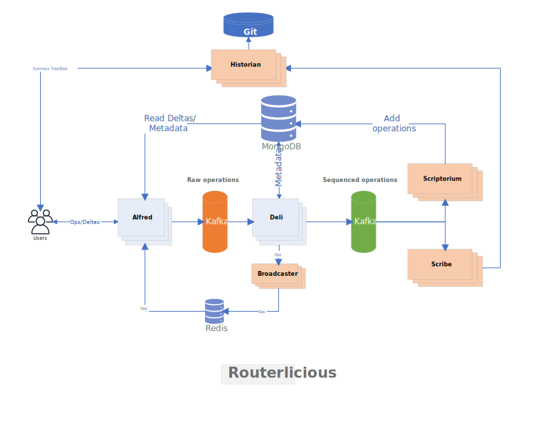

# Routerlicious

Routerlicious handles the receiving of delta operations and is responsible for the ordering and assignment of a
sequence number to them. Once assigned it is also responsible for notifying connected clients of a new sequence
number.

This repository splits the code into two separate sections. The core API is contained within src/api. This section
contains the core routerlicious code. But stubs out connections to external services behind provided interfaces.
This code is shared between clients and services.

A server implementation is contained within various other folders. These are named based on the architecture image below. This makes use of the API but provides implementations of
the interfaces. For instance connections are handled with socket.io. And cross machine communication is handled
via Redis.

The services follow the [twelve factor](https://12factor.net) methodology and are considered [cattle and not pets](http://cloudscaling.com/blog/cloud-computing/the-history-of-pets-vs-cattle/).

## Getting Started

Get up and running quickly using our Get Started guide at https://fluidframework.com.

## Help and Questions

Questions can be directed to [GitHub Discussions](https://github.com/microsoft/FluidFramework/discussions)

## Building and Running

Note that we also provide an npm package of our client side API which allows you to program against the production
Routerlicious service. See the Documentation at https://fluidframework.com for more details. You only need to follow the
below steps if you'd like to run a local version of the service or need to make changes to it.

### Prerequisities

#### Standalone

-   [Docker](https://www.docker.com/)
    -   If running on Windows, WSL 2 may not work correctly for symlinking dependencies. This will manifest as "module not found" errors when starting the service. You can disable WSL 2 (and use Hyper-V instead) in Docker Settings -> General
    -   In Docker Settings -> Resources -> Advanced, give Docker at least 4GB of Memory--the more the better. You can give additional CPUs as well.
    -   In Docker Settings -> Resources -> Advanced, check the hard drive where your repository lives.

#### For Development

-   [Node v18.x](https://nodejs.org/en/)
-   [Node-gyp](https://github.com/nodejs/node-gyp) dependencies
    -   (Notes for Windows users, **not** using [WSL](https://docs.microsoft.com/en-us/windows/wsl/about)):
        -   The easiest way to install the dependencies is with windows-build-tools: `npm install --global --production windows-build-tools`

### Development

Docker is the preferred method of development. Run the following commands from this directory.

To build the service:

```
docker-compose build
```

And to run the service:

```
docker-compose up
```

We also support volume mounting your local drive into the container which provides a faster dev loop.

To start the service with your local drive mounted run the following commands:

```sh
npm install -g pnpm
pnpm install
npm run build
npm start
```

To stop the service run `npm stop`. If you also want to clean up any mounted volumes (to get to a fully clean state) run `npm run stop:full`.

If you also need debugging you can run:

-   `npm run start:debug` - which will allow you to attach a debugger

After starting the service, you can navigate to http://localhost:3000/ in a browser.

#### Dev Flow

An example developer flow would be to:

-   `npm run start:debug` - attach a debugger

Then use another command window to deliver the changes:

-   `npm run build` - build
-   `docker-compose restart {modified service}` - allow the container to pick up the changes stored on the local machine

> **Note:** Some dependencies are required to be installed and built on the OS they are running on.
> When you update one of these dependencies (e.g. change versions) you will need to fully restart the service using `npm stop && npm start`.
> Current dependencies with this requirement: zookeeper

or

### Standalone

You can also just run the service directly with Docker.

Docker Compose is used to run the service locally. To start up an instance of the service simply run the following two commands.

-   `docker-compose build`
-   `docker-compose up`

The standalone app is meant to be run in a Linux container. If when running either of the above commands you get an error mentioning `no matching manifest for windows/amd64 in the manifest list entries`, check that your Docker installation is configured to run Linux containers. If you are on Docker for Windows, you can check this by right-clicking on the Docker icon in your taskbar. If you see the option `Switch to Linux containers...`, click this. If you see the option `Switch to Windows containers...`, you are already configured to run Linux containers.

### Testing

To test simply run `npm test` - either inside of the container or after building locally.

You can use the --grep parameter of mocha to limit to a particular test or suite of tests. For example, to just run the
deli tests, you can use `npm run test -- --grep Deli`.

To debug simply add the mocha --inspect-brk parameter `npm run test -- --inspect-brk`. After which you can
attach to the running tests with VS Code or any other node debugger.

### Documentation

If you want to build API documentation locally, see
[Building Documentation](https://github.com/microsoft/FluidFramework/wiki/Building-documentation-locally).

## Design principals

-   Leverage the Client
-   Perf === Magic

## Architecture



### Microservices

Routerlicious as a whole is a collection of microservices. These microservices are designed to handle a single task and
have clear input and output characteristics. Many can be run as serverless lambdas and in fact we have our own
[lambda framework](./README.lambdas.md). We chose this path to have greater control over the throughput and latency
characteristics of our message processing. But could be also be run with Azure Functions, AWS Lambdas, Fission, etc...

#### [Alfred](./packages/lambdas/src/alfred)

Alfred is the entry point to the system. Clients connect to Alfred to join the operation stream. Joining the stream
allows them to receive push notifications for new operations, retrieve old operations, as well as create new ones. We
make use of Redis for push notifications. New operations are placed inside of Apache Kafka for processing.

#### [Deli](./packages/lambdas/src/deli)

Deli retrieves unsequenced messages from Kafka and then attaches a new sequence number to them. Sequence numbers
are per-document monotonically increasing numbers. Sequenced messages are placed back into Apache Kafka for processing.
The Deli microservice also runs the [Broadcaster](./packages/lambdas/src/broadcaster) lambda that directly put sequenced
message into redis so that alfred can listen and broadcast back to the clients.

#### [Scriptorium](./packages/lambdas/src/scriptorium)

Scriptorium retrieves sequenced messages from Kafka. It then writes the message
to a database for storage. We currently make use of Redis for broadcasting and MongoDB for storage.

#### [Scribe](./packages/lambdas/src/scribe)

Scribe is responsible for listening to inbound summary ops and then writing them to the public record in the Historian

#### [Historian](../historian)

Historian is in charge of storing document snapshots. It itself is a cached proxy to an underlying
content-addressable file system represented via the [Git REST API](https://developer.github.com/v3/git/).
Storage providers that implement this interface are then able to plug into the system as a whole. Currently we have
support for [GitHub](https://developer.github.com/v3/git/) and [Git](../gitrest).

More details on content-addressable file systems and Git can be found at

-   https://git-scm.com/book/en/v2/Git-Internals-Plumbing-and-Porcelain
-   http://stefan.saasen.me/articles/git-clone-in-haskell-from-the-bottom-up/

### Other Microservices

#### [Copier](./packages/lambdas/src/copier)

Copier directly reads the raw (unticketed) operations and store it in the database. The data can later be retrieved
via alfred for testing and verification.

## Distributed data structures

The API currently exposes four distributed data structures

-   Text
-   Map
-   Cell
-   Ink

## Logging

### Service

We make use of [Winston](https://github.com/winstonjs/winston) for logging on the service side. Winston adds in some nice features over the usual console like log levels, timestamps, formatting, etc...

It's easy to use though. Just import our configured logger via:

```js
import { logger } from "../utils";
```

And then you can do logger.info in place of console.log as well as logger.error, logger.warn, logger.verbose, logger.silly to target different levels. The default filter only displays info and above (so error, warning, and info). But you can change this within logger.ts.

### Libraries

Within internal libraries we make use of the [debug](https://github.com/visionmedia/debug) library. Debug allows a
library to log messages to a namespace. By default these messages aren't displayed but can be enabled by the app
that is making use of the library. Debug is a popular package used by most major node modules (express, socket.io, etc...).

For our node apps enabling library logging is as simple as setting the DEBUG environment variable - i.e.

`DEBUG=fluid:*,connect:compress,connect:session`

This is already done in our docker compose files for our own internal libraries which are all under the routerlicous namespace.

In the browser you can enable them by setting localStorage.debug variable.

`localStorage.debug = 'fluid:*'`

After which you will need to reload the page.

## Viewing Snapshots

Git is used to store document snapshots and provide revision history. The git storage model maps well to our own
stream of delta messages. And git semantics as applied to document collaboration provide interesting areas for further
exploration (i.e. branching, forking, merging documents).

To view the git stored snapshots simply run

```
git clone ssh://git@localhost:3022/home/git/fluid/fluid
cd fluid/fluid
git checkout <document id>
```

From there you can use your git repository management tool of choice to inspect the various documents and revisions
stored in the repository.

## Authentication model

Routerlicious uses a token based authentication model. Tenants are registered to routerlicious first and a secret key is generated for each tenant. Apps are expected to pass `<secret-key>`, `<tenant-id>`, and `<user-info>` as a signed token to routerlicious. Tenants are given a symmetric-key beforehand to sign the token.

When a user from a tenant wants to create/access a document in routerlicious, it passes the signed token in api load call. Routerlicious verifies the token, matches the secret-key for the tenant and on a successful verification, grants the user access to the document. The access token is valid for the entire websocket session. User is expected to pass in another signed token for any subsequent api load call.

For now, token is optional. So passing no token would grant access to the user.

### Creating a token

Routerlicious uses [jsonwebtoken](https://www.npmjs.com/package/jsonwebtoken) library for verifying the token. Example of a token creation:

```javascript
jwt.sign(
	{
		documentId: "<document_id>",
		scopes: ["doc:read", "doc:write", "summary:write"],
		tenantId: "<tenant_id>",
		user: "<user_id>",
		iat: Math.round(new Date().getTime() / 1000),
		exp: Math.round(new Date().getTime() / 1000) + 60 * 60, // 1 hour expiration
		ver: "1.0",
	},
	"<secret_key>",
);
```

### Passing auth token to the API

Add a token field to api load call.

```javascript
await prague.api.load(id, { encrypted: false, token });
```

Passing an invalid token will fail the load call.

<!-- AUTO-GENERATED-CONTENT:START (README_FOOTER) -->

<!-- prettier-ignore-start -->
<!-- NOTE: This section is automatically generated using @fluid-tools/markdown-magic. Do not update these generated contents directly. -->

## Contribution Guidelines

There are many ways to [contribute](https://github.com/microsoft/FluidFramework/blob/main/CONTRIBUTING.md) to Fluid.

-   Participate in Q&A in our [GitHub Discussions](https://github.com/microsoft/FluidFramework/discussions).
-   [Submit bugs](https://github.com/microsoft/FluidFramework/issues) and help us verify fixes as they are checked in.
-   Review the [source code changes](https://github.com/microsoft/FluidFramework/pulls).
-   [Contribute bug fixes](https://github.com/microsoft/FluidFramework/blob/main/CONTRIBUTING.md).

Detailed instructions for working in the repo can be found in the [Wiki](https://github.com/microsoft/FluidFramework/wiki).

This project has adopted the [Microsoft Open Source Code of Conduct](https://opensource.microsoft.com/codeofconduct/).
For more information see the [Code of Conduct FAQ](https://opensource.microsoft.com/codeofconduct/faq/) or contact [opencode@microsoft.com](mailto:opencode@microsoft.com) with any additional questions or comments.

This project may contain Microsoft trademarks or logos for Microsoft projects, products, or services.
Use of these trademarks or logos must follow Microsoft’s [Trademark & Brand Guidelines](https://www.microsoft.com/trademarks).
Use of Microsoft trademarks or logos in modified versions of this project must not cause confusion or imply Microsoft sponsorship.

## Help

Not finding what you're looking for in this README? Check out [fluidframework.com](https://fluidframework.com/docs/).

Still not finding what you're looking for? Please [file an issue](https://github.com/microsoft/FluidFramework/wiki/Submitting-Bugs-and-Feature-Requests).

Thank you!

## Trademark

This project may contain Microsoft trademarks or logos for Microsoft projects, products, or services.

Use of these trademarks or logos must follow Microsoft's [Trademark & Brand Guidelines](https://www.microsoft.com/en-us/legal/intellectualproperty/trademarks/usage/general).

Use of Microsoft trademarks or logos in modified versions of this project must not cause confusion or imply Microsoft sponsorship.

<!-- prettier-ignore-end -->

<!-- AUTO-GENERATED-CONTENT:END -->
