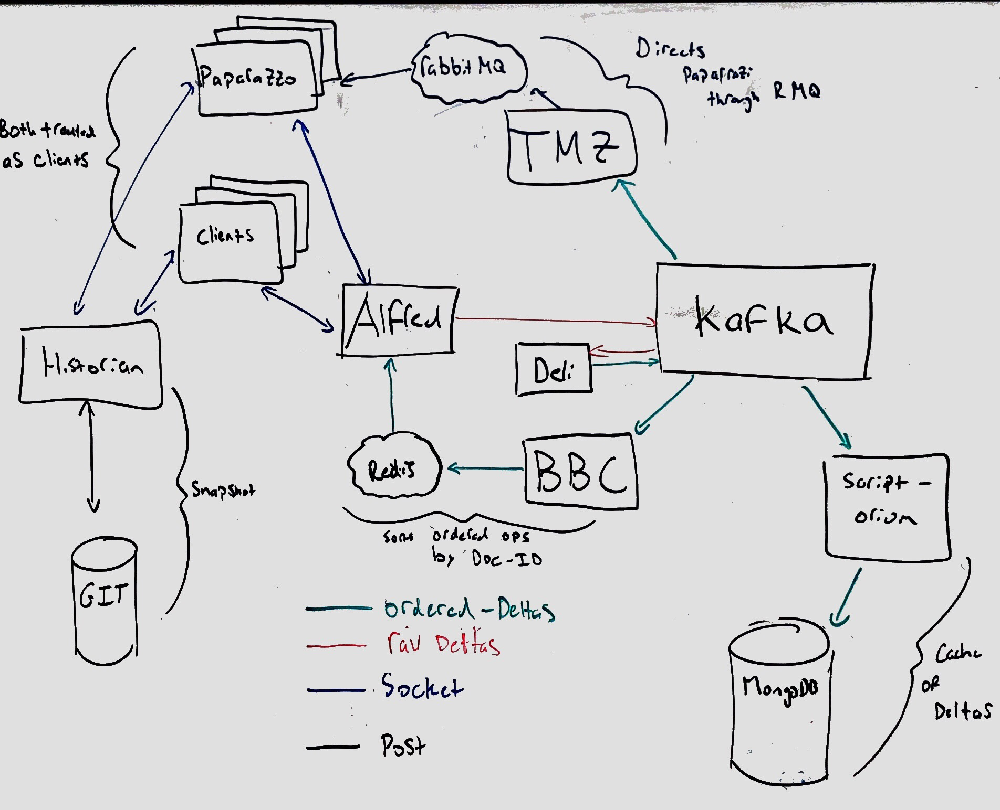

# Routerlicious

Routerlicious handles the receiving of delta operations and is responsible for the ordering and assignment of a
sequence number to them. Once assigned it is also responsible for notifying connected clients of a new sequence
number.

This repository splits the code into two separate sections. The core API is contained within src/api. This section
contains the core routerlicious code. But stubs out connections to external services behind provided interfaces.
This code is shared between clients and services.

A server implementation is contained within various other folders. These are named based on the architecture image below. This makes use of the API but provides implementations of
the interfaces. For instance connections are handled with socket.io. And cross machine communication is handled
via Redis.

The services follow the [twelve factor](https://12factor.net) methodology and are considered [cattle and not pets](http://cloudscaling.com/blog/cloud-computing/the-history-of-pets-vs-cattle/).

## Getting Started

To get started with Prague, we suggest that you [build a component](https://praguedocs.azurewebsites.net/get-started/build-a-component.html) using the [Yo Fluid](https://praguedocs.azurewebsites.net/get-started/yo-prague.html) bootstrapper.

If you want a local service, but don't want to build routerlicious, you can use the standalone dockerfile located at the Fluid Framework root.

If you want to dive into the Prague internals, keep reading below.

## Help and Questions

Questions can be directed to [Stack Overflow](https://stackoverflow.microsoft.com/questions/tagged/fluid)

## Build and Deployment Status

|Environment|Status|
|-----------|------|
|Service|[](https://offnet.visualstudio.com/officenet/_build/index?definitionId=3)|
|API|[](https://offnet.visualstudio.com/officenet/_build/index?definitionId=10)|

Deployment Status

|Environment|Status|
|-----------|------|
|[WestUS2 Production](https://www.wu2.prague.office-int.com/)|[](https://offnet.visualstudio.com/officenet/_release?definitionId=4&definitionEnvironmentId=5&_a=environment-summary)|
|[WestUS2 PPE](https://www.wu2-ppe.prague.office-int.com/)|[](https://offnet.visualstudio.com/officenet/_release?definitionId=4&definitionEnvironmentId=8&_a=environment-summary)|
|[WestUS2-2](https://www.wu2-2.prague.office-int.com/)|[]()|
|[EastUS2](https://www.eu2.prague.office-int.com/)|[](https://offnet.visualstudio.com/officenet/_release?definitionId=4&definitionEnvironmentId=11&_a=environment-summary)|
|[WestEU](https://www.we.prague.office-int.com/)|[]()|


## Building and Running

Note that we also provide an npm package of our client side API which allows you to program against the production
Routerlicious service. See the [API documentation](https://praguedocs.azurewebsites.net/api/app-component.html) for more details. You only need to follow the below steps
if you'd like to run a local version of the service or need to make changes to it.

### Prerequisities

Standalone 
* [Git LFS](https://git-lfs.github.com/) (comes by default with most git installations)
* [Docker](https://www.docker.com/)
    * In Docker Settings -> Advanced Settings, give Docker at least 4GB of Memory--the more the better. You can give additional CPUs as well. 
    * In Docker Settings -> Shared Drives, check the hard drive where your repository lives.

For Development
* [Node v8.x](https://nodejs.org/en/)
* [Node-gyp](https://github.com/nodejs/node-gyp) dependencies

### Development 

For the development setup we map your source tree directly into the container. This allows you to build/edit on your local
machine with your toolchain of choice. And the output is then run inside the container.

To start the service for development run the following commands:

```sh
npm install
npm run build
npm start
```
To stop the service run `npm stop`. If you also want to clean up any mounted volumes (to get to a fully clean state) run `npm run stop:full`.

If you also need debugging you can run:

* `npm run start:debug` - which will allow you to attach a debugger

After starting the service, you can navigate to http://localhost:3000/ in a browser.

#### Dev Flow
An example developer flow would be to:
* `npm run start:debug` - attach a debugger

Then use another command window to deliver the changes:
* `npm run build` - build
* `docker-compose restart {modified service}` - allow the container to pick up the changes stored on the local machine
or
* `npm run browserify` - rebuild the view code (.hjs, view controllers) and reload the browser

### Standalone

You can also just run the service directly with Docker. To do so you first need to authenticate to our private
container registry by running:

* `docker login -u prague -p /vM3i=D+K4+vj+pgha=cg=55OQLDWj3w prague.azurecr.io`

Docker Compose is used to run the service locally. To start up an instance of the service simply run the following two commands.

* `docker-compose build`
* `docker-compose up`

The standalone app is meant to be run in a Linux container. If when running either of the above commands you get an error mentioning `no matching manifest for windows/amd64 in the manifest list entries`, check that your Docker installation is configured to run Linux containers. If you are on Docker for Windows, you can check this by right-clicking on the Docker icon in your taskbar. If you see the option `Switch to Linux containers...`, click this. If you see the option `Switch to Windows containers...`, you are already configured to run Linux containers.

### Testing

To test simply run `npm test` - either inside of the container or after building locally.

You can use the --grep parameter of mocha to limit to a particilar test or suite of tests. For example, to just run the deli tests, you can use `npm run test -- --grep Deli`.

To debug simply add the mocha --inspect-brk parameter `npm run test -- --inspect-brk`. After which you can
attach to the running tests with VS Code or any other node debugger.

### Documentation

If you want to build API documentation locally, see [Building Documentation](https://praguedocs.azurewebsites.net/contributing/building-documentation.html).

## CI/CD

We make use of continuous integration and deployment via VSTS at https://offnet.visualstudio.com/officenet/

## Design principals

* Leverage the Client
* Perf === Magic

## Architecture

Below is the original Routerlicious architecture diagram. The current system has slight changes from the diagram but
largely remains unchanged. Detailed descriptions of the components are contained below as well as callouts
to areas that have changed from the original picture. We will update the README with a more current diagram soon.



### Microservices

Routerlicious as a whole is a collection of microservices. These microservices are designed to handle a single task and
have clear input and output characteristics. Many can be run as serverless lambdas and in fact we have our own
[lambda framework](./src/kafka-service). We chose this path to have greater control over the throughput and latency
characteristics of our message processing. But could be also be run with Azure Functions, AWS Lambdas, Fission, etc...

#### [Alfred](./src/alfred)

Alfred is the entry point to the system. Clients connect to Alfred to join the operation stream. Joining the stream
allows them to receive push notifications for new operations, retrieve old operations, as well as create new ones. We
make use of Redis for push notifications. New operations are placed inside of Apache Kafka for processing.

#### [Deli](./src/deli)

Deli retrieves unsequenced messages from Kafka and then attaches a new sequence number to them. Sequence numbers
are per-document monotonically increasing numbers. Sequenced messages are placed back into Apache Kafka for processing.

#### [Scriptorium](./src/scriptorium)

Scriptorium retrieves sequenced messages from Kafka. It then broadcasts the new message and writes the message
to a database for storage. We currently make use of Redis for broadcasting and MongoDB for storage.

#### [Paparazzi](./src/paparazzi)

The logical storage model for documents is an ordered sequence of operations. Rather than requiring clients to replay
all operations when loading a document we instead periodically create consolidated logs of the operations. These
consolidated logs, or snapshots, are designed for quick and efficient loading of the document at a particular
sequence number.

Paparazzi was initially charged with just creating snapshots of documents. But it has since evolved to run
intelligent agents. Paparazzi agents are designed to be isomorphic - that is they can be run on both the server
and the client. This enables a connected client join in with a pool of server Paparazzi instances to perform
snapshotting and intelligence on a document.

Paparazzi instances connect to Foreman to receive instructions on what operations to perform on the document.

#### [Foreman](./src/foreman)

Foreman is in charge of managing a pool of Paparazzi instances. It listens to the same stream of Kafka messages as
Scriptorium but uses this to understand which documents are active. It then schedules and manages work to be run
across the pool of Paparazzi instances (snapshot, spell check, entity extraction, etc...).

#### [Historian](../historian)

Historian is in charge of storing document snapshots. It itself is a cached proxy to an underlying
content-addressable file system represented via the [Git REST API](https://developer.github.com/v3/git/).
Storage providers that implement this interface are then able to plug into the system as a whole. Currently we have
support for [GitHub](https://developer.github.com/v3/git/), [Git](../gitrest), and
[Cobalt](https://offnet.visualstudio.com/officenet/_git/cobalt-netcore).

More details on content-adressable file systems and Git can be found at 
* https://git-scm.com/book/en/v2/Git-Internals-Plumbing-and-Porcelain
* http://stefan.saasen.me/articles/git-clone-in-haskell-from-the-bottom-up/

### Picture Errata

* Deli only talks to Kafka
* Scriptorium should have a line to MongoDB
* Paparazzi talks to Foreman directly and no longer proxies through a queue
* Clients can also be Paparazzi and connect directly to Foreman
* Only a single receive line should be drawn from Redis to Aflred
* Historian is missing - as well as the underlying storage provider it proxies to.
  * Clients (including Paparazzi) talk directly to Historian.
  * Historian makes REST calls to a configured storage provider
  * Historian caches data via Redis.

## Distributed data structures

The API currently exposes four distributed data structures

* Text
* Map
* Cell
* Ink

## Logging

### Service

We make use of [Winston](https://github.com/winstonjs/winston) for logging on the service side. Winston adds in some nice features over the usual console like log levels, timestamps, formatting, etc...

It's easy to use though. Just import our configured logger via:

import { logger } from "../utils";

And then you can do logger.info in place of console.log as well as logger.error, logger.warn, logger.verbose, logger.silly to target different levels. The default filter only displays info and above (so error, warning, and info). But you can change this within logger.ts.

### Libraries

Within internal libraries we make use of the [debug](https://github.com/visionmedia/debug) library. Debug allows a
library to log messages to a namespace. By default these messages aren't displayed but can be enabled by the app
that is making use of the library. Debug is a popular package used by most major node modules (express, socket.io, etc...).

For our node apps enabling library logging is as simple as setting the DEBUG environment variable - i.e.

`DEBUG=fluid:*,connect:compress,connect:session`

This is already done in our docker compose files for our own internal libraries which are all under the routerlicous namespace.

In the browser you can enable them by setting localStorage.debug variable.

`localStorage.debug = 'fluid:*'`

After which you will need to reload the page.

## Viewing Snapshots

Git is used to store document snapshots and provide revision history. The git storage model maps well to our own
stream of delta messages. And git semantics as applied to document collaboration provide interesting areas for further
exploration (i.e. branching, forking, merging documents).

To view the git stored snapshots simply run

```
git clone ssh://git@localhost:3022/home/git/fluid/fluid
cd fluid/fluid
git checkout <document id>
```

Or `git clone ssh://git@praguegit.westus2.cloudapp.azure.com/home/git/prague/prague` for our production site.

From there you can use your git repository management tool of choice to inspect the various documents and revisions
stored in the repository.

## Alerting
We are using [elastalert](https://github.com/Yelp/elastalert) plugin to send email alerts on production failures and errors. The plugin scans data from elasticsearch and looks for anomalies/patterns/spikes. Checkout the [documentation](http://elastalert.readthedocs.io/en/latest/) for creating new alert rules.

### Alerting on Error
To receive service side error alerts, just print the error message in console using `winston.error('message')`. Elastalert aggregates all error messages for last hour and sends an email. Kibana dashboard can also be filtered down to just error messages (search for 'level:error').

## Latency tracking
We are using telegraf, influxdb, and grafana to monitor the latency of our microservices. Each service annotates the messages with service name, tag, and timestamp (inspired by [Dapper paper](https://static.googleusercontent.com/media/research.google.com/en//pubs/archive/36356.pdf)). Once the message is acknowledged back, the latency information is written to telegraf. Telegraf daemon picks up the messages every 10 seconds and writes to influxdb as time series data. Finally Grafana is used to visualize the time series graphs.

By default, the service does not run locally. To run locally, first add the following field to the config file.
```
"metric":
    {
      "client": "telegraf",
      "telegraf": {
          "host": "telegraf",
          "port": 8094
        }
    }
```
This will enable the metric writer to write to telegraf client. Then run `docker-compose -f docker-compose.yml -f docker-compose.dev.yml -f docker-compose.metric.yml up` to bring up telegraf, influxdb, and grafana containers. Navigate "http://localhost:7000" to see grafana up and running.

## Authentication model
Routerlicious uses a token based authentication model. Tenants are registered to routerlicious first and a secret key is generated for each tenant. Apps are expected to pass <secret-key>, <tenant-id>, and <user-info> as a signed token to routerlicious. Tenants are given a symmetric-key beforehand to sign the token.

When a user from a tenant wants to create/access a document in routerlicious, it passes the signed token in api load call. Routerlicious verifies the token, matches the secret-key for the tenant and on a successful verification, grants the user access to the document. The access token is valid for the entire websocket session. User is expected to pass in another signed token for any subsequent api load call.

For now, token is optional. So passing no token would grant access to the user.

### Creating a token
Routerlicious uses [jsonwebtoken](https://www.npmjs.com/package/jsonwebtoken) library for verifying the token. Example of a token creation:

```javascript
    jwt.sign(
        {
            documentId: <document_id>,
            scopes: ["doc:read", "doc:write", "summary:write"],
            tenantId: <tenant_id>,
            user: <user_id>,
        },
        <secret_key>);
```

### Passing auth token to the API
Add a token field to api load call.

```javascript
await prague.api.load(id, { encrypted: false, token });
```
Passing an invalid token will fail the load call.
