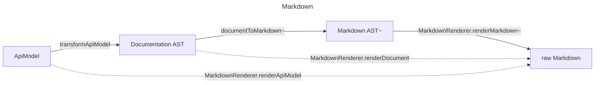
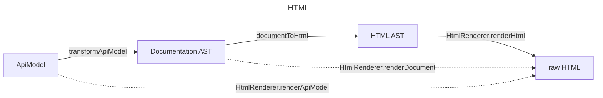

# @fluid-tools/api-markdown-documenter

Contains a programmatic API for generating [Markdown][] documentation from an API report generated by [API-Extractor][].

> Note: this library is specifically configured to target [GitHub flavored Markdown][].
>
> Compatibility with other Markdown flavors is not guaranteed, though you can always write your own renderer implementation against our [Documentation Domain](#documentation-domain)!

It is similar to [API-Documenter][] and is heavily based upon it and uses it under the hood, but is designed to be more extensible and can be used programmatically.

**Note**: this library does not currently offer a Command Line Interface (CLI).
One may be added in the future, but for now this library is intended to be consumed programmatically.

## Glossary

The following terms are leveraged heavily in this package's APIs and documentation.

-   **API Model**: Refers to a complete API suite, comprised of one or more packages.
    This often corresponds to all of the packages in the mono-repo, or a series of packages whose API docs are published together.
    It is generally represented via the [ApiModel][] type, from the [@microsoft/api-extractor-model](https://github.com/microsoft/rushstack/tree/main/libraries/api-extractor-model) library.
    -   In some places, this library refers to an `API Model` in terms of a directory or directory path.
        In these cases, it is referring to a directory that contains the set of `.api.json` files (generated per-package by `API-Extractor`).
-   **API Item**: Refers to a single TypeScript item exported by one or more packages in the `API Model`.
    It is generally represented via the [ApiItem][] type, from the [@microsoft/api-extractor-model](https://github.com/microsoft/rushstack/tree/main/libraries/api-extractor-model) library.
    E.g., an exported interface `Foo` would be captured by API Extractor as a single API item (an [ApiInterface](https://api.rushstack.io/pages/api-extractor-model.apiinterface/)).
    Alternatively, an exported enum `Foo` with flags `Bar` and `Baz` would be captured as 1 API item (an [ApiEnum](https://api.rushstack.io/pages/api-extractor-model.apiEnum/)) for `Foo`, with 2 child API items for the flags `Bar` and `Baz` ([ApiEnumMember](https://api.rushstack.io/pages/api-extractor-model.apienummember/)s).
    -   This is the granularity by which documentation is generated, and the granularity at which most configuration options are presented.

<!-- AUTO-GENERATED-CONTENT:START (LIBRARY_README_HEADER:installation=TRUE&devDependency=TRUE) -->

<!-- prettier-ignore-start -->
<!-- NOTE: This section is automatically generated using @fluid-tools/markdown-magic. Do not update these generated contents directly. -->

**NOTE: This package is a library intended for use within the [microsoft/FluidFramework](https://github.com/microsoft/FluidFramework) repository.**
**It is not intended for public use.**
**We make no stability guarantees regarding this library and its APIs.**

## Installation

To get started, install the package by running the following command:

```bash
npm i @fluid-tools/api-markdown-documenter -D
```

## Importing from this package

This package leverages [package.json exports](https://nodejs.org/api/packages.html#exports) to separate its APIs by support level.
For more information on the related support guarantees, see [API Support Levels](https://fluidframework.com/docs/build/releases-and-apitags/#api-support-levels).

To access the `public` ([SemVer](https://semver.org/)) APIs, import via `@fluid-tools/api-markdown-documenter` like normal.

To access the `beta` APIs, import via `@fluid-tools/api-markdown-documenter/beta`.

<!-- prettier-ignore-end -->

<!-- AUTO-GENERATED-CONTENT:END -->

## Usage

### Quick Start

This library is intended to be highly customizable.
That said, it is also intended to be easy to use out of the box.

Are you using [API-Extractor][]?
Are you already generating `.api.json` report files as a part of your build?

If yes, create a file called `api-markdown-documenter.js` and paste the following code:

<!-- AUTO-GENERATED-CONTENT:START (INCLUDE_CODE:path=./examples/RenderMarkdown.ts&language=typescript&start=5) -->

<!-- prettier-ignore-start -->
<!-- NOTE: This section is automatically generated by embedding the referenced file contents. Do not update these generated contents directly. -->

```typescript
import { loadModel, MarkdownRenderer } from "@fluid-tools/api-markdown-documenter";

const modelDirectoryPath = "<PATH-TO-YOUR-DIRECTORY-CONTAINING-API-REPORTS>";
const outputDirectoryPath = "<YOUR-OUTPUT-DIRECTORY-PATH>";

// Create the API Model from our API reports
const apiModel = await loadModel({
	modelDirectoryPath,
});

const transformConfig = {
	apiModel,
	uriRoot: ".",
};

await MarkdownRenderer.renderApiModel(transformConfig, {}, { outputDirectoryPath });
```

<!-- prettier-ignore-end -->

<!-- AUTO-GENERATED-CONTENT:END -->

The above script can be invoked as an `npm` script by adding the following to your `package.json`'s `scripts` property:

```json
"generate-api-docs": "node ./api-markdown-documenter.js"
```

The above steps omit many of the configuration options exposed by the library.
For more advanced usage options, see the following sections.

### Documentation Generation

This package contains 2 primary, programmatic entry-points for generating documentation:

#### transformApiModel

The `transformApiModel` function accepts an [ApiModel][] representing the package(s) of a repository, and generates a sequence of "Document" [Abstract Syntax Tree][] objects representing the resulting documentation based on the other provided configuration options.
These objects include information about the page item, its documentation contents, and the intended output file path the document file should be rendered to, based on provided options.

-   These trees are backed by [unist][]'s AST model.

The input `ApiModel` here will generally be the output of [API-Extractor][].

See [Documentation Domain](#documentation-domain) below for more details on the output format.

##### Limitations

###### Embedded HTML

Note: `TSDoc`'s parser has limited support for preserving `HTML` tags in `TSDoc` comments.
This library does not preserve embedded `HTML` in doc comments.
Instead, any `HTML` tags found will be discarded, and the contents within will be rendered normally.
This matches VSCode Intellisense's behavior.
We may reconsider this in the future.

#### MarkdownRenderer

The `MarkdownRenderer` namespace includes a few functions for generating Markdown contents.

The `MarkdownRenderer.renderApiModel` function operates like [transformApiModel](#createdocuments), but writes the resulting documents to disk as files based on the provided configuration options.

This function accepts overrides for all of its default `Markdown`-rendering behaviors, so feel free to customize as you see fit!

### Loading the API Model

Both of the rendering APIs above take as input an `ApiModel` object that describes the API suite being processed.

To generate an API model from `.api.json` files generated by `API-Extractor`, see the `loadModel` function, which can generate an `ApiModel` for you, given a path to a directory containing the API reports.

### Emitting Markdown Content

If you are using the [transformApiModel](#createdocuments) option described above, one option for emitting Markdown string content is to use the `emitMarkdown` function.
It accepts a `MarkdownDocument` object as input, and outputs a string representing the final Markdown content.

Note: you can also accomplish this by just using [MarkdownRenderer.renderApiModel](#renderfiles) if you are using default configuration / emitter options.

### Configuration Options

As mentioned above, this library was designed in an attempt to be highly flexible and configurable.
Each [layer in the system](#architectural-overview) has its own configuration with a suite of options that you can customize to meet your needs.

Some of the configs may contain a large number of options, but fret not!
The vast majority of these options have default values that have been crafted to produce high quality documentation for your library with minimal specification.

## Architectural Overview

As noted above, this library is intended to be consumed programmatically.
While we may at some point add some command line interfaces for common paths, the primary goal of this library's architecture is to be flexible and extensible.
To that end, we have broken its logic into a few isolable steps, each offering its own extensibility offerings.

End to end, this library can be viewed as a pseudo-functional transformation pipeline mapping from an [APIModel][] generated by `API-Extractor` to one or more `Markdown` or `HTML` formatted document files.

But this is broken into the following internal sequences:





**Note:** APIs above marked with an `*` are in preview, and may change without notice.

**Note:** APIs above marked with an `~` are planned, but do not yet exist.

For more details on the interior `Documentation AST` ([Abstract Syntax Tree][]) domain, see [Documentation Domain](#documentation-domain) below.

### API-Extractor

The input to our system is the [ApiModel][] generated by [API-Extractor][].

This library offers the `loadModel` function as an option for loading your model from the generated `.api.json` metadata files `API-Extractor` generates be default.

To transform this input to our [Documentation Domain][], you may call the `transformApiModel` function.
This function walks the input `ApiModel` tree, transforming each `ApiItem` under it according to its configured series of transformation policies.
These policies are entirely configurable, though the system offers defaults out of the box.

### Documentation Domain

This library defines its own "Documentation Domain" using [Abstract Syntax Tree][] (AST) syntax backed by [unist][].
This is used as an intermediate domain between the `API-Extractor`-based input, and the `Markdown` rendering output.
This domain was crafted to support [TSDoc][]'s capabilities, and to represent something resembling lowest common denominator between `Markdown` and `HTML` syntax.

As this domain is implemented as an `AST`, it is highly customizable.
If you are interested in creating your own intermediate domain concepts, feel free to implement them.
So long as you provide a corresponding [rendering handler](#markdown-renderer), the system will gladly accept them!

### MarkdownRenderer

The final component of this library's transformation pipeline is its `Markdown` renderer.

> Note: by default, this renderer is configured to generate [GitHub flavored Markdown][].
>
> Compatibility with other Markdown flavors is not guaranteed by default.

As with the other logic in this library, the renderer is highly configurable.
It will accept any `Documentation Domain` tree as input, and transform each node according to its configured render policies.

If you would like to add rendering support for a custom `Documentation Domain` node type, simply provide a rendering handler associated with that node's `type` value.

If you would like to change any or all of this library's default rendering policies, you may simply override the default policies for the desired `type`s.

## HtmlRenderer

This library now includes APIs for HTML rendering.

Like the [MarkdownRenderer](#markdownrenderer), we offer a `HtmlRenderer.renderApiModel` function that operates in much the same way, but outputs `HTML`-formatted documents instead of Markdown.

## Preview APIs

The following APIs are still in preview, and may change without notice.
Use at your own risk.

## ToHtml Transformation

This library now includes APIs for transforming `Documentation Domain` trees to HTML syntax trees using [hast](https://github.com/syntax-tree/hast).

### lintApiModel

This library includes a preview API for "linting" an API Model.

To use, import the `lintApiModel` function from `@fluid-tools/api-markdown-documenter/beta`.

This function returns a set of TSDoc-related "errors" discovered while walking the API Model.

The primary goal of this tool is to detect issues that `API-Extractor` cannot validate on a per-package basis when generating API reports.

For now, this is limited to validating `@link` and `@inheritDoc` tags to ensure that symbolic references are valid within the API Model.
Other validation may be added in the future as needed.

## Upcoming Work

-   Add extensibility options for `DocNode` transformations
    -   If a consumer has a custom tsdoc config associated with their API-Extractor setup, this will be needed.

### Documentation Improvements

-   Intro sandbox (api report)
-   Extensibility examples (maybe use the "AlertNode" concept used by the fluidframework.com build)

### Styling Improvements

-   Fix links to the same file (only need heading component, not file path)
    -   This will require plumbing down a context document item, so we can easily determine if the document to which the link is being generated is the same as the document being linked to.
-   Update exported utilities to accept partial configs, rather than needing the user to provide a complete configuration.
-   Config options for parsing TSDoc block comment contents as Markdown (and don't escape the contents)?
-   Add support for Table Cell alignment

### Performance Improvements

-   Rather than repeatedly walking up a given `ApiItem`'s hierarchy when evaluating paths, links, etc., we could pass down transformation context object containing a running record of the item's hierarchy as we walk the tree.

## Longer-term work

-   Support placing documents _within_ their own hierarchy (support for the "index" model used by systems like DocFX)
-   Pre-canned policies (flat, index, adjacency)
-   Add `documentToMarkdown` API that generates `mdast` output.
    -   Update Markdown rendering APIs to leverage the `mdast` and `hast` domain outputs.

<!-- AUTO-GENERATED-CONTENT:START (README_FOOTER) -->

<!-- prettier-ignore-start -->
<!-- NOTE: This section is automatically generated using @fluid-tools/markdown-magic. Do not update these generated contents directly. -->

## Contribution Guidelines

There are many ways to [contribute](https://github.com/microsoft/FluidFramework/blob/main/CONTRIBUTING.md) to Fluid.

-   Participate in Q&A in our [GitHub Discussions](https://github.com/microsoft/FluidFramework/discussions).
-   [Submit bugs](https://github.com/microsoft/FluidFramework/issues) and help us verify fixes as they are checked in.
-   Review the [source code changes](https://github.com/microsoft/FluidFramework/pulls).
-   [Contribute bug fixes](https://github.com/microsoft/FluidFramework/blob/main/CONTRIBUTING.md).

Detailed instructions for working in the repo can be found in the [Wiki](https://github.com/microsoft/FluidFramework/wiki).

This project has adopted the [Microsoft Open Source Code of Conduct](https://opensource.microsoft.com/codeofconduct/).
For more information see the [Code of Conduct FAQ](https://opensource.microsoft.com/codeofconduct/faq/) or contact [opencode@microsoft.com](mailto:opencode@microsoft.com) with any additional questions or comments.

This project may contain Microsoft trademarks or logos for Microsoft projects, products, or services.
Use of these trademarks or logos must follow Microsoft’s [Trademark & Brand Guidelines](https://www.microsoft.com/trademarks).
Use of Microsoft trademarks or logos in modified versions of this project must not cause confusion or imply Microsoft sponsorship.

## Help

Not finding what you're looking for in this README? Check out [fluidframework.com](https://fluidframework.com/docs/).

Still not finding what you're looking for? Please [file an issue](https://github.com/microsoft/FluidFramework/wiki/Submitting-Bugs-and-Feature-Requests).

Thank you!

## Trademark

This project may contain Microsoft trademarks or logos for Microsoft projects, products, or services.

Use of these trademarks or logos must follow Microsoft's [Trademark & Brand Guidelines](https://www.microsoft.com/en-us/legal/intellectualproperty/trademarks/usage/general).

Use of Microsoft trademarks or logos in modified versions of this project must not cause confusion or imply Microsoft sponsorship.

<!-- prettier-ignore-end -->

<!-- AUTO-GENERATED-CONTENT:END -->

<!-- Links -->

[markdown]: https://en.wikipedia.org/wiki/Markdown
[abstract syntax tree]: https://en.wikipedia.org/wiki/Abstract_syntax_tree
[api-extractor]: https://api-extractor.com
[api-documenter]: https://github.com/microsoft/rushstack/tree/main/apps/api-documenter
[apiitem]: https://api.rushstack.io/pages/api-extractor-model.apiitem
[apimodel]: https://api.rushstack.io/pages/api-extractor-model.apimodel
[github flavored markdown]: https://docs.github.com/en/get-started/writing-on-github/getting-started-with-writing-and-formatting-on-github/about-writing-and-formatting-on-github
[tsdoc]: https://tsdoc.org/
[unist]: https://github.com/syntax-tree/unist
