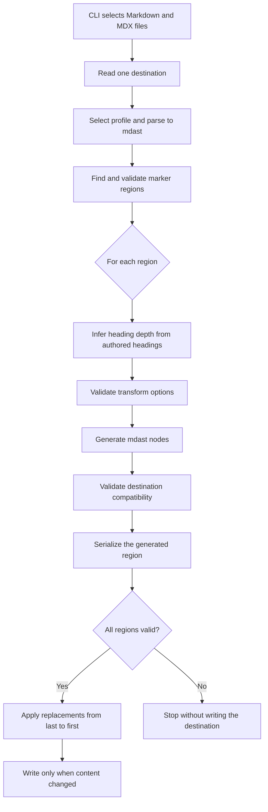

# @fluid-tools/markdown-magic

This package generates and embeds content in Markdown and MDX documents.

<!-- markdown-magic:begin {"transform":"library-readme-header"} -->

<!-- prettier-ignore-start -->

<!-- NOTE: This section is automatically generated using @fluid-tools/markdown-magic. Do not update these generated contents directly. -->

**NOTE: This package is a library intended for use within the [microsoft/FluidFramework](https://github.com/microsoft/FluidFramework) repository.**
**It is not intended for public use.**
**We make no stability guarantees regarding this library and its APIs.**

<!-- prettier-ignore-end -->

<!-- markdown-magic:end -->

## Usage

Run the command from a workspace that depends on this package:

```shell
pnpm exec markdown-magic [--files <glob> ...] [--workingDirectory <directory>]
```

### Command options

| Option               | Alias | Value                                                                        | Default                       |
| -------------------- | ----- | ---------------------------------------------------------------------------- | ----------------------------- |
| `--files`            | `-f`  | One or more [globby](https://github.com/sindresorhus/globby#readme) patterns | `**/*.md` and `**/*.mdx`      |
| `--workingDirectory` | `-w`  | The base directory for glob patterns and relative paths                      | The current working directory |
| `--help`             | `-h`  | None                                                                         | Not applicable                |

The search includes files only and applies `.gitignore` rules. To process a `.markdown` file, select it explicitly with `--files`.

For example, the following command updates Markdown and MDX files in `docs` except for `docs/README.md`:

```shell
pnpm exec markdown-magic --files "docs/**/*.{md,mdx}" "!docs/README.md"
```

The command reports the number of files that changed. If an error occurs, the command writes the error to stderr and returns exit code `1`.

## Markers

Add a begin marker and an end marker to a Markdown file. The begin marker contains a JSON object. The `transform` property is required. Add transform options as other properties in the object.

The following example includes `overview.md` in a Markdown document:

```markdown
<!-- markdown-magic:begin {"transform":"include","path":"./overview.md"} -->

The tool writes generated content here.

<!-- markdown-magic:end -->
```

For MDX, use MDX comments. HTML comments are not valid in MDX.

The following example includes `overview.mdx` in an MDX document:

```mdx
{/* markdown-magic:begin {"transform":"include","path":"./overview.mdx"} */}

The tool writes generated content here.

{/* markdown-magic:end */}
```

The marker must be a top-level block in the document syntax tree. Marker text in a code block or another nested construct is not active.

The tool parses the complete document. It replaces only the source range between each marker pair. It does not serialize the authored content outside that range.

The tool adds these items to each generated region:

1. A `prettier-ignore-start` comment.
2. A generated-content notice.
3. The serialized transform output.
4. A `prettier-ignore-end` comment.

The tool uses remark and GitHub Flavored Markdown to serialize generated content. The serializer can normalize lists, links, tables, and whitespace inside a generated region.

The tool rejects these inputs:

- A begin marker without a JSON object.
- Invalid JSON or a JSON value that is not an object.
- A missing or empty `transform` property.
- An unknown transform or option.
- An option with the wrong JSON type.
- Nested regions.
- An opening or closing marker without its matching marker.

The tool validates and generates all regions in one destination file before it writes that file. Thus, a failed region does not cause a partial write to that file. The command processes multiple files concurrently. A different file can finish before an error stops the command.

### Generated headings

Transforms that generate a section determine its heading depth from the marker position. A following authored heading defines the depth. Otherwise, the nearest preceding authored heading defines the depth. A section after the document title uses level two. A section in a document without authored headings uses level one.

The tool ignores headings inside generated regions when it determines the depth. Thus, existing generated content does not change the result. At the end of a section, the generated heading is a sibling of the nearest preceding heading. To generate a child section, put the marker before an authored child heading of the required depth.

The tool stops with an error if adjusted headings in a shared template would be deeper than level six.

## Transforms

Transform names use kebab case. Option names use camel case. Option values use native JSON types. For example, use `true` instead of `"true"`.

| Transform                                                                     | Purpose                                                                      |
| ----------------------------------------------------------------------------- | ---------------------------------------------------------------------------- |
| [`include`](./docs/transforms/include.md)                                     | Parse and include Markdown or MDX from a file.                               |
| [`include-code`](./docs/transforms/include-code.md)                           | Include text from a file in a fenced code block.                             |
| [`library-readme-header`](./docs/transforms/library-readme-header.md)         | Generate the standard sections at the start of a library README.             |
| [`example-app-readme-header`](./docs/transforms/example-app-readme-header.md) | Generate the standard section at the start of an example application README. |
| [`readme-footer`](./docs/transforms/readme-footer.md)                         | Generate the standard sections at the end of a package README.               |
| [`example-getting-started`](./docs/transforms/example-getting-started.md)     | Generate setup instructions for an example application.                      |
| [`api-docs`](./docs/transforms/api-docs.md)                                   | Generate a link to package API documentation.                                |
| [`installation-instructions`](./docs/transforms/installation-instructions.md) | Generate the package installation command.                                   |
| [`import-instructions`](./docs/transforms/import-instructions.md)             | Generate instructions for supported package export paths.                    |
| [`package-scripts`](./docs/transforms/package-scripts.md)                     | Generate a table from the package `scripts` object.                          |
| [`package-scope-notice`](./docs/transforms/package-scope-notice.md)           | Generate a notice for the package kind.                                      |
| [`client-requirements`](./docs/transforms/client-requirements.md)             | Generate the minimum client requirements.                                    |
| [`contribution-guidelines`](./docs/transforms/contribution-guidelines.md)     | Generate the contribution guidelines.                                        |
| [`dependency-guidelines`](./docs/transforms/dependency-guidelines.md)         | Generate the dependency guidelines.                                          |
| [`help`](./docs/transforms/help.md)                                           | Generate links to support resources.                                         |
| [`trademark`](./docs/transforms/trademark.md)                                 | Generate the Microsoft trademark notice.                                     |

Each linked guide contains the option types, default values, behavior notes, and a basic marker example.

## Architecture

The command processes each destination as a Markdown abstract syntax tree (mdast). Authored content stays in its original source form. The tool serializes only generated regions and replaces them by source offset.



The main modules have these responsibilities:

1. `cli.ts` selects files and processes at most eight files concurrently.
2. `processorProfiles.ts` selects the Markdown or MDX parser from the destination extension.
3. `regions.ts` reads top-level marker nodes and validates marker pairs.
4. `headings.ts` determines the heading depth for each generated section.
5. `transformRegistry.ts` validates file-transform options and creates transform context.
6. `transforms.ts` generates package and template sections as mdast nodes.
7. `processing.ts` coordinates validation, serialization, source-range replacement, and writes.

The executable bin file uses `jiti` to load the TypeScript source. The package does not emit JavaScript build output.

A transform has a `validateOptions` function and a `generate` function. `validateOptions` converts an unknown JSON value to validated options. `generate` returns an array of mdast root-content nodes. A composite transform combines node arrays. It does not combine serialized Markdown strings.

The transform context provides the destination path, destination format, path resolution, document parsing, and file reading. New transforms must return nodes that the destination processor can serialize.

`migrateLegacyMarkers.ts` contains the one-use migration from the former marker syntax. It changes marker text only. It does not change generated content between markers.

## Validation

Run the package tests and documentation generation:

```shell
pnpm --dir tools/markdown-magic test
pnpm --dir tools/markdown-magic build:docs
pnpm --dir tools/markdown-magic check:biome
```

Run generation twice. The second run must report `Updated 0 files.`

<!-- markdown-magic:begin {"transform":"readme-footer"} -->

<!-- prettier-ignore-start -->

<!-- NOTE: This section is automatically generated using @fluid-tools/markdown-magic. Do not update these generated contents directly. -->

## Contribution Guidelines

There are many ways to [contribute](https://github.com/microsoft/FluidFramework/blob/main/CONTRIBUTING.md) to Fluid.

* Participate in Q\&A in our [GitHub Discussions](https://github.com/microsoft/FluidFramework/discussions).
* [Submit bugs](https://github.com/microsoft/FluidFramework/issues) and help us verify fixes as they are checked in.
* Review the [source code changes](https://github.com/microsoft/FluidFramework/pulls).
* [Contribute bug fixes](https://github.com/microsoft/FluidFramework/blob/main/CONTRIBUTING.md).

Detailed instructions for working in the repo can be found in the [Wiki](https://github.com/microsoft/FluidFramework/blob/main/docs/content/Home.md).

This project has adopted the [Microsoft Open Source Code of Conduct](https://opensource.microsoft.com/codeofconduct/).
For more information see the [Code of Conduct FAQ](https://opensource.microsoft.com/codeofconduct/faq/) or contact <opencode@microsoft.com> with any additional questions or comments.

This project may contain Microsoft trademarks or logos for Microsoft projects, products, or services.
Use of these trademarks or logos must follow Microsoft’s [Trademark & Brand Guidelines](https://www.microsoft.com/trademarks).
Use of Microsoft trademarks or logos in modified versions of this project must not cause confusion or imply Microsoft sponsorship.

## Help

Not finding what you're looking for in this README?
Check out [fluidframework.com](https://fluidframework.com/docs/).

Still not finding what you're looking for?
Please [file an issue](https://github.com/microsoft/FluidFramework/blob/main/docs/content/Contributing/Submitting-Bugs-and-Feature-Requests.md).

Thank you!

## Trademark

This project may contain Microsoft trademarks or logos for Microsoft projects, products, or services.

Use of these trademarks or logos must follow Microsoft's [Trademark & Brand Guidelines](https://www.microsoft.com/en-us/legal/intellectualproperty/trademarks/usage/general).

Use of Microsoft trademarks or logos in modified versions of this project must not cause confusion or imply Microsoft sponsorship.

<!-- prettier-ignore-end -->

<!-- markdown-magic:end -->

<!-- Links -->

[tinylicious]: https://github.com/microsoft/FluidFramework/tree/main/server/routerlicious/packages/tinylicious/
[api-extractor]: https://api-extractor.com/
