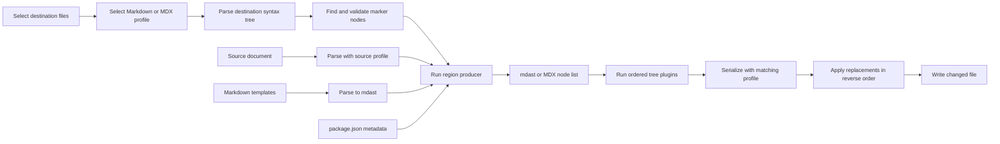

# Re-platform Markdown Magic on remark

## Status

This document proposes a refactor of `@fluid-tools/markdown-magic`. The refactor replaces the current string-based implementation with a Markdown abstract syntax tree (mdast) implementation based on [remark](https://remark.js.org/).

The refactor does not add new document transformations. It creates the syntax-tree pipeline that can support those transformations later.

Breaking changes to the marker syntax and internal transform API are acceptable. The command name and its main file-selection options should remain stable unless implementation work finds a specific reason to change them.

## Decision summary

Use remark to parse generated and included Markdown into mdast nodes. Make transforms produce mdast nodes instead of Markdown strings.

Keep generated regions delimited by invisible comments. Use HTML comments in Markdown and JavaScript comments in MDX. Change the opening marker to contain a transform name and JSON options. Normalize both forms to one internal region model.

Parse each destination document to locate and validate region markers. Serialize only generated regions, then apply those replacements to the original source text. Do not serialize the complete destination document during this refactor.

Use explicit parser profiles for Markdown and Markdown JSX (MDX). The initial migration only needs to update existing Markdown regions, but the engine and transform contract must accept MDX trees without a later architectural change.

This source-range update model has two benefits:

- Authored content outside generated regions remains byte-for-byte unchanged.
- The first migration does not require remark to normalize every Markdown or MDX construct in a destination document.

The generated content still uses a complete syntax-tree pipeline. A transform can parse source content, operate on its nodes, and return nodes to the destination region.

## Goals

- Represent generated Markdown as mdast nodes instead of strings.
- Parse included Markdown before it is inserted into another document.
- Provide an ordered plugin stage for future transformations of generated nodes.
- Make `.mdx` a supported parser profile and preserve MDX nodes through transforms.
- Preserve current generated document content during this refactor, except for intentional marker and canonical formatting changes.
- Support GitHub Flavored Markdown (GFM), including tables, task lists, strikethrough, autolinks, and footnotes.
- Give invalid markers and invalid transform options clear errors with file locations.
- Keep repeated runs idempotent.
- Avoid formatting authored content outside generated regions.

## Non-goals

- Rewrite links or image paths.
- Replace line ranges with heading or section selectors.
- Add new README sections.
- Convert Markdown or MDX to HTML.
- Evaluate MDX expressions or import modules referenced by MDX.
- Provide a general-purpose public remark plugin.
- Preserve the current custom transform callback API.
- Preserve the current marker syntax.

## Current implementation

The executable in [`bin/markdown-magic`](./bin/markdown-magic) loads [`src/index.cjs`](./src/index.cjs). The CLI selects files and passes them to the forked `@tylerbu/markdown-magic` dependency. That dependency uses regular expressions to find marker pairs and replace the text between them.

Fluid-specific transforms are registered in [`src/md-magic.config.cjs`](./src/md-magic.config.cjs). They have this effective contract:

```text
(originalGeneratedText, stringOptions, mutableFileConfig) => MarkdownString
```

The transforms and utilities build Markdown with string concatenation. `INCLUDE` reads a source file and returns its raw text. `INCLUDE_CODE` adds a Markdown fence around raw text. Template transforms read Markdown templates as strings and change heading levels with a regular expression.

This model has the following constraints:

- A transform cannot reliably distinguish links, images, definitions, HTML, JSX, expressions, and plain text.
- Composition is string composition. Each layer must manage spacing, escaping, and heading syntax.
- Options use an untyped `key=value&key=value` grammar.
- The upstream engine silently keeps old content when a transform is missing or returns no value.
- The upstream engine mutates a shared configuration object while it processes a file.
- Line slicing can produce a fragment that starts or ends inside a Markdown or MDX construct.

### Repository inventory

A repository scan on 2026-08-26 found 336 opening markers and 336 closing markers in 181 Markdown files. This count includes examples in the package README and committed test fixtures. No `.mdx` file currently contains a marker. All live Markdown marker lines start at the document root with no indentation.

The main uses are:

| Transform | Opening markers |
| --- | ---: |
| `README_FOOTER` | 154 |
| `LIBRARY_README_HEADER` | 96 |
| `EXAMPLE_APP_README_HEADER` | 39 |
| `INCLUDE` | 13 |
| `INCLUDE_CODE` | 6 |

Sixteen include regions specify `start` or `end`. Thirteen markers contain an empty colon after the transform name. The new parser does not need to preserve either syntax detail.

[`src/md-magic.config.cjs`](./src/md-magic.config.cjs) also contains 16 opening-marker examples without paired closing markers. A migration tool must process documentation files only, or it must explicitly distinguish source-code examples from live regions.

## remark, mdast, and MDX foundation

[mdast](https://github.com/syntax-tree/mdast) defines Markdown nodes such as `heading`, `link`, `image`, `code`, `table`, and `html`. mdast extends the Universal Syntax Tree (unist) format, so transforms can use the unified ecosystem of tree utilities.

[remark](https://remark.js.org/) provides the unified parse, transform, and stringify pipeline for mdast. [remark-gfm](https://github.com/remarkjs/remark-gfm) adds parsing and serialization for GFM constructs.

[remark-mdx](https://mdxjs.com/packages/remark-mdx/) adds parsing and serialization for MDX. It extends mdast with node types for ECMAScript modules, expressions, and JSX elements. MDX support must use these nodes. The tool must not treat JSX or expressions as raw HTML or text.

The Fluid Framework repository already uses remark 15 and remark-gfm 4 in `@fluid-tools/build-cli`. It also uses `mdast-util-to-markdown` 2 and its GFM extensions in `@fluid-tools/api-markdown-documenter`. The website already depends on `mdast-util-directive`, so the unified syntax-tree ecosystem is established in the repository.

The current versions of remark and the low-level mdast utilities are ECMAScript module (ESM) packages. The implementation should convert this package from CommonJS to ESM instead of adding dynamic-import adapters throughout the code.

Parsing and serialization are not lossless formatting operations. `mdast-util-to-markdown` guarantees Markdown that represents the tree, but it does not reproduce all source formatting choices. MDX serialization has the same limitation. This is the main reason to serialize generated regions only.

## Marker format

Use one-line comments with JSON options. The following Markdown example includes part of another document:

```markdown
<!-- markdown-magic:begin {"transform":"include","path":"./source.md","start":2} -->

Generated content is stored here.

<!-- markdown-magic:end -->
```

HTML comments are not valid MDX. MDX uses JavaScript comments inside expressions. Use the following equivalent marker form in `.mdx` files:

```mdx
{/* markdown-magic:begin {"transform":"include","path":"./source.mdx"} */}

Generated content is stored here.

{/* markdown-magic:end */}
```

Under `remark-mdx`, these markers are root-level MDX flow-expression nodes. Normalize them to the same internal marker representation as Markdown `html` nodes. The marker implementation must use parsed nodes and their positions. Do not fall back to a repository-wide regular expression scanner.

Use lowercase kebab-case transform names. For example, use `library-readme-header` instead of `LIBRARY_README_HEADER`.

The marker parser must apply these rules:

1. A marker must be a root-level Markdown `html` node or MDX flow-expression node.
2. Each `begin` marker must have one later `end` marker.
3. Regions must not nest.
4. A marker must occupy its own line.
5. The opening marker must contain one JSON object.
6. The JSON object must contain a known `transform` string.
7. Each transform must validate its own options.
8. Unknown properties must cause an error unless the transform explicitly accepts them.
9. A Markdown marker must not contain `--`, as required by HTML comment syntax.
10. An MDX marker expression must contain only the marker comment. It must not contain executable JavaScript.

JSON gives options native string, number, and boolean types. It also defines escaping without a package-specific parser. A static end marker makes region matching simple.

### Why not remark directives

The generic directive syntax from [remark-directive](https://github.com/remarkjs/remark-directive) can represent a transform and its attributes as a node. It is useful when one processor controls every rendering environment.

Fluid documentation is also read directly on GitHub and by tools that do not install this package's remark plugins. Directive markers can remain visible or have undefined behavior in those environments. Format-native Markdown and MDX comments are the safer repository control syntax.

### Why not serialize the complete document

A complete parse and stringify pass is architecturally simpler, but it would normalize lists, emphasis, code fences, JSX formatting, expressions, escaping, and blank lines in all destination files. It would also couple this tool to every current and future Docusaurus MDX extension.

That churn does not help the syntax-tree migration. Source-range replacement limits normalization to generated content, which the tool already owns.

## Proposed architecture



### Processor profiles

Create explicit processor profiles instead of one global processor:

| Profile | File types | Parser and serializer extensions |
| --- | --- | --- |
| Markdown | `.md`, `.markdown` | remark parse/stringify and `remark-gfm` |
| MDX | `.mdx` | Markdown profile plus `remark-mdx` 3 |

The destination extension selects the output profile. The source extension selects the input profile. This distinction permits Markdown-to-MDX inclusion and MDX-to-MDX inclusion.

Do not permit MDX nodes in a Markdown destination. For example, an `mdxJsxFlowElement` from an MDX source cannot be serialized into a `.md` region. Fail with an error that identifies the source and destination. Markdown nodes can be included in MDX when they are valid at the destination region's flow position.

The first implementation should support generated regions at the document root only. It must reject a region inside JSX children, an expression, a table cell, a list item, or another container. Supporting those positions requires context-sensitive parsing and serialization and should be a separate design.

Configure serialization explicitly. Match existing repository conventions where possible:

- Use `-` for unordered lists.
- Use fenced code blocks.
- Do not align table pipes with spaces.
- Do not increment ordered-list markers if current generated content consistently uses `1.`.
- Configure the MDX serializer through the same processor that parsed MDX nodes.

Add parser extensions only when the inventory or tests require them. Frontmatter is destination metadata outside generated regions, so source-range replacement does not require its serialization. Add a frontmatter extension if a future transform includes or generates frontmatter.

### Region discovery

Parse the complete destination source to obtain node positions. Find Markdown comment nodes or MDX comment-expression nodes among the root's children. Convert both forms to internal marker records, then pair each opening marker with the next closing marker.

Store the following data for each region:

```ts
type DocumentFormat = "markdown" | "mdx";

interface GeneratedRegion {
	readonly destinationPath: string;
	readonly destinationFormat: DocumentFormat;
	readonly transformName: string;
	readonly options: Readonly<Record<string, unknown>>;
	readonly openingMarkerEnd: number;
	readonly closingMarkerStart: number;
}
```

The offsets come from unist position data. Reject markers that do not have offsets. Reject marker nodes below the root instead of trying to reconstruct indentation or JSX context.

After all regions succeed, apply replacements from the highest offset to the lowest offset. This order prevents an earlier replacement from invalidating later offsets. Write the file only when its content changes.

Do not partially update a file. If one region fails, report the error and leave that file unchanged.

### Transform contract

Replace the string callback with a node-producing interface. The following interface illustrates the proposed ownership boundaries:

```ts
import type { Root, RootContent } from "mdast";

type DocumentFormat = "markdown" | "mdx";

interface ParsedDocument {
	readonly format: DocumentFormat;
	readonly path: string;
	readonly tree: Root;
}

interface TransformContext {
	readonly destination: ParsedDocument;
	readonly parseDocument: (
		source: string,
		sourcePath: string,
		format: DocumentFormat,
	) => ParsedDocument;
	readonly readDocument: (sourcePath: string) => Promise<ParsedDocument>;
}

interface MarkdownTransform<TOptions> {
	readonly validateOptions: (value: unknown) => TOptions;
	readonly generate: (
		options: TOptions,
		context: TransformContext,
	) => Promise<readonly RootContent[]>;
}
```

The production type must augment mdast with the node types from `mdast-util-mdx`. The abbreviated example uses `RootContent` for readability.

`validateOptions` must return typed options or throw a location-aware error. `generate` must return nodes. It must not serialize content or write files.

Keep file access in the context so tests can provide an in-memory implementation. Resolve relative paths from the destination document, as the current tool does.

### Tree transformation stage

After a producer returns nodes, wrap them in a temporary mdast `root` and run an ordered processor plugin list. Use the destination profile so MDX nodes remain registered during transforms and serialization. The initial list can be empty except for invariant checks. Its presence is an architectural requirement of this refactor.

A future relative-link plugin can visit `link`, `image`, and `definition` nodes. It can also define explicit behavior for URLs inside MDX JSX attributes. That future plugin is not part of this work.

Transforms that combine several sections must combine node arrays before this shared plugin stage. This rule makes `library-readme-header` and `readme-footer` one generated unit and avoids repeated serialization.

### Serialization and generated notices

Serialize the temporary root with the destination processor profile. Normalize the result to one leading blank line and one trailing blank line inside the markers.

Represent generated notices and Prettier control comments as syntax-tree nodes that the selected profile can serialize safely. Do not concatenate these comments after serialization.

Keep the current `prettier-ignore-start` and `prettier-ignore-end` comments for the first migration. Verify their behavior in both Markdown and MDX. Remove them only after a separate formatting investigation.

After serialization, parse the generated body again with the destination profile. Treat a parse failure or an unexpected node-class change as an internal error before writing the file.

### Templates

Keep the Markdown template files in [`src/templates`](./src/templates). Parse each template into mdast once, cache the parsed tree, and clone its nodes for each use.

Change heading levels by visiting `heading` nodes and changing their `depth`. Do not modify heading markers with a regular expression. Validate that the new depth remains between 1 and 6.

Templates remain Markdown unless a transform needs an MDX-specific template in the future. Markdown template nodes are valid in both destination profiles.

### Transform-specific migration

| Current transform group | Syntax-tree implementation |
| --- | --- |
| `INCLUDE` | Preserve current line slicing, parse the selected source text with its source profile, validate destination compatibility, and return the root children. |
| `INCLUDE_CODE` | Return one mdast `code` node with `lang` and `value`. Do not create a fence string. |
| Static template transforms | Parse template Markdown and adjust `heading.depth` nodes. |
| `INSTALLATION_INSTRUCTIONS` | Build headings, paragraphs, and code nodes. |
| `API_DOCS` | Build heading, paragraph, strong, and link nodes. |
| `IMPORT_INSTRUCTIONS` | Build paragraphs, links, and inline-code nodes from package exports. |
| `PACKAGE_SCOPE_NOTICE` | Return cloned nodes from the selected parsed template. Return an empty array when no notice applies. |
| `PACKAGE_SCRIPTS` | Replace `markdown-magic-package-scripts` with local GFM table-node generation. |
| Composite README transforms | Concatenate node arrays from the lower-level generators. |

Removing `markdown-magic-package-scripts` avoids parsing a third-party Markdown string back into the tree. The local implementation needs only the current package-script table behavior.

### Line slicing

Keep the current zero-based `Array.prototype.slice` behavior for `start` and `end` during this refactor. Slice source lines before parsing the selected text.

Add tests for fragments that start with headings, lists, fences, definitions, HTML, JSX, and expressions. If a range cuts through a construct, parsing can change its meaning or make MDX invalid. Report that limitation clearly, but do not introduce structural selectors in this work.

## Package and file changes

Convert the package to ESM because the current unified packages are ESM-only. Use `.js` modules with JSDoc or TypeScript checking unless a compile step provides enough value to justify changing package consumption.

The expected module layout is:

```text
src/
  cli.js
  processorProfiles.js
  regions.js
  serialization.js
  transformRegistry.js
  transforms/
  templates/
  utilities/
```

Remove these dependencies after the replacement engine is active:

- `@tylerbu/markdown-magic`
- `markdown-magic-package-scripts`

Add direct dependencies for the selected remark stack. Use the same major versions already used in this repository where available:

- `remark` 15
- `remark-gfm` 4
- `remark-mdx` 3, which is compatible with remark 15 and already resolved as version 3.1.0 in the website workspace
- `unist-util-visit` 5
- mdast and MDX types, if required by the selected source language

The high-level `remark` package already supplies parsing and stringification. Prefer it over separate low-level parser and serializer packages unless marker parsing needs a micromark or mdast extension.

## Error behavior

The new implementation must fail for these conditions:

- Invalid marker JSON.
- Missing, extra, or nested markers.
- Marker nodes that are not at the document root.
- Unknown transforms.
- Missing required options.
- Unknown options.
- Invalid option types or values.
- Missing source files or package files.
- A heading offset greater than level 6.
- MDX nodes generated for a Markdown destination.
- A sliced MDX fragment that cannot be parsed independently.
- A generated tree that cannot be serialized and parsed again with the destination profile.

Each error must include the destination path and marker line. Source-content errors must also include the source path and source format.

Process files concurrently with a bounded worker count. Do not share mutable per-file state. Collect failures and exit with a nonzero status after in-progress files finish. A failed file must remain unchanged.

## Implementation plan

### 1. Add characterization tests and an MDX spike

1. Save the current generated output for every fixture.
2. Add tests for CLI glob and working-directory behavior.
3. Add tests for relative path resolution and negative line indices.
4. Add tests for package-scope and public-package defaults.
5. Add tests for malformed markers and unknown transforms. Record the desired strict behavior even though the old engine is permissive.
6. Add a repository inventory test or script that verifies balanced root-level markers before migration.
7. Verify that MDX comment markers parse as root-level flow-expression nodes with stable offsets.
8. Test MDX flow JSX, text JSX, expressions, ESM imports, and Markdown embedded between JSX elements.
9. Record which MDX node types can move from an MDX source to an MDX destination without context changes.

Do not continue to the production engine until the marker syntax works in both profiles. If the MDX flow-expression nodes do not provide stable offsets, stop and revise the marker design before implementing region replacement.

### 2. Build the syntax-tree core behind tests

1. Convert the package runtime to ESM.
2. Add remark, GFM, MDX, and tree-visit dependencies.
3. Implement the Markdown and MDX processor profiles.
4. Implement marker parsing, validation, region pairing, and source offsets.
5. Implement reverse-order source replacement and unchanged-file detection.
6. Define the typed transform registry and context.
7. Add parse-transform-serialize-parse invariant tests for both profiles.
8. Add source-to-destination compatibility validation.

Use the new marker syntax only in isolated fixtures during this phase.

### 3. Migrate leaf transforms

Migrate transforms in this order:

1. `include-code`.
2. `include` for Markdown sources and destinations.
3. `include` for supported MDX source and destination combinations.
4. Static template transforms.
5. Package scope, installation, API documentation, and import transforms.
6. Package scripts.

For each transform, compare the new generated body with the old generated body. Accept formatting differences only when they are deterministic, semantically equivalent, and documented in the test update.

### 4. Migrate composite transforms

1. Implement node-array composition helpers.
2. Migrate `library-readme-header`.
3. Migrate `example-app-readme-header`.
4. Migrate `readme-footer`.
5. Verify defaults against public, experimental, internal, private, tools, and example package fixtures.
6. Run each composite transform in a Markdown fixture and an MDX fixture.

Do not serialize and parse the output of a leaf transform when composing it. Composite transforms must operate on nodes only.

### 5. Migrate repository markers

Create a one-use migration command that parses documentation files and rewrites old opening and closing markers to the new syntax. It must not rewrite generated bodies.

Run the migration in these groups:

1. Package fixtures and the package README.
2. Repository-level files and package READMEs.
3. Example and server documentation.
4. Website documentation, from the website workspace.

After each group, run the new generator and inspect the generated-content diff. Keep marker migration and generated formatting changes reviewable as separate commits if the repository workflow permits it.

Do not use a repository-wide regular expression as the migration implementation. Parse the old option grammar with its existing rules, convert values to the new typed representation, and serialize JSON. This is necessary for empty colons and boolean strings.

There are no current `.mdx` markers to migrate. Add dedicated MDX fixtures before enabling `.mdx` in the default CLI glob.

### 6. Switch the CLI and remove the old engine

1. Point `bin/markdown-magic` at the new CLI.
2. Keep `--files` and `--workingDirectory` behavior.
3. Change the default glob to include `.mdx` only after MDX integration tests pass.
4. Remove `@tylerbu/markdown-magic`.
5. Remove `markdown-magic-package-scripts` after its table output is covered.
6. Delete obsolete string-formatting helpers.
7. Update the package README with the new marker syntax, transform options, and MDX constraints.
8. Update the changelog or changeset required by repository policy.

Do not keep a permanent dual-engine mode. A short-lived migration branch can contain both engines for comparison, but the final implementation should have one execution path.

## Verification plan

### Unit tests

- Parse valid markers and typed options under both profiles.
- Reject every malformed-marker case.
- Verify each transform's generated syntax tree.
- Verify template heading changes through node depths.
- Verify GFM tables, task lists, autolinks, and footnotes.
- Verify MDX JSX, expression, and ESM nodes survive supported MDX-to-MDX generation.
- Reject MDX nodes in Markdown output.
- Verify path resolution on POSIX and Windows-style path inputs where applicable.
- Verify line slicing with positive and negative indices.
- Verify source files are not mutated.

### Integration tests

- Run the tool twice and require an empty second diff.
- Require bytes outside generated region ranges to remain unchanged.
- Parse every generated region after serialization with its destination profile.
- Compare legacy and new fixture output after removing marker syntax and approved formatting differences.
- Verify that one failed region prevents all writes to its destination file.
- Verify multiple regions in one file are replaced correctly.
- Build representative generated `.mdx` fixtures with the website's Docusaurus pipeline.
- Verify markers remain invisible in rendered Markdown and MDX.

### Repository validation

1. Run the package test suite.
2. Run the package formatting and lint checks.
3. Run the root `build:readme` command.
4. Run the website `build:markdown-magic` command from the website workspace.
5. Run both generation commands a second time and require no diff.
6. Build the website to detect unsupported generated Markdown or MDX.
7. Inspect representative output on GitHub and in the Docusaurus site.

The repository-wide generated diff is the primary rollout artifact. Separate expected marker changes from unexpected authored-content changes.

## Risks and mitigations

| Risk | Mitigation |
| --- | --- |
| remark normalizes generated formatting | Serialize generated regions only. Pin serializer options and use golden tests. |
| A source range cuts through a Markdown or MDX construct | Preserve current behavior, add edge-case tests, and document the limitation. |
| GFM syntax loses meaning | Install `remark-gfm` for both parse and stringify and add construct-specific tests. |
| MDX nodes are invalid in the destination context | Initially permit root-level regions only and validate source and destination profiles. |
| Markdown and MDX use different comment nodes | Normalize both parsed forms to one internal marker record and test their offsets first. |
| Destination content uses unsupported extensions | Use destination parsing only for root marker positions. Add parser extensions when inventory finds a requirement. |
| Generated HTML or JSX passes through unchanged | Do not render or evaluate content. Continue to trust repository-authored sources as the current tool does. |
| ESM conversion affects package consumers | Test root, website, and package-local command entry points before removing CommonJS files. |
| A large migration diff hides regressions | Split marker conversion from generated-body updates and compare normalized legacy output. |
| Concurrent processing causes partial writes | Keep state per file, bound concurrency, and write a file only after all its regions succeed. |

## Completion criteria

The re-platforming is complete when all of these statements are true:

- No production transform returns Markdown or MDX text.
- Included content is parsed into a syntax tree before insertion.
- Markdown and MDX processor profiles share one transform architecture.
- MDX fixtures cover JSX, expressions, and ESM nodes.
- Every generated region passes through the shared tree-plugin stage.
- Only generated source ranges are serialized and replaced.
- The old Markdown Magic fork and package-scripts transform dependency are removed.
- All repository markers use the new syntax.
- Package, root, and website generation are idempotent.
- Authored content outside generated regions has no migration diff.
- Repository and website builds pass.

At that point, link rewriting and structural include selectors can be designed as independent syntax-tree plugins without another engine migration.
