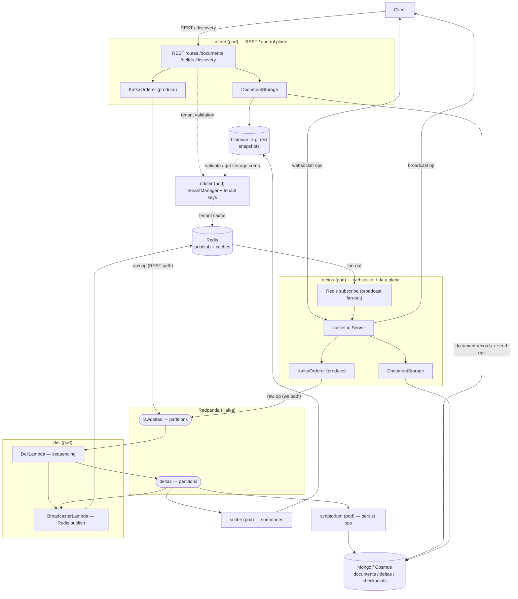
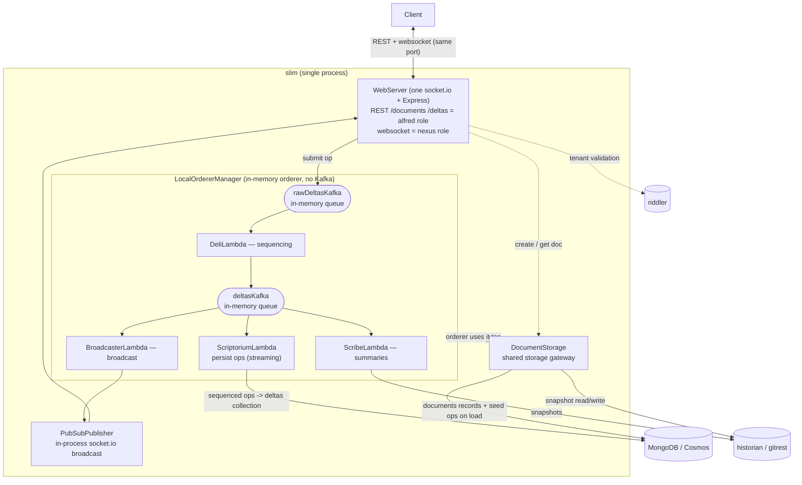

# Architecture — Routerlicious full-stack (Redpanda) and the slim alternative

This repo deploys the **full Routerlicious service topology**, with the message broker
provided by **Redpanda** (Kafka wire-protocol compatible) instead of Kafka + ZooKeeper.
A lighter **slim** single-process shape
of the *same* ordering logic is described at the end as a dev / prototype option.

Both topologies share the same storage gateway (`DocumentStorage`), the same
lambda pipeline (deli / scriptorium / scribe / broadcaster), and the same
external backends (MongoDB/Cosmos, historian/gitrest, riddler).

---

## 1. Full-stack (Redpanda) — selected AKS and core ordering shape

**Notes**

- `DocumentStorage` is a **library inside alfred and nexus** (each constructs its own), not a separate pod.
- Both alfred (REST path) and nexus (websocket path) can produce raw ops into the `rawdeltas` topic.
- Ordering pipeline over Kafka: `rawdeltas` -> deli (sequence) -> `deltas` -> scriptorium (Mongo) / scribe (historian). The deli process also runs `BroadcasterLambda`, which publishes sequenced ops to Redis; broadcaster is not a separate deployed pod.
- The local Compose variants also start a separate `copier` worker inherited from the source
  deployment. The selected AKS Helm chart does not deploy `copier`; it was not part of the
  exercised AKS client path shown above.
- Broadcast fan-out uses **Redis** pub/sub so ops reach clients across nexus instances; a document's ops are keyed by `documentId` to one partition -> one deli -> single sequencer per doc.
- **Redpanda** replaces Kafka + ZooKeeper with one process, speaks the Kafka wire protocol (the rdkafka orderer connects unchanged), and needs no ZooKeeper. The Azure deployment explicitly creates and verifies both delta topics; do not rely on auto-creation there.

---

## 2. slim (single process) — lightweight dev / prototype alternative

**Notes**

- One `socket.io` + Express `WebServer` serves both REST (alfred role) and the websocket delta stream (nexus role) on one port.
- `LocalOrdererManager` runs the full lambda pipeline **in-process**, wired by in-memory queues instead of Kafka. The slim process's ordering and broadcast path needs no broker or Redis.
- Its core external dependencies are MongoDB/Cosmos, historian/gitrest, and riddler. A complete deployment bundle can still include Redis for supporting services such as riddler or historian; process dependencies and bundle dependencies are not identical.
- Trade-off: lighter and faster to start than the full topology, but no broker-grade failover or single-doc redundancy (on reconnect it reloads from a Mongo checkpoint), and it sits off the production microservice topology. Good for dev / prototype; the full-stack (Redpanda) shape above is the recommended full-topology reference baseline.

---

## 3. Mapping: full-stack object <-> slim in-process equivalent

| full-stack (separate pod / internal object) | slim (same process) |
| --- | --- |
| alfred REST + nexus socket.io | one WebServer (Express + socket.io) |
| `DocumentStorage` inside alfred / nexus | same `DocumentStorage` (injected into LocalOrderer) |
| Redpanda topics `rawdeltas` / `deltas` | `LocalKafka` in-memory queues rawDeltasKafka / deltasKafka |
| deli / scriptorium / scribe (3 worker pods); `BroadcasterLambda` runs inside deli | the same 4 lambdas run in-process |
| Redis pub/sub broadcast | in-process PubSubPublisher (socket.io) |
| MongoDB / historian / riddler | identical external dependencies |

**The difference is transport + process topology, not the components.** Full-stack
splits into pods connected by Redpanda + Redis; slim folds everything into one
process connected by in-memory queues + in-process pub/sub. The storage gateway
layer (`DocumentStorage`) is identical on both.
