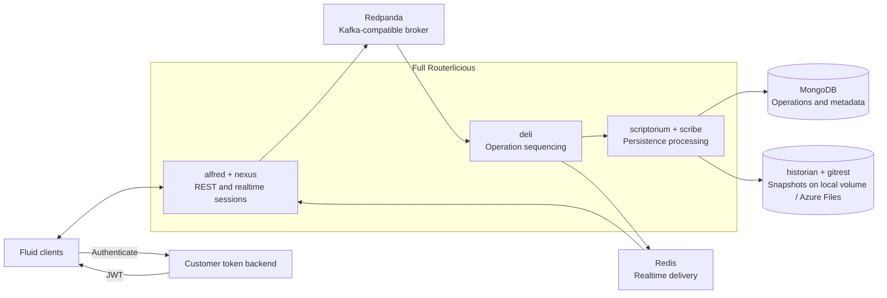

# Self-host Fluid Framework — Routerlicious + Redpanda

**A customer-operated self-host option for third-party clients who want to run Fluid Framework themselves.**

**Project owner:** Gin Fu

## Executive overview

> **TL;DR** — This project delivers a concrete product and engineering solution for third-party
> clients who want to run Fluid Framework as a service they operate themselves. Combining **product ownership with
> hands-on engineering**, it scopes the customer need, compares four service architectures on five
> criteria, and designs and builds the selected self-hosted service — **full Routerlicious with
> Redpanda replacing Kafka + ZooKeeper** — for a much lighter broker tier. It then proves the
> service with a real Fluid client on Azure AKS and carries it through the **full lifecycle**, from
> initial scope to production handoff:
>
> **scope → requirements → architecture comparison → decision → implementation → local and Azure
> validation → customer deployment → migration → maintenance → production handoff**

### Results at a glance

| Aspect | Summary |
| --- | --- |
| **Need** | Third-party clients need to run Fluid under their own operation — for control, data residency, cost at their scale, or to avoid a managed-service dependency — with real-time + durable collaboration |
| **Approach** | Translated the client-visible Fluid experience into self-host requirements, then compared four candidate architectures on five criteria — client behavior, durability, resource footprint, operational complexity, and maintainability — and selected on recorded evidence |
| **Decision** | **Full Routerlicious + Redpanda** — the mainline Routerlicious topology with Redpanda as its Kafka-compatible broker |
| **Efficiency** | **Same quality, far less cost** — vs. the original full Routerlicious (Kafka + ZooKeeper), the same recorded end-to-end test result at ~**13×** less average broker CPU, ~**33×** less peak, and ~**2.2×** less memory |
| **Validation** | A real Fluid client on **Azure AKS**: connect, two-client realtime sync, cold-load, convergence, and audience presence |
| **Delivered** | Source-built **local + Azure AKS** deployments, persistent operations/snapshot storage, and deployment automation with runbooks |
| **Full lifecycle** | Beyond build — **customer adoption, migration (exercised), maintenance/operations, and a production handoff** to the receiving team |

### Repository guide

| Need | Go to |
| --- | --- |
| Detailed service topology, data flow, and slim alternative | [ARCHITECTURE.md](./ARCHITECTURE.md) |
| Recorded tests, provenance, failures, and evidence boundaries | [VALIDATION.md](./VALIDATION.md) |
| Step-by-step bring-up runbook (local + Azure) with VERIFY gates | [AGENTS.md](./AGENTS.md) |
| Azure deployment commands, verification, and cleanup | [azure/README.md](./azure/README.md) |
| Final team decisions and production acceptance criteria | [HANDOFF.md](./HANDOFF.md) |
| Token prototype and production identity boundary | [token-function/README.md](./token-function/README.md) |

---

## 1. Scope and requirements

**The goal is a practical self-host option, not a new platform.** Third-party clients want or need
to run Fluid under their own operation — for control, data residency, cost at their scale, or to
avoid a managed-service dependency. This project is a **customer-operated self-host option** for
that audience, not a new general-purpose platform or a recreation of every managed-service capability.

**Who this is for:** third-party clients that run a Fluid application and want to operate its
backend themselves rather than depend on a managed Fluid service.

The target is a focused set of applications with modest session volume rather than a broad,
hyperscale market. The need is therefore a practical self-host path that preserves real-time
collaboration and durable data under customer operation, rather than a service that reproduces a
managed service's hyperscale footprint.

Applications rely on Fluid for two connected outcomes: **real-time synchronization and durable
data**. The self-host path therefore had to account for the Fluid capabilities visible to a client
and for the operational responsibilities that move to the receiving team:

- **Collaboration:** connect, create/load, operation ordering, realtime updates, signals,
  audience, and presence.
- **Persistence:** document metadata, sequenced operations, checkpoints, summaries/snapshots,
  and later cold-load.
- **Access:** tenant, document, user, scopes, signing-key custody, and authorization policy.
- **Compatibility and identity:** supported Fluid clients and document-reference mapping.
- **Deployment and operations:** customer/team-operated infrastructure, health, recovery,
  upgrades, security response, backup/restore, and incidents.
- **Migration:** a defined way to move durable state and manage the cutover seam.

---

## 2. Final delivered solution

**What shipped:** a full Routerlicious service running on one Kafka-compatible broker, with
persistent operations and snapshot storage, deployed and validated both locally and on Azure AKS.
This section summarizes the architecture, the end-to-end lifecycle coverage, and the delivered
artifacts.

### 2.1 Architecture overview

The final reference architecture keeps the full Routerlicious service topology and replaces
the Kafka broker and ZooKeeper coordination service with Redpanda through Routerlicious's
existing Kafka-protocol integration.



Fluid clients authenticate through a customer token backend and connect to alfred and nexus.
Redpanda carries operations through the Routerlicious ordering path; MongoDB persists operations
and metadata; historian/gitrest persists snapshots; and Redis carries sequenced operations back
to connected clients. Detailed service boundaries, topic flow, and component responsibilities
are documented in [ARCHITECTURE.md](./ARCHITECTURE.md).

### 2.2 Complete lifecycle solution

| Lifecycle area | Final solution | Delivery state |
| --- | --- | --- |
| **Fluid service** | Full Routerlicious with Redpanda as the Kafka-compatible broker | Implemented and validated locally and on AKS |
| **Operations and metadata** | MongoDB-backed document records, operations, and checkpoints | Implemented with persistent storage |
| **Customer-owned durable storage** | `IFileSystemManager` provides the snapshot-storage contract. The validated Azure implementation uses Azure Files; Azure Blob is the default bring-your-own-storage example, and customers can connect another preferred backend through a compatible implementation | Azure Files implemented and exercised through cold-load; additional backends pluggable via the `IFileSystemManager` contract |
| **Token and identity** | Customer backend authenticates users, authorizes document access, and issues short-lived Routerlicious JWTs | End-to-end auth validated on a development token path; production token service handed off (Section 7) |
| **Local deployment** | Source-built Docker Compose with amd64 and arm64 entry points | Implemented with health and smoke verification |
| **Azure deployment** | ACR + AKS + Helm, managed-disk PVCs, Azure Files, and explicit service endpoints | Implemented and validated with Fluid Chat |
| **Migration** | Read-only freeze, latest-state recreation, validation, and controlled cutover | Latest-state path exercised end to end (freeze → recreate → validate); cutover/rollback and repeatable tooling handed off (Section 7) |
| **Maintenance** | Pin, build, test, stage, deploy, monitor, and roll back; back up durable stores | Operating model and receiving-team responsibilities defined |

### 2.3 Delivered artifacts

This repository contains the local Compose stacks, source-build automation, smoke tests, Azure
manifests, parameterized ARM templates and a deployment capture, Routerlicious Helm values,
architecture and validation records, and phase-by-phase operator runbooks.

---

## 3. Architecture comparison and decision

**The decision lens.** The four service shapes were compared on five criteria: **client behavior**
(the client-visible collaboration experience), **durability** (surviving process loss and restart),
**resource footprint** (broker and runtime cost), **operational complexity** (services to run and
coordinate), and **long-term maintainability** (staying on the mainline Routerlicious path). The
options, the recorded comparison, and the resulting decision follow.

### 3.1 Options evaluated

- **Stock Routerlicious with Kafka + ZooKeeper:** the full reference topology, but with the
  heaviest broker and coordination footprint in the comparison.
- **Full Routerlicious with Redpanda:** the same full service shape using one Kafka-compatible
  broker and no custom ordering implementation.
- **Slim Routerlicious:** a single-process assembly using in-process queues; efficient for
  development and prototypes but a different operational and maintenance path.
- **Tinylicious:** the simplest development server and fastest startup path, but not selected
  as the customer/team-operated baseline.

### 3.2 Recorded comparison

The Fluid client E2E results recorded against all four shapes are summarized below.

| Shape | Containers | Recorded E2E | Broker / runtime observation | Fit |
| --- | :--: | --- | --- | --- |
| Kafka + ZooKeeper | 15 | 634 pass / 6 fail / 492 skip (328 s) | broker avg CPU 62%, peak 333%, ~634 MiB | Full baseline; heavy broker tier |
| **Full + Redpanda** | 14 | 634 pass / 6 fail / 492 skip (346 s) | broker avg CPU 4.9%, peak 10%, ~289 MiB | **Selected reference** |
| Slim | 8 | 634 pass / 6 fail / 492 skip (189 s) | slim process 61% CPU / 339 MiB | Development / prototype |
| Tinylicious | 1 | 658 pass (149 s) | one process, ~421 MiB average | Development only |

The 6 failures identical across the first three shapes are pre-existing old-version compatibility
cases outside the selected `--compatKind=None` scope — not regressions from the Redpanda
substitution. For the same recorded full-suite result, Redpanda used approximately **13× less
average broker CPU, 33× less peak broker CPU, 2.2× less broker memory, and one fewer container**
than Kafka + ZooKeeper. These are comparative engineering observations from the recorded
development environment, not production-capacity figures. Full provenance is in
[VALIDATION.md](./VALIDATION.md).

### 3.3 Decision

**Full Routerlicious + Redpanda** was selected. The self-host requirement was larger than standing
up a Fluid-compatible server: the service needed an ordering path that survives beyond a single
application process — but without Kafka and ZooKeeper's recorded cost. That framed two decisions.

**Decision 1 — keep the broker-backed full topology, over brokerless Slim/Tinylicious.** Full
Routerlicious runs client gateways, sequencing, persistence, summaries, and broadcast as separate
stages linked by the `rawdeltas` and `deltas` streams, so ordering does not live or die with one
process. Two consequences drove the choice:

- **Failure recovery.** Slim and Tinylicious replace those streams with in-memory queues and
  in-process pub/sub. If that single process fails, the active ordering session has no broker log
  or second orderer to continue from — clients must reconnect and the service must reload persisted
  state (Slim from Mongo, Tinylicious from LevelDB/local storage). Neither offers broker-style
  failover or single-document redundancy.
- **Scale-out.** The broker lets Full partition documents across ordering workers and scale
  gateways, sequencing, persistence, and broadcast independently. A brokerless replica model needs
  document-to-replica sticky routing instead, leaving each document bound to one process and
  failure domain.

**Decision 2 — use Redpanda as that broker, over Kafka + ZooKeeper.** Redpanda speaks the Kafka
wire protocol, so it drops into Routerlicious's existing orderer with no new ordering code and
removes ZooKeeper, collapsing the broker tier from two coordinated services to one. This was not a
paper choice: all four shapes were built and run through the same Fluid client E2E suite, and
Redpanda returned the **same recorded result at a fraction of the broker cost** (§3.2). It was also
the smaller structural change — keep the mainline Routerlicious shape, swap one Kafka-compatible
component.

Slim and Tinylicious proved brokerless collaboration works with the single-process ordering and
recovery model above; they remain the better fit when minimum footprint matters more than
broker-backed recovery and scale-out.

---

## 4. What was implemented and validated

**Evidence, not assertion.** The architecture was exercised in three layers: a local source-built
deployment, the same architecture on Azure AKS, and a real Fluid Chat client driving the full
collaboration lifecycle against the Azure deployment. Full provenance is recorded in
[VALIDATION.md](./VALIDATION.md).

### 4.1 Local reference deployment

The project delivered source-built amd64 and arm64 Compose paths containing full Routerlicious,
Redpanda, MongoDB, Redis, historian, gitrest, riddler, proxying, health checks, and persistent
MongoDB/snapshot volumes. PowerShell and bash entry points fetch or reuse FluidFramework source,
build the images, start the stack, wait for health, and run smoke verification.

Local evidence included service health, HTTP smoke checks, the Fluid client E2E suite, and the
four-shape resource comparison. This demonstrated that the Redpanda substitution retained the
selected suite result and that the complete exercised collaboration pipeline ran on the local
self-host stack.

### 4.2 Azure reference deployment

The same architecture was deployed to Azure using source-built images in ACR, full
Routerlicious on AKS, PVC-backed Redpanda, persistent MongoDB, in-cluster Redis, and
historian/gitrest snapshots on Azure Files. The final manifests explicitly configure the broker
PVC, while the Azure runbook explicitly bootstraps the broker topics. The Helm values and service
exposure provide the alfred, nexus, and historian client paths.

### 4.3 Fluid Chat validation

A real Fluid Chat application running locally connected to the Azure-hosted deployment and
completed the exercised client lifecycle:

1. connected to alfred, nexus, and historian;
2. created and attached a Fluid document;
3. opened the existing document in a second client;
4. exchanged realtime operations between clients;
5. cold-loaded persisted state and converged to the same value; and
6. reported both clients in the audience.

The Redpanda restart check also retained both topics and their eight-partition / replication-
factor-1 configuration. Together, the recorded results demonstrate that full Routerlicious can
run as a self-host service, Redpanda can satisfy the exercised Kafka-protocol path, real clients
can collaborate through the AKS deployment, and persisted state can initialize a second client.

---

## 5. Customer self-host adoption guide

**From local evaluation to operated service.** This guide takes a third-party client from trying the
service locally to running its existing Fluid application on a self-hosted service the client fully
operates. The application keeps working with only minimal changes — new service endpoints, a
production token provider, and remapped document references. First evaluate the service locally
(5.1); then follow the production adoption journey (5.2): plan and design, build and deploy,
validate and get operationally ready, then migrate and go live when you are ready.

**Which document, when.** This section is the adoption narrative; the operational detail lives in
dedicated docs, each with one job:

| Goal | Document | Audience |
| --- | --- | --- |
| Follow the whole adoption path | this section (§5) | reader / customer |
| Bring the stack up step by step (local → Azure) with VERIFY gates | [AGENTS.md](./AGENTS.md) | operator or AI agent |
| Run the Azure deploy — exact commands, verification, cleanup | [azure/README.md](./azure/README.md) | Azure operator |
| Reproduce the Azure reference deployment from parameterized ARM | [azure/deployment/skill.md](./azure/deployment/skill.md) + [azure/arm/](./azure/arm) | AI / engineer |
| See what was proven and its boundaries / open production decisions | [VALIDATION.md](./VALIDATION.md) / [HANDOFF.md](./HANDOFF.md) | reviewer / receiving team |

In short: §5 narrates, [AGENTS.md](./AGENTS.md) orchestrates the bring-up, and
[azure/README.md](./azure/README.md) is the command authority.

### 5.1 Evaluate the service locally

**Prerequisites:** Docker, git, a running Docker daemon, and free host ports. From the repository
root, run the script matching the host architecture:

```powershell
./scripts/run-local.ps1          # amd64 PowerShell
./scripts/run-local-arm64.ps1    # arm64 PowerShell
```

```bash
./scripts/run-local.sh           # amd64 bash
./scripts/run-local-arm64.sh     # arm64 bash
```

The script builds from FluidFramework source, starts the stack, waits for health, and finishes
with `SMOKE PASS`. Set `FLUID_REPO_DIR` to reuse an existing checkout. The primary client
endpoint is `http://127.0.0.1:3003`, historian is on port `3001`, and the default development
tenant is `fluid`.

To repeat the selected client E2E suite from a built FluidFramework checkout:

```bash
cd packages/test/test-end-to-end-tests
pnpm run test:realsvc:r11s:docker -- --compatKind=None
```

Stop while retaining local MongoDB and snapshot volumes with
`docker compose -f <compose-file> down`; add `-v` to delete those volumes. Use
`docker-compose.redpanda.yml` on amd64 and `docker-compose.redpanda.arm64.yml` on arm64. See
[AGENTS.md](./AGENTS.md) for all VERIFY gates and troubleshooting.

### 5.2 Adopt the service for your application

Work through four phases in order. Phases 1–2 plan, build, and deploy the service; phase 3
validates it and establishes operational readiness without touching production; phase 4 is the
migration and go-live, which you schedule when you are ready.

**Phase 1 — Plan and design**

1. **Confirm the application contract** — record the Fluid SDK versions in use, required client
  capabilities, tenant/document model, expected session shape, region, and data-residency needs.
2. **Assign operational ownership** — name the team responsible for the Azure subscription,
  service availability, security updates, incidents, storage lifecycle, backup, and restore.
3. **Choose durable storage** — use Azure Files for snapshot storage, or connect your preferred
  backend through a compatible `IFileSystemManager` implementation (Azure Blob is the default
  bring-your-own-storage example). Select a supported MongoDB topology for document metadata,
  operations, and checkpoints.

**Phase 2 — Build and deploy**

4. **Build the release** — pin a reviewed FluidFramework revision and complete patch set, build
  immutable routerlicious/historian/gitrest images, and publish them to your ACR.
5. **Deploy the Azure service** — create AKS, deploy Redpanda and its topics, deploy the storage
  backends, install Routerlicious, and expose alfred, nexus, and historian behind your DNS and TLS
  boundary. Deploy from the parameterized ARM templates ([azure/arm/](./azure/arm), following the
  [deployment capture](./azure/deployment/skill.md)), or hand-run the [Azure runbook](./azure/README.md).
6. **Integrate identity** — connect your identity provider to a trusted backend that authorizes
  tenant/document access and issues short-lived Routerlicious JWTs without exposing the tenant
  signing key.

**Phase 3 — Validate and prepare to operate**

7. **Validate the service in staging** — point the self-host alfred, nexus, and historian URLs, the
  production token provider, and the document-reference resolver at a staging path, then test
  authorization, create/load, realtime collaboration, signals/audience behavior, second-client
  cold-load, convergence, and restart recovery — all without moving production users.
8. **Establish operational readiness** — before any production data or users land, enable
  monitoring and alerts, establish backups and restore drills, document SLO/RTO/RPO and escalation
  ownership, and adopt the pinned upgrade and rollback process.

**Phase 4 — Migrate and go live (you schedule this)**

9. **Migrate and cut over** — at a window you choose, follow the [migration
  story](#61-migration-story): freeze the source to read-only, migrate each document's
  latest state, remap document references, and cut over. The source stays read-only until you
  accept the cutover or roll back.
10. **Run in production** — confirm the live service with real users, then operate it day to day
   using the monitoring, backups, and rollback established in phase 3. Your existing Fluid
   application now runs on the service you operate.

The infrastructure commands and VERIFY gates for deployment are in the authoritative
[Azure runbook](./azure/README.md).

---

## 6. Migration and maintenance

**Two operator concerns after cutover:** moving durable state across from an existing service, and running the
service safely over time. The migration model and the ongoing maintenance loop follow.

### 6.1 Migration story

The approach is a **logical read-only freeze and latest-state recreation** — not a server shutdown
or a zero-downtime live migration. Freezing writes (reads keep working) gives one consistent
point-in-time to copy: the destination reflects a single well-defined source state that the team
can validate against and, because the source stays readable, roll back to cleanly if the cutover is
rejected. A zero-downtime live migration would instead keep both sides taking writes at once —
risking divergence and a cutover far harder to verify or reverse — for little benefit at this
project's modest scale.

**What moves, and what doesn't:** migration carries each document's **latest application state** —
not its operation history — and recreated documents receive **new IDs** rather than preserving the
originals.

**The migration flow:**

> **Inventory → freeze source writes → read latest state → recreate on self-host → validate →
> map document references → cut over → roll back or complete**

- **Freeze.** Stop issuing write-capable source tokens and drain or reconnect existing writers, so
  the source still serves reads but rejects writes server-side.
- **Export and recreate.** Working through the inventory, the customer (or a schema-aware
  migration client) loads each source document, captures its latest application state, and
  recreates that state on self-host, per document across the inventory rather than as a single bulk
  transfer.
- **Map references.** Keep a durable old-to-new ID map and update the application's document
  references so existing links resolve to the recreated documents.
- **Validate and cut over.** Validate the recreated state and destination write path with the
  customer application, then switch service endpoints and document-reference routing. The source
  stays read-only until the cutover is accepted or a rollback decision is made.

Migration is customer-driven and customer-scheduled: the receiving team picks the cutover window
and the write-freeze it entails, agreed as part of the migration contract (Section 7).

**What the project exercised.** For one synthetic application schema, a `DocRead`-only source token
caused write attempts to be rejected server-side, an authorized client copied the latest
application state, and the destination remained writable — demonstrating the freeze →
read-latest-state → recreate → validate path end-to-end. Turning it into per-customer repeatable
tooling (inventory and export contract, writer drain or revocation, ID mapping, application
routing, validation records, and tested cutover and rollback) is handed off in Section 7.

### 6.2 Maintenance model

The receiving operator owns the ongoing lifecycle:

> **Pin → build → test → stage → deploy → monitor → roll back**

The release process should pin a reviewed FluidFramework revision and complete patch set, create
immutable image tags or digests, repeat client and storage validation in staging, and preserve a
known-good rollback. Operational maintenance also includes MongoDB and snapshot backups, a
broker recovery policy, restore drills, security-update intake, monitoring, alerts, SLOs, and
incident ownership. Detailed receiving-team decisions are in [HANDOFF.md](./HANDOFF.md).

---

## 7. Production handoff: remaining work

This repository is a **reference implementation**. The following areas are handed to the receiving
team to own and complete before the service goes to production for a customer:

| Area | Required production outcome |
| --- | --- |
| **Security and identity** | HTTPS/WSS and DNS; a trusted production token service (the [token Azure Function](./token-function/README.md) prototype is handed to the team to build on); the production authentication approach is still under design; protected and rotatable tenant keys; backend access controls |
| **Summary correctness** | Resolve the observed incremental-summary 404 and prove bounded operation-log growth |
| **Reliability** | Select supported HA topologies for Redpanda, MongoDB, Redis, and the application tier; test restart, failover, backup, and restore |
| **Storage** | Accept and govern Azure Files, or provide and validate an `IFileSystemManager` adapter for the customer's preferred backend (e.g., Azure Blob) handed to the team to build; define independent lifecycle and retention ownership |
| **Operations** | Add metrics, dashboards, alerts, SLOs, capacity/load/soak evidence, runbooks, RTO/RPO, and incident response |
| **Release engineering** | Pin source and images; archive patches and digests; test staged upgrades, security updates, and rollback |
| **Compatibility** | Define the supported Fluid client/version matrix and confirm the required client-visible capability surface |
| **Migration** | Deliver repeatable, automated tooling that migrates the full document inventory, and agree export availability, ID mapping, downtime, history, validation, and rollback contracts |
| **Region and residency** | Agree deployment regions, data placement, replication, retention, and compliance ownership |

Current-state evidence and tests not run are recorded in [VALIDATION.md](./VALIDATION.md);
production acceptance criteria are in [HANDOFF.md](./HANDOFF.md). The next phase is
receiving-team productionization with explicit owners and acceptance tests.

---

## License

[MIT](./LICENSE).
