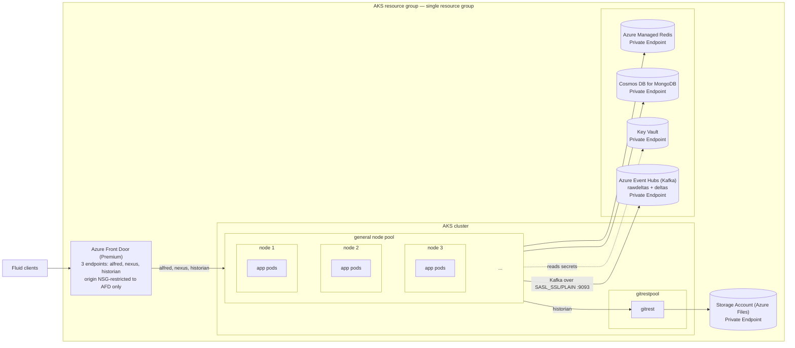
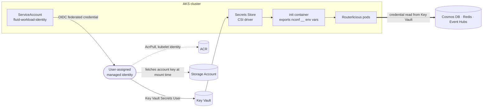

# Fluid AKS Production Hardening — Design

**Status:** Approved by project owner 2026-07-16, pending written-spec review (see Section 11).
**Scope:** Single combined design, organized in phases (see Section 8), covering resource-group
topology, managed-services adoption, capacity sizing, and security hardening for the self-host
Fluid (Routerlicious + Azure Event Hubs) AKS reference deployment described in [README.md](./README.md)
and [azure/README.md](./azure/README.md).

## 1. Problem statement

The current Azure reference deployment ([azure/README.md](./azure/README.md)) runs
everything — application tier, the Kafka broker, MongoDB, Redis, and snapshot storage — inside one AKS
cluster and one resource group, with the AKS-managed `MC_...` node resource group absorbing
storage that should be independently owned. The gaps this design closes: no TLS/DNS, no
production auth, plaintext tenant key, single-node broker/cache/database with no HA, and storage
lifecycle tied to the cluster.

This design also replicates a resource-group pattern used by a similar production deployment
(one dedicated resource group per environment/customer deployment), and sizes the result to
support up to 1,000,000 sessions/customer/month per deployment.

## 2. Goals

- Move durable/third-party backing services (database, cache, snapshot storage, edge/TLS) out
  of the AKS-managed `MC_...` node resource group, into the same explicitly-managed resource
  group as the AKS cluster itself — one resource group per deployment (Section 6).
- Move ordering off the in-cluster broker entirely and onto Azure Event Hubs over the Kafka
  protocol — a managed PaaS service with service-managed replication and no broker disks,
  quorum or rebalance operations to own (Section 7.3).
- Close the security gaps in the existing hardening register: TLS/DNS, secure tenant-key
  storage, ACR credential handling. Token/auth minting remains the customer's own operated
  backend (Section 7.6), out of scope for this design.
- Size the design to support up to 1,000,000 sessions/customer/month per deployment, using
  real observed data rather than assumption where possible.

## 3. Non-goals

- Multi-region or multi-cluster failover. A total AKS cluster/region loss remains a full-outage
  event under this design (see Section 7). Documented as a residual risk, not solved here.
- A hyperscale, horizontally-sharded multi-cell architecture. Real usage data (Section 4)
  showed the actual target load doesn't require it; building it now would be over-engineering.
- Resolving domain ownership. This is an organizational decision for the project owner's team,
  carried forward as an open action item (Section 9), not a technical design question.
- Finalizing exact Cosmos DB RU/s, Managed Redis tier, or AKS HPA thresholds. This design sets
  starting points; final values come from load testing (Section 7), consistent with this repo's
  existing position that no load/capacity benchmark exists yet.
- Building, hosting, or hardening a token/auth-minting service. Section 7.6 documents the
  shared-tenant-key contract Routerlicious requires; the customer builds and operates their own
  backend that holds the tenant key and authenticates its own users, using whatever identity
  provider they choose. This design does not build, deploy, or prescribe a concrete
  implementation.
- Fine-grained, per-document authorization. The shared tenant key is inherently tenant-scoped,
  not per-document; a finer-grained per-document access-control model on top of it is a
  documented future enhancement (Section 9), not this design's scope.
- Building an alternative `IFileSystemManager` adapter for gitrest snapshot storage (e.g., for
  Azure Blob). This design's default is to accept and govern Azure Files as-is (Section 7.4);
  building and validating a different backend, with its own independent lifecycle and retention
  ownership, is the customer's own choice to make if they need it (Section 9), not something
  this design builds.

## 4. Capacity target

This design targets support for **up to 1,000,000 sessions/customer/month**, for **one
customer's deployment** (Section 9) — i.e. one customer operating one independent deployment,
not an aggregate across multiple customers/tenants.

**Working assumptions:** session lifetime capped at 5 minutes (sessions reconnect at least this
often, bounding concurrency independent of arrival rate) and a 3x peak:average headroom factor.
Combined, these put the working design target at **~347 peak concurrent sessions per customer**.
All downstream sizing (Cosmos RU/s, Managed Redis tier, AKS replica counts/HPA thresholds,
Event Hubs partition/throughput-unit sizing) treats that figure as a starting point, to be confirmed by
load testing, not treated as a hard guarantee.

## 5. Architecture overview



"app pods" above stands for alfred / nexus / deli / scriptorium / scribe / riddler / historian —
the Kubernetes scheduler spreads their replicas across whichever nodes the general pool
currently has (3 is the minimum; the pool autoscales beyond
that as needed), based on resource availability, not a fixed per-node assignment. No workload in
the general pool has a pinned placement rule — ordering runs on Azure Event Hubs (Section 7.3),
outside the cluster entirely. Only
gitrest is pinned to its own dedicated, tainted node pool (`gitrestpool`) — historian is
HPA-scalable like the other 6 services and runs on the shared general node pool (Section 7.4).
Token/auth minting is a customer-operated backend, out of scope for this design (Section 7.6).

### Identity model: one identity to reach Key Vault, secrets for everything else

Routerlicious does not authenticate to most first-party Azure services with a managed identity.
It uses a managed identity to reach **Key Vault**, and Key Vault brokers the credentials for
everything else. Managed identity is the bootstrap, not the data-plane credential.



**Where identity is the credential.** Key Vault (workload identity federated through the AKS OIDC
issuer to the `fluid-workload-identity` ServiceAccount) and ACR image pulls (kubelet identity,
`AcrPull`) need no stored secret at all. The Storage Account is a hybrid: an identity fetches the
account key live from ARM so nothing is persisted, but the SMB mount itself still uses that key,
because identity-based SMB requires Kerberos and therefore AD DS or Entra Kerberos (Section 7.4).

**Where it is still a secret.** Cosmos DB, Redis, and Event Hubs each authenticate with a
credential held in Key Vault and projected into pods by the CSI driver:

| Service | Why not managed identity |
|---|---|
| Cosmos DB for MongoDB (vCore) | The vCore data plane is MongoDB SCRAM. Entra data-plane auth is a Cosmos NoSQL-API capability, not a vCore one (Section 7.1) |
| Redis | The deployed class is password-based. Even on a tier that supports Entra, the client must acquire a token and re-`AUTH` on expiry — logic Routerlicious does not have (Section 7.2) |
| Event Hubs | `oauthBearerConfig.tokenProvider` must be a JavaScript **function**; nconf config can only carry JSON (Section 7.3) |

**These are the same blocker wearing three hats.** Routerlicious's configuration layer is
nconf/JSON, so it can express a credential that is a *string* but not one that is a *refreshing
token provider*. Every service needing a rotating Entra token therefore needs code, not
configuration — which is why a single token-provider abstraction in Routerlicious would unlock
Redis and Event Hubs together. Cosmos would additionally require moving off vCore.

What compensates in the meantime: every one of those services sits behind a Private Endpoint with
public access disabled, and the secrets exist only in Key Vault and a tmpfs CSI mount — never in
Helm values, a ConfigMap, or an image layer.

### Connectivity: AKS ↔ first-party Azure services

| Service | Network path | Auth mechanism | Identity |
|---|---|---|---|
| Key Vault | Private Endpoint (`privatelink.vaultcore.azure.net`); public access is re-enabled only transiently while `deploy.sh` itself writes secrets, then disabled again (Section 7.5) | RBAC — `Key Vault Secrets User` for pods, `Key Vault Secrets Officer` for the deploying caller | The one workload identity, federated via AKS's OIDC issuer to the `fluid-workload-identity` ServiceAccount |
| Cosmos DB for MongoDB | Private Endpoint (`privatelink.mongo.cosmos.azure.com`), public access disabled | Connection string (the credential itself), stored in Key Vault and CSI-mounted (Section 7.1) | — |
| Azure Managed Redis | Private Endpoint (`privatelink.redis.azure.net`), public access disabled | Access key (the credential itself), stored in Key Vault and CSI-mounted (Section 7.2) | — |
| Storage Account (gitrest) | Private Endpoint (`privatelink.file.core.windows.net`), public access disabled; `allowSharedKeyAccess` stays `true` (Section 7.4) | Storage account key, fetched live from ARM at mount/provision time — never persisted anywhere | AKS kubelet identity (`Storage Account Key Operator Service Role`, node-level SMB mount) and the AKS cluster's own control-plane identity (`Storage Account Contributor`, PVC provisioning) |
| ACR | Public endpoint — no Private Endpoint | RBAC (`AcrPull`); admin account disabled (Section 7.8) | AKS kubelet identity |
| Azure Front Door → AKS origins | Public (LoadBalancer IPs), inbound only, NSG-restricted to the `AzureFrontDoor.Backend` service tag (Section 7.7) | Network-level restriction, not an identity | — |
| Event Hubs | Private Endpoint (`privatelink.servicebus.windows.net`), public access disabled | Shared-access-key connection string, stored in Key Vault and CSI-mounted (Section 7.3) | — |

Five services get a genuine Private Endpoint (Key Vault, Cosmos DB, Redis, Storage, Event Hubs);
ACR and
Front Door's path to the AKS origins are the two exceptions, for different reasons — ACR pulls
have no supported Private Link path from the kubelet identity used here, and Front Door's
origins must stay reachable from Front Door's own public backend network by design.

## 6. Resource group topology

**Subscription and resource group are the customer's own choice, not prescribed by this
design.** Consistent with this repo's existing Prerequisites convention
([azure/README.md](./azure/README.md) "Prerequisites" — `SUB` is documented there as the
customer Azure subscription ID, `RG`/`RG_LOC` as the customer-owned resource group and its
location), the customer selects which Azure subscription to deploy into and creates/names their
own resource group. This design does not require or assume a specific subscription or
resource-group name — every name in this document is this project's own illustrative test
choice, not a requirement.

**Test deployment name** (this project's own validation instance, in its own subscription —
not a subscription or naming convention customers following this design are required to use;
the customer picks their own subscription and resource-group name):

| Resource group | Name | Contains | Ownership rule |
|---|---|---|---|
| AKS resource group | `example-fluid-deployment-001` | AKS cluster (its auto-managed `MC_...` node RG is a separate, AKS-owned child resource group); Cosmos DB for MongoDB, Azure Managed Redis, Storage Account (gitrest Azure Files), Key Vault, Azure Front Door profile (3 endpoints: alfred, nexus, historian) — all created directly in this RG, **not** inside `MC_...` | Single RG per deployment; deleting it deletes everything in it, including the data-bearing resources (tradeoff tracked in Section 9) |

**Change from the two-RG design considered earlier:** the data/platform resources (Cosmos DB,
Redis, Storage Account, Key Vault, Front Door) are now **consolidated into the same resource
group as the AKS cluster**, rather than a second, independently-owned resource group. This still
solves the Section 1 problem — the Storage Account is explicitly pre-created here, not
auto-provisioned into the AKS-managed `MC_...` node RG — but it gives up the earlier design's
"survives AKS resource-group deletion" property. See Section 9 for the accepted tradeoff.

## 7. Component design

### 7.1 MongoDB → Cosmos DB for MongoDB (RU-based API for MongoDB)

Replaces the in-cluster `mongo:4` deployment in [azure/backends.yaml](./azure/backends.yaml)
(single instance, no auth, managed-disk PV). The Helm chart already anticipates this path — set
`mongodb.operationsDbEndpoint` to the Cosmos connection string and `mongodb.directConnection: false`
in [azure/routerlicious-values.yaml](./azure/routerlicious-values.yaml). Placed in the
same resource group as the AKS cluster (Section 6). Validate wire-version/compatibility and
rerun the existing two-client E2E suite against it before cutover.

**Authentication:** connection-string based (the connection string is stored in Key Vault, not
managed identity — Section 7.5). Whether Cosmos DB for MongoDB vCore supports Microsoft Entra
ID/managed-identity authentication for MongoDB wire-protocol data-plane connections could not be
confirmed from current documentation (tracked as an open verification item, Section 9) — vCore
is provisioned with an admin username/password at cluster creation and is believed to use native
MongoDB SCRAM authentication, distinct from Cosmos DB's NoSQL API, which does have native Entra
ID RBAC. Do not assume passwordless auth works here without confirming directly first.

**Implementation update — this uses the RU-based "API for MongoDB" account type, not Cosmos
DB for MongoDB vCore; capacity sizing completed.** Azure has two distinct "Cosmos DB for
MongoDB" products: the original, GA, RU-billed **"API for MongoDB"** (what's deployed here),
and the newer **vCore** option — a separate, VM-based deployment model, not RU-billed. This
design originally targeted vCore, but its preview control plane returned a persistent
`internal_server_error` during validation (confirmed via raw ARM REST calls, not
a CLI bug). Switched to the RU-based API for MongoDB account type (`--kind MongoDB`) instead —
consumed identically by `mongodb.operationsDbEndpoint`. Account capacity mode is
**Provisioned** (Serverless has a hard, non-negotiable 5,000 RU/s-per-container ceiling — not
viable for the target load). Per-collection throughput was sized two ways: (1) against a
known-good production reference deployment's configuration, and (2) by reading the
actual FluidFramework source across all 6 top-level services (alfred, nexus, riddler, deli,
scribe, scriptorium) to confirm which of the chart's 8 declared `mongo.collectionNames` are
genuinely read, and by whom:

| Collection | Throughput | Consumer(s) | Why |
|---|---|---|---|
| `deltas` | Autoscale, max **80,000** RU/s, sharded on `documentId` (hash) | scriptorium | Every sequenced op, unconditionally — the hottest collection by far. |
| `documents` | Autoscale, max **80,000** RU/s, sharded on `documentId` (hash) | alfred, scribe, deli | Fires once per document-partition-lambda lifecycle, not per-op. Its earlier 100% RU saturation was driven by deli checkpointing on every message; with checkpoint batching enabled and active-session checkpoints routed to `checkpoints`, measured utilization is 2-3%. |
| `checkpoints` | Autoscale, max **10,000** RU/s, sharded on `documentId` (hash) | scribe, deli, nexus, scriptorium (soft-delete path) | Shared collection with a `type` discriminator; written on each lambda's periodic checkpoint. |
| `scribeDeltas` | Autoscale, max **4,000** RU/s, sharded on `documentId` (hash) | scribe | Scribe's own copy of the sequenced-op stream for summarization. |
| `tenants` | Autoscale, max **4,000** RU/s, sharded on `_id` (hash) | riddler | Tenant metadata/key lookups, cached, low frequency; sharded on `_id` rather than `documentId` — tenants has no such field, but `tenantManager.ts` always sets `_id` to the tenant's own unique tenantId. |
| `nodes` | Autoscale, max **4,000** RU/s, unsharded | **nexus** (`NodeManager`, `@fluidframework/server-memory-orderer`) | Node registration for `LocalOrderManager`, unconditionally constructed on every nexus startup. Easy to miss — different package than `services-core`, class name doesn't match the collection name. |
| `reservations` | Autoscale, max **4,000** RU/s, unsharded | **nexus** (`ReservationManager`, same package) | Lease-renewal mechanism `NodeManager` depends on. |
| `partitions` | *(not created)* | — | The only one of the 8 declared collection names confirmed unused anywhere in the current code — vestigial. |

`tenants`/`nodes`/`reservations` sit at Azure's 4,000 RU/s autoscale **minimum** ceiling rather
than a cheaper manual floor specifically for **burst tolerance**: manual throughput is a hard
cap (429 throttling with no headroom), and all three have a real burst risk unrelated to
steady-state traffic — mass client reconnects after a network blip, or many deli/nexus pods
restarting near-simultaneously after a rolling deploy or HPA scale event. Azure's autoscale
floor bills at 10% of the max (~400 RU/s idle, same as a manual floor), so this costs nothing
extra at typical load. One real mistake made and corrected during this work:
`nodes`/`partitions`/`reservations` were initially all deleted as "unused" after checking only 5
of the 6 services — nexus (the actual consumer of `nodes`/`reservations`) wasn't checked until a
second pass.

**`documents` was raised twice** — from 4,000 to 50,000 RU/s and given a shard key it didn't
originally have, matching `deltas`' treatment: confirmed live via Azure Monitor
(`NormalizedRUConsumption`) that `documents` was pegged at 100% RU utilization for 25+ minutes
straight under real traffic while sharded `deltas` stayed at only ~30% of its own much higher
ceiling. An unsharded collection is also capped around ~10,000 RU/s regardless of the
configured max (a "fixed to unlimited migration" ceiling), so raising the number alone would not
have been enough without sharding too. It was **raised again, from 50,000 to 100,000 RU/s**,
after combined multi-cluster load testing showed it repeatedly hitting 100% utilization even at
the 50,000 ceiling; `deltas` was raised alongside it, from 50,000 to 80,000 RU/s, based on its
own observed peak (~62%) in that same test window. **It now sits at 80,000 RU/s, matching
`deltas`**: the saturation that justified 100,000 came from deli checkpointing on every message,
and once `checkpointHeuristics` batching was enabled and `localCheckpointEnabled` routed
active-session checkpoints to the `checkpoints` collection, measured utilization dropped to 2-3%.
`checkpoints` and `scribeDeltas` were sharded on
`documentId` at the same time (matching `deltas`/`documents`), and `tenants` was sharded on
`_id` separately. Cosmos has no in-place "add shard key" operation on an existing collection, so
`azure/deploy.sh` never automates this — it only warns with the exact manual
drop-and-recreate command if a collection is found unsharded when it should not be (real data
loss risk otherwise, see `phase8_cosmos_throughput`). All values here are starting points
informed by a real reference deployment, source-verified usage patterns, and live capacity
findings — not load-test-derived final numbers (Section 9 still applies).

### 7.2 Redis → Azure Managed Redis

Replaces Azure Cache for Redis with Azure Managed Redis (`Microsoft.Cache/redisEnterprise`).
The deployed database uses encrypted client traffic on port `10000`, high availability,
`NoCluster`, and the service-default `VolatileLRU` eviction policy. Non-clustered mode is required because
`RedisClientConnectionManager` (`@fluidframework/server-services-utils`) constructs a standalone
Redis client and does not handle Redis Cluster `MOVED` redirects. Azure distributes HA replicas
across availability zones by default where the region supports them.

**Authentication approach:** access-key authentication is explicitly enabled and the primary key
is stored in Key Vault and CSI-mounted into every Fluid workload. Microsoft Entra ID is the
preferred Azure Managed Redis authentication mode, but Fluid's current client is password-based
and has no token acquisition or refresh path. Access keys therefore provide the compatible
migration path without carrying credentials in Helm values, ConfigMaps, Kubernetes Secrets, or
images.

The earlier Azure Managed Redis attempt used the older Enterprise SKU family and failed with
`AllocationFailed`/`OperationFailed` across the regions tested; it also disabled access keys,
which made the password-only Fluid client unable to authenticate. The current implementation
uses the newer Balanced SKU family and enables access keys. `Balanced_B5` is the starting
baseline because Microsoft maps a non-clustered Premium P1 cache to B5: both advertise 6 GB
(approximately 4.8 GB usable after service reservation). Production sizing must still use
observed peak memory, server load, bandwidth, and connection metrics.

### 7.3 Azure Event Hubs — the ordering backend

Ordering runs on Azure Event Hubs over the Kafka protocol. Event Hubs speaks the Kafka wire
protocol, so Routerlicious's rdkafka orderer connects to it without a code change, and being a
managed PaaS service it keeps disk sizing, retention tuning, quorum and rebalance handling
inside the service rather than in the cluster.

| Aspect | Design |
|---|---|
| Namespace | Standard tier, 4 throughput units with auto-inflate to 10, `kafkaEnabled`, zone-redundant, TLS 1.2 minimum |
| Hubs | `rawdeltas` and `deltas`, 32 partitions each — the Standard-tier ceiling, giving each of the 8 deli/scribe/scriptorium replicas four partitions |
| Retention | 72 hours by default (`kafka.eventHubs.retentionHours`); Standard caps this at 7 days. The reference baseline leaves the service default, so this is deliberately more conservative |
| Throughput | 1 TU = 1 MB/s **or 1000 events/s** ingress, 2 MB/s egress, namespace-wide — whichever limit binds first, and on this stack it is the event rate rather than the byte rate. Egress runs 2-3x ingress because `deltas` is read by two consumer groups (scriptorium and scribe). Sized at 4 TU with auto-inflate to 10 rather than to the average, because a throttled produce stalls until `delivery.timeout.ms` (120s) and that timeout is fatal — under-provisioning surfaces as the service restarting, not as a throttling error. Unlike `zoneRedundant`, capacity **is** changeable on a live namespace |
| Replication | Managed by the service — no `default_topic_replication`, no PVC, no anti-affinity or quorum concern |
| Client wiring | `SASL_SSL` + `PLAIN` on port 9093, selected by `rdkafkaBase.ts` as soon as `kafka:lib:eventHubConnString` is non-empty |
| Network | Public access disabled, private endpoint (`privatelink.servicebus.windows.net`) into the private-endpoint subnet — matching every other PaaS dependency (Section 5) |
| Client tuning | The production-validated librdkafka block: `connections.max.idle.ms: 180000` — Event Hubs drops idle connections at ~240s, so the client must time out first — plus the matching consumer/producer timeout and retry values and `consumeLoopTimeoutDelay: 0`. Delivered as `kafka__lib__*` env vars, so no chart change is needed. `partition.assignment.strategy: cooperative-sticky` is deliberately excluded: it is not production-validated for this stack |

**Authentication — a deliberate deviation from the hardened baseline.** The hardened namespace posture sets
`disableLocalAuth: true` and authenticates with a managed identity. That path reaches rdkafka
through `oauthBearerConfig.tokenProvider`, which `rdkafkaBase.ts` requires to be a **JavaScript
function** — it throws `oauthBearerConfig is malformed` for anything else. A function cannot be
expressed in JSON config, so adopting it would mean shipping a custom Routerlicious image. This
deployment runs stock upstream images, so it takes the connection-string path instead, which
requires local auth to remain enabled. The connection string is held in Key Vault, projected
into pods by the Secrets Store CSI driver, and exported by the init container as
`kafka__lib__eventHubConnString`; it is deliberately **not** rendered into the ConfigMap, which
would otherwise place a shared-access key in a cluster object readable by anyone holding
`get configmap`. Moving to managed identity is the natural hardening follow-up if a custom image
ever becomes acceptable — see "Identity model" above for why this blocker is shared with Redis
rather than specific to Event Hubs.

**Network exposure.** Because a shared-access key is the only credential in play, the namespace
is not left on the public internet: `deploy.sh` disables public network access and attaches a
private endpoint, the same treatment Cosmos DB, Redis, Storage and Key Vault already get
(Section 5). A Deny-by-default network ruleset reaches an equivalent position; a private
endpoint is the idiom already established here. Only the Kafka data plane moves inside the VNet —
namespace and hub provisioning are ARM control-plane calls and are unaffected — so the brokers
are reachable from AKS pods and nowhere else. Broker inspection from a laptop is therefore not
possible; use Azure Monitor for consumer-group lag.

**Consequences of running a remote broker:**

- Topics are not created by `deploy.sh` beyond the two hubs above; the rdkafka client's own
  topic auto-creation still applies, as it did in-cluster.
- `zoneRedundant` is **create-time only**. It cannot be changed on an existing namespace, so a
  mismatch needs a new namespace — `preflight-check.sh` checks the region for Availability Zone
  support before anything is provisioned.
- 32 partitions is exactly the Standard-tier ceiling per hub. Growing beyond it means the
  Premium or Dedicated tier, not a configuration change.

### 7.4 Snapshot storage placement

Today, gitrest's Azure Files PV ([azure/backends.yaml](./azure/backends.yaml)) is
provisioned by the Azure File CSI driver, which by default lands the underlying Storage Account
in the AKS-managed `MC_...` node resource group. Change: pre-create the Storage Account directly
in the AKS resource group (Section 6) — not the auto-managed `MC_...` node RG — and reference it
from the `azurefile-gitrest` StorageClass via the CSI driver's `secretName` / `storageAccount`
parameters instead of auto-provisioning. No change to gitrest's
`IFileSystemManager` usage (still Azure Files, not Blob — Blob remains unimplemented in OSS
gitrest per [azure/README.md](./azure/README.md)).

**Only gitrest runs on its own dedicated node** — historian is HPA-scalable and runs on the
general node pool with the other 6 services (`azure/deploy.sh`'s `phase1_gitrest_nodepool`
creates a separate 1-node pool for gitrest alone): a 1-node pool tainted
`dedicated=gitrest:NoSchedule`, with gitrest's Deployment carrying the matching toleration plus
a `nodeAffinity` pinning it to that pool (`azure/backends.yaml`). This reflects a real
constraint, not a preference — the current design only supports **1 gitrest replica** (no HPA,
`Recreate` strategy), since gitrest has no Blob-backed `IFileSystemManager` to make it safely
horizontally scalable (Section 9). Isolating it onto its own node means gitrest's fixed sizing
doesn't compete with the app tier's HPA-driven scale-out for node capacity.

**Storage backend is a customer decision, with two paths (Section 9):** this design's default
is to **accept and govern Azure Files** as provisioned above — relocating it into the AKS
resource group (this section) fixes *where* it's created, but its lifecycle still stays tied to
that resource group's own lifecycle (the single-RG blast-radius tradeoff, Section 9). A customer
who instead wants a backend with genuinely **independent lifecycle and retention ownership** —
e.g., data that survives AKS resource-group deletion, or a backend with its own
soft-delete/versioning/lifecycle-management policy — would need to **build and validate a new
`IFileSystemManager` adapter** for their preferred backend (e.g., Azure Blob); gitrest has no
Blob implementation in OSS today (only local-fs / mem / redis). That adapter is real,
non-trivial engineering — a new storage driver against an internal Fluid Framework interface,
needing its own concurrent read/write/list correctness testing — not just provisioning an Azure
resource, so it is tracked as an open, customer-driven decision (Section 9) rather than built by
default here.

**Authentication approach:** true passwordless identity-based SMB access to Azure Files requires
Kerberos — via on-premises AD DS synced to Entra ID, Microsoft Entra Domain Services, or
Microsoft Entra Kerberos. Standing up any of those is a substantial infrastructure commitment
disproportionate to this design's scope, so it's out of scope here. Instead: keep the
storage-account-key-based SMB mount, but have the CSI driver's managed identity fetch/rotate that
key from Azure Resource Manager at runtime, rather than storing it as a long-lived static
Kubernetes Secret — this removes the static-credential-at-rest exposure without requiring a full
Kerberos deployment.

### 7.5 Secret management

The tenant key is **not** in Key Vault — riddler generates and stores it directly in Cosmos DB
as part of the tenant document (`key1`/`key2`, [tenant-admin/README.md](./tenant-admin/README.md)
"What a tenant gets"), and every service that needs it (riddler, the optional
[token-service](./token-service/README.md)) reads it from there or via that service's own
mechanism — not a shared Key Vault secret.

What Key Vault + the AKS-managed CSI Secrets Store driver actually holds: **`cosmos-connection-string`**
and **`redis-password`** (Sections 7.1/7.2), mounted into all 8 app-workload pods
(alfred/nexus/riddler/deli/scribe/scriptorium/gitrest/historian) via one `SecretProviderClass`
and the one workload identity — never rendered into Helm values, ConfigMaps, or a plain
Kubernetes Secret. The Storage Account key (Section 7.4) is **not** stored as a Key Vault secret
at all: it's fetched dynamically from ARM by the kubelet identity at mount time, never persisted
anywhere. Net effect: only two long-lived secrets exist in Key Vault, not one per credential a
naive Key-Vault-for-everything design would produce.

If the optional [token-service](./token-service/README.md) reference implementation is
deployed, it separately mirrors one tenant's key as its own Key Vault secret
(`fluid-tenant-key-<tenantId>`), read by the Function App via an **App Service Key Vault
reference** — a different mechanism than the CSI mount above, since a Function App isn't a
Kubernetes pod (Section 7.6).

### 7.6 Token / auth service — customer-operated backend, with an optional Entra ID reference

This design does not require any particular token-minting service. Fluid's authorization model is
a shared tenant key: any backend that holds the tenant key and mints a correctly-shaped,
HS256-signed Fluid JWT is accepted by Routerlicious (riddler validates with that same key) —
there is no dependency on any specific identity provider.

```
Client
   │
   ▼
Customer Backend
   │
   │ tenantKey
   ▼
Fluid JWT
   ▼
Routerlicious
```

The customer builds and operates the "Customer Backend" box themselves: authenticating their
own end users however they choose (Entra ID, another identity provider, or a custom scheme),
then minting a Fluid JWT signed with the tenant key and returning it to the client. Which
identity provider to use, and how to host/operate that backend, are the customer's own
decisions — not something this design prescribes.

#### Optional: the Entra ID reference implementation

A working implementation of that box ships at [token-service/](./token-service/README.md). It is
**opt-in and not part of `azure/deploy.sh`** — it has its own script, and the stack is fully
functional without it. It exists so the security expectations below are demonstrated rather than
just described.

```
Browser (MSAL)
   │  1. sign in                          ┌─────────────┐
   ├─────────────────────────────────────▶│  Entra ID   │
   │  2. access token for                 └─────────────┘
   │     api://<appId>/Fluid.Token.Issue         │
   ▼                                             │
Azure Function (token-service)                   │
   │  3. Easy Auth validates the token ──────────┘
   │     and injects x-ms-client-principal
   │
   │  4. authorize(): is this user allowed
   │     this tenant/document?
   │
   │  5. tenant key ◀── Key Vault reference (managed identity)
   ▼
   6. Fluid JWT (HS256, short-lived, least-privilege scopes)
   │
   ▼
Routerlicious (riddler validates with the same tenant key)
```

Three properties are worth noting, because they are what make this a *reference* rather than a
sample: the platform authenticates the caller before any code runs (Easy Auth, step 3), user
identity is derived from Entra's verified claims rather than anything the caller sends (step 4),
and the tenant key is never in configuration — the app resolves a Key Vault reference with its
managed identity (step 5). Authorization decisions live in one function, `authorize()`, with
three shipped policies (`default`, `tenant-scoped`, `role-based`); customising access control
means editing that one place.

Customers remain free to ignore all of this and front Fluid with their own service. At minimum,
any such backend must authenticate the caller with a trusted identity provider, authorize access
to the requested tenant/document on the server, derive user identity from trusted claims rather
than caller-supplied values, keep the tenant signing key in a server-side secret store, issue
short-lived least-privilege tokens, support key rotation/audit logging/rate limiting/revocation,
and enforce HTTPS with an explicit CORS policy.

Key rotation interacts with this service: `tenant-admin rotate` refuses to rotate the key the
token service is currently signing with, so a rotation cannot silently break minting. See
[tenant-admin/README.md](./tenant-admin/README.md#the-in-use-key-check).

### 7.7 TLS / DNS — Azure Front Door (Premium)

Three plain-HTTP LoadBalancer Services (alfred, nexus, historian), each fronted by its own
**Azure Front Door (Premium)** endpoint in the same resource group as the AKS cluster (Section
6), with its own origin group pointing at the corresponding LoadBalancer Service. This avoids
running a cert-manager/in-cluster-ingress stack: nothing new runs inside the cluster. Premium
(not Standard) is required here, not just an optional upgrade — it's what the origin-restriction
rule below depends on.

**Certificates:** each endpoint gets Azure's auto-generated default hostname
(`<endpoint-name>-<hash>.z01.azurefd.net`) with a **Front Door-managed certificate issued and
auto-renewed by Azure automatically** — no CSR, no cert-manager, no DNS validation required, and
no dependency on the domain-ownership decision below.

**Unique URLs per deployment:** because Front Door appends a globally-unique hash to the
endpoint name, every deployment run (new environment, new customer instance) gets fresh, unique
HTTPS URLs automatically — the Azure runbook creates the profile/endpoints/routes as part of its
standard flow and captures the resulting hostnames as outputs, the same way it captures
LoadBalancer IPs today.

**Custom domain (optional, non-blocking):** a custom domain can be layered onto any endpoint
later without changing this design. **Domain ownership remains an open action item** (Section 9)
— but it no longer blocks having a working HTTPS deployment, since the default `azurefd.net`
hostname is usable immediately.

**Origin protection:** the AKS node resource group's NSG restricts the LoadBalancer Services'
port 80 to Front Door's `AzureFrontDoor.Backend` service tag only, with a lower-priority explicit
deny for direct Internet traffic on the same port (`azure/deploy.sh`'s
`phase12_restrict_origin_nsg`) — the origin can't be reached by bypassing Front Door directly.
The customer-managed AKS subnet's own NSG gets the same `AzureFrontDoor.Backend` allow rule
separately (`phase0_network_allow_frontdoor`), since it's a different NSG object from the one on
the node resource group. Because Azure Policy can attach and populate that NSG asynchronously,
the final Front Door phase reconciles it again, places the allow ahead of applicable deny rules,
and verifies all three health paths through Front Door.

**Concurrent WebSocket connections and quota ownership:** Front Door Standard/Premium defaults
to **3,000 concurrent WebSocket connections per profile**, raisable via an Azure support request
(confirmed from the official service-limits table — not a hard ceiling). At the ~347 peak
concurrent target (Section 4), a single customer's own deployment uses only ~12% of that
default — substantial headroom before the ceiling is a concern. Consistent with this repo's
existing customer-owned-resources model ([azure/README.md](./azure/README.md) "Azure resource
ownership" table), **filing a quota-increase support request, if usage ever grows enough to
need one, is the customer's own responsibility for their own subscription and Front Door
profile** — this design provides the monitoring threshold (alert at ~70-80% of the current
limit, well before hitting it) and the guidance, not a centrally-filed request on the customer's
behalf. No premature multi-profile sharding is built into this design; it's a documented
fallback only if a customer's own quota increase is denied or insufficient.

### 7.8 ACR credential hardening

The AKS kubelet identity holds `AcrPull` on the deploy ACR
(`azure/deploy.sh`'s `phase2_acr_harden`), and build operators authenticate to the build ACR
through `az acr login`. Both registries are created with their admin accounts disabled and
reconcile an existing registry back to that state. There is no long-lived admin-password secret.
An earlier state, with an admin username/password stored as a Kubernetes `regsecret`, predates
this and is no longer how a fresh deployment provisions ACR access.

### 7.9 AKS application-tier scaling

`alfred`, `nexus`, `riddler`, and `historian` run multiple replicas with HPA
(`azure/deploy.parameters.json`'s `microservices.<name>.{replicas,minReplicas,maxReplicas}`,
defaults: 4 replicas, `minReplicas: 4`, `maxReplicas: 500` for alfred/riddler/historian and
`300` for nexus). `deli`, `scribe`, and `scriptorium` deliberately have **no HPA** — fixed at 8
replicas by default — since autoscaling a Kafka consumer-group deployment forces a full
partition-assignment rebalance on every scale event
([azure/routerlicious-values.yaml](./azure/routerlicious-values.yaml)). `gitrest` has no replica
setting at all: it's permanently fixed at 1 (Section 7.4). Thresholds and replica counts are
starting points informed by prior capacity work, not precomputed in this design (see Section 3).

## 8. Phases

1. **Managed services in the AKS resource group** — provision Cosmos DB (connection string in
   Key Vault), Azure Managed Redis, and the relocated Storage Account directly in the AKS
   resource group (Section 6); update Helm values and raw Deployment env vars for Cosmos.
   Riddler generates and stores each tenant's signing key directly in Cosmos DB, not Key Vault
   (Section 7.5). The Storage Account key's managed-identity retrieval (Section 7.4) is Phase 4
   work, not part of this phase.
2. **Ordering backend** — provision the Azure Event Hubs namespace (Standard, zone-redundant,
   Kafka protocol enabled) with a private endpoint, and wire the connection string through Key
   Vault (Section 7.3).
3. **AKS application-tier scaling** — HPA, multi-replica rollout, informed by load testing.
4. **Security hardening** — Key Vault + CSI driver, Storage Account key managed-identity
   retrieval, TLS/DNS, ACR credential change. Token/auth minting remains the customer's own
   operated backend by default, with an optional Entra ID reference implementation
   (Section 7.6), out of scope for this phase.

Phases 2–4 can proceed in parallel once Phase 1's resource-group/secrets foundation exists;
they're listed in this order because Phase 1 is the architectural prerequisite the others build on.

## 9. Open items (decision register)

Tracked here as this design's own decision register:

| Decision | Owner | Status |
|---|---|---|
| Whether Cosmos DB for MongoDB vCore supports Entra ID/managed-identity authentication for MongoDB data-plane connections | — | **Moot** — vCore was abandoned for the RU-based API for MongoDB (Section 7.1's "Implementation update") before this was ever confirmed; connection-string-via-Key-Vault is what's actually deployed, not a fallback pending verification. |
| Custom domain ownership and management (optional layer on top of Front Door's default `azurefd.net` hostname) | Project owner's team | **Open** — no longer blocks HTTPS, since Front Door's auto-generated hostname + managed certificate work without one |
| Exact Cosmos DB RU/s, Managed Redis tier, AKS HPA thresholds | Implementation phase | Pending load test against the ~347 peak concurrent/customer target |
| Move Redis from Azure Cache for Redis to **Azure Managed Redis** (`redisenterprise`) | Implementation phase | **Implemented** (Section 7.2) with access keys enabled for the password-only `RedisClientConnectionManager`. Entra ID auth remains separate client work: acquiring a token and re-sending `AUTH` before hourly expiry wherever Routerlicious/gitrest/historian build their Redis clients is the prerequisite for `--access-keys-authentication Disabled`. |
| Front Door WebSocket connection quota increase (above the default 3,000/profile, if needed) | **Customer**, for their own deployment's subscription | Guidance provided (monitor at ~70–80% utilization); filing the request is the customer's own action, matching this repo's existing customer-owned-resources pattern |
| Number of tenants the operator runs on one deployment instance (this design assumes one customer operates one independent deployment in their own subscription, not multiple third parties sharing one deployment) | Customer/operator | Their own decision; capacity and quota planning for however many tenants they choose scales from the same per-tenant figures in Section 4 |
| Which Azure subscription and resource-group name to deploy into | **Customer** | Not prescribed by this design — the customer selects their own subscription and names their own resource group, matching `azure/README.md`'s existing Prerequisites convention (`SUB`/`RG`/`RG_LOC` as customer inputs). Every concrete name in this spec (e.g. `example-fluid-deployment-001`) is this project's own test choice, not a requirement |
| Snapshot storage backend and its lifecycle/retention ownership — accept Azure Files (this design's default, Section 7.4) or build a different backend | **Customer** | Default path: accept and govern Azure Files; its lifecycle stays tied to the AKS resource group (see the blast-radius row below). Alternative: build and validate a new `IFileSystemManager` adapter for the customer's preferred backend (e.g., Azure Blob), with independent lifecycle and retention ownership — gitrest has no Blob backend in OSS today, so this is new engineering work, not a configuration change |
| Single-resource-group blast radius: Cosmos DB, Managed Redis, the Storage Account (and its snapshots), Key Vault, and the Front Door profile now live in the **same** resource group as the AKS cluster, so deleting that resource group deletes all of them together — there is no longer a second, independently-owned resource group that survives cluster teardown | Project owner | **Accepted tradeoff** — explicit simplification to a single-RG-per-deployment topology (Section 6). Customers who want protection against accidental whole-RG deletion can apply Azure resource locks (`CanNotDelete`) to the data-bearing resources; not built into this design by default |
| Token/auth-minting backend and identity provider | **Customer** | Out of scope for this design (Section 7.6) — the customer builds and operates their own backend that holds the tenant key and mints Fluid tokens, using whatever identity provider and authentication method they choose |
| Per-document authorization (finer-grained than the tenant-scoped shared-key model) | Project owner | **Deferred, not blocking** — the shared tenant key inherently authorizes at the tenant-membership level only, regardless of which backend mints it; a real per-document ACL model (e.g., backed by Cosmos DB) is a documented future enhancement, not required for this design's stated goals |
| Event Hubs authentication uses a shared-access-key connection string rather than the managed identity the hardened baseline uses (`disableLocalAuth: true`) | Project owner | **Accepted deviation** — the managed-identity path requires `oauthBearerConfig.tokenProvider` to be a JavaScript function, which cannot be expressed in config without shipping a custom Routerlicious image; the key is Key-Vault-held and the namespace is private-endpoint-only (Section 7.3) |

## 10. Validation plan (additions to existing VERIFY gates)

- Event Hubs: confirm the namespace reports `kafkaEnabled: true` and the configured
  `zoneRedundant`, both `rawdeltas` and `deltas` exist with 32 partitions, and public network
  access is `Disabled` with an Approved private endpoint; rerun the
  existing two-client E2E scenario (create/attach, real-time sync, cold-load/convergence,
  audience) against the `rawdeltas`/`deltas` topics.
- Cosmos DB: confirm compatibility (wire version, `directConnection: false`), rerun the existing
  two-client create/attach/real-time-sync/cold-load/convergence/audience E2E suite against it.
- Load test to the ~116 average / ~347 peak concurrent-per-customer target before treating any
  HPA threshold or managed-service tier as final.
- TLS: confirm each Front Door endpoint's managed certificate issues automatically on the
  default `azurefd.net` hostname with no manual step; confirm HTTP is disabled or redirected.
- Front Door WebSocket passthrough: confirm the nexus endpoint's socket.io handshake and
  real-time op exchange work end-to-end through Front Door, not just direct-to-LoadBalancer.
- Origin protection: confirm the AKS LoadBalancer Services reject traffic that doesn't come
  through Front Door (NSG/service-tag restriction actually blocks direct access).
- Customer-owned monitoring: confirm an Azure Monitor alert exists on the nexus Front Door
  endpoint's concurrent WebSocket connection count, firing at ~70–80% of the current quota —
  set up and owned by the customer for their own deployment, not centrally monitored.
- Node resource group check: confirm Cosmos DB, Managed Redis, the Storage Account, Key Vault,
  and the Front Door profile are **not** present in the AKS-managed `MC_...` node resource group
  — only in the explicitly-created AKS resource group (Section 6) — so they're unaffected by
  node-pool/cluster upgrade operations that recreate `MC_...`.

## 11. Spec self-review

- **Placeholder scan:** no TBD/TODO markers remain; the deliberately unresolved items (domain
  ownership, per-document authorization) are tracked explicitly in Section 9, not left ambiguous.
- **Internal consistency:** Section 7.3's Event Hubs namespace is listed in Section 6's
  resource-group table as a first-class Azure resource created in the deployment's own resource
  group, alongside Cosmos DB, Redis and Storage. Section 4's capacity figures are used
  consistently in Sections 5, 7.9,
  and 10.
- **Scope check:** single cohesive design across one architectural change (resource-group
  topology + managed-services adoption) and its direct consequences (sizing, security). Not
  decomposed further per the project owner's explicit choice to treat this as one combined design.
- **Ambiguity check:** the capacity target's peak:average headroom (3x) and session lifetime
  (5 min) are stated as explicit assumptions in Section 4, not silently baked in, so they can be
  revisited without reinterpreting the whole document.

## 12. References

- [README.md](./README.md)
- [azure/README.md](./azure/README.md), [azure/backends.yaml](./azure/backends.yaml),
  [azure/routerlicious-values.yaml](./azure/routerlicious-values.yaml),
  [azure/hpa.yaml](./azure/hpa.yaml), [azure/secretproviderclass.yaml](./azure/secretproviderclass.yaml)
- [tenant-admin/README.md](./tenant-admin/README.md),
  [token-service/README.md](./token-service/README.md),
  [deploy-validate/README.md](./deploy-validate/README.md)
